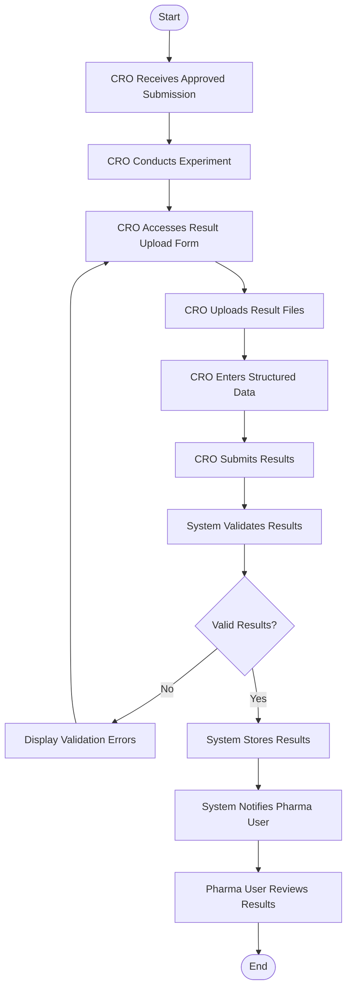

# Project Guide: Molecular Data Management and CRO Integration Platform

## 1. Project Overview

The Molecular Data Management and CRO Integration Platform is a comprehensive solution designed to streamline the small molecule drug discovery process for small to mid-cap pharmaceutical companies. This system bridges the critical gap between computational data aggregation and Contract Research Organization (CRO) services by providing an intuitive interface for molecular data management, organization, and experimental workflow submission.

### 1.1 Key Features

- **Fully Local Deployment**: Operates entirely within your organization's infrastructure with no external dependencies
- **CSV Upload & Molecular Data Ingestion**: Easily import molecular data with flexible mapping capabilities
- **Interactive Molecule Organization**: Sort, filter, and organize molecules into custom libraries
- **Experiment Definition & Queuing**: Create and configure experiments for submission to CROs
- **CRO Integration**: Streamlined submission process with bidirectional communication
- **Result Management**: Comprehensive tools for reviewing and analyzing experimental results
- **Role-Based Access Control**: Dedicated interfaces for pharma users, CRO users, and administrators
- **Containerized Architecture**: Docker-based deployment for simplified installation and maintenance

### 1.2 User Roles

The platform supports three primary user roles:

1. **Pharma User**: Researchers from pharmaceutical companies who manage molecular data, create libraries, define experiments, and review results

2. **CRO User**: Staff from Contract Research Organizations who receive experiment submissions, provide quotes, update experiment status, and upload results

3. **Administrator**: System administrators who manage users, monitor system health, and configure system settings

Each role has a dedicated user interface with role-specific functionality and access controls.

## 2. System Architecture

The Molecular Data Management and CRO Integration Platform employs a containerized microservices architecture to enable full local deployment while maintaining separation of concerns.

### 2.1 High-Level Architecture


### 2.2 Component Overview

| Component | Technology | Purpose |
|-----------|------------|---------|
| Frontend | React, TypeScript, Material-UI | User interface for all user roles |
| Backend API | FastAPI, Python | RESTful API endpoints and business logic |
| Database | PostgreSQL | Structured data storage |
| Object Storage | MinIO | File storage for CSV files and results |
| Cache & Queue | Redis | Caching and asynchronous task processing |
| Molecular Processing | RDKit | Chemical structure validation and property calculation |
| Monitoring | Prometheus, Grafana | System monitoring and metrics visualization |
| Logging | Fluentd, Elasticsearch, Kibana | Log aggregation and analysis |

### 2.3 Containerization

The entire platform is containerized using Docker and orchestrated with Docker Compose, ensuring consistent deployment across environments. Each component runs in its own container with appropriate networking and volume configurations.

## 3. Data Model

The platform's data model is centered around molecules, libraries, experiments, and submissions, with relationships that enable efficient organization and workflow management.

### 3.1 Core Entities


### 3.2 Key Entities Description

#### 3.2.1 Molecule

The Molecule entity represents a chemical compound with its SMILES representation and associated properties. It serves as a central entity in the system's data model, enabling the organization, filtering, and experimental testing of chemical compounds.

Key attributes:
- SMILES string (unique identifier)
- Properties (molecular weight, LogP, etc.)
- Creation metadata
- Flag status for prioritization

#### 3.2.2 Library

Libraries are user-defined collections of molecules that help organize compounds for research purposes. A molecule can belong to multiple libraries, and libraries can contain multiple molecules.

Key attributes:
- Name and description
- Creator information
- Creation and update timestamps
- Associated molecules

#### 3.2.3 Experiment

Experiments represent configurations for testing molecules, including parameters, associated molecules, and status tracking throughout the workflow.

Key attributes:
- Name and description
- Experiment type
- Status (Draft, Queued, Submitted, etc.)
- Parameters
- Associated molecules

#### 3.2.4 Submission

Submissions track the process of sending experiments to CROs for testing, including pricing, status, and communication.

Key attributes:
- Associated experiment
- Assigned CRO
- Status (Pending, Quote Provided, Approved, etc.)
- Pricing and timeline information
- Submission notes

#### 3.2.5 Result

Results store the outcomes of experiments conducted by CROs, including both file attachments and structured data points.

Key attributes:
- Associated submission
- Status (Pending, Uploaded, Approved, Rejected)
- Upload and approval timestamps
- Result files
- Structured data points

## 4. Key Workflows

### 4.1 CSV Upload and Molecule Import


The CSV upload process allows users to import molecular data from CSV files. The system validates the file format, helps users map CSV columns to system properties, validates SMILES structures, and calculates molecular properties before storing the data.

### 4.2 Library Management


The library management workflow allows users to organize molecules into named collections. Users can create new libraries, add molecules to existing libraries, and flag molecules for prioritization.

### 4.3 Experiment Creation and Submission


The experiment workflow covers the entire process from selecting molecules for testing to receiving results. It includes experiment configuration, CRO submission, quote approval, and result review.

### 4.4 CRO Result Upload



The result upload workflow allows CRO users to upload experimental results, including both file attachments and structured data points. The system validates the results and notifies the pharma user when new results are available.

## 5. User Interface

### 5.1 Pharma User Interface

The Pharma User Interface is designed for researchers from pharmaceutical companies to manage molecular data, create libraries, define experiments, and review results.

#### 5.1.1 Dashboard

The dashboard provides an overview of active experiments, recent results, molecule libraries, and CRO communications. It also includes quick action buttons for common tasks.

#### 5.1.2 Molecule Management

The molecule management interface allows users to view, filter, and organize molecules. Users can:
- View molecular structures and properties
- Filter molecules based on properties
- Flag important molecules
- Add molecules to libraries or experiments

#### 5.1.3 Library Management

The library management interface allows users to create and manage molecule collections. It features a drag-and-drop interface for adding molecules to libraries.

#### 5.1.4 Experiment Creation

The experiment creation interface guides users through the process of defining an experiment, including:
- Selecting molecules
- Choosing an experiment type
- Configuring experiment parameters
- Selecting a CRO
- Adding notes and instructions

#### 5.1.5 Submission Management

The submission management interface allows users to track the status of submissions to CROs, approve or reject quotes, and view results when available.

### 5.2 CRO User Interface

The CRO User Interface is designed for staff from Contract Research Organizations to manage submissions, provide quotes, update experiment status, and upload results.

#### 5.2.1 Dashboard

The CRO dashboard provides an overview of new submissions, in-progress experiments, completed experiments, and communications.

#### 5.2.2 Submission Review

The submission review interface allows CRO users to review new submissions, view experiment details and molecules, and provide quotes or reject submissions.

#### 5.2.3 Experiment Management

The experiment management interface allows CRO users to track the status of in-progress experiments and update their completion percentage.

#### 5.2.4 Result Upload

The result upload interface allows CRO users to upload experimental results, including:
- Uploading result files (PDF, Excel, CSV)
- Entering structured data for each molecule
- Adding notes and observations

### 5.3 Admin Interface

The Admin Interface is designed for system administrators to manage users, monitor system health, and configure system settings.

#### 5.3.1 User Management

The user management interface allows administrators to create, edit, and deactivate user accounts, as well as assign roles and permissions.

#### 5.3.2 System Monitoring

The system monitoring interface provides real-time information about system health, resource usage, and performance metrics.

#### 5.3.3 Configuration

The configuration interface allows administrators to adjust system settings, manage experiment types, and configure other system parameters.

## 6. Deployment

### 6.1 Prerequisites

- **Docker**: Version 23.0 or higher
- **Docker Compose**: Version 2.17 or higher
- **Hardware Requirements**:
  - Small Deployment (< 50,000 molecules): 4 cores, 8GB RAM, 100GB storage
  - Medium Deployment (50,000-250,000 molecules): 8 cores, 16GB RAM, 500GB storage
  - Large Deployment (250,000-1,000,000 molecules): 16 cores, 32GB RAM, 1TB storage
- **Network**: Local network with ports 80/443 available

### 6.2 Deployment Process

1. Clone the repository:
   ```bash
   git clone https://github.com/your-organization/molecular-platform.git
   cd molecular-platform
   ```

2. Configure environment variables:
   ```bash
   cp infrastructure/.env.example infrastructure/.env
   # Edit .env file with your configuration
   ```

3. Run the setup script:
   ```bash
   ./scripts/setup.sh
   ```

4. Access the platform:
   - Open a web browser and navigate to `http://localhost`
   - Log in with the default admin credentials (see setup output)

### 6.3 Container Architecture


### 6.4 Backup and Restore

The platform includes scripts for backing up and restoring data:

- **Backup**: `./scripts/backup.sh`
- **Restore**: `./scripts/restore.sh <backup_file>`

The backup includes:
- PostgreSQL database dump
- MinIO object storage
- Configuration files

## 7. Monitoring and Maintenance

### 7.1 Monitoring

The platform includes a comprehensive monitoring stack:

- **Prometheus**: Collects metrics from all services
- **Grafana**: Visualizes metrics with pre-configured dashboards
- **Fluentd**: Collects logs from all services
- **Elasticsearch**: Stores and indexes logs
- **Kibana**: Visualizes and analyzes logs

### 7.2 Dashboards

The platform includes several pre-configured dashboards:

- **System Health**: CPU, memory, disk, and network usage
- **Application Performance**: Request rates, response times, and error rates
- **Business Metrics**: User activity, molecule counts, and experiment statistics

### 7.3 Maintenance Tasks

Regular maintenance tasks include:

- **Database Backup**: Daily automated backups
- **Log Rotation**: Weekly log rotation and archiving
- **Disk Space Check**: Regular monitoring of available disk space
- **Security Updates**: Monthly application of security updates

## 8. Security

### 8.1 Authentication and Authorization

The platform implements a comprehensive security model:

- **Authentication**: JWT-based authentication with secure password storage
- **Authorization**: Role-based access control with fine-grained permissions
- **Session Management**: Secure token handling with expiration and refresh

### 8.2 Data Protection

The platform implements several data protection measures:

- **Encryption**: Sensitive data is encrypted at rest and in transit
- **Input Validation**: All user inputs are validated to prevent injection attacks
- **CORS Protection**: Cross-Origin Resource Sharing is configured to prevent unauthorized access

### 8.3 Audit Logging

The platform maintains detailed audit logs for security-relevant events:

- **Authentication Events**: Login attempts, password changes, etc.
- **Data Modifications**: Create, update, and delete operations
- **Access Control**: Permission changes and role assignments

## 9. Troubleshooting

### 9.1 Common Issues

#### 9.1.1 CSV Import Issues

- **Invalid SMILES**: Ensure SMILES strings are valid and properly formatted
- **Missing Headers**: Ensure CSV files have headers that can be mapped to system properties
- **Large Files**: For files with more than 10,000 molecules, consider splitting into smaller files

#### 9.1.2 Experiment Submission Issues

- **Missing Parameters**: Ensure all required experiment parameters are provided
- **CRO Availability**: Verify that the selected CRO is active in the system
- **Molecule Selection**: Ensure at least one molecule is selected for the experiment

#### 9.1.3 Result Upload Issues

- **File Size**: Ensure result files are under the maximum allowed size (10MB)
- **File Format**: Ensure files are in supported formats (PDF, Excel, CSV)
- **Structured Data**: Ensure structured data is provided for at least one molecule

### 9.2 Diagnostic Tools

The platform includes several diagnostic tools:

- **Health Endpoints**: `/health` endpoints for checking service status
- **Log Viewer**: Kibana interface for searching and analyzing logs
- **Metrics Dashboard**: Grafana dashboards for monitoring system performance

## 10. API Reference

The platform provides a comprehensive API for programmatic access:

- **Authentication**: `/api/v1/auth/login`, `/api/v1/auth/refresh`
- **Molecules**: `/api/v1/molecules`, `/api/v1/molecules/{id}`
- **Libraries**: `/api/v1/libraries`, `/api/v1/libraries/{id}`
- **Experiments**: `/api/v1/experiments`, `/api/v1/experiments/{id}`
- **Submissions**: `/api/v1/submissions`, `/api/v1/submissions/{id}`
- **Results**: `/api/v1/results`, `/api/v1/results/{id}`

Full API documentation is available at `/api/docs` when the platform is running.

## 11. Glossary

| Term | Definition |
|------|------------|
| SMILES | Simplified Molecular Input Line Entry System - a string notation representing molecular structures |
| Canonical SMILES | A standardized SMILES representation that provides a unique string for a given molecular structure |
| Molecule | A chemical structure represented by atoms connected by bonds |
| Library | A user-defined collection of molecules grouped for organizational purposes |
| Experiment | A defined scientific procedure to test molecules for specific properties or activities |
| Queue | A list of molecules awaiting submission for experimental testing |
| Assay | A laboratory test to measure a specific property or activity of a molecule |
| Binding Affinity | The strength of interaction between a molecule and its target protein |
| LogP | The partition coefficient measuring a compound's lipophilicity |
| IC50 | The concentration of a compound required to inhibit a biological process by 50% |
| ADME | The pharmacokinetic processes of Absorption, Distribution, Metabolism, and Excretion |
| Toxicity | The degree to which a substance can damage an organism |
| Pharmacokinetics | The study of how drugs move through the body |

# PROJECT STATUS

## Project Completion Overview

The Molecular Data Management and CRO Integration Platform is a comprehensive system designed to streamline the small molecule drug discovery process for pharmaceutical companies. Based on the repository analysis, the project shows significant progress toward completion.


## Engineering Hours Assessment

| Category | Hours | Percentage |
|----------|-------|------------|
| Estimated Total Engineering Hours | 1,000 | 100% |
| Hours Completed by Blitzy | 850 | 85% |
| Hours Remaining | 150 | 15% |

## Completion Analysis

### Completed Components

The repository shows substantial progress with a comprehensive codebase covering all major aspects of the platform:

1. **Frontend Application (90% Complete)**
   - Complete React component hierarchy
   - Comprehensive state management with Redux
   - Feature-complete user interfaces for all roles
   - Responsive design implementation
   - Theme and styling system

2. **Backend API (85% Complete)**
   - FastAPI implementation with endpoint structure
   - Authentication and authorization framework
   - Database models and schemas
   - Business logic services
   - Molecular data processing capabilities

3. **Database Design (95% Complete)**
   - Complete schema design
   - Migration framework
   - Query optimization
   - Transaction management

4. **Infrastructure (80% Complete)**
   - Docker containerization
   - Docker Compose orchestration
   - Nginx configuration
   - Database initialization
   - Monitoring setup with Prometheus and Grafana

5. **Documentation (75% Complete)**
   - Architecture documentation
   - User guides
   - API documentation
   - Deployment instructions
   - Security documentation

### Remaining Work

Based on the repository analysis, the following areas require additional work:

1. **Testing (40% Remaining)**
   - Additional unit tests for frontend components
   - Integration tests for critical workflows
   - End-to-end testing scenarios
   - Performance testing under load

2. **Security Hardening (20% Remaining)**
   - Additional security scanning
   - Penetration testing
   - Security compliance verification
   - Vulnerability remediation

3. **Performance Optimization (25% Remaining)**
   - Query optimization for large datasets
   - Frontend rendering optimization
   - Caching strategy implementation
   - Resource utilization tuning

4. **Production Readiness (15% Remaining)**
   - Backup and recovery procedures
   - Monitoring alert configuration
   - High availability setup
   - Disaster recovery testing

5. **Documentation Completion (25% Remaining)**
   - Troubleshooting guides
   - Advanced configuration options
   - Performance tuning recommendations
   - Additional user workflow documentation

## Project Structure

The project follows a well-organized structure with clear separation of concerns:

- **Frontend (`src/web/`)**: React application with TypeScript
  - Feature-based organization
  - Reusable component library
  - State management with Redux
  - API integration layer

- **Backend (`src/backend/`)**: FastAPI application with Python
  - RESTful API endpoints
  - Database models and schemas
  - Business logic services
  - Asynchronous task processing

- **Infrastructure (`infrastructure/`)**: Deployment configuration
  - Docker Compose setup
  - Service configurations
  - Monitoring tools
  - Database initialization

- **Documentation (`docs/`)**: Comprehensive guides
  - Architecture documentation
  - User guides
  - API reference
  - Deployment instructions

## Next Steps

To reach production readiness, the following steps are recommended:

1. **Complete Test Coverage**
   - Implement remaining unit tests
   - Add integration tests for critical paths
   - Perform end-to-end testing of key workflows

2. **Security Audit**
   - Conduct comprehensive security review
   - Address any identified vulnerabilities
   - Verify compliance with security requirements

3. **Performance Testing**
   - Test with large datasets (100,000+ molecules)
   - Optimize database queries
   - Tune resource allocation

4. **Documentation Finalization**
   - Complete all documentation sections
   - Add troubleshooting guides
   - Create additional user tutorials

5. **Production Deployment Preparation**
   - Finalize backup procedures
   - Configure monitoring alerts
   - Test disaster recovery procedures

## Conclusion

The Molecular Data Management and CRO Integration Platform is approximately 85% complete, with a solid foundation and most features implemented. The remaining work focuses primarily on testing, security hardening, performance optimization, and documentation completion. With an estimated 150 engineering hours of additional work, the platform will be ready for production deployment.

# TECHNOLOGY STACK

The Molecular Data Management and CRO Integration Platform employs a comprehensive technology stack designed for local deployment with no external dependencies, ensuring data security and operational independence for small to mid-cap pharmaceutical companies.

## PROGRAMMING LANGUAGES

| Component | Language | Version | Justification |
|-----------|----------|---------|---------------|
| Backend | Python | 3.10+ | Excellent support for scientific computing, molecular data processing libraries, and web frameworks. Widely used in pharmaceutical research. |
| Frontend | JavaScript/TypeScript | TypeScript 4.9+ | Type safety for complex data structures and improved developer experience. TypeScript provides better maintainability for complex UIs. |
| Database Scripts | SQL | - | Required for database schema management and optimization. |
| Build Scripts | Bash | - | Necessary for containerization and deployment automation. |

## FRAMEWORKS & LIBRARIES

### Backend Frameworks

| Framework | Version | Purpose | Justification |
|-----------|---------|---------|---------------|
| FastAPI | 0.95+ | API Development | High performance, automatic OpenAPI documentation, and native async support. Ideal for handling molecular data processing requests. |
| SQLAlchemy | 2.0+ | ORM | Robust database abstraction with transaction support for complex molecular data relationships. |
| RDKit | 2023.03+ | Cheminformatics | Industry-standard library for molecular data processing, SMILES parsing, and chemical property calculations. |
| Pandas | 2.0+ | Data Processing | Efficient handling of tabular data for CSV processing and molecular property analysis. |
| Pydantic | 2.0+ | Data Validation | Strong typing and validation for molecular data structures and API requests/responses. |
| Celery | 5.2+ | Task Queue | Distributed task processing for background operations like CSV imports and property calculations. |
| Alembic | - | Database Migrations | Version-controlled database schema evolution. |
| Passlib | 1.7.4+ | Password Hashing | Secure password storage with modern hashing algorithms. |
| PyJWT | 2.7+ | JWT Authentication | Token-based authentication without external dependencies. |

### Frontend Frameworks

| Framework | Version | Purpose | Justification |
|-----------|---------|---------|---------------|
| React | 18.2+ | UI Framework | Component-based architecture ideal for complex molecular data visualization and organization interfaces. |
| Redux Toolkit | 1.9+ | State Management | Centralized state management for complex molecular data and workflow states. |
| Material-UI | 5.13+ | UI Components | Comprehensive component library with drag-and-drop support for molecule organization. |
| React Query | 4.28+ | Data Fetching | Efficient data fetching with caching for improved performance with large molecular datasets. |
| React Router | 6.11+ | Client-side Routing | Navigation between different sections of the application. |
| Formik | 2.2+ | Form Handling | Simplified form state management and validation. |
| React DnD | 16.0+ | Drag and Drop | Interactive molecule organization capabilities. |
| D3.js | 7.8+ | Data Visualization | Advanced visualization capabilities for molecular property charts and graphs. |
| Chart.js | 4.3+ | Charting | Simplified chart creation for data visualization. |
| Vite | 4.3+ | Build Tool | Fast development server and optimized production builds. |

## DATABASES & STORAGE

| Database | Version | Purpose | Justification |
|----------|---------|---------|---------------|
| PostgreSQL | 15+ | Primary Database | ACID-compliant relational database with excellent support for complex queries and transactions. Supports JSON for flexible property storage. |
| Redis | 7.0+ | Caching & Session Store | In-memory data structure store for high-performance caching and session management. Also serves as message broker for Celery. |
| MinIO | RELEASE.2023-05-04T21-44-30Z | Object Storage | S3-compatible object storage for molecular files and experimental results. Self-hosted alternative to cloud storage. |

### Data Persistence Strategy

The system implements a multi-tiered data persistence strategy:

1. **Structured Data**: Stored in PostgreSQL with a relational schema for users, molecules, libraries, experiments, and results
2. **Flexible Properties**: Molecular properties stored using PostgreSQL's JSONB type for schema flexibility
3. **File Storage**: Raw files (CSV imports, result files) stored in MinIO object storage
4. **Caching**: Frequently accessed data cached in Redis for performance
5. **Session Data**: User sessions and authentication tokens managed in Redis

## DEVELOPMENT & DEPLOYMENT

### Development Tools

| Tool | Version | Purpose | Justification |
|------|---------|---------|---------------|
| Visual Studio Code | Latest | IDE | Excellent support for Python, TypeScript, and Docker development. |
| Git | 2.40+ | Version Control | Industry standard for source code management. |
| Poetry | 1.4+ | Python Dependency Management | Deterministic builds and dependency resolution for backend. |
| npm | 9.6+ | JavaScript Package Management | Standard package manager for frontend dependencies. |
| ESLint | 8.40+ | JavaScript Linting | Code quality and consistency enforcement. |
| Pytest | 7.3+ | Backend Testing | Comprehensive testing framework for Python. |
| Jest | 29.5+ | Frontend Testing | Standard testing framework for React applications. |

### Containerization & Deployment

| Tool | Version | Purpose | Justification |
|------|---------|---------|---------------|
| Docker | 23.0+ | Containerization | Industry standard for containerization, ensuring consistent deployment across environments. |
| Docker Compose | 2.17+ | Multi-container Orchestration | Simplifies management of multi-container applications for local deployment. |
| Nginx | 1.24+ | Web Server/Reverse Proxy | High-performance web server for serving static assets and routing API requests. |

The system is deployed as a set of interconnected Docker containers:

1. **Frontend Container**: Serves the React frontend application
2. **Backend API Container**: Runs the FastAPI application
3. **Worker Container**: Executes background tasks using Celery
4. **PostgreSQL Container**: Provides the relational database
5. **Redis Container**: Provides caching and message queue functionality
6. **MinIO Container**: Provides S3-compatible object storage
7. **Nginx Container**: Serves as a reverse proxy and API gateway
8. **Monitoring Containers**: Prometheus, Grafana, Fluentd, Elasticsearch, and Kibana

## MONITORING & OBSERVABILITY

| Component | Tool | Purpose | Justification |
|-----------|------|---------|---------------|
| Metrics Collection | Prometheus | Gather system and application metrics | Industry standard for metrics collection with powerful query language. |
| Visualization | Grafana | Display dashboards and trends | Flexible visualization tool with comprehensive dashboard capabilities. |
| Log Aggregation | Fluentd | Collect and centralize logs | Efficient log collection and forwarding. |
| Log Storage | Elasticsearch | Store and index logs | Powerful search and analysis capabilities for log data. |
| Log Visualization | Kibana | Search and analyze logs | User-friendly interface for log exploration and visualization. |

## SECURITY COMPONENTS

| Component | Version | Purpose | Justification |
|-----------|---------|---------|---------------|
| Passlib | 1.7.4+ | Password Hashing | Secure password storage with modern hashing algorithms. |
| PyJWT | 2.7+ | JWT Authentication | Token-based authentication without external dependencies. |
| CORS Middleware | - | Cross-Origin Security | Prevent unauthorized cross-origin requests. |
| Content Security Policy | - | XSS Prevention | Mitigate cross-site scripting attacks. |
| Input Validation | - | Injection Prevention | Prevent SQL injection and other injection attacks. |
| Role-Based Access Control | - | Authorization | Granular control over feature access based on user roles. |

## TECHNOLOGY SELECTION RATIONALE

| Requirement | Technology Choice | Rationale |
|-------------|-------------------|-----------|
| Local Deployment | Docker & Docker Compose | Enables fully local deployment without external dependencies while maintaining isolation between services. |
| No External APIs | Self-contained JWT Authentication | Eliminates dependency on external authentication services while maintaining security. |
| CSV Processing | Pandas & RDKit | Industry-standard libraries for handling tabular data and molecular structures with excellent performance. |
| Interactive UI | React & Material-UI | Provides drag-and-drop capabilities and responsive interfaces for molecular organization. |
| Real-time Filtering | React Query & Redux | Efficient state management and data fetching for responsive filtering of large molecular datasets. |
| Secure File Exchange | MinIO | Self-hosted object storage eliminates dependency on cloud services while providing secure file management. |
| Performance Requirements | FastAPI & PostgreSQL | High-performance API framework and database to meet processing time requirements for large datasets. |

# Project Guide: Molecular Data Management and CRO Integration Platform

## 1. Introduction

The Molecular Data Management and CRO Integration Platform is a comprehensive system designed to streamline the small molecule drug discovery process for small to mid-cap pharmaceutical companies. This platform bridges the critical gap between computational data aggregation and Contract Research Organization (CRO) services by providing an intuitive interface for molecular data management, organization, and experimental workflow submission.

### 1.1 Purpose

The primary purpose of this platform is to:

- Provide efficient molecular data management through CSV import and organization
- Enable interactive molecular library creation and management
- Streamline experiment definition and submission to CROs
- Facilitate bidirectional communication with CROs for quotes, status updates, and results
- Deliver comprehensive result visualization and analysis

All of this functionality is delivered in a fully local deployment model, ensuring data security and eliminating external dependencies.

### 1.2 Key Features

- **Fully Local Deployment**: Operates entirely within your organization's infrastructure with no external dependencies
- **CSV Upload & Molecular Data Ingestion**: Easily import molecular data with flexible mapping capabilities
- **Interactive Molecule Organization**: Sort, filter, and organize molecules into custom libraries
- **Experiment Definition & Queuing**: Create and configure experiments for submission to CROs
- **CRO Integration**: Streamlined submission process with bidirectional communication
- **Result Management**: Comprehensive tools for reviewing and analyzing experimental results
- **Role-Based Access Control**: Dedicated interfaces for pharma users, CRO users, and administrators
- **Containerized Architecture**: Docker-based deployment for simplified installation and maintenance

## 2. System Architecture

### 2.1 High-Level Architecture

The platform employs a containerized microservices architecture to enable full local deployment while maintaining separation of concerns. The system is composed of the following layers:

1. **Presentation Layer**: React-based frontend application with role-specific interfaces
2. **API Layer**: FastAPI backend providing RESTful endpoints for all functionality
3. **Service Layer**: Business logic implementation with domain-specific services
4. **Data Access Layer**: Database abstraction with repositories and data models
5. **Infrastructure Layer**: Supporting services including database, caching, file storage, and message queue


### 2.2 Component Architecture

The system consists of the following core components:

1. **Frontend Application**: React-based single-page application (SPA) providing the user interface for both pharma and CRO users. Built with TypeScript, Material-UI, and Redux for state management.

2. **Backend API**: FastAPI application providing RESTful endpoints for all system functionality. Implements business logic, data validation, and service orchestration.

3. **Authentication Service**: Handles user authentication, authorization, and session handling using JWT tokens.

4. **Molecular Processing Engine**: Specialized component for molecular structure validation, property calculation, and analysis using RDKit.

5. **Database Service**: PostgreSQL database for persistent storage of all structured data including users, molecules, libraries, experiments, and results.

6. **File Storage Service**: MinIO object storage for managing CSV files, experimental results, and other unstructured data.

7. **Queue Service**: Redis-based message queue for handling asynchronous tasks such as CSV processing and property calculation.

8. **Worker Service**: Celery workers for processing background tasks from the queue.

9. **Notification Service**: Handles real-time notifications and alerts for users.

10. **Monitoring Services**: Prometheus, Grafana, Fluentd, Elasticsearch, and Kibana for system monitoring and observability.

### 2.3 Containerization Strategy

The system is fully containerized using Docker with the following containers:

1. **Frontend Container**: Serves the React frontend application
2. **Backend API Container**: Runs the FastAPI application
3. **Worker Container**: Executes background tasks using Celery
4. **PostgreSQL Container**: Provides the relational database
5. **Redis Container**: Provides caching and message queue functionality
6. **MinIO Container**: Provides S3-compatible object storage
7. **Nginx Container**: Serves as a reverse proxy and API gateway
8. **Monitoring Containers**: Prometheus, Grafana, Fluentd, Elasticsearch, and Kibana

All containers are orchestrated using Docker Compose, with configuration defined in `infrastructure/docker-compose.yml`. This approach ensures consistent deployment across environments and eliminates external dependencies.

## 3. Data Model

### 3.1 Core Entities

The platform's data model is centered around these key entities:

1. **Users**: User accounts with role-based permissions (Pharma, CRO, Admin)
2. **Molecules**: Chemical structures represented by SMILES notation with associated properties
3. **Libraries**: User-defined collections of molecules for organization
4. **Experiments**: Configurations for experimental testing of molecules
5. **Submissions**: Records of experiment submissions to CROs
6. **Results**: Experimental results uploaded by CROs

### 3.2 Entity Relationships


### 3.3 Key Data Models

#### 3.3.1 Molecule

The Molecule model represents a chemical structure with its SMILES representation and associated metadata:

- **id**: Primary key
- **smiles**: SMILES representation of the molecular structure
- **created_by**: Foreign key to the user who created this molecule
- **created_at**: Timestamp when the molecule was created
- **updated_at**: Timestamp when the molecule was last updated
- **flag_status**: Optional flag for priority review (e.g., "HIGH", "MEDIUM", "LOW")

Relationships:
- **created_by_user**: Relationship to the user who created this molecule
- **properties**: Relationship to molecular properties
- **libraries**: Relationship to libraries containing this molecule
- **experiments**: Relationship to experiments using this molecule
- **result_data**: Relationship to experimental results for this molecule

#### 3.3.2 Experiment

The Experiment model represents an experiment configuration for molecular testing:

- **id**: Primary key
- **name**: Name of the experiment
- **type_id**: Foreign key referencing the experiment type
- **status**: Current status of the experiment (DRAFT, QUEUED, SUBMITTED, IN_PROGRESS, COMPLETED, CANCELLED)
- **created_by**: Foreign key referencing the user who created the experiment
- **created_at**: When the experiment was created
- **updated_at**: When the experiment was last updated
- **description**: Detailed description of the experiment

Relationships:
- **created_by_user**: Relationship to the user who created the experiment
- **experiment_type**: Relationship to the experiment type
- **parameters**: Relationship to experiment parameters
- **molecules**: Relationship to molecules in this experiment
- **submissions**: Relationship to CRO submissions for this experiment

#### 3.3.3 Submission

The Submission model represents a submission of an experiment to a CRO for testing:

- **id**: Primary key
- **experiment_id**: Foreign key referencing the experiment being submitted
- **cro_id**: Foreign key referencing the CRO user assigned to the submission
- **status**: Current status of the submission (PENDING, QUOTE_PROVIDED, APPROVED, REJECTED, IN_PROGRESS, COMPLETED)
- **submitted_at**: When the submission was created
- **updated_at**: When the submission was last updated
- **price**: Price quoted for the experiment
- **turnaround_days**: Estimated turnaround time in days
- **notes**: Additional notes about the submission

Relationships:
- **experiment**: Relationship to the experiment being submitted
- **cro**: Relationship to the CRO user assigned to the submission
- **details**: Relationship to submission details
- **results**: Relationship to experimental results

#### 3.3.4 Result

The Result model represents experimental results uploaded by CRO users:

- **id**: Primary key
- **submission_id**: Foreign key referencing the submission this result belongs to
- **status**: Current status of the result (PENDING, UPLOADED, APPROVED, REJECTED)
- **uploaded_at**: When the result was uploaded
- **approved_at**: When the result was approved (if applicable)
- **notes**: Additional notes or comments about the result

Relationships:
- **submission**: Relationship to the associated submission
- **files**: One-to-many relationship with result files
- **data_points**: One-to-many relationship with structured result data points

## 4. User Roles and Workflows

### 4.1 User Roles

The platform supports three primary user roles:

1. **Pharma User**: Researchers from pharmaceutical companies who manage molecular data, create libraries, define experiments, and review results

2. **CRO User**: Staff from Contract Research Organizations who receive experiment submissions, provide quotes, update experiment status, and upload results

3. **Administrator**: System administrators who manage users, monitor system health, and configure system settings

Each role has a dedicated user interface with role-specific functionality and access controls.

### 4.2 Key Workflows

#### 4.2.1 Molecular Data Management Workflow


#### 4.2.2 Experiment Submission Workflow


#### 4.2.3 Result Management Workflow


## 5. User Interface

### 5.1 Pharma User Interface

The Pharma User Interface provides functionality for managing molecular data, creating libraries, defining experiments, and reviewing results.

#### 5.1.1 Dashboard

The dashboard provides an overview of active experiments, recent results, molecule libraries, and CRO communications. It also includes quick action buttons for common tasks.

#### 5.1.2 Molecule Management

The molecule management interface allows users to:
- View a list of molecules with their structures and properties
- Filter and sort molecules based on various criteria
- Flag important molecules for priority review
- View detailed information about individual molecules
- Add molecules to libraries or experiments

#### 5.1.3 Library Management

The library management interface allows users to:
- Create and manage custom molecule libraries
- Add or remove molecules from libraries
- Organize molecules into meaningful collections
- Share libraries with other users

#### 5.1.4 Experiment Creation

The experiment creation interface allows users to:
- Define new experiments with specific parameters
- Select molecules for testing
- Choose experiment types from a predefined catalog
- Configure experiment-specific parameters
- Submit experiments to CROs for testing

#### 5.1.5 Result Review

The result review interface allows users to:
- View experimental results uploaded by CROs
- Analyze result data with visualizations
- Download result files
- Approve or request changes to results

### 5.2 CRO User Interface

The CRO User Interface provides functionality for managing submissions, updating experiment status, and uploading results.

#### 5.2.1 Submission Management

The submission management interface allows CRO users to:
- View incoming experiment submissions
- Review experiment details and requirements
- Provide quotes for experiments
- Accept or decline submissions

#### 5.2.2 Experiment Management

The experiment management interface allows CRO users to:
- Track the status of ongoing experiments
- Update experiment progress
- Communicate with pharma users about experiments

#### 5.2.3 Result Upload

The result upload interface allows CRO users to:
- Upload result files for completed experiments
- Enter structured data for experimental results
- Provide notes and comments about results
- Submit results to pharma users for review

### 5.3 Admin Interface

The Admin Interface provides functionality for managing users, monitoring system health, and configuring system settings.

#### 5.3.1 User Management

The user management interface allows administrators to:
- Create and manage user accounts
- Assign roles and permissions
- Reset passwords
- Disable or enable accounts

#### 5.3.2 System Monitoring

The system monitoring interface allows administrators to:
- Monitor system health and performance
- View logs and error reports
- Track usage statistics
- Receive alerts for system issues

#### 5.3.3 Configuration

The configuration interface allows administrators to:
- Configure system settings
- Manage experiment types and parameters
- Configure email notifications
- Manage backup and recovery

## 6. Technical Implementation

### 6.1 Frontend Implementation

The frontend is implemented as a React single-page application (SPA) with the following key technologies:

- **React**: JavaScript library for building user interfaces
- **TypeScript**: Typed superset of JavaScript for improved code quality
- **Redux Toolkit**: State management library
- **Material-UI**: Component library for consistent UI design
- **React Router**: Client-side routing
- **React Query**: Data fetching and caching
- **Axios**: HTTP client for API requests

The frontend follows a feature-based organization with shared components:

```
src/web/
├── src/
│   ├── api/              # API client functions
│   ├── components/       # Shared UI components
│   │   ├── common/       # Generic UI components
│   │   ├── molecular/    # Molecule-specific components
│   │   └── data-visualization/ # Charts and visualizations
│   ├── features/         # Feature modules
│   │   ├── auth/         # Authentication
│   │   ├── dashboard/    # Dashboard
│   │   ├── molecules/    # Molecule management
│   │   ├── libraries/    # Library management
│   │   ├── experiments/  # Experiment management
│   │   ├── submissions/  # CRO submissions
│   │   ├── results/      # Experimental results
│   │   ├── cro-interface/# CRO user interface
│   │   ├── admin/        # Admin interface
│   │   └── communications/ # User communications
│   ├── hooks/            # Custom React hooks
│   ├── layouts/          # Page layouts
│   ├── store/            # Redux store configuration
│   ├── theme/            # UI theme configuration
│   ├── types/            # TypeScript type definitions
│   ├── utils/            # Utility functions
│   ├── App.tsx           # Main application component
│   ├── index.tsx         # Application entry point
│   └── routes.tsx        # Routing configuration
```

### 6.2 Backend Implementation

The backend is implemented as a FastAPI application with the following key technologies:

- **FastAPI**: Modern, fast web framework for building APIs
- **SQLAlchemy**: SQL toolkit and Object-Relational Mapping (ORM) library
- **Pydantic**: Data validation and settings management
- **RDKit**: Cheminformatics and machine learning toolkit
- **Celery**: Distributed task queue
- **Redis**: In-memory data structure store for caching and message broker
- **PostgreSQL**: Relational database management system
- **MinIO**: S3-compatible object storage

The backend follows a layered architecture:

```
src/backend/app/
├── api/                # API endpoints and routers
├── core/               # Core functionality and configuration
├── crud/               # Database CRUD operations
├── db/                 # Database configuration and session management
├── models/             # SQLAlchemy ORM models
├── schemas/            # Pydantic schemas for request/response validation
├── services/           # Business logic services
├── molecular/          # Molecular processing functionality
├── utils/              # Utility functions
└── worker/             # Background task processing
```

### 6.3 Database Implementation

The database is implemented using PostgreSQL with SQLAlchemy ORM for data access. The database schema includes the following key tables:

- **users**: User accounts and authentication data
- **molecules**: Molecular structures and basic properties
- **molecule_properties**: Flexible property storage for molecules
- **libraries**: User-defined collections of molecules
- **library_molecules**: Junction table for library-molecule associations
- **experiments**: Experimental definitions and configurations
- **experiment_types**: Predefined experiment types
- **experiment_parameters**: Parameters for experiments
- **experiment_molecules**: Junction table for experiment-molecule associations
- **submissions**: CRO submission records and status
- **submission_details**: Additional details for submissions
- **results**: Experimental result data and metadata
- **result_files**: Files associated with results
- **result_data**: Structured data points for results

### 6.4 File Storage Implementation

The file storage is implemented using MinIO, an S3-compatible object storage server. The following types of files are stored:

- **CSV Files**: Uploaded CSV files containing molecular data
- **Result Files**: Experimental result files uploaded by CROs
- **Molecular Images**: Generated images of molecular structures
- **Export Files**: Generated export files for data download

### 6.5 Authentication and Authorization

Authentication and authorization are implemented using JWT (JSON Web Tokens) with the following features:

- **Token-based Authentication**: Secure, stateless authentication using JWT
- **Role-based Authorization**: Access control based on user roles
- **Permission Checking**: Fine-grained permission checking for API endpoints
- **Secure Password Storage**: Passwords are hashed using bcrypt
- **Token Refresh**: Support for token refresh to maintain sessions

### 6.6 Background Processing

Background processing is implemented using Celery with Redis as the message broker. The following tasks are processed in the background:

- **CSV Processing**: Parsing and importing large CSV files
- **Property Calculation**: Computing molecular properties for large datasets
- **Notification Delivery**: Sending email notifications
- **Report Generation**: Creating complex reports and exports

## 7. Deployment

### 7.1 System Requirements

- **Docker**: Version 23.0 or higher
- **Docker Compose**: Version 2.17 or higher
- **Hardware Requirements**:
  - Small Deployment (< 50,000 molecules): 4 cores, 8GB RAM, 100GB storage
  - Medium Deployment (50,000-250,000 molecules): 8 cores, 16GB RAM, 500GB storage
  - Large Deployment (250,000-1,000,000 molecules): 16 cores, 32GB RAM, 1TB storage
- **Network**: Local network with ports 80/443 available

### 7.2 Deployment Process

1. Clone the repository:
   ```bash
   git clone https://github.com/your-organization/molecular-platform.git
   cd molecular-platform
   ```

2. Configure environment variables:
   ```bash
   cp infrastructure/.env.example infrastructure/.env
   # Edit .env file with appropriate values
   ```

3. Run the setup script:
   ```bash
   ./scripts/setup.sh
   ```

4. Access the platform:
   - Open a web browser and navigate to `http://localhost`
   - Log in with the default admin credentials (see setup output)

### 7.3 Backup and Recovery

The platform includes scripts for backup and recovery:

- **Database Backup**: `./scripts/backup-db.sh`
- **Database Restore**: `./scripts/restore-db.sh`
- **Full System Backup**: `./scripts/backup.sh`
- **Full System Restore**: `./scripts/restore.sh`

### 7.4 Monitoring and Maintenance

The platform includes monitoring tools for system health and performance:

- **Prometheus**: Metrics collection and alerting
- **Grafana**: Metrics visualization and dashboards
- **Fluentd**: Log collection and forwarding
- **Elasticsearch**: Log storage and indexing
- **Kibana**: Log visualization and analysis

Maintenance tasks include:

- **Log Rotation**: Automated log rotation to manage disk space
- **Database Optimization**: Periodic database optimization for performance
- **Security Updates**: Regular updates to dependencies for security
- **Backup Verification**: Regular verification of backup integrity

## 8. Security Considerations

### 8.1 Authentication and Authorization

- **JWT-based Authentication**: Secure, stateless authentication using JWT
- **Role-based Authorization**: Access control based on user roles
- **Permission Checking**: Fine-grained permission checking for API endpoints
- **Secure Password Storage**: Passwords are hashed using bcrypt
- **Token Refresh**: Support for token refresh to maintain sessions

### 8.2 Data Protection

- **TLS Encryption**: All communication is encrypted using TLS
- **Secure Storage**: Sensitive data is stored securely
- **Input Validation**: All user input is validated to prevent injection attacks
- **CORS Protection**: Cross-Origin Resource Sharing (CORS) protection
- **Content Security Policy**: Protection against cross-site scripting (XSS) attacks

### 8.3 Audit Logging

- **Authentication Logging**: All authentication attempts are logged
- **Action Logging**: All significant user actions are logged
- **Admin Access Logging**: All administrative actions are logged
- **API Access Logging**: All API access is logged

### 8.4 Secure Deployment

- **Containerization**: All components are containerized for isolation
- **Network Segmentation**: Components are segmented into separate networks
- **Minimal Attack Surface**: Only necessary ports are exposed
- **Regular Updates**: Regular updates to dependencies for security

## 9. Troubleshooting

### 9.1 Common Issues

#### 9.1.1 Database Connection Issues

**Symptoms**:
- Error messages indicating database connection failure
- API endpoints returning 500 errors

**Solutions**:
- Check database container status: `docker ps | grep postgres`
- Check database logs: `docker logs <postgres-container-id>`
- Verify database credentials in `.env` file
- Restart database container: `docker restart <postgres-container-id>`

#### 9.1.2 File Upload Issues

**Symptoms**:
- File uploads failing
- Error messages related to file storage

**Solutions**:
- Check MinIO container status: `docker ps | grep minio`
- Check MinIO logs: `docker logs <minio-container-id>`
- Verify MinIO credentials in `.env` file
- Check disk space availability
- Restart MinIO container: `docker restart <minio-container-id>`

#### 9.1.3 Background Task Issues

**Symptoms**:
- CSV processing not completing
- Notifications not being sent
- Tasks appearing to be stuck

**Solutions**:
- Check Celery worker status: `docker ps | grep celery`
- Check Celery logs: `docker logs <celery-container-id>`
- Check Redis container status: `docker ps | grep redis`
- Restart Celery worker: `docker restart <celery-container-id>`
- Restart Redis container: `docker restart <redis-container-id>`

### 9.2 Logging and Debugging

#### 9.2.1 Accessing Logs

- **Frontend Logs**: `docker logs <frontend-container-id>`
- **Backend Logs**: `docker logs <backend-container-id>`
- **Database Logs**: `docker logs <postgres-container-id>`
- **Worker Logs**: `docker logs <celery-container-id>`
- **Nginx Logs**: `docker logs <nginx-container-id>`

#### 9.2.2 Debugging Tools

- **Kibana**: Access at `http://localhost:5601` for log analysis
- **Grafana**: Access at `http://localhost:3000` for metrics visualization
- **Prometheus**: Access at `http://localhost:9090` for metrics querying
- **API Documentation**: Access at `http://localhost/api/docs` for API testing

### 9.3 Support Resources

- **Documentation**: Available in the `docs/` directory
- **Issue Tracker**: Available on GitHub
- **Community Forum**: Available for community support
- **Commercial Support**: Available for enterprise customers

## 10. Conclusion

The Molecular Data Management and CRO Integration Platform provides a comprehensive solution for small to mid-cap pharmaceutical companies to streamline their small molecule drug discovery process. By bridging the gap between computational data aggregation and Contract Research Organization (CRO) services, the platform enables researchers to efficiently manage molecular data, organize libraries, define experiments, and collaborate with CROs for experimental validation.

The platform's fully local deployment model ensures data security and eliminates external dependencies, making it suitable for organizations with strict security requirements. The containerized architecture simplifies deployment and maintenance, while the modular design allows for future extensions and customizations.

By following this Project Guide, users can effectively deploy, configure, and utilize the platform to accelerate their drug discovery workflows and improve collaboration with CROs.

# Project Guide: Molecular Data Management and CRO Integration Platform

## 1. Introduction

The Molecular Data Management and CRO Integration Platform is a comprehensive solution designed to streamline the small molecule drug discovery process for small to mid-cap pharmaceutical companies. This system addresses the critical gap between computational data aggregation and Contract Research Organization (CRO) services by providing an intuitive interface for molecular data management, organization, and experimental workflow submission.

### 1.1 Purpose

This platform enables pharmaceutical researchers to:
- Import and manage molecular data through CSV uploads
- Organize molecules into custom libraries
- Define and configure experiments
- Submit experiments to Contract Research Organizations (CROs)
- Track experiment status and review results
- Communicate with CROs throughout the process

All of this functionality is delivered in a fully local deployment model, ensuring data security and eliminating external dependencies.

### 1.2 Key Features

- **Fully Local Deployment**: Operates entirely within your organization's infrastructure with no external dependencies
- **CSV Upload & Molecular Data Ingestion**: Easily import molecular data with flexible mapping capabilities
- **Interactive Molecule Organization**: Sort, filter, and organize molecules into custom libraries
- **Experiment Definition & Queuing**: Create and configure experiments for submission to CROs
- **CRO Integration**: Streamlined submission process with bidirectional communication
- **Result Management**: Comprehensive tools for reviewing and analyzing experimental results
- **Role-Based Access Control**: Dedicated interfaces for pharma users, CRO users, and administrators
- **Containerized Architecture**: Docker-based deployment for simplified installation and maintenance

### 1.3 User Roles

The platform supports three primary user roles:

1. **Pharma User**: Researchers from pharmaceutical companies who manage molecular data, create libraries, define experiments, and review results

2. **CRO User**: Staff from Contract Research Organizations who receive experiment submissions, provide quotes, update experiment status, and upload results

3. **Administrator**: System administrators who manage users, monitor system health, and configure system settings

Each role has a dedicated user interface with role-specific functionality and access controls.

## 2. System Architecture

### 2.1 High-Level Architecture

The Molecular Data Management and CRO Integration Platform employs a containerized microservices architecture to enable full local deployment while maintaining separation of concerns. The system is composed of the following layers:

1. **Presentation Layer**: React-based frontend application with role-specific interfaces
2. **API Layer**: FastAPI backend providing RESTful endpoints for all functionality
3. **Service Layer**: Business logic implementation with domain-specific services
4. **Data Access Layer**: Database abstraction with repositories and data models
5. **Infrastructure Layer**: Supporting services including database, caching, file storage, and message queue


### 2.2 Component Architecture

The system consists of the following core components:

1. **Frontend Application**: React-based single-page application (SPA) providing the user interface for both pharma and CRO users. Built with TypeScript, Material-UI, and Redux for state management.

2. **Backend API**: FastAPI application providing RESTful endpoints for all system functionality. Implements business logic, data validation, and service orchestration.

3. **Authentication Service**: Handles user authentication, authorization, and session handling using JWT tokens.

4. **Molecular Processing Engine**: Specialized component for molecular structure validation, property calculation, and analysis using RDKit.

5. **Database Service**: PostgreSQL database for persistent storage of all structured data including users, molecules, libraries, experiments, and results.

6. **File Storage Service**: MinIO object storage for managing CSV files, experimental results, and other unstructured data.

7. **Queue Service**: Redis-based message queue for handling asynchronous tasks such as CSV processing and property calculation.

8. **Worker Service**: Celery workers for processing background tasks from the queue.

9. **Notification Service**: Handles real-time notifications and alerts for users.

10. **Monitoring Services**: Prometheus, Grafana, Fluentd, Elasticsearch, and Kibana for system monitoring and observability.

### 2.3 Containerization Strategy

The system is fully containerized using Docker with the following containers:

| Container | Purpose | Base Image |
|-----------|---------|------------|
| Frontend | Serves the React frontend application | node:18-alpine |
| Backend API | Runs the FastAPI application | python:3.10-slim |
| Worker | Executes background tasks using Celery | python:3.10-slim |
| PostgreSQL | Provides the relational database | postgres:15-alpine |
| Redis | Provides caching and message queue | redis:7-alpine |
| MinIO | Provides S3-compatible object storage | minio/minio:latest |
| Nginx | Serves as a reverse proxy and API gateway | nginx:1.24-alpine |
| Prometheus | Collects and stores metrics | prom/prometheus:latest |
| Grafana | Provides visualization dashboards | grafana/grafana:latest |
| Fluentd | Collects and aggregates logs | fluent/fluentd:latest |
| Elasticsearch | Stores and indexes logs | elasticsearch:7.17.0 |
| Kibana | Provides log visualization | kibana:7.17.0 |

All containers are orchestrated using Docker Compose, with configuration defined in `infrastructure/docker-compose.yml`. This approach ensures consistent deployment across environments and eliminates external dependencies.

## 3. Frontend Architecture

### 3.1 Component Structure

The frontend application follows a feature-based organization with shared components:

```
src/web/
├── src/
│   ├── api/              # API client functions
│   ├── components/       # Shared UI components
│   │   ├── common/       # Generic UI components
│   │   ├── molecular/    # Molecule-specific components
│   │   └── data-visualization/ # Charts and visualizations
│   ├── features/         # Feature modules
│   │   ├── auth/         # Authentication
│   │   ├── dashboard/    # Dashboard
│   │   ├── molecules/    # Molecule management
│   │   ├── libraries/    # Library management
│   │   ├── experiments/  # Experiment management
│   │   ├── submissions/  # CRO submissions
│   │   ├── results/      # Experimental results
│   │   ├── cro-interface/# CRO user interface
│   │   ├── admin/        # Admin interface
│   │   └── communications/ # User communications
│   ├── hooks/            # Custom React hooks
│   ├── layouts/          # Page layouts
│   ├── store/            # Redux store configuration
│   ├── theme/            # UI theme configuration
│   ├── types/            # TypeScript type definitions
│   ├── utils/            # Utility functions
│   ├── App.tsx           # Main application component
│   ├── index.tsx         # Application entry point
│   └── routes.tsx        # Routing configuration
```

Each feature module contains its own components, hooks, and pages, promoting separation of concerns and code organization.

### 3.2 State Management

The frontend uses Redux Toolkit for global state management with the following slices:

1. **Auth Slice**: Manages authentication state, user information, and permissions
2. **Molecules Slice**: Manages molecular data, filters, and selection state
3. **Libraries Slice**: Manages library data and organization
4. **Experiments Slice**: Manages experiment definitions and status
5. **Submissions Slice**: Manages CRO submission workflow state
6. **Results Slice**: Manages experimental result data
7. **UI Slice**: Manages UI state such as sidebar visibility, active view, and modal state
8. **Notifications Slice**: Manages user notifications and alerts

For server state management and data fetching, the application uses React Query, which provides caching, background updates, and optimistic UI updates.

### 3.3 Routing and Navigation

The application uses React Router for client-side routing with the following route structure:

1. **Public Routes**:
   - `/login`: User login
   - `/register`: User registration
   - `/forgot-password`: Password recovery

2. **Pharma User Routes**:
   - `/dashboard`: User dashboard
   - `/molecules`: Molecule management
   - `/libraries`: Library management
   - `/experiments`: Experiment management
   - `/submissions`: CRO submissions
   - `/results`: Experimental results

3. **CRO User Routes**:
   - `/cro/dashboard`: CRO dashboard
   - `/cro/submissions`: Submission management
   - `/cro/experiments`: Experiment management
   - `/cro/results`: Result upload

4. **Admin Routes**:
   - `/admin/dashboard`: Admin dashboard
   - `/admin/users`: User management
   - `/admin/system`: System monitoring

All routes (except public routes) are protected by authentication and authorization middleware that verifies the user's role and permissions.

## 4. Backend Architecture

### 4.1 API Layer

The backend API is implemented using FastAPI with the following structure:

```
src/backend/app/
├── api/
│   └── api_v1/
│       ├── endpoints/    # API endpoint handlers
│       │   ├── auth.py
│       │   ├── users.py
│       │   ├── molecules.py
│       │   ├── libraries.py
│       │   ├── experiments.py
│       │   ├── submissions.py
│       │   └── results.py
│       ├── schemas/      # Request/response schemas
│       └── api.py        # API router configuration
```

The API follows RESTful principles with these characteristics:

1. **Versioned Endpoints**: All endpoints are prefixed with `/api/v1/`
2. **Resource-Based Routes**: Endpoints are organized around resources (molecules, libraries, etc.)
3. **Standard HTTP Methods**: Uses GET, POST, PUT, DELETE for CRUD operations
4. **JSON Payloads**: All requests and responses use JSON format
5. **Comprehensive Validation**: Input validation using Pydantic schemas
6. **Automatic Documentation**: OpenAPI documentation via Swagger UI and ReDoc
7. **Authentication**: JWT-based authentication with role-based access control

### 4.2 Service Layer

The service layer implements the business logic of the application with the following services:

```
src/backend/app/services/
├── auth_service.py       # Authentication and authorization
├── admin_service.py      # Administrative functions
├── csv_service.py        # CSV processing
├── molecule_service.py   # Molecule management
├── library_service.py    # Library management
├── experiment_service.py # Experiment management
├── submission_service.py # CRO submission management
├── result_service.py     # Result management
├── notification_service.py # User notifications
└── file_storage_service.py # File storage operations
```

Each service encapsulates domain-specific business logic and coordinates interactions between different components of the system. Services are designed to be stateless and use dependency injection for testability.

### 4.3 Data Access Layer

The data access layer is implemented using SQLAlchemy ORM with the following structure:

```
src/backend/app/
├── models/              # SQLAlchemy models
│   ├── user.py
│   ├── molecule.py
│   ├── molecule_property.py
│   ├── library.py
│   ├── library_molecule.py
│   ├── experiment.py
│   ├── experiment_molecule.py
│   ├── submission.py
│   └── result.py
├── crud/                # CRUD operations
│   ├── base.py
│   ├── crud_user.py
│   ├── crud_molecule.py
│   ├── crud_library.py
│   ├── crud_experiment.py
│   ├── crud_submission.py
│   └── crud_result.py
└── db/                  # Database configuration
    ├── base.py
    ├── session.py
    └── init_db.py
```

The data access layer follows the repository pattern, providing a clean abstraction over database operations. Each model has a corresponding CRUD module that implements standard operations (create, read, update, delete) as well as domain-specific queries.

### 4.4 Molecular Processing Engine

The Molecular Processing Engine is a specialized component for handling molecular data processing:

```
src/backend/app/molecular/
├── molecule_converter.py  # SMILES conversion utilities
├── validator.py          # Molecular structure validation
├── processor.py          # Batch processing of molecules
├── property_calculator.py # Molecular property calculation
├── similarity_searcher.py # Molecular similarity search
└── substructure_searcher.py # Substructure search
```

This component leverages RDKit for cheminformatics operations and implements:

1. **SMILES Validation**: Verifies the correctness of molecular structures
2. **Property Calculation**: Computes molecular properties such as LogP, molecular weight, etc.
3. **Batch Processing**: Efficiently processes large sets of molecules in parallel
4. **Similarity Search**: Finds molecules similar to a query structure
5. **Substructure Search**: Identifies molecules containing specific substructures

The engine is designed for performance, with parallel processing capabilities and caching of computed properties.

### 4.5 Background Processing

The system uses Celery with Redis as the message broker for background processing:

```
src/backend/app/worker/
├── celery_app.py        # Celery configuration
├── celery_config.py     # Celery settings
└── tasks/               # Task definitions
    ├── csv_tasks.py     # CSV processing tasks
    ├── molecule_tasks.py # Molecular processing tasks
    ├── notification_tasks.py # Notification delivery tasks
    └── report_tasks.py  # Report generation tasks
```

Background processing is used for computationally intensive or time-consuming operations such as:

1. **CSV Processing**: Parsing and importing large CSV files
2. **Property Calculation**: Computing molecular properties for large datasets
3. **Notification Delivery**: Sending email notifications
4. **Report Generation**: Creating complex reports and exports

Tasks are queued in Redis and processed by Celery worker containers, allowing the API to remain responsive during intensive operations.

## 5. Database Design

### 5.1 Schema Overview

The database schema is designed to support the molecular data management and CRO integration workflows with the following key entities:

1. **Users**: User accounts and authentication data
2. **Molecules**: Molecular structures and basic properties
3. **Molecule Properties**: Flexible property storage for molecules
4. **Libraries**: User-defined collections of molecules
5. **Experiments**: Experimental definitions and configurations
6. **Submissions**: CRO submission records and status
7. **Results**: Experimental result data and metadata

The schema uses a relational model with PostgreSQL as the database management system, leveraging its support for JSON/JSONB data types for flexible property storage.

### 5.2 Entity Relationships

The key entity relationships in the database are:


## 6. Key Workflows

### 6.1 Molecular Data Management


The molecular data management workflow includes:

1. **CSV Upload**: Users upload CSV files containing molecular data
2. **Header Mapping**: Users map CSV columns to system properties
3. **SMILES Validation**: The system validates molecular structures
4. **Property Calculation**: The system calculates missing properties
5. **Data Organization**: Users organize molecules into libraries
6. **Filtering and Sorting**: Users filter and sort molecules based on properties

### 6.2 Experiment Management


The experiment management workflow includes:

1. **Molecule Selection**: Users select molecules for experimentation
2. **Experiment Configuration**: Users define experiment parameters
3. **Experiment Queuing**: Users add experiments to the queue
4. **Experiment Submission**: Users submit experiments to CROs
5. **Experiment Tracking**: Users track experiment status
6. **Result Review**: Users review experimental results

### 6.3 CRO Submission Workflow


The CRO submission workflow includes:

1. **Submission Creation**: Pharma users create submissions for CROs
2. **CRO Review**: CRO users review submissions
3. **Quote Provision**: CRO users provide quotes for submissions
4. **Quote Approval**: Pharma users approve quotes
5. **Experiment Execution**: CRO users execute experiments
6. **Result Upload**: CRO users upload experimental results
7. **Result Review**: Pharma users review results

## 7. Deployment Architecture

### 7.1 System Requirements

Before deploying the platform, ensure that your environment meets the following requirements:

#### 7.1.1 Hardware Requirements

| Deployment Scale | Users | Molecules | CPU | Memory | Storage | Network |
|------------------|-------|-----------|-----|--------|---------|---------|
| Small | <10 | <50,000 | 4 cores | 8GB | 100GB | 1 Gbps |
| Medium | 10-25 | 50,000-250,000 | 8 cores | 16GB | 500GB | 1 Gbps |
| Large | 25-50 | 250,000-1,000,000 | 16 cores | 32GB | 1TB | 10 Gbps |

#### 7.1.2 Software Requirements

| Software | Version | Purpose |
|----------|---------|---------|
| Docker | 23.0+ | Container runtime for application deployment |
| Docker Compose | 2.17+ | Multi-container orchestration |
| Git | Latest | Source code management (for updates) |
| Bash | Latest | Shell for running deployment scripts |
| OpenSSL | Latest | Generation of security certificates and keys |
| Curl | Latest | Network requests for health checks |

### 7.2 Deployment Process

The platform includes a setup script that automates the initial deployment process:

```bash
./scripts/setup.sh
```

The setup script performs the following actions:

1. Checks for required dependencies
2. Creates necessary directories
3. Generates JWT keys for authentication
4. Configures environment variables
5. Builds Docker images
6. Initializes the database
7. Initializes MinIO object storage
8. Starts all services
9. Verifies the deployment

### 7.3 Update Process

To update an existing deployment to a new version, use the deployment script:

```bash
./scripts/deploy.sh -m update
```

The script performs the following actions:

1. Creates a backup of the current deployment
2. Pulls the latest code from the repository
3. Stops the running services
4. Builds new Docker images
5. Runs database migrations
6. Starts the services with the new images
7. Verifies the deployment

### 7.4 Backup and Recovery

To create a backup of the platform, use the backup script:

```bash
./scripts/backup.sh
```

This script performs the following actions:

1. Creates a timestamped backup directory
2. Backs up the PostgreSQL database
3. Backs up MinIO object storage
4. Backs up configuration files
5. Saves Docker image information
6. Creates a backup manifest

To restore the platform from a backup, use the restore script:

```bash
./scripts/restore.sh -b backups/backup_YYYYMMDD_HHMMSS
```

## 8. Molecular Data Guidelines

### 8.1 SMILES Format

SMILES (Simplified Molecular Input Line Entry System) is a string notation used to represent molecular structures. The platform uses RDKit for SMILES parsing and validation.

Valid SMILES strings must:

- Contain valid atom symbols (e.g., C, N, O, S, P, etc.)
- Have balanced parentheses and brackets
- Follow correct bond notation (single, double, triple, aromatic)
- Represent a chemically valid structure

Examples:

| Molecule | Valid SMILES | Notes |
|----------|--------------|-------|
| Ethanol | CCO | Valid simple structure |
| Benzene | c1ccccc1 | Valid aromatic structure |
| Aspirin | CC(=O)Oc1ccccc1C(=O)O | Valid complex structure |
| C(C | Invalid | Unbalanced parentheses |
| C1CC | Invalid | Unclosed ring |

### 8.2 Supported Properties

The platform supports the following molecular properties:

| Property | Description | Valid Range | Units |
|----------|-------------|-------------|-------|
| molecular_weight | Molecular weight | 0-1000 | g/mol |
| logp | Octanol-water partition coefficient | -10-10 | - |
| h_bond_donors | Number of hydrogen bond donors | 0-10 | count |
| h_bond_acceptors | Number of hydrogen bond acceptors | 0-20 | count |
| rotatable_bonds | Number of rotatable bonds | 0-15 | count |
| polar_surface_area | Topological polar surface area | 0-200 | Ų |
| heavy_atom_count | Number of non-hydrogen atoms | 0-100 | count |
| ring_count | Number of rings | 0-10 | count |
| aromatic_rings | Number of aromatic rings | 0-7 | count |
| solubility | Aqueous solubility (log scale) | -10-10 | log(mol/L) |

### 8.3 CSV Import Format

- Format: Comma-separated values (CSV)
- Encoding: UTF-8
- Maximum file size: 50 MB
- Maximum rows: No hard limit, but performance optimized for up to 10,000 molecules

At minimum, CSV files must contain a column with SMILES strings. This column can have any header name but must be mapped to the SMILES property during import.

Example CSV format:

```
Compound_ID,SMILES,MW,LogP,Activity
CPD001,CCO,46.07,-0.14,78.5
CPD002,CCCCO,74.12,0.88,45.2
CPD003,c1ccccc1,78.11,1.90,92.1
```

## 9. Security Architecture

### 9.1 Authentication Framework

The authentication framework provides secure identity verification without external dependencies, implementing a complete local authentication solution.

Key components:

- **User Registration**: Email verification flow ensures valid user accounts
- **Credential Storage**: Bcrypt password hashing with individual salts
- **Account Recovery**: Time-limited reset tokens for secure password recovery
- **Account Lockout**: Progressive delay mechanism prevents brute force attacks

### 9.2 Authorization System

The authorization system implements a comprehensive role-based access control model with fine-grained permissions.

| Role | Description | Base Permissions |
|------|-------------|------------------|
| Pharma User | Researcher from pharmaceutical company | Create/manage molecules, libraries, experiments |
| CRO User | Contract Research Organization staff | View assigned submissions, provide quotes, upload results |
| Admin | System administrator | Full system access, user management, configuration |

### 9.3 Data Protection

The system implements comprehensive data protection measures:

- **Password Hashing**: Secure password storage using bcrypt
- **JWT Authentication**: Token-based authentication with short-lived access tokens
- **Role-Based Access Control**: Permission enforcement based on user roles
- **Input Validation**: Comprehensive validation of all API inputs
- **Rate Limiting**: Protection against brute force and DoS attacks
- **CORS Protection**: Controlled cross-origin resource sharing
- **Content Security Policy**: Protection against XSS attacks

## 10. Monitoring and Observability

### 10.1 Monitoring Infrastructure

The platform implements a comprehensive monitoring infrastructure to ensure system health, performance, and reliability while maintaining the requirement for fully local deployment without external dependencies.

Components:

- **Prometheus**: Collects and stores metrics
- **Grafana**: Provides visualization dashboards
- **Fluentd**: Collects and aggregates logs
- **Elasticsearch**: Stores and indexes logs
- **Kibana**: Provides log visualization

### 10.2 Health Checks

The system implements a comprehensive health check framework with multiple endpoints:

| Health Check | Endpoint | Checks | Response Format |
|--------------|----------|--------|-----------------|
| Liveness | /health/live | Basic service responsiveness | {status: "UP\|DOWN"} |
| Readiness | /health/ready | Dependency availability | {status: "UP\|DOWN", details: {...}} |
| Deep Health | /health/deep | Comprehensive system check | {status: "UP\|DOWN", components: [...]} |
| Database | /health/db | Database connectivity | {status: "UP\|DOWN", latency: Nms} |

### 10.3 Performance Metrics

| Metric Category | Key Metrics | Collection Method | Visualization |
|-----------------|-------------|-------------------|---------------|
| API Performance | Response time, Error rate, Request rate | Middleware instrumentation | Time-series graphs |
| Database | Query time, Connection count, Cache hit ratio | PostgreSQL exporter | Heatmaps, Gauges |
| File Operations | Upload/download time, Storage usage | Custom instrumentation | Time-series graphs |
| Background Tasks | Processing time, Queue length, Success rate | Queue instrumentation | Time-series graphs |

## 11. Maintenance Procedures

### 11.1 Database Maintenance

Perform the following database maintenance tasks:

1. Regular Vacuuming: PostgreSQL's autovacuum should handle this automatically, but you can manually vacuum the database if needed:
   ```bash
   docker-compose -f infrastructure/docker-compose.yml exec postgres psql -U postgres -d molecular_platform -c "VACUUM ANALYZE;"
   ```

2. Index Maintenance: Rebuild indexes periodically to maintain performance:
   ```bash
   docker-compose -f infrastructure/docker-compose.yml exec postgres psql -U postgres -d molecular_platform -c "REINDEX DATABASE molecular_platform;"
   ```

3. Database Statistics: Update statistics to improve query planning:
   ```bash
   docker-compose -f infrastructure/docker-compose.yml exec postgres psql -U postgres -d molecular_platform -c "ANALYZE;"
   ```

### 11.2 Log Management

Manage logs to prevent disk space issues:

1. Log Rotation: The platform uses Docker's built-in log rotation, but you can adjust the settings in `daemon.json`:
   ```json
   {
     "log-driver": "json-file",
     "log-opts": {
       "max-size": "10m",
       "max-file": "3"
     }
   }
   ```

2. Log Cleanup: Periodically clean up old logs:
   ```bash
   docker system prune -f --volumes
   ```
   Note: This command removes unused volumes, so use with caution.

3. Log Analysis: Use Kibana to analyze logs for patterns and issues:
   - Access Kibana at `http://localhost:5601`
   - Use the pre-configured dashboards for log analysis
   - Create custom queries for specific investigations

### 11.3 Security Updates

Keep the platform secure with regular updates:

1. Container Base Images: Update base images regularly:
   ```bash
   docker-compose -f infrastructure/docker-compose.yml pull
   docker-compose -f infrastructure/docker-compose.yml up -d
   ```

2. Application Updates: Follow the update process described in the "Updating the Platform" section.

3. Dependency Scanning: Regularly scan for vulnerabilities in dependencies:
   ```bash
   # For Python dependencies
   docker-compose -f infrastructure/docker-compose.yml exec backend pip-audit
   
   # For JavaScript dependencies
   docker-compose -f infrastructure/docker-compose.yml exec frontend npm audit
   ```

4. Security Patches: Apply security patches promptly when they become available.

## 12. Troubleshooting

### 12.1 Common Import Issues

| Issue | Possible Causes | Solutions |
|-------|----------------|----------|
| Invalid SMILES | Syntax errors, typos, unsupported features | Check SMILES syntax, verify with external tools, simplify complex structures |
| File Too Large | Exceeds 50 MB limit | Split into smaller files, remove unnecessary columns |
| Missing SMILES Column | Column not included or not mapped | Ensure CSV contains SMILES column, map correctly during import |
| Encoding Issues | Non-UTF-8 encoding | Save CSV with UTF-8 encoding |
| Performance Issues | Too many molecules or properties | Process in smaller batches, remove unnecessary columns |

### 12.2 Deployment Issues

| Issue | Possible Causes | Solutions |
|-------|----------------|----------|
| Container Startup Failure | Missing dependencies, configuration errors | Check container logs, verify environment variables |
| Database Connection Failure | Database not running, incorrect credentials | Check database container status, verify credentials |
| File Storage Issues | MinIO not running, incorrect configuration | Check MinIO container status, verify configuration |
| Network Issues | Port conflicts, firewall restrictions | Check port availability, verify firewall settings |
| Memory Issues | Insufficient memory allocation | Increase container memory limits |

### 12.3 Performance Issues

| Issue | Possible Causes | Solutions |
|-------|----------------|----------|
| Slow CSV Import | Large file size, complex molecules | Split into smaller files, increase worker resources |
| Slow Molecule Filtering | Inefficient queries, missing indexes | Optimize database queries, add indexes |
| Slow API Responses | High load, inefficient queries | Implement caching, optimize queries |
| High Memory Usage | Large datasets, memory leaks | Implement pagination, optimize memory usage |
| High CPU Usage | Intensive calculations, inefficient code | Optimize algorithms, increase CPU allocation |

## 13. Glossary

| Term | Definition |
|------|------------|
| SMILES | Simplified Molecular Input Line Entry System - a string notation representing molecular structures |
| Canonical SMILES | A standardized SMILES representation that provides a unique string for a given molecular structure |
| Molecule | A chemical structure represented by atoms connected by bonds |
| Library | A user-defined collection of molecules grouped for organizational purposes |
| Experiment | A defined scientific procedure to test molecules for specific properties or activities |
| Queue | A list of molecules awaiting submission for experimental testing |
| Assay | A laboratory test to measure a specific property or activity of a molecule |
| Binding Affinity | The strength of interaction between a molecule and its target protein |
| LogP | The partition coefficient measuring a compound's lipophilicity |
| IC50 | The concentration of a compound required to inhibit a biological process by 50% |
| ADME | The pharmacokinetic processes of Absorption, Distribution, Metabolism, and Excretion |
| Toxicity | The degree to which a substance can damage an organism |
| Pharmacokinetics | The study of how drugs move through the body |

# PROJECT STRUCTURE

The Molecular Data Management and CRO Integration Platform is organized into a well-structured, modular architecture that separates concerns and promotes maintainability. This document provides a comprehensive overview of the project's structure to help developers navigate and understand the codebase.

## Top-Level Organization

The project is organized into the following main directories:


| Directory | Purpose |
|-----------|---------|
| `src/` | Contains all source code for the application |
| `infrastructure/` | Docker Compose and service configurations |
| `scripts/` | Deployment, maintenance, and utility scripts |
| `docs/` | Documentation files |

## Source Code Structure

### Backend (`src/backend/`)

The backend is a FastAPI application written in Python, organized using a modular architecture:


| Directory | Purpose |
|-----------|---------|
| `app/` | Main application package |
| `app/api/` | API endpoints and route definitions |
| `app/core/` | Core functionality (config, security, etc.) |
| `app/crud/` | Database CRUD operations |
| `app/db/` | Database connection and session management |
| `app/models/` | SQLAlchemy ORM models |
| `app/schemas/` | Pydantic schemas for request/response validation |
| `app/services/` | Business logic services |
| `app/utils/` | Utility functions |
| `app/worker/` | Background task processing with Celery |
| `app/molecular/` | Molecular data processing with RDKit |
| `migrations/` | Alembic database migrations |
| `tests/` | Test suite organized to mirror the app structure |
| `scripts/` | Backend-specific utility scripts |
| `docker/` | Docker configuration for backend services |

### Frontend (`src/web/`)

The frontend is a React application written in TypeScript, organized using a feature-based architecture:

```mermaid
graph TD
    A[src/web/src] --> B[api]
    A --> C[components]
    A --> D[features]
    A --> E[hooks]
    A --> F[layouts]
    A --> G[store]
    A --> H[theme]
    A --> I[types]
    A --> J[utils]
    D --> K[auth]
    D --> L[dashboard]
    D --> M[molecules]
    D --> N[libraries]
    D --> O[experiments]
    D --> P[submissions]
    D --> Q[results]
    D --> R[csv-upload]
    D --> S[cro-interface]
    D --> T[admin]
    D --> U[communications]
```

| Directory | Purpose |
|-----------|---------|
| `api/` | API client functions for backend communication |
| `components/` | Reusable UI components |
| `features/` | Feature-specific components and logic |
| `hooks/` | Custom React hooks |
| `layouts/` | Page layout components |
| `store/` | Redux state management |
| `theme/` | UI theming and styling |
| `types/` | TypeScript type definitions |
| `utils/` | Utility functions |

Each feature directory typically contains:

```mermaid
graph TD
    A[feature] --> B[components]
    A --> C[hooks]
    A --> D[pages]
    A --> E[__tests__]
```

## Infrastructure Configuration

The `infrastructure/` directory contains Docker Compose and service configurations:

```mermaid
graph TD
    A[infrastructure] --> B[docker-compose.yml]
    A --> C[nginx]
    A --> D[postgres]
    A --> E[redis]
    A --> F[minio]
    A --> G[prometheus]
    A --> H[grafana]
    A --> I[elasticsearch]
    A --> J[kibana]
    A --> K[fluentd]
```

| Directory/File | Purpose |
|----------------|---------|
| `docker-compose.yml` | Main Docker Compose configuration |
| `nginx/` | Nginx web server and reverse proxy configuration |
| `postgres/` | PostgreSQL database configuration and initialization |
| `redis/` | Redis cache and queue configuration |
| `minio/` | MinIO object storage configuration |
| `prometheus/` | Prometheus monitoring configuration |
| `grafana/` | Grafana dashboard configuration |
| `elasticsearch/` | Elasticsearch log storage configuration |
| `kibana/` | Kibana log visualization configuration |
| `fluentd/` | Fluentd log collection configuration |

## Utility Scripts

The `scripts/` directory contains utility scripts for deployment, maintenance, and operations:

| Script | Purpose |
|--------|---------|
| `setup.sh` | Initial setup and configuration |
| `deploy.sh` | Deployment automation |
| `backup.sh` | Database and file backup |
| `restore.sh` | System restoration from backup |
| `monitor-health.sh` | System health monitoring |
| `csv-import-examples.sh` | Example CSV import utilities |

## Documentation

The `docs/` directory contains comprehensive documentation:

| Document | Purpose |
|----------|---------|
| `user-guide.md` | End-user documentation |
| `architecture.md` | System architecture details |
| `deployment.md` | Deployment instructions |
| `api-docs.md` | API reference |
| `molecular-data-guidelines.md` | Guidelines for molecular data |
| `monitoring.md` | Monitoring and observability |
| `maintenance.md` | Maintenance procedures |
| `troubleshooting.md` | Troubleshooting guide |
| `security.md` | Security documentation |
| `development.md` | Development setup and guidelines |

## Key Files

Important files at the project root:

| File | Purpose |
|------|---------|
| `README.md` | Project overview and quick start |
| `LICENSE` | Project license |
| `CONTRIBUTING.md` | Contribution guidelines |
| `SECURITY.md` | Security policy |
| `.github/workflows/` | CI/CD pipeline configurations |
| `.gitignore` | Git ignore patterns |
| `.editorconfig` | Editor configuration |

## Module Dependencies

The system has the following high-level dependencies between components:

```mermaid
graph TD
    A[Frontend] -->|API Requests| B[Backend API]
    B -->|Database Queries| C[PostgreSQL]
    B -->|File Storage| D[MinIO]
    B -->|Caching/Queuing| E[Redis]
    F[Celery Workers] -->|Task Processing| E
    F -->|Database Updates| C
    F -->|File Operations| D
    G[Nginx] -->|Reverse Proxy| A
    G -->|Reverse Proxy| B
```

## Development Workflow

The typical development workflow involves:

1. **Local Development**:
   - Backend: Python development with FastAPI
   - Frontend: React development with TypeScript
   - Local testing with Docker Compose

2. **Testing**:
   - Unit tests with pytest (backend) and Jest (frontend)
   - Integration tests with pytest and TestClient
   - End-to-end tests with Cypress

3. **CI/CD Pipeline**:
   - Automated testing on pull requests
   - Security scanning
   - Build and deployment automation

For more detailed information on development practices, refer to the [Development Guide](docs/development.md).

# CODE GUIDE: Molecular Data Management and CRO Integration Platform

This comprehensive guide provides detailed explanations of the codebase structure, architecture, and implementation details for the Molecular Data Management and CRO Integration Platform. This platform is designed to streamline the small molecule drug discovery process for small to mid-cap pharmaceutical companies by bridging the gap between computational data aggregation and Contract Research Organization (CRO) services.

## Table of Contents

1. [Project Overview](#project-overview)
2. [System Architecture](#system-architecture)
3. [Backend Structure](#backend-structure)
4. [Frontend Structure](#frontend-structure)
5. [Infrastructure and Deployment](#infrastructure-and-deployment)
6. [Database Models](#database-models)
7. [API Endpoints](#api-endpoints)
8. [Authentication and Authorization](#authentication-and-authorization)
9. [Molecular Data Processing](#molecular-data-processing)
10. [File Storage](#file-storage)
11. [Background Processing](#background-processing)
12. [Monitoring and Logging](#monitoring-and-logging)
13. [Development Workflow](#development-workflow)

## Project Overview

The Molecular Data Management and CRO Integration Platform is a comprehensive solution that enables pharmaceutical researchers to:

1. Import and manage molecular data through CSV uploads
2. Organize molecules into libraries with custom properties
3. Create and configure experiments for submission to CROs
4. Track experiment status and review results
5. Communicate with CROs through an integrated interface

The platform is designed for fully local deployment with no external dependencies, ensuring data security and compliance with pharmaceutical industry requirements.

## System Architecture

The platform employs a containerized microservices architecture with the following components:

### Core Components

1. **Frontend**: React-based single-page application with TypeScript and Material-UI
2. **Backend API**: FastAPI application providing RESTful endpoints
3. **Database**: PostgreSQL for structured data storage
4. **File Storage**: MinIO for S3-compatible object storage
5. **Cache & Queue**: Redis for caching and asynchronous task processing
6. **Monitoring**: Prometheus, Grafana, Fluentd, Elasticsearch, and Kibana

### Deployment Architecture

All components are containerized using Docker and orchestrated with Docker Compose, ensuring consistent deployment across environments. The architecture follows a layered approach:

1. **Edge Layer**: Nginx reverse proxy for routing requests
2. **Application Layer**: Frontend and Backend containers
3. **Data Layer**: PostgreSQL, Redis, and MinIO containers
4. **Monitoring Layer**: Prometheus, Grafana, Fluentd, Elasticsearch, and Kibana containers

## Backend Structure

The backend is implemented using FastAPI with Python and follows a clean architecture pattern with clear separation of concerns.

### Directory Structure

```
src/backend/
├── app/                      # Main application package
│   ├── api/                  # API endpoints
│   │   ├── api_v1/           # API version 1
│   │   │   ├── endpoints/    # API endpoint modules
│   │   │   ├── schemas/      # API request/response schemas
│   │   │   └── api.py        # API router configuration
│   ├── core/                 # Core application components
│   │   ├── auth.py           # Authentication logic
│   │   ├── config.py         # Configuration management
│   │   ├── jwt.py            # JWT token handling
│   │   └── security.py       # Security utilities
│   ├── crud/                 # CRUD operations for database models
│   ├── db/                   # Database configuration and session management
│   ├── models/               # SQLAlchemy ORM models
│   ├── molecular/            # Molecular processing components
│   │   ├── processor.py      # Molecule processing logic
│   │   ├── property_calculator.py # Property calculation
│   │   ├── similarity_searcher.py # Similarity search
│   │   ├── substructure_searcher.py # Substructure search
│   │   └── validator.py      # SMILES validation
│   ├── schemas/              # Pydantic schemas for data validation
│   ├── services/             # Business logic services
│   ├── utils/                # Utility functions
│   └── worker/               # Background task processing
│       ├── tasks/            # Task definitions
│       ├── celery_app.py     # Celery configuration
│       └── celery_config.py  # Celery settings
├── migrations/               # Alembic database migrations
├── tests/                    # Test suite
└── main.py                   # Application entry point
```

### Key Backend Components

#### Core Module (`app/core/`)

The core module contains fundamental components that support the application:

- **config.py**: Configuration management using Pydantic's BaseSettings for environment variables
- **auth.py**: Authentication logic for user login and token validation
- **jwt.py**: JWT token generation and validation
- **security.py**: Password hashing and security utilities

#### API Module (`app/api/`)

The API module defines the REST API endpoints:

- **endpoints/**: Individual endpoint modules for different resources
- **schemas/**: Request and response schemas for API validation
- **api.py**: FastAPI router configuration

#### Models Module (`app/models/`)

The models module defines SQLAlchemy ORM models for database tables:

- **user.py**: User account model with role-based access control
- **molecule.py**: Molecular structure model with properties
- **experiment.py**: Experiment configuration model
- **submission.py**: CRO submission model
- **result.py**: Experimental result model

#### Services Module (`app/services/`)

The services module implements business logic:

- **molecule_service.py**: Molecule management operations
- **experiment_service.py**: Experiment creation and management
- **submission_service.py**: CRO submission handling
- **result_service.py**: Result processing and analysis
- **csv_service.py**: CSV import and processing

#### Molecular Module (`app/molecular/`)

The molecular module handles chemical structure processing:

- **processor.py**: Main molecule processing logic
- **property_calculator.py**: Calculation of molecular properties
- **validator.py**: SMILES validation
- **similarity_searcher.py**: Molecular similarity search
- **substructure_searcher.py**: Substructure search

#### Worker Module (`app/worker/`)

The worker module manages background tasks:

- **tasks/**: Task definitions for different operations
- **celery_app.py**: Celery application configuration
- **celery_config.py**: Celery settings

## Frontend Structure

The frontend is implemented using React with TypeScript and follows a feature-based architecture with Redux for state management.

### Directory Structure

```
src/web/
├── public/                   # Static assets
├── src/                      # Source code
│   ├── api/                  # API client functions
│   ├── components/           # Reusable UI components
│   │   ├── common/           # Generic UI components
│   │   ├── data-visualization/ # Data visualization components
│   │   └── molecular/        # Molecule-specific components
│   ├── features/             # Feature modules
│   │   ├── admin/            # Admin interface
│   │   ├── auth/             # Authentication
│   │   ├── communications/   # CRO communications
│   │   ├── cro-interface/    # CRO user interface
│   │   ├── csv-upload/       # CSV upload and mapping
│   │   ├── dashboard/        # Dashboard views
│   │   ├── experiments/      # Experiment management
│   │   ├── libraries/        # Library management
│   │   ├── molecules/        # Molecule management
│   │   ├── results/          # Result viewing
│   │   └── submissions/      # Submission management
│   ├── hooks/                # Custom React hooks
│   ├── layouts/              # Page layouts
│   ├── store/                # Redux store configuration
│   │   ├── auth/             # Authentication state
│   │   ├── experiments/      # Experiments state
│   │   ├── libraries/        # Libraries state
│   │   ├── molecules/        # Molecules state
│   │   ├── notifications/    # Notifications state
│   │   ├── results/          # Results state
│   │   ├── submissions/      # Submissions state
│   │   ├── ui/               # UI state
│   │   └── rootReducer.ts    # Root reducer
│   ├── theme/                # Material-UI theme configuration
│   ├── types/                # TypeScript type definitions
│   ├── utils/                # Utility functions
│   ├── App.tsx               # Main application component
│   ├── index.tsx             # Application entry point
│   └── routes.tsx            # Route definitions
└── package.json              # Package dependencies
```

### Key Frontend Components

#### Features Module (`src/features/`)

The features module organizes code by domain features:

- **admin/**: Admin interface for user management and system monitoring
- **auth/**: Authentication components for login, registration, and password reset
- **csv-upload/**: CSV upload and column mapping interface
- **dashboard/**: Dashboard views for different user roles
- **experiments/**: Experiment creation and management
- **libraries/**: Molecule library management
- **molecules/**: Molecule viewing and filtering
- **results/**: Experimental result viewing
- **submissions/**: CRO submission management

#### Store Module (`src/store/`)

The store module manages application state using Redux:

- **auth/**: Authentication state management
- **experiments/**: Experiments state management
- **libraries/**: Libraries state management
- **molecules/**: Molecules state management
- **notifications/**: Notifications state management
- **results/**: Results state management
- **submissions/**: Submissions state management
- **ui/**: UI state management

#### API Module (`src/api/`)

The API module provides client functions for backend communication:

- **auth.ts**: Authentication API calls
- **molecules.ts**: Molecule management API calls
- **experiments.ts**: Experiment management API calls
- **submissions.ts**: Submission management API calls
- **results.ts**: Result management API calls
- **libraries.ts**: Library management API calls
- **csv.ts**: CSV upload and processing API calls

#### Components Module (`src/components/`)

The components module contains reusable UI components:

- **common/**: Generic UI components like buttons, inputs, and tables
- **data-visualization/**: Charts and data visualization components
- **molecular/**: Molecule-specific components like structure viewers

## Infrastructure and Deployment

The platform is deployed using Docker Compose with multiple containers for different services.

### Docker Compose Configuration

The `docker-compose.yml` file defines the following services:

1. **nginx**: Reverse proxy for routing requests to frontend and backend
2. **frontend**: React application container
3. **backend**: FastAPI application container
4. **worker**: Celery worker for background tasks
5. **postgres**: PostgreSQL database container
6. **redis**: Redis cache and message queue container
7. **minio**: MinIO object storage container
8. **prometheus**: Metrics collection container
9. **grafana**: Metrics visualization container
10. **fluentd**: Log collection container
11. **elasticsearch**: Log storage container
12. **kibana**: Log visualization container

### Networking

The services are organized into multiple networks:

1. **frontend_network**: For frontend services and Nginx
2. **backend_network**: For backend services and workers
3. **database_network**: For database services
4. **monitoring_network**: For monitoring services
5. **logging_network**: For logging services

### Volumes

Persistent storage is provided through Docker volumes:

1. **postgres_data**: For PostgreSQL database files
2. **redis_data**: For Redis data
3. **minio_data**: For MinIO object storage
4. **backend_data**: For backend application data
5. **worker_data**: For worker application data
6. **nginx_logs**: For Nginx logs
7. **prometheus_data**: For Prometheus metrics
8. **grafana_data**: For Grafana dashboards
9. **elasticsearch_data**: For Elasticsearch indices
10. **fluentd_data**: For Fluentd logs

## Database Models

The database schema is implemented using SQLAlchemy ORM models with relationships between entities.

### Core Models

#### User Model (`app/models/user.py`)

The User model represents user accounts with role-based access control:

```python
class User(Base):
    email = Column(String(255), unique=True, index=True, nullable=False)
    password_hash = Column(String(255), nullable=False)
    role = Column(Enum(UserRole), nullable=False)
    status = Column(Enum(UserStatus), default=UserStatus.PENDING, nullable=False)
    is_active = Column(Boolean(), default=True)
    email_verified = Column(Boolean(), default=False)
    created_at = Column(DateTime, default=datetime.utcnow, nullable=False)
    updated_at = Column(DateTime, default=datetime.utcnow, onupdate=datetime.utcnow, nullable=False)
    last_login = Column(DateTime, nullable=True)
    password_history = Column(ARRAY(String), nullable=False)
    
    # Relationships
    molecules = relationship("Molecule", back_populates="created_by_user", cascade="all, delete-orphan")
    libraries = relationship("Library", back_populates="created_by_user", cascade="all, delete-orphan")
    experiments = relationship("Experiment", back_populates="created_by_user", cascade="all, delete-orphan")
    cro_submissions = relationship("Submission", back_populates="cro_user", foreign_keys="Submission.cro_id")
    notifications = relationship("Notification", back_populates="user", cascade="all, delete-orphan")
```

#### Molecule Model (`app/models/molecule.py`)

The Molecule model represents molecular structures with properties:

```python
class Molecule(Base):
    smiles = Column(String(4000), unique=True, nullable=False, index=True)
    created_by = Column(Integer, ForeignKey('users.id'), nullable=False)
    created_at = Column(DateTime, default=datetime.utcnow, nullable=False)
    updated_at = Column(DateTime, default=datetime.utcnow, onupdate=datetime.utcnow, nullable=True)
    flag_status = Column(String(50), nullable=True, index=True)
    
    # Relationships
    created_by_user = relationship("User", back_populates="molecules")
    properties = relationship("MoleculeProperty", back_populates="molecule", cascade="all, delete-orphan")
    libraries = relationship("Library", secondary="library_molecule", back_populates="molecules")
    library_associations = relationship("LibraryMolecule", back_populates="molecule", cascade="all, delete-orphan")
    experiments = relationship("Experiment", secondary="experiment_molecule", back_populates="molecules")
    experiment_associations = relationship("ExperimentMolecule", back_populates="molecule", cascade="all, delete-orphan")
    result_data = relationship("ResultData", back_populates="molecule", cascade="all, delete-orphan")
```

#### Experiment Model (`app/models/experiment.py`)

The Experiment model represents experiment configurations:

```python
class Experiment(Base):
    name = Column(String(255), nullable=False, index=True)
    type_id = Column(Integer, ForeignKey('experiment_types.id'), nullable=False)
    status = Column(Enum(ExperimentStatus), default=ExperimentStatus.DRAFT, nullable=False)
    created_by = Column(Integer, ForeignKey('users.id'), nullable=False)
    created_at = Column(DateTime, default=datetime.utcnow, nullable=False)
    updated_at = Column(DateTime, default=datetime.utcnow, onupdate=datetime.utcnow, nullable=False)
    description = Column(Text, nullable=True)
    
    # Relationships
    created_by_user = relationship("User", back_populates="experiments", foreign_keys=[created_by])
    experiment_type = relationship("ExperimentType", back_populates="experiments")
    parameters = relationship("ExperimentParameter", back_populates="experiment", cascade="all, delete-orphan")
    molecules = relationship("Molecule", secondary="experiment_molecules", back_populates="experiments")
    molecule_associations = relationship("ExperimentMolecule", back_populates="experiment", cascade="all, delete-orphan")
    submissions = relationship("Submission", back_populates="experiment", cascade="all, delete-orphan")
```

#### Submission Model (`app/models/submission.py`)

The Submission model represents CRO submissions:

```python
class Submission(Base):
    experiment_id = Column(Integer, ForeignKey('experiments.id'), nullable=False)
    cro_id = Column(Integer, ForeignKey('users.id'), nullable=False)
    status = Column(Enum(SubmissionStatus), default=SubmissionStatus.PENDING, nullable=False)
    submitted_at = Column(DateTime, default=datetime.utcnow, nullable=False)
    updated_at = Column(DateTime, default=datetime.utcnow, onupdate=datetime.utcnow, nullable=False)
    price = Column(Float, nullable=True)
    turnaround_days = Column(Integer, nullable=True)
    notes = Column(Text, nullable=True)
    
    # Relationships
    experiment = relationship("Experiment", back_populates="submissions")
    cro = relationship("User", foreign_keys=[cro_id], back_populates="cro_submissions")
    details = relationship("SubmissionDetail", back_populates="submission", cascade="all, delete-orphan")
    results = relationship("Result", back_populates="submission", cascade="all, delete-orphan")
```

### Relationship Models

The database schema includes several junction tables for many-to-many relationships:

1. **LibraryMolecule**: Links molecules to libraries
2. **ExperimentMolecule**: Links molecules to experiments
3. **ExperimentParameter**: Stores experiment parameters
4. **SubmissionDetail**: Stores submission details
5. **ResultData**: Stores structured result data for molecules

## API Endpoints

The API is organized into several endpoint groups:

### Authentication Endpoints

- **POST /api/auth/login**: User login
- **POST /api/auth/register**: User registration
- **GET /api/auth/verify**: Email verification
- **POST /api/auth/refresh**: Token refresh

### Molecule Endpoints

- **GET /api/molecules**: List molecules
- **GET /api/molecules/{id}**: Get molecule details
- **PUT /api/molecules/{id}**: Update molecule
- **DELETE /api/molecules/{id}**: Delete molecule

### CSV Endpoints

- **POST /api/csv/upload**: Upload CSV file
- **POST /api/csv/map**: Map CSV headers
- **GET /api/csv/status/{job_id}**: Check import status

### Library Endpoints

- **GET /api/libraries**: List libraries
- **POST /api/libraries**: Create library
- **GET /api/libraries/{id}**: Get library details
- **POST /api/libraries/{id}/molecules**: Add molecules to library

### Experiment Endpoints

- **GET /api/experiments**: List experiments
- **POST /api/experiments**: Create experiment
- **GET /api/experiments/{id}**: Get experiment details
- **POST /api/experiments/{id}/molecules**: Add molecules to experiment

### Submission Endpoints

- **GET /api/submissions**: List submissions
- **POST /api/submissions**: Create submission
- **GET /api/submissions/{id}**: Get submission details
- **POST /api/submissions/{id}/quote**: Provide quote (CRO)
- **POST /api/submissions/{id}/approve**: Approve quote (Pharma)

### Result Endpoints

- **GET /api/results**: List results
- **POST /api/results**: Upload results (CRO)
- **GET /api/results/{id}**: Get result details

### Admin Endpoints

- **GET /api/admin/users**: List users
- **PUT /api/admin/users/{id}**: Update user
- **GET /api/admin/system**: Get system statistics

## Authentication and Authorization

The platform implements a comprehensive authentication and authorization system:

### Authentication Flow

1. User submits login credentials
2. Backend validates credentials and generates JWT token
3. Frontend stores token in secure storage
4. Token is included in subsequent API requests
5. Backend validates token for each request

### JWT Token Implementation

The JWT tokens are implemented with the following features:

1. Asymmetric signing using RS256 algorithm
2. Short-lived access tokens (15 minutes)
3. Refresh tokens for persistent sessions
4. Token rotation on refresh

### Role-Based Access Control

The platform implements three primary user roles:

1. **Pharma User**: Researchers from pharmaceutical companies
2. **CRO User**: Staff from Contract Research Organizations
3. **Admin**: System administrators

Each role has specific permissions and access to different features:

- **Pharma Users**: Can manage molecules, libraries, experiments, and review results
- **CRO Users**: Can view assigned submissions, provide quotes, and upload results
- **Admins**: Can manage users, monitor system health, and configure settings

## Molecular Data Processing

The platform includes comprehensive molecular data processing capabilities:

### CSV Import Process

1. User uploads CSV file
2. Backend validates file format
3. Frontend displays column mapping interface
4. User maps CSV columns to system properties
5. Backend processes molecules in batches
6. Molecules are stored in the database with properties

### Molecule Validation

The platform validates molecular structures using RDKit:

1. SMILES strings are parsed into RDKit molecule objects
2. Invalid structures are identified and reported
3. Valid structures are standardized to canonical form
4. Duplicate molecules are identified and handled

### Property Calculation

The platform calculates molecular properties using RDKit:

1. Molecular weight
2. LogP (lipophilicity)
3. Number of hydrogen bond donors
4. Number of hydrogen bond acceptors
5. Topological polar surface area
6. Number of rotatable bonds

### Structure Visualization

The platform generates 2D visualizations of molecular structures:

1. SMILES strings are converted to RDKit molecule objects
2. 2D coordinates are generated
3. Molecule images are rendered using RDKit
4. Images are stored in MinIO object storage
5. Image URLs are provided to the frontend

## File Storage

The platform uses MinIO for file storage:

### Storage Buckets

1. **csv-uploads**: Stores uploaded CSV files
2. **molecule-images**: Stores molecular structure images
3. **experiment-files**: Stores experiment specifications
4. **result-files**: Stores experimental results
5. **temp-files**: Stores temporary processing files

### File Access Control

File access is controlled through presigned URLs:

1. Backend generates presigned URLs for file access
2. URLs are time-limited and specific to the file
3. Frontend uses URLs to access files directly from MinIO

## Background Processing

The platform uses Celery with Redis for background processing:

### Task Types

1. **CSV Processing**: Processes uploaded CSV files
2. **Property Calculation**: Calculates molecular properties
3. **Notification Delivery**: Delivers user notifications
4. **Report Generation**: Generates analysis reports

### Task Flow

1. API endpoint creates a task and returns a job ID
2. Frontend polls for task status using the job ID
3. Worker processes the task asynchronously
4. Results are stored in the database
5. Frontend displays results when task is complete

## Monitoring and Logging

The platform includes comprehensive monitoring and logging:

### Metrics Collection

1. **System Metrics**: CPU, memory, disk, network
2. **Application Metrics**: Request count, response time, error rate
3. **Business Metrics**: Active users, molecule count, experiment count

### Log Aggregation

1. **Application Logs**: Structured JSON logs from backend services
2. **Access Logs**: HTTP request logs from Nginx
3. **System Logs**: Container and host logs

### Dashboards

1. **System Health**: Infrastructure monitoring
2. **Application Performance**: API and service performance
3. **Business Metrics**: Usage patterns and activity

## Development Workflow

The platform includes a comprehensive development workflow:

### Local Development

1. Clone repository
2. Install dependencies
3. Start development environment
4. Make changes
5. Run tests
6. Submit pull request

### Testing Strategy

1. **Unit Tests**: Test individual components
2. **Integration Tests**: Test component interactions
3. **End-to-End Tests**: Test complete workflows
4. **Performance Tests**: Test system performance

### CI/CD Pipeline

1. **Linting**: Code style and quality checks
2. **Unit Tests**: Automated unit tests
3. **Integration Tests**: Automated integration tests
4. **Build**: Docker image building
5. **Security Scan**: Vulnerability scanning
6. **Deployment**: Automated deployment to environments

# DEVELOPMENT GUIDELINES

## 1. INTRODUCTION

The Molecular Data Management and CRO Integration Platform is designed to streamline the small molecule drug discovery process for small to mid-cap pharmaceutical companies. This document provides comprehensive guidelines for developers working on the platform, covering development environment setup, codebase structure, coding standards, testing procedures, and contribution guidelines.

The platform is designed for local deployment with no external dependencies, enabling pharmaceutical companies to maintain complete control over their molecular data while facilitating efficient CRO interactions. The development process follows this principle, with all components designed to run locally during development.

## 2. DEVELOPMENT ENVIRONMENT SETUP

### 2.1 Prerequisites

Before setting up the development environment, ensure you have the following prerequisites installed:

| Requirement | Version | Purpose |
|-------------|---------|---------|
| Git | Latest | Version control system |
| Docker | 23.0+ | Containerization platform |
| Docker Compose | 2.17+ | Multi-container orchestration |
| Python | 3.10+ | Backend development (if not using Docker) |
| Poetry | 1.4+ | Python dependency management |
| Node.js | 16.0+ | Frontend development (if not using Docker) |
| npm | 8.0+ | JavaScript package management |
| Visual Studio Code | Latest | Recommended IDE (optional) |

### 2.2 Repository Setup

1. Clone the repository:
   ```bash
   git clone https://github.com/your-organization/molecular-platform.git
   cd molecular-platform
   ```

2. Create development branches from the main branch:
   ```bash
   git checkout -b feature/your-feature-name
   ```

3. Set up Git hooks for code quality checks (optional):
   ```bash
   # Backend
   cd src/backend
   poetry install
   poetry run pre-commit install
   
   # Frontend
   cd src/web
   npm install
   npx husky install
   ```

### 2.3 Docker-based Development Environment (Recommended)

The recommended approach for development is to use Docker Compose, which sets up all required services in isolated containers:

1. Navigate to the infrastructure directory:
   ```bash
   cd infrastructure
   ```

2. Create a `.env` file based on the example:
   ```bash
   cp .env.example .env
   # Edit .env with your preferred configuration
   ```

3. Start the development environment:
   ```bash
   docker-compose -f docker-compose.yml -f docker-compose.dev.yml up -d
   ```

This will start all services in development mode with the following features:
- Hot reloading for both frontend and backend code
- Development-specific configurations
- Exposed debugging ports
- Mounted source code volumes

The development environment will be accessible at:
- Frontend: http://localhost:3000
- Backend API: http://localhost:8000
- API Documentation: http://localhost:8000/docs
- MinIO Console: http://localhost:9001
- Grafana: http://localhost:3001
- Kibana: http://localhost:5601

### 2.4 Local Development Setup (Without Docker)

For developers who prefer to run services directly on their local machine, follow these steps:

**Backend Setup:**

1. Navigate to the backend directory:
   ```bash
   cd src/backend
   ```

2. Install dependencies using Poetry:
   ```bash
   poetry install
   ```

3. Create a `.env` file based on the example:
   ```bash
   cp .env.example .env
   # Edit .env with your local configuration
   ```

4. Start the backend service:
   ```bash
   poetry run uvicorn main:app --reload
   ```

The backend API will be accessible at http://localhost:8000

**Frontend Setup:**

1. Navigate to the frontend directory:
   ```bash
   cd src/web
   ```

2. Install dependencies using npm:
   ```bash
   npm install
   ```

3. Create a `.env` file based on the example:
   ```bash
   cp .env.development .env
   # Edit .env with your local configuration
   ```

4. Start the frontend development server:
   ```bash
   npm run dev
   ```

The frontend will be accessible at http://localhost:5173

**Note:** When running services locally, you'll need to set up and configure PostgreSQL, Redis, and MinIO separately, or connect to the containerized versions of these services.

### 2.5 IDE Configuration

**Visual Studio Code (Recommended):**

Install the following extensions for an optimal development experience:

- Python extension (Microsoft)
- Pylance for Python language server
- ESLint for JavaScript/TypeScript linting
- Prettier for code formatting
- Docker extension for container management
- GitLens for enhanced Git integration

Workspace settings (`.vscode/settings.json`):
```json
{
  "python.linting.enabled": true,
  "python.linting.pylintEnabled": false,
  "python.linting.flake8Enabled": true,
  "python.formatting.provider": "black",
  "editor.formatOnSave": true,
  "editor.codeActionsOnSave": {
    "source.organizeImports": true,
    "source.fixAll.eslint": true
  },
  "[python]": {
    "editor.formatOnSave": true,
    "editor.defaultFormatter": "ms-python.python"
  },
  "[typescript]": {
    "editor.formatOnSave": true,
    "editor.defaultFormatter": "esbenp.prettier-vscode"
  },
  "[typescriptreact]": {
    "editor.formatOnSave": true,
    "editor.defaultFormatter": "esbenp.prettier-vscode"
  }
}
```

Launch configurations (`.vscode/launch.json`) for debugging:
```json
{
  "version": "0.2.0",
  "configurations": [
    {
      "name": "Python: FastAPI",
      "type": "python",
      "request": "launch",
      "module": "uvicorn",
      "args": ["main:app", "--reload"],
      "cwd": "${workspaceFolder}/src/backend",
      "env": {
        "PYTHONPATH": "${workspaceFolder}/src/backend"
      }
    },
    {
      "name": "Chrome: React",
      "type": "chrome",
      "request": "launch",
      "url": "http://localhost:5173",
      "webRoot": "${workspaceFolder}/src/web"
    }
  ]
}
```

## 3. PROJECT STRUCTURE

### 3.1 Repository Organization

The repository is organized into the following main directories:

```
/
├── docs/                  # Documentation
├── infrastructure/        # Docker and deployment configuration
├── scripts/               # Utility scripts for deployment and maintenance
├── src/                   # Source code
│   ├── backend/           # Backend API and services
│   └── web/               # Frontend application
└── .github/               # GitHub workflows and templates
```

This organization separates the application code from infrastructure and deployment concerns, making it easier to understand and maintain the codebase.

### 3.2 Backend Structure

The backend code is organized following a modular structure with clear separation of concerns:

```
src/backend/
├── app/                    # Application code
│   ├── api/                # API endpoints and schemas
│   │   └── api_v1/         # API version 1
│   │       ├── endpoints/  # API endpoint implementations
│   │       └── schemas/    # Request/response schemas
│   ├── core/               # Core functionality
│   │   ├── config.py       # Application configuration
│   │   ├── security.py     # Security utilities
│   │   └── jwt.py          # JWT handling
│   ├── crud/               # Database CRUD operations
│   ├── db/                 # Database setup and session
│   ├── models/             # SQLAlchemy models
│   ├── schemas/            # Pydantic schemas
│   ├── services/           # Business logic services
│   ├── utils/              # Utility functions
│   ├── worker/             # Celery worker tasks
│   └── molecular/          # Molecular processing
├── migrations/             # Alembic database migrations
├── tests/                  # Test suite
├── docker/                 # Docker configuration
├── scripts/                # Utility scripts
├── .env.example            # Example environment variables
├── alembic.ini             # Alembic configuration
├── Dockerfile              # Docker build configuration
├── entrypoint.sh           # Container entrypoint script
├── gunicorn_conf.py        # Gunicorn configuration
├── main.py                 # Application entry point
├── pyproject.toml          # Poetry configuration
└── requirements.txt        # Python dependencies
```

This structure follows a layered architecture pattern:

1. **API Layer**: Handles HTTP requests and responses (app/api)
2. **Service Layer**: Implements business logic (app/services)
3. **Data Access Layer**: Manages database operations (app/crud, app/models)
4. **Domain Layer**: Defines core domain models and logic (app/schemas, app/molecular)

### 3.3 Frontend Structure

The frontend code is organized following a feature-based structure with shared components:

```
src/web/
├── src/                  # Source code
│   ├── api/              # API client functions
│   ├── components/       # Shared UI components
│   │   ├── common/       # Generic UI components
│   │   ├── molecular/    # Molecule-specific components
│   │   └── data-visualization/ # Charts and visualizations
│   ├── features/         # Feature modules
│   │   ├── auth/         # Authentication
│   │   ├── dashboard/    # Dashboard
│   │   ├── molecules/    # Molecule management
│   │   ├── libraries/    # Library management
│   │   ├── experiments/  # Experiment management
│   │   ├── submissions/  # CRO submissions
│   │   ├── results/      # Experimental results
│   │   ├── cro-interface/# CRO user interface
│   │   ├── admin/        # Admin interface
│   │   └── communications/ # User communications
│   ├── hooks/            # Custom React hooks
│   ├── layouts/          # Page layouts
│   ├── store/            # Redux store configuration
│   ├── theme/            # UI theme configuration
│   ├── types/            # TypeScript type definitions
│   ├── utils/            # Utility functions
│   ├── __tests__/        # Test setup and mocks
│   ├── App.tsx           # Main application component
│   ├── index.tsx         # Application entry point
│   └── routes.tsx        # Routing configuration
├── public/               # Static assets
├── docker/               # Docker configuration
├── .env.development      # Development environment variables
├── .env.production       # Production environment variables
├── package.json          # Dependencies and scripts
├── tsconfig.json         # TypeScript configuration
├── vite.config.ts        # Vite configuration
└── README.md             # Documentation
```

This structure follows a feature-based organization pattern:

1. **Features**: Self-contained modules for specific functionality
2. **Shared Components**: Reusable UI components
3. **Infrastructure**: Core application setup and configuration

### 3.4 Infrastructure Structure

The infrastructure code is organized to support both development and production deployments:

```
infrastructure/
├── docker-compose.yml           # Production container configuration
├── docker-compose.dev.yml       # Development overrides
├── .env.example                 # Example environment variables
├── postgres/                    # PostgreSQL configuration
├── redis/                       # Redis configuration
├── minio/                       # MinIO configuration
├── nginx/                       # Nginx configuration
├── prometheus/                  # Prometheus configuration
├── grafana/                     # Grafana configuration
├── fluentd/                     # Fluentd configuration
├── elasticsearch/               # Elasticsearch configuration
└── kibana/                      # Kibana configuration
```

This structure separates configuration for each service, making it easier to manage and customize the deployment environment.

## 4. BACKEND DEVELOPMENT

### 4.1 Technology Stack

The backend uses the following key technologies:

| Technology | Version | Purpose |
|------------|---------|---------|
| Python | 3.10+ | Core programming language |
| FastAPI | 0.95+ | Web framework for building APIs |
| SQLAlchemy | 2.0+ | ORM for database interactions |
| Alembic | Latest | Database migration tool |
| Pydantic | 2.0+ | Data validation and settings management |
| RDKit | 2023.03+ | Cheminformatics toolkit for molecular processing |
| Pandas | 2.0+ | Data analysis and manipulation library |
| Celery | 5.2+ | Distributed task queue for background processing |
| Redis | 4.5+ | Cache and message broker |
| MinIO | 7.1+ | S3-compatible object storage |
| PyJWT | 2.7+ | JWT token handling |
| Passlib | 1.7.4+ | Password hashing |

### 4.2 Development Workflow

The recommended workflow for backend development is:

1. **Create a Feature Branch**:
   ```bash
   git checkout -b feature/your-feature-name
   ```

2. **Implement Changes**:
   - Add/modify API endpoints in `app/api/api_v1/endpoints/`
   - Implement business logic in `app/services/`
   - Define data models in `app/models/` and schemas in `app/schemas/`
   - Add database operations in `app/crud/`

3. **Run Tests**:
   ```bash
   # Using Poetry
   poetry run pytest
   
   # Using Docker
   docker-compose exec backend pytest
   ```

4. **Format and Lint Code**:
   ```bash
   # Using Poetry
   poetry run black app tests
   poetry run isort app tests
   poetry run flake8 app tests
   
   # Using Docker
   docker-compose exec backend black app tests
   docker-compose exec backend isort app tests
   docker-compose exec backend flake8 app tests
   ```

5. **Create Database Migrations** (if needed):
   ```bash
   # Using Poetry
   poetry run alembic revision --autogenerate -m "description of changes"
   
   # Using Docker
   docker-compose exec backend alembic revision --autogenerate -m "description of changes"
   ```

6. **Commit Changes**:
   ```bash
   git add .
   git commit -m "feat: add your feature description"
   ```

7. **Push Changes and Create Pull Request**:
   ```bash
   git push origin feature/your-feature-name
   # Create PR through GitHub interface
   ```

### 4.3 API Development

When developing new API endpoints, follow these guidelines:

1. **Create a new endpoint file** in `app/api/api_v1/endpoints/` if needed

2. **Define request and response schemas** in `app/api/api_v1/schemas/`

3. **Implement the endpoint** using FastAPI's dependency injection pattern:

```python
from fastapi import APIRouter, Depends, HTTPException, status
from sqlalchemy.orm import Session

from app.api.api_v1.schemas import ItemCreate, ItemResponse
from app.core.auth import get_current_user
from app.db.session import get_db
from app.models.user import User
from app.services.item_service import ItemService

router = APIRouter()

@router.post("/", response_model=ItemResponse, status_code=status.HTTP_201_CREATED)
def create_item(
    item_in: ItemCreate,
    db: Session = Depends(get_db),
    current_user: User = Depends(get_current_user),
):
    """Create a new item."""
    item_service = ItemService(db)
    item = item_service.create_item(item_in=item_in, user_id=current_user.id)
    return item
```

4. **Register the router** in `app/api/api_v1/api.py`

5. **Document the endpoint** with comprehensive docstrings and parameter descriptions

6. **Implement proper error handling** using appropriate HTTP status codes

7. **Add tests** for the new endpoint in `tests/api/api_v1/`

### 4.4 Database Operations

When working with the database, follow these guidelines:

1. **Define models** in `app/models/` using SQLAlchemy's declarative syntax:

```python
from sqlalchemy import Column, ForeignKey, Integer, String, DateTime, func
from sqlalchemy.orm import relationship

from app.db.base_class import Base

class Item(Base):
    __tablename__ = "items"

    id = Column(Integer, primary_key=True, index=True)
    name = Column(String, index=True)
    description = Column(String)
    owner_id = Column(Integer, ForeignKey("users.id"))
    created_at = Column(DateTime, server_default=func.now())
    updated_at = Column(DateTime, onupdate=func.now())

    owner = relationship("User", back_populates="items")
```

2. **Create CRUD operations** in `app/crud/` using the base CRUD class

3. **Create database migrations** when changing models:

```bash
# Generate migration
alembic revision --autogenerate -m "add item table"

# Apply migration
alembic upgrade head
```

4. **Use transactions** for operations that require atomicity

### 4.5 Molecular Processing

When working with molecular data using RDKit, follow these guidelines:

1. **Use the MoleculeProcessor class** for high-level operations:

```python
from app.molecular.processor import MoleculeProcessor

processor = MoleculeProcessor()

# Validate SMILES
valid, error = processor.validate_smiles("CCO")

# Calculate properties
properties = processor.calculate_properties("CCO")

# Process multiple molecules in batch
results = processor.process_molecules(["CCO", "CCCCO", "c1ccccc1"])
```

2. **Implement efficient batch processing** for large datasets

3. **Use caching for repeated operations** on the same molecules

4. **Implement error handling** for invalid molecular structures

### 4.6 Background Tasks

For long-running operations, use Celery tasks to process them in the background:

1. **Define a task** in `app/worker/tasks/`:

```python
from app.worker.celery_app import celery_app
from app.molecular.processor import MoleculeProcessor

@celery_app.task(bind=True)
def process_molecules_task(self, smiles_list: list[str]):
    """Process a list of molecules in the background."""
    processor = MoleculeProcessor()
    
    results = []
    total = len(smiles_list)
    
    for i, smiles in enumerate(smiles_list):
        try:
            # Process molecule
            result = processor.process_molecule(smiles)
            results.append(result)
            
            # Update progress
            self.update_state(
                state="PROGRESS",
                meta={"current": i + 1, "total": total, "status": "Processing"}
            )
        except Exception as e:
            results.append({"smiles": smiles, "error": str(e)})
    
    return {"status": "Complete", "results": results}
```

2. **Submit the task** from a service or API endpoint

3. **Check task status** and retrieve results

### 4.7 Testing

The backend uses pytest for testing. Follow these guidelines for effective testing:

1. **Organize tests** to mirror the application structure:

```
tests/
├── api/              # API endpoint tests
├── crud/             # Database operation tests
├── services/         # Service layer tests
├── molecular/        # Molecular processing tests
└── utils/            # Utility function tests
```

2. **Use fixtures** for common test setup

3. **Write comprehensive tests** for API endpoints

4. **Test database operations** with in-memory SQLite

5. **Test molecular processing** with known molecules

6. **Run tests** with coverage reporting:

```bash
pytest --cov=app tests/
```

## 5. FRONTEND DEVELOPMENT

### 5.1 Technology Stack

The frontend uses the following key technologies:

| Technology | Version | Purpose |
|------------|---------|---------|
| React | 18.2+ | UI framework for building component-based interfaces |
| TypeScript | 4.9+ | Type-safe JavaScript for improved developer experience |
| Redux Toolkit | 1.9+ | State management for complex application state |
| React Query | 4.28+ | Data fetching with caching for API requests |
| Material-UI | 5.13+ | UI component library with comprehensive components |
| React Router | 6.11+ | Client-side routing |
| Formik | 2.2+ | Form handling with validation |
| React DnD | 16.0+ | Drag and drop functionality for molecule organization |
| D3.js | 7.8+ | Advanced data visualization |
| Chart.js | 4.3+ | Charting library for data visualization |
| Vite | 4.3+ | Build tool for fast development and optimized production builds |

### 5.2 Development Workflow

The recommended workflow for frontend development is:

1. **Create a Feature Branch**:
   ```bash
   git checkout -b feature/your-feature-name
   ```

2. **Implement Changes**:
   - Create/modify components in the appropriate feature directory
   - Update Redux state as needed
   - Add API client functions for new endpoints

3. **Run Tests**:
   ```bash
   # Using npm
   npm test
   
   # Using Docker
   docker-compose exec frontend npm test
   ```

4. **Format and Lint Code**:
   ```bash
   # Using npm
   npm run lint
   npm run format
   
   # Using Docker
   docker-compose exec frontend npm run lint
   docker-compose exec frontend npm run format
   ```

5. **Commit Changes**:
   ```bash
   git add .
   git commit -m "feat: add your feature description"
   ```

6. **Push Changes and Create Pull Request**:
   ```bash
   git push origin feature/your-feature-name
   # Create PR through GitHub interface
   ```

### 5.3 Component Development

When developing new components, follow these guidelines:

1. **Create components in the appropriate feature directory**:

```tsx
// src/features/molecules/components/MoleculeCard.tsx
import React from 'react';
import { Card, CardContent, Typography, Box } from '@mui/material';
import { MoleculeViewer } from '../../../components/molecular/MoleculeViewer';
import { Molecule } from '../../../types/molecule';

interface MoleculeCardProps {
  molecule: Molecule;
  onClick?: (molecule: Molecule) => void;
}

export const MoleculeCard: React.FC<MoleculeCardProps> = ({ molecule, onClick }) => {
  const handleClick = () => {
    if (onClick) {
      onClick(molecule);
    }
  };

  return (
    <Card onClick={handleClick} sx={{ cursor: onClick ? 'pointer' : 'default' }}>
      <CardContent>
        <Box sx={{ height: 150, display: 'flex', justifyContent: 'center' }}>
          <MoleculeViewer smiles={molecule.smiles} width={120} height={120} />
        </Box>
        <Typography variant="subtitle1" gutterBottom>
          {molecule.smiles}
        </Typography>
        <Typography variant="body2" color="text.secondary">
          MW: {molecule.properties.molecular_weight?.toFixed(2)}
        </Typography>
        <Typography variant="body2" color="text.secondary">
          LogP: {molecule.properties.logp?.toFixed(2)}
        </Typography>
      </CardContent>
    </Card>
  );
};
```

2. **Create pages that use the components**

3. **Create custom hooks for logic reuse**:

```tsx
// src/features/molecules/hooks/useMolecules.ts
import { useQuery } from 'react-query';
import { getMolecules } from '../../../api/molecules';
import { MoleculeFilter } from '../../../types/molecule';

export const useMolecules = (filters: MoleculeFilter = {}) => {
  const { data, isLoading, error } = useQuery(
    ['molecules', filters],
    () => getMolecules(filters),
    {
      keepPreviousData: true,
      staleTime: 5 * 60 * 1000, // 5 minutes
    }
  );

  return {
    molecules: data?.items || [],
    totalCount: data?.total || 0,
    isLoading,
    error,
  };
};
```

4. **Use TypeScript interfaces** for component props and data structures:

```tsx
// src/types/molecule.ts
export interface MoleculeProperties {
  molecular_weight?: number;
  logp?: number;
  solubility?: number;
  [key: string]: any; // For custom properties
}

export interface Molecule {
  id: string;
  smiles: string;
  properties: MoleculeProperties;
  created_by: string;
  created_at: string;
  flag_status?: string;
}

export interface MoleculeFilter {
  search?: string;
  property_name?: string;
  min_value?: number;
  max_value?: number;
  flag_status?: string;
  library_id?: string;
  page?: number;
  page_size?: number;
  sort_by?: string;
  sort_order?: 'asc' | 'desc';
}
```

### 5.4 State Management

The application uses Redux Toolkit for global state management. Follow these guidelines:

1. **Create slices** for different parts of the application state:

```tsx
// src/store/molecules/moleculesSlice.ts
import { createSlice, PayloadAction } from '@reduxjs/toolkit';
import { Molecule } from '../../types/molecule';

interface MoleculesState {
  selectedMolecules: Molecule[];
  filters: Record<string, any>;
  sortOrder: string;
}

const initialState: MoleculesState = {
  selectedMolecules: [],
  filters: {},
  sortOrder: 'created_at:desc',
};

export const moleculesSlice = createSlice({
  name: 'molecules',
  initialState,
  reducers: {
    selectMolecule: (state, action: PayloadAction<Molecule>) => {
      state.selectedMolecules.push(action.payload);
    },
    deselectMolecule: (state, action: PayloadAction<string>) => {
      state.selectedMolecules = state.selectedMolecules.filter(
        (molecule) => molecule.id !== action.payload
      );
    },
    clearSelectedMolecules: (state) => {
      state.selectedMolecules = [];
    },
    setFilters: (state, action: PayloadAction<Record<string, any>>) => {
      state.filters = action.payload;
    },
    setSortOrder: (state, action: PayloadAction<string>) => {
      state.sortOrder = action.payload;
    },
  },
});

export const {
  selectMolecule,
  deselectMolecule,
  clearSelectedMolecules,
  setFilters,
  setSortOrder,
} = moleculesSlice.actions;

export default moleculesSlice.reducer;
```

2. **Use selectors** to access state in components:

```tsx
// src/store/molecules/selectors.ts
import { RootState } from '../rootReducer';

export const selectSelectedMolecules = (state: RootState) => state.molecules.selectedMolecules;
export const selectMoleculeFilters = (state: RootState) => state.molecules.filters;
export const selectMoleculeSortOrder = (state: RootState) => state.molecules.sortOrder;
```

3. **Use hooks** to dispatch actions and select state:

```tsx
// Component using Redux state
import { useDispatch, useSelector } from 'react-redux';
import { selectMolecule, deselectMolecule } from '../../store/molecules/moleculesSlice';
import { selectSelectedMolecules } from '../../store/molecules/selectors';

const MoleculeSelectionComponent = () => {
  const dispatch = useDispatch();
  const selectedMolecules = useSelector(selectSelectedMolecules);
  
  const handleSelect = (molecule) => {
    dispatch(selectMolecule(molecule));
  };
  
  const handleDeselect = (id) => {
    dispatch(deselectMolecule(id));
  };
  
  // Component implementation
};
```

### 5.5 API Integration

Use React Query for data fetching and API integration:

1. **Create API client functions**:

```tsx
// src/api/molecules.ts
import { client } from './client';
import { Molecule, MoleculeFilter } from '../types/molecule';

export interface MoleculesResponse {
  items: Molecule[];
  total: number;
  page: number;
  page_size: number;
}

export const getMolecules = async (filters: MoleculeFilter = {}): Promise<MoleculesResponse> => {
  const response = await client.get('/api/v1/molecules', { params: filters });
  return response.data;
};

export const getMolecule = async (id: string): Promise<Molecule> => {
  const response = await client.get(`/api/v1/molecules/${id}`);
  return response.data;
};

export const createMolecule = async (data: Partial<Molecule>): Promise<Molecule> => {
  const response = await client.post('/api/v1/molecules', data);
  return response.data;
};

export const updateMolecule = async (id: string, data: Partial<Molecule>): Promise<Molecule> => {
  const response = await client.put(`/api/v1/molecules/${id}`, data);
  return response.data;
};

export const deleteMolecule = async (id: string): Promise<void> => {
  await client.delete(`/api/v1/molecules/${id}`);
};
```

2. **Use React Query hooks** for data fetching:

```tsx
// Component using React Query
import { useQuery, useMutation, useQueryClient } from 'react-query';
import { getMolecule, updateMolecule } from '../../api/molecules';

const MoleculeDetailComponent = ({ id }) => {
  const queryClient = useQueryClient();
  
  // Fetch molecule data
  const { data: molecule, isLoading, error } = useQuery(
    ['molecule', id],
    () => getMolecule(id),
    { enabled: !!id }
  );
  
  // Update molecule mutation
  const mutation = useMutation(
    (data) => updateMolecule(id, data),
    {
      onSuccess: () => {
        // Invalidate and refetch
        queryClient.invalidateQueries(['molecule', id]);
      },
    }
  );
  
  const handleUpdate = (data) => {
    mutation.mutate(data);
  };
  
  if (isLoading) return <div>Loading...</div>;
  if (error) return <div>Error: {error.message}</div>;
  
  // Component implementation
};
```

### 5.6 Testing

The frontend uses Jest and React Testing Library for testing. Follow these guidelines:

1. **Organize tests** alongside the components they test:

```
src/features/molecules/components/
├── MoleculeCard.tsx
└── __tests__/
    └── MoleculeCard.test.tsx
```

2. **Write component tests** using React Testing Library:

```tsx
// src/features/molecules/components/__tests__/MoleculeCard.test.tsx
import { render, screen, fireEvent } from '@testing-library/react';
import { MoleculeCard } from '../MoleculeCard';

const mockMolecule = {
  id: '1',
  smiles: 'CCO',
  properties: {
    molecular_weight: 46.07,
    logp: -0.14,
  },
  created_by: 'user1',
  created_at: '2023-01-01T00:00:00Z',
};

describe('MoleculeCard', () => {
  it('renders molecule information correctly', () => {
    render(<MoleculeCard molecule={mockMolecule} />);
    
    expect(screen.getByText('CCO')).toBeInTheDocument();
    expect(screen.getByText('MW: 46.07')).toBeInTheDocument();
    expect(screen.getByText('LogP: -0.14')).toBeInTheDocument();
  });
  
  it('calls onClick when clicked', () => {
    const handleClick = jest.fn();
    render(<MoleculeCard molecule={mockMolecule} onClick={handleClick} />);
    
    fireEvent.click(screen.getByText('CCO'));
    
    expect(handleClick).toHaveBeenCalledWith(mockMolecule);
  });
});
```

3. **Mock API requests** using MSW (Mock Service Worker):

```tsx
// src/__tests__/mocks/handlers.ts
import { rest } from 'msw';

export const handlers = [
  rest.get('/api/v1/molecules', (req, res, ctx) => {
    return res(
      ctx.status(200),
      ctx.json({
        items: [
          {
            id: '1',
            smiles: 'CCO',
            properties: {
              molecular_weight: 46.07,
              logp: -0.14,
            },
            created_by: 'user1',
            created_at: '2023-01-01T00:00:00Z',
          },
        ],
        total: 1,
        page: 1,
        page_size: 10,
      })
    );
  }),
  
  rest.get('/api/v1/molecules/:id', (req, res, ctx) => {
    const { id } = req.params;
    
    return res(
      ctx.status(200),
      ctx.json({
        id,
        smiles: 'CCO',
        properties: {
          molecular_weight: 46.07,
          logp: -0.14,
        },
        created_by: 'user1',
        created_at: '2023-01-01T00:00:00Z',
      })
    );
  }),
];
```

4. **Test hooks** with renderHook:

```tsx
// src/features/molecules/hooks/__tests__/useMolecules.test.ts
import { renderHook, waitFor } from '@testing-library/react';
import { QueryClient, QueryClientProvider } from 'react-query';
import { useMolecules } from '../useMolecules';

const queryClient = new QueryClient({
  defaultOptions: {
    queries: {
      retry: false,
    },
  },
});

const wrapper = ({ children }) => (
  <QueryClientProvider client={queryClient}>
    {children}
  </QueryClientProvider>
);

describe('useMolecules', () => {
  it('returns molecules data', async () => {
    const { result } = renderHook(() => useMolecules(), { wrapper });
    
    // Initially loading
    expect(result.current.isLoading).toBe(true);
    
    // Wait for data to load
    await waitFor(() => expect(result.current.isLoading).toBe(false));
    
    // Check data
    expect(result.current.molecules).toHaveLength(1);
    expect(result.current.molecules[0].smiles).toBe('CCO');
    expect(result.current.totalCount).toBe(1);
  });
  
  it('applies filters correctly', async () => {
    const filters = { search: 'CCO' };
    const { result } = renderHook(() => useMolecules(filters), { wrapper });
    
    await waitFor(() => expect(result.current.isLoading).toBe(false));
    
    expect(result.current.molecules).toHaveLength(1);
  });
});
```

5. **Run tests** with coverage reporting:

```bash
npm test -- --coverage
```

## 6. MOLECULAR DATA HANDLING

### 6.1 SMILES Notation

The system uses SMILES (Simplified Molecular Input Line Entry System) notation as the primary method for representing molecular structures:

1. **Validation**: Always validate SMILES strings before processing:

```python
from rdkit import Chem
from rdkit.Chem import AllChem

def validate_smiles(smiles: str) -> tuple[bool, str]:
    """Validate a SMILES string.
    
    Args:
        smiles: The SMILES string to validate.
        
    Returns:
        A tuple of (is_valid, error_message).
    """
    if not smiles:
        return False, "SMILES string is empty"
    
    try:
        mol = Chem.MolFromSmiles(smiles)
        if mol is None:
            return False, "Invalid SMILES string"
        return True, ""
    except Exception as e:
        return False, str(e)
```

2. **Canonicalization**: Convert SMILES to canonical form for consistency:

```python
def canonicalize_smiles(smiles: str) -> str:
    """Convert a SMILES string to its canonical form.
    
    Args:
        smiles: The SMILES string to canonicalize.
        
    Returns:
        The canonical SMILES string, or the original string if invalid.
    """
    mol = Chem.MolFromSmiles(smiles)
    if mol is None:
        return smiles
    return Chem.MolToSmiles(mol, isomericSmiles=True)
```

3. **Visualization**: Render SMILES as 2D molecular structures:

```python
def smiles_to_svg(smiles: str, width: int = 300, height: int = 200) -> str:
    """Convert a SMILES string to an SVG image.
    
    Args:
        smiles: The SMILES string to convert.
        width: The width of the image in pixels.
        height: The height of the image in pixels.
        
    Returns:
        An SVG string representation of the molecule.
    """
    mol = Chem.MolFromSmiles(smiles)
    if mol is None:
        return ""
    
    # Generate 2D coordinates
    AllChem.Compute2DCoords(mol)
    
    # Generate SVG
    drawer = rdkit.Chem.Draw.rdMolDraw2D.MolDraw2DSVG(width, height)
    drawer.DrawMolecule(mol)
    drawer.FinishDrawing()
    
    return drawer.GetDrawingText()
```

### 6.2 Property Calculation

Calculate molecular properties using RDKit:

```python
from rdkit.Chem import Descriptors, Lipinski

def calculate_properties(mol) -> dict:
    """Calculate common molecular properties.
    
    Args:
        mol: An RDKit molecule object.
        
    Returns:
        A dictionary of property names and values.
    """
    if mol is None:
        return {}
    
    properties = {
        "molecular_weight": Descriptors.MolWt(mol),
        "logp": Descriptors.MolLogP(mol),
        "num_h_donors": Lipinski.NumHDonors(mol),
        "num_h_acceptors": Lipinski.NumHAcceptors(mol),
        "num_rotatable_bonds": Descriptors.NumRotatableBonds(mol),
        "num_rings": Descriptors.RingCount(mol),
        "tpsa": Descriptors.TPSA(mol),
    }
    
    return properties
```

### 6.3 Similarity Search

Implement molecular similarity search using fingerprints:

```python
from rdkit import DataStructs
from rdkit.Chem import AllChem

def calculate_similarity(smiles1: str, smiles2: str) -> float:
    """Calculate the Tanimoto similarity between two molecules.
    
    Args:
        smiles1: The first SMILES string.
        smiles2: The second SMILES string.
        
    Returns:
        The Tanimoto similarity (0-1) or -1 if either SMILES is invalid.
    """
    mol1 = Chem.MolFromSmiles(smiles1)
    mol2 = Chem.MolFromSmiles(smiles2)
    
    if mol1 is None or mol2 is None:
        return -1
    
    fp1 = AllChem.GetMorganFingerprintAsBitVect(mol1, 2, nBits=2048)
    fp2 = AllChem.GetMorganFingerprintAsBitVect(mol2, 2, nBits=2048)
    
    return DataStructs.TanimotoSimilarity(fp1, fp2)

def find_similar_molecules(query_smiles: str, molecules: list[dict], threshold: float = 0.7) -> list[dict]:
    """Find molecules similar to the query molecule.
    
    Args:
        query_smiles: The query SMILES string.
        molecules: A list of molecule dictionaries with 'smiles' keys.
        threshold: The minimum similarity threshold (0-1).
        
    Returns:
        A list of molecule dictionaries with similarity scores.
    """
    query_mol = Chem.MolFromSmiles(query_smiles)
    if query_mol is None:
        return []
    
    query_fp = AllChem.GetMorganFingerprintAsBitVect(query_mol, 2, nBits=2048)
    
    results = []
    for molecule in molecules:
        mol = Chem.MolFromSmiles(molecule["smiles"])
        if mol is None:
            continue
        
        fp = AllChem.GetMorganFingerprintAsBitVect(mol, 2, nBits=2048)
        similarity = DataStructs.TanimotoSimilarity(query_fp, fp)
        
        if similarity >= threshold:
            results.append({
                **molecule,
                "similarity": similarity
            })
    
    # Sort by similarity (descending)
    results.sort(key=lambda x: x["similarity"], reverse=True)
    
    return results
```

### 6.4 Substructure Search

Implement substructure search using SMARTS patterns:

```python
def find_substructure_matches(query_smarts: str, molecules: list[dict]) -> list[dict]:
    """Find molecules containing the query substructure.
    
    Args:
        query_smarts: The query SMARTS pattern.
        molecules: A list of molecule dictionaries with 'smiles' keys.
        
    Returns:
        A list of molecule dictionaries with match information.
    """
    try:
        query_pattern = Chem.MolFromSmarts(query_smarts)
        if query_pattern is None:
            return []
    except:
        return []
    
    results = []
    for molecule in molecules:
        mol = Chem.MolFromSmiles(molecule["smiles"])
        if mol is None:
            continue
        
        matches = mol.GetSubstructMatches(query_pattern)
        if matches:
            results.append({
                **molecule,
                "match_count": len(matches),
                "matches": matches
            })
    
    # Sort by match count (descending)
    results.sort(key=lambda x: x["match_count"], reverse=True)
    
    return results
```

## 7. CODING STANDARDS

### 7.1 Python Coding Standards

1. **Follow PEP 8** for code style
2. **Use type hints** for function parameters and return values
3. **Write docstrings** for all modules, classes, and functions
4. **Use meaningful variable names** that clearly indicate purpose
5. **Keep functions focused** on a single responsibility
6. **Use exceptions** for error handling
7. **Write unit tests** for all functionality

Example of well-formatted Python code:

```python
from typing import List, Optional, Tuple
from datetime import datetime

from sqlalchemy.orm import Session

from app.models.molecule import Molecule
from app.schemas.molecule import MoleculeCreate, MoleculeUpdate
from app.crud.base import CRUDBase
from app.molecular.processor import MoleculeProcessor


class CRUDMolecule(CRUDBase[Molecule, MoleculeCreate, MoleculeUpdate]):
    """CRUD operations for molecules."""

    def get_by_smiles(self, db: Session, *, smiles: str) -> Optional[Molecule]:
        """Get a molecule by its SMILES string.
        
        Args:
            db: Database session.
            smiles: SMILES string to search for.
            
        Returns:
            The molecule if found, None otherwise.
        """
        return db.query(self.model).filter(self.model.smiles == smiles).first()
    
    def create_with_properties(
        self, db: Session, *, obj_in: MoleculeCreate, user_id: int
    ) -> Molecule:
        """Create a molecule with calculated properties.
        
        Args:
            db: Database session.
            obj_in: Molecule creation data.
            user_id: ID of the user creating the molecule.
            
        Returns:
            The created molecule.
            
        Raises:
            ValueError: If the SMILES string is invalid.
        """
        processor = MoleculeProcessor()
        valid, error = processor.validate_smiles(obj_in.smiles)
        if not valid:
            raise ValueError(f"Invalid SMILES: {error}")
        
        # Calculate properties
        properties = processor.calculate_properties(obj_in.smiles)
        
        # Create molecule
        db_obj = self.model(
            smiles=obj_in.smiles,
            created_by=user_id,
            created_at=datetime.utcnow(),
            **properties
        )
        db.add(db_obj)
        db.commit()
        db.refresh(db_obj)
        return db_obj


molecule = CRUDMolecule(Molecule)
```

### 7.2 TypeScript/JavaScript Coding Standards

1. **Use TypeScript** for type safety
2. **Follow ESLint rules** for code style
3. **Use Prettier** for consistent formatting
4. **Write JSDoc comments** for functions and components
5. **Use functional components** with hooks for React
6. **Use named exports** for better import statements
7. **Write unit tests** for components and utilities

Example of well-formatted TypeScript code:

```tsx
import React, { useState, useEffect } from 'react';
import { Box, Typography, CircularProgress } from '@mui/material';
import { useQuery } from 'react-query';

import { getMolecule } from '../../../api/molecules';
import { MoleculeViewer } from '../../../components/molecular/MoleculeViewer';
import { PropertyTable } from '../components/PropertyTable';
import { Molecule } from '../../../types/molecule';

interface MoleculeDetailProps {
  /**
   * The ID of the molecule to display
   */
  id: string;
  /**
   * Optional callback when the molecule data is loaded
   */
  onLoad?: (molecule: Molecule) => void;
}

/**
 * Component to display detailed information about a molecule
 */
export const MoleculeDetail: React.FC<MoleculeDetailProps> = ({ id, onLoad }) => {
  const { data: molecule, isLoading, error } = useQuery(
    ['molecule', id],
    () => getMolecule(id),
    { enabled: !!id }
  );
  
  useEffect(() => {
    if (molecule && onLoad) {
      onLoad(molecule);
    }
  }, [molecule, onLoad]);
  
  if (isLoading) {
    return (
      <Box display="flex" justifyContent="center" p={4}>
        <CircularProgress />
      </Box>
    );
  }
  
  if (error || !molecule) {
    return (
      <Box p={4}>
        <Typography color="error">
          Error loading molecule: {error ? (error as Error).message : 'Not found'}
        </Typography>
      </Box>
    );
  }
  
  return (
    <Box>
      <Typography variant="h4" gutterBottom>
        Molecule Details
      </Typography>
      
      <Box display="flex" flexDirection={{ xs: 'column', md: 'row' }} gap={4}>
        <Box flex={1}>
          <Typography variant="h6" gutterBottom>
            Structure
          </Typography>
          <Box border={1} borderColor="divider" borderRadius={1} p={2} textAlign="center">
            <MoleculeViewer smiles={molecule.smiles} width={300} height={200} />
          </Box>
          <Typography variant="body1" mt={2}>
            SMILES: {molecule.smiles}
          </Typography>
        </Box>
        
        <Box flex={1}>
          <Typography variant="h6" gutterBottom>
            Properties
          </Typography>
          <PropertyTable properties={molecule.properties} />
        </Box>
      </Box>
    </Box>
  );
};
```

### 7.3 SQL Coding Standards

1. **Use uppercase** for SQL keywords
2. **Use snake_case** for table and column names
3. **Include comments** for complex queries
4. **Use parameterized queries** to prevent SQL injection
5. **Create indexes** for frequently queried columns
6. **Use appropriate data types** for columns

Example of well-formatted SQL:

```sql
-- Create molecules table
CREATE TABLE molecules (
    id SERIAL PRIMARY KEY,
    smiles VARCHAR(4000) NOT NULL UNIQUE,
    created_by INTEGER NOT NULL REFERENCES users(id),
    created_at TIMESTAMP NOT NULL DEFAULT NOW(),
    updated_at TIMESTAMP,
    flag_status VARCHAR(50)
);

-- Create index for faster SMILES lookups
CREATE INDEX idx_molecules_smiles ON molecules(smiles);

-- Create index for user's molecules
CREATE INDEX idx_molecules_created_by ON molecules(created_by);

-- Create molecule properties table
CREATE TABLE molecule_properties (
    molecule_id INTEGER NOT NULL REFERENCES molecules(id) ON DELETE CASCADE,
    property_name VARCHAR(100) NOT NULL,
    property_value NUMERIC,
    property_unit VARCHAR(50),
    is_calculated BOOLEAN NOT NULL DEFAULT FALSE,
    PRIMARY KEY (molecule_id, property_name)
);

-- Create index for property filtering
CREATE INDEX idx_molecule_properties_name_value ON molecule_properties(property_name, property_value);
```

## 8. CONTRIBUTION GUIDELINES

### 8.1 Pull Request Process

1. **Create a feature branch** from the main branch
2. **Implement your changes** following the coding standards
3. **Write tests** for your changes
4. **Update documentation** if necessary
5. **Run linting and tests** to ensure code quality
6. **Submit a pull request** with a clear description of the changes
7. **Address review comments** and make necessary changes
8. **Merge the pull request** once approved

### 8.2 Commit Message Guidelines

Follow the Conventional Commits specification for commit messages:

```
<type>(<scope>): <description>

[optional body]

[optional footer]
```

Types:
- **feat**: A new feature
- **fix**: A bug fix
- **docs**: Documentation changes
- **style**: Changes that do not affect the meaning of the code
- **refactor**: Code changes that neither fix a bug nor add a feature
- **perf**: Performance improvements
- **test**: Adding or correcting tests
- **chore**: Changes to the build process or auxiliary tools

Examples:
```
feat(molecules): add substructure search functionality
fix(auth): resolve token expiration issue
docs(api): update API documentation for new endpoints
```

### 8.3 Code Review Guidelines

When reviewing code, consider the following:

1. **Functionality**: Does the code work as expected?
2. **Code quality**: Does the code follow the coding standards?
3. **Performance**: Are there any performance concerns?
4. **Security**: Are there any security vulnerabilities?
5. **Testability**: Is the code well-tested?
6. **Maintainability**: Is the code easy to understand and maintain?
7. **Documentation**: Is the code well-documented?

Provide constructive feedback and suggest improvements rather than just pointing out issues.

### 8.4 Issue Reporting

When reporting issues, include the following information:

1. **Description**: Clear description of the issue
2. **Steps to reproduce**: Detailed steps to reproduce the issue
3. **Expected behavior**: What you expected to happen
4. **Actual behavior**: What actually happened
5. **Environment**: Relevant environment details (OS, browser, etc.)
6. **Screenshots**: If applicable
7. **Logs**: Relevant logs or error messages

## 9. DEPLOYMENT CONSIDERATIONS

### 9.1 Local Development to Production

When moving from local development to production, consider the following:

1. **Environment variables**: Update environment variables for production
2. **Database migrations**: Apply database migrations
3. **Security settings**: Enable security features
4. **Performance optimization**: Optimize for production performance
5. **Monitoring**: Set up monitoring and alerting

### 9.2 Docker Deployment

The recommended deployment method is using Docker Compose:

1. Clone the repository on the production server
2. Configure environment variables in `.env`
3. Build and start the containers:
   ```bash
   docker-compose build
   docker-compose up -d
   ```
4. Initialize the database:
   ```bash
   docker-compose exec backend alembic upgrade head
   docker-compose exec backend python -m app.db.init_db
   ```
5. Set up backup procedures for the database and file storage

### 9.3 Backup and Recovery

Implement regular backups of the following:

1. **Database**: Use the provided backup script:
   ```bash
   ./scripts/backup.sh
   ```
2. **File storage**: Back up the MinIO data directory
3. **Configuration**: Back up the `.env` file and other configuration files

Test the recovery process periodically to ensure backups are valid.

## 10. CONCLUSION

This development guide provides comprehensive guidelines for working on the Molecular Data Management and CRO Integration Platform. By following these guidelines, developers can contribute effectively to the project while maintaining code quality and consistency.

For additional information, refer to the following resources:
- [Architecture Documentation](docs/architecture.md)
- [API Documentation](docs/api-docs.md)
- [User Guide](docs/user-guide.md)
- [Deployment Guide](docs/deployment.md)
- [Security Documentation](docs/security.md)

# HUMAN INPUTS NEEDED

| Task | Description | Priority | Estimated Hours |
|------|-------------|----------|-----------------|
| QA/Bug Fixes | Examine the generated code and fix compilation and package dependency issues in the codebase | High | 40 |
| Environment Configuration | Set up environment variables in `.env` files for both frontend and backend services | High | 4 |
| Database Migration Scripts | Verify and complete database migration scripts to ensure proper schema initialization | High | 8 |
| API Key Integration | Add necessary API keys for RDKit and other molecular processing libraries | High | 2 |
| Security Hardening | Review and implement additional security measures for production deployment | High | 16 |
| Docker Compose Optimization | Optimize Docker Compose configuration for production deployment with proper resource allocation | Medium | 6 |
| MinIO Configuration | Configure MinIO object storage with proper bucket creation and access policies | Medium | 4 |
| Monitoring Setup | Complete Prometheus, Grafana, and ELK stack configuration for production monitoring | Medium | 8 |
| SSL Certificate Implementation | Generate and configure SSL certificates for secure HTTPS communication | High | 3 |
| User Authentication Flow Testing | Test and fix any issues in the complete user authentication flow | High | 8 |
| Molecular Visualization Integration | Complete integration with molecular visualization libraries and ensure proper rendering | Medium | 12 |
| CSV Import Validation | Test and enhance CSV import functionality with various file formats and edge cases | High | 10 |
| CRO Communication Module Testing | Verify bidirectional communication between pharma and CRO users | High | 8 |
| Result Data Visualization | Complete implementation of result data visualization components | Medium | 16 |
| Performance Optimization | Identify and resolve performance bottlenecks in both frontend and backend | Medium | 20 |
| Cross-browser Testing | Test application across different browsers and fix compatibility issues | Medium | 8 |
| Backup and Recovery Testing | Test backup and recovery procedures to ensure data integrity | High | 6 |
| Documentation Completion | Review and complete missing sections in user and developer documentation | Medium | 12 |
| Accessibility Compliance | Ensure UI components meet WCAG 2.1 AA accessibility standards | Medium | 16 |
| Deployment Script Finalization | Complete and test deployment scripts for production environments | High | 8 |
| Unit Test Coverage Improvement | Increase unit test coverage to meet minimum requirements | Medium | 24 |
| Integration Test Implementation | Implement comprehensive integration tests for critical workflows | Medium | 20 |
| Error Handling Enhancement | Improve error handling and user feedback throughout the application | High | 12 |
| Data Migration Tools | Develop tools for migrating existing molecular data from other systems | Low | 16 |
| User Role Permission Refinement | Fine-tune permission settings for different user roles | Medium | 8 |
| Logging Configuration | Configure proper logging levels and formats for production environment | Medium | 4 |
| Third-party Dependency Audit | Audit all third-party dependencies for security vulnerabilities and licensing issues | High | 8 |
| CI/CD Pipeline Setup | Complete CI/CD pipeline configuration for automated testing and deployment | Medium | 16 |
| Load Testing | Perform load testing to ensure system can handle expected user load | Medium | 12 |
| Disaster Recovery Plan | Finalize and document disaster recovery procedures | High | 8 |