# Technical Specifications

## 1. INTRODUCTION

### 1.1 EXECUTIVE SUMMARY

The Molecular Data Management and CRO Integration Platform is designed to streamline the small molecule drug discovery process for small to mid-cap pharmaceutical companies. This system addresses the critical gap between computational data aggregation and Contract Research Organization (CRO) services by providing an intuitive interface for molecular data management, organization, and experimental workflow submission.

| Key Aspect | Description |
|------------|-------------|
| Business Problem | Small to mid-cap pharma companies struggle with efficient molecular data management and seamless CRO interactions for experimental testing |
| Primary Users | Small to mid-cap pharmaceutical researchers and Contract Research Organizations (CROs) |
| Value Proposition | Reduces time from molecule identification to experimental validation by streamlining data organization and CRO submission processes |
| Core Differentiator | Fully local deployment with no external dependencies while maintaining comprehensive functionality |

### 1.2 SYSTEM OVERVIEW

#### 1.2.1 Project Context

The platform positions itself as an essential bridge in the drug discovery pipeline, connecting computational chemistry with experimental validation. It operates in a market where existing solutions often require cloud dependencies or lack integrated CRO submission capabilities.

| Context Element | Description |
|-----------------|-------------|
| Market Positioning | Specialized tool for small/mid-cap pharma with focus on molecular data management and CRO integration |
| Current Limitations | Existing solutions typically separate molecular management from CRO interactions, creating workflow inefficiencies |
| Enterprise Integration | Self-contained system requiring no external enterprise system dependencies |

#### 1.2.2 High-Level Description

The system provides comprehensive molecular data management capabilities with a focus on organization, filtering, and experimental submission to CROs. It employs a containerized architecture for simplified deployment and maintenance.

| Component | Description |
|-----------|-------------|
| User Management | Role-based access control for pharma users, CRO users, and administrators |
| Data Ingestion | CSV upload with SMILES and property columns, flexible mapping capabilities |
| Molecule Organization | Interactive sorting, filtering, and library management interface |
| CRO Integration | Streamlined submission process with bidirectional communication |
| Deployment | Docker-based containerization for local deployment without external dependencies |

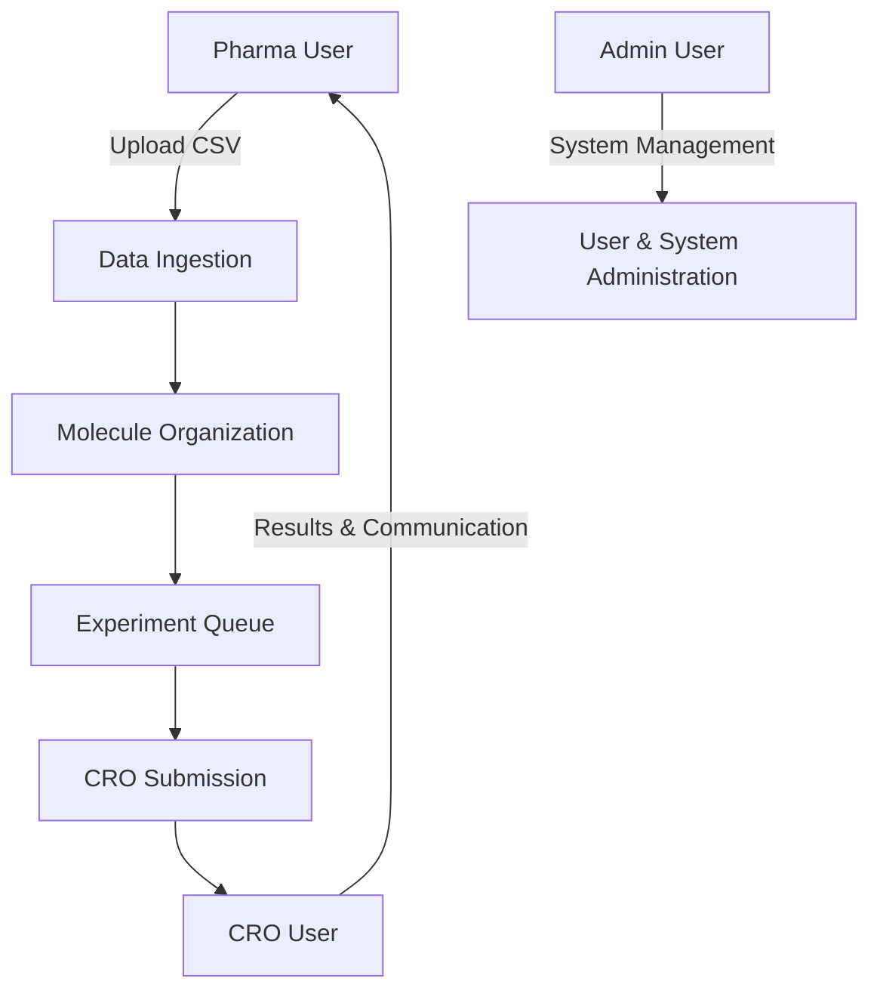
```mermaid
graph TD
    A[Pharma User] -->|Upload CSV| B[Data Ingestion]
    B --> C[Molecule Organization]
    C --> D[Experiment Queue]
    D --> E[CRO Submission]
    E --> F[CRO User]
    F -->|Results & Communication| A
    G[Admin User] -->|System Management| H[User & System Administration]
```

#### 1.2.3 Success Criteria

| Success Metric | Target |
|----------------|--------|
| CSV Processing Time | <30 seconds for files with up to 10,000 molecules |
| User Onboarding | <15 minutes from installation to first molecule submission |
| CRO Response Time | Reduction by 50% compared to manual processes |
| Workflow Efficiency | 75% reduction in time spent organizing molecular data |

### 1.3 SCOPE

#### 1.3.1 In-Scope

**Core Features and Functionalities:**

| Feature Category | Included Capabilities |
|------------------|------------------------|
| Data Management | CSV upload, property mapping, molecular organization, library creation |
| User Experience | Interactive dashboards, drag-and-drop interfaces, real-time filtering |
| CRO Integration | Experiment submission, pricing communication, results retrieval |
| Deployment | Docker containerization, local installation, no external dependencies |

**Implementation Boundaries:**

| Boundary Type | Coverage |
|---------------|----------|
| User Groups | Pharma researchers, CRO service providers, system administrators |
| Data Domains | Molecular structures (SMILES), chemical properties, experimental assay data |
| System Access | Local network deployment with no cloud dependencies |
| Supported Assays | 20+ experimental assessment types including ADME, toxicity, and binding assays |

#### 1.3.2 Out-of-Scope

- External API integrations with third-party chemical databases
- Cloud-based deployment options
- Molecular property prediction algorithms (system accepts pre-calculated values)
- Automated laboratory equipment integration
- Regulatory submission preparation
- Financial transaction processing between pharma and CRO entities
- Multi-tenant SaaS deployment model
- Mobile application interfaces
- Real-time molecular visualization and 3D modeling
- Quantum mechanical calculations or molecular dynamics simulations

## 2. PRODUCT REQUIREMENTS

### 2.1 FEATURE CATALOG

#### 2.1.1 User Management & Authentication

| Metadata | Details |
|----------|---------|
| ID | F-001 |
| Feature Name | User Management & Authentication |
| Feature Category | Security & Access Control |
| Priority Level | Critical |
| Status | Proposed |

**Description:**
- **Overview:** Secure role-based authentication system for pharma users, CRO users, and administrators without external dependencies.
- **Business Value:** Ensures data security and appropriate access controls while maintaining complete system independence.
- **User Benefits:** Streamlined access to role-specific functionality without requiring external authentication services.
- **Technical Context:** Fully local authentication system with encrypted credential storage.

**Dependencies:**
- **Prerequisite Features:** None
- **System Dependencies:** Local database for user credentials
- **External Dependencies:** None
- **Integration Requirements:** None

#### 2.1.2 CSV Upload & Molecular Data Ingestion

| Metadata | Details |
|----------|---------|
| ID | F-002 |
| Feature Name | CSV Upload & Molecular Data Ingestion |
| Feature Category | Data Management |
| Priority Level | Critical |
| Status | Proposed |

**Description:**
- **Overview:** Capability to upload, validate, and process CSV files containing SMILES and property data.
- **Business Value:** Enables efficient data import without manual entry, reducing errors and saving time.
- **User Benefits:** Flexible mapping of CSV headers to system properties with validation to ensure data integrity.
- **Technical Context:** CSV parser with validation logic and dynamic property mapping.

**Dependencies:**
- **Prerequisite Features:** User Management & Authentication (F-001)
- **System Dependencies:** Molecular database
- **External Dependencies:** None
- **Integration Requirements:** None

#### 2.1.3 Molecule Sorting & Organization

| Metadata | Details |
|----------|---------|
| ID | F-003 |
| Feature Name | Molecule Sorting & Organization |
| Feature Category | Data Management |
| Priority Level | Critical |
| Status | Proposed |

**Description:**
- **Overview:** Interactive interface for sorting, filtering, and organizing molecules into custom libraries.
- **Business Value:** Enables researchers to efficiently identify promising candidates and organize research efforts.
- **User Benefits:** Intuitive drag-and-drop interface with real-time filtering capabilities.
- **Technical Context:** Dynamic data filtering and organization system with persistent storage.

**Dependencies:**
- **Prerequisite Features:** CSV Upload & Molecular Data Ingestion (F-002)
- **System Dependencies:** Molecular database
- **External Dependencies:** None
- **Integration Requirements:** None

#### 2.1.4 Molecule Management & Experiment Queuing

| Metadata | Details |
|----------|---------|
| ID | F-004 |
| Feature Name | Molecule Management & Experiment Queuing |
| Feature Category | Workflow Management |
| Priority Level | High |
| Status | Proposed |

**Description:**
- **Overview:** System for flagging molecules, adding them to experimental queues, and tracking their status.
- **Business Value:** Streamlines the transition from computational analysis to experimental validation.
- **User Benefits:** Clear visibility into molecule status and experimental pipeline.
- **Technical Context:** Status tracking system with workflow management capabilities.

**Dependencies:**
- **Prerequisite Features:** Molecule Sorting & Organization (F-003)
- **System Dependencies:** Workflow database
- **External Dependencies:** None
- **Integration Requirements:** Integration with CRO Submission module

#### 2.1.5 CRO Submission & Integration

| Metadata | Details |
|----------|---------|
| ID | F-005 |
| Feature Name | CRO Submission & Integration |
| Feature Category | External Collaboration |
| Priority Level | Critical |
| Status | Proposed |

**Description:**
- **Overview:** Interface for submitting molecules to CROs, managing communications, and receiving results.
- **Business Value:** Creates a seamless connection between computational research and experimental validation.
- **User Benefits:** Streamlined submission process with clear communication channels and result tracking.
- **Technical Context:** Secure data exchange system with bidirectional communication capabilities.

**Dependencies:**
- **Prerequisite Features:** Molecule Management & Experiment Queuing (F-004)
- **System Dependencies:** Communication database
- **External Dependencies:** None
- **Integration Requirements:** Integration with Molecule Management module

#### 2.1.6 Pharma User Interface

| Metadata | Details |
|----------|---------|
| ID | F-006 |
| Feature Name | Pharma User Interface |
| Feature Category | User Experience |
| Priority Level | High |
| Status | Proposed |

**Description:**
- **Overview:** Intuitive dashboard for molecular data organization and experiment submission with drag-and-drop functionality.
- **Business Value:** Increases researcher productivity and reduces training requirements.
- **User Benefits:** Streamlined workflow with real-time filtering and auto-saving of configurations.
- **Technical Context:** Modern web interface with responsive design and interactive components.

**Dependencies:**
- **Prerequisite Features:** User Management & Authentication (F-001)
- **System Dependencies:** Frontend framework
- **External Dependencies:** None
- **Integration Requirements:** Integration with all data management modules

#### 2.1.7 CRO User Interface

| Metadata | Details |
|----------|---------|
| ID | F-007 |
| Feature Name | CRO User Interface |
| Feature Category | User Experience |
| Priority Level | High |
| Status | Proposed |

**Description:**
- **Overview:** Specialized interface for CROs to review submissions, provide pricing, and upload results.
- **Business Value:** Facilitates efficient collaboration between pharma companies and CROs.
- **User Benefits:** Streamlined workflow for processing submissions and communicating with pharma users.
- **Technical Context:** Role-specific interface with secure file upload capabilities.

**Dependencies:**
- **Prerequisite Features:** User Management & Authentication (F-001)
- **System Dependencies:** Frontend framework
- **External Dependencies:** None
- **Integration Requirements:** Integration with CRO Submission module

#### 2.1.8 Experimental Assessment Catalog

| Metadata | Details |
|----------|---------|
| ID | F-008 |
| Feature Name | Experimental Assessment Catalog |
| Feature Category | Data Management |
| Priority Level | Medium |
| Status | Proposed |

**Description:**
- **Overview:** Comprehensive catalog of available experimental assessments with associated data requirements.
- **Business Value:** Provides clear options for experimental validation pathways.
- **User Benefits:** Simplified selection of appropriate tests based on research needs.
- **Technical Context:** Structured catalog with metadata for each assessment type.

**Dependencies:**
- **Prerequisite Features:** None
- **System Dependencies:** Assessment database
- **External Dependencies:** None
- **Integration Requirements:** Integration with CRO Submission module

### 2.2 FUNCTIONAL REQUIREMENTS TABLE

#### 2.2.1 User Management & Authentication (F-001)

| Requirement Details | Description |
|---------------------|-------------|
| ID | F-001-RQ-001 |
| Description | System shall provide secure user registration with email verification |
| Acceptance Criteria | Users can register, receive verification email, and activate account |
| Priority | Must-Have |
| Complexity | Medium |

| Technical Specifications | Details |
|--------------------------|---------|
| Input Parameters | Username, Email, Password, Role Selection |
| Output/Response | Account creation confirmation, verification email |
| Performance Criteria | Registration process completes in <5 seconds |
| Data Requirements | User credentials stored with encryption |

| Validation Rules | Details |
|------------------|---------|
| Business Rules | Email must be unique, password must meet complexity requirements |
| Data Validation | Email format validation, password strength validation |
| Security Requirements | Passwords must be hashed, not stored in plaintext |
| Compliance Requirements | GDPR compliance for EU users |

| Requirement Details | Description |
|---------------------|-------------|
| ID | F-001-RQ-002 |
| Description | System shall support role-based access control (Pharma, CRO, Admin) |
| Acceptance Criteria | Users can only access features appropriate to their role |
| Priority | Must-Have |
| Complexity | Medium |

| Technical Specifications | Details |
|--------------------------|---------|
| Input Parameters | User credentials, Role |
| Output/Response | Role-specific interface and permissions |
| Performance Criteria | Role verification in <1 second |
| Data Requirements | Role definitions and permission mappings |

| Validation Rules | Details |
|------------------|---------|
| Business Rules | Roles must be assigned during registration and changeable by admins |
| Data Validation | Valid role selection required |
| Security Requirements | Role-based access control enforced on all endpoints |
| Compliance Requirements | Audit logging of role changes |

#### 2.2.2 CSV Upload & Molecular Data Ingestion (F-002)

| Requirement Details | Description |
|---------------------|-------------|
| ID | F-002-RQ-001 |
| Description | System shall allow upload of CSV files containing SMILES and property data |
| Acceptance Criteria | Users can upload CSV files and see preview of data |
| Priority | Must-Have |
| Complexity | Medium |

| Technical Specifications | Details |
|--------------------------|---------|
| Input Parameters | CSV file |
| Output/Response | Data preview, validation results |
| Performance Criteria | Upload and preview of 10,000 molecules in <30 seconds |
| Data Requirements | CSV with SMILES column and property columns |

| Validation Rules | Details |
|------------------|---------|
| Business Rules | File must contain valid SMILES column |
| Data Validation | CSV format validation, SMILES validation |
| Security Requirements | File size limits, content type validation |
| Compliance Requirements | None |

| Requirement Details | Description |
|---------------------|-------------|
| ID | F-002-RQ-002 |
| Description | System shall allow mapping of CSV headers to system-defined properties |
| Acceptance Criteria | Users can interactively map columns to system properties |
| Priority | Must-Have |
| Complexity | Medium |

| Technical Specifications | Details |
|--------------------------|---------|
| Input Parameters | CSV headers, System property selections |
| Output/Response | Mapping confirmation, validation results |
| Performance Criteria | Mapping interface responds in <1 second |
| Data Requirements | System property definitions |

| Validation Rules | Details |
|------------------|---------|
| Business Rules | SMILES column must be mapped |
| Data Validation | Data type validation for mapped properties |
| Security Requirements | Input sanitization |
| Compliance Requirements | None |

#### 2.2.3 Molecule Sorting & Organization (F-003)

| Requirement Details | Description |
|---------------------|-------------|
| ID | F-003-RQ-001 |
| Description | System shall provide interactive sorting and filtering of molecules by properties |
| Acceptance Criteria | Users can sort and filter molecules in real-time |
| Priority | Must-Have |
| Complexity | Medium |

| Technical Specifications | Details |
|--------------------------|---------|
| Input Parameters | Sort criteria, Filter parameters |
| Output/Response | Filtered and sorted molecule list |
| Performance Criteria | Filtering of 10,000 molecules in <2 seconds |
| Data Requirements | Indexed molecular properties |

| Validation Rules | Details |
|------------------|---------|
| Business Rules | Valid property selections for sorting/filtering |
| Data Validation | Range validation for numerical filters |
| Security Requirements | Input sanitization |
| Compliance Requirements | None |

| Requirement Details | Description |
|---------------------|-------------|
| ID | F-003-RQ-002 |
| Description | System shall allow creation and management of custom molecule libraries |
| Acceptance Criteria | Users can create, edit, and delete custom libraries |
| Priority | Must-Have |
| Complexity | Medium |

| Technical Specifications | Details |
|--------------------------|---------|
| Input Parameters | Library name, Description, Molecule selections |
| Output/Response | Library creation confirmation, library contents |
| Performance Criteria | Library operations complete in <3 seconds |
| Data Requirements | Library definitions and molecule associations |

| Validation Rules | Details |
|------------------|---------|
| Business Rules | Library names must be unique per user |
| Data Validation | Required fields validation |
| Security Requirements | Access control for library management |
| Compliance Requirements | None |

#### 2.2.4 Molecule Management & Experiment Queuing (F-004)

| Requirement Details | Description |
|---------------------|-------------|
| ID | F-004-RQ-001 |
| Description | System shall allow flagging molecules for priority review |
| Acceptance Criteria | Users can flag/unflag molecules and view flagged molecules |
| Priority | Should-Have |
| Complexity | Low |

| Technical Specifications | Details |
|--------------------------|---------|
| Input Parameters | Molecule ID, Flag status |
| Output/Response | Updated flag status, filtered view |
| Performance Criteria | Flag operations complete in <1 second |
| Data Requirements | Flag status storage |

| Validation Rules | Details |
|------------------|---------|
| Business Rules | Only authorized users can flag molecules |
| Data Validation | Valid molecule ID |
| Security Requirements | Access control for flag operations |
| Compliance Requirements | None |

| Requirement Details | Description |
|---------------------|-------------|
| ID | F-004-RQ-002 |
| Description | System shall allow adding molecules to experimental queues |
| Acceptance Criteria | Users can add molecules to queues and track status |
| Priority | Must-Have |
| Complexity | Medium |

| Technical Specifications | Details |
|--------------------------|---------|
| Input Parameters | Molecule IDs, Queue selection |
| Output/Response | Queue update confirmation, status tracking |
| Performance Criteria | Queue operations complete in <2 seconds |
| Data Requirements | Queue definitions and status tracking |

| Validation Rules | Details |
|------------------|---------|
| Business Rules | Valid queue selection required |
| Data Validation | Valid molecule IDs |
| Security Requirements | Access control for queue operations |
| Compliance Requirements | Audit logging of queue changes |

#### 2.2.5 CRO Submission & Integration (F-005)

| Requirement Details | Description |
|---------------------|-------------|
| ID | F-005-RQ-001 |
| Description | System shall allow selection of CRO services and submission of molecules |
| Acceptance Criteria | Users can select services, submit molecules, and track submissions |
| Priority | Must-Have |
| Complexity | High |

| Technical Specifications | Details |
|--------------------------|---------|
| Input Parameters | CRO service selection, Molecule IDs, Specifications |
| Output/Response | Submission confirmation, tracking information |
| Performance Criteria | Submission process completes in <5 seconds |
| Data Requirements | CRO service definitions, submission tracking |

| Validation Rules | Details |
|------------------|---------|
| Business Rules | Valid service selection required |
| Data Validation | Required fields validation |
| Security Requirements | Secure transmission of submission data |
| Compliance Requirements | Audit logging of submissions |

| Requirement Details | Description |
|---------------------|-------------|
| ID | F-005-RQ-002 |
| Description | System shall allow CROs to provide pricing, turnaround times, and upload results |
| Acceptance Criteria | CROs can respond to submissions with pricing and upload results |
| Priority | Must-Have |
| Complexity | High |

| Technical Specifications | Details |
|--------------------------|---------|
| Input Parameters | Submission ID, Pricing, Turnaround time, Result files |
| Output/Response | Response confirmation, notification to pharma user |
| Performance Criteria | Response process completes in <5 seconds |
| Data Requirements | Response tracking, file storage |

| Validation Rules | Details |
|------------------|---------|
| Business Rules | Only assigned CRO can respond to submission |
| Data Validation | Required fields validation, file type validation |
| Security Requirements | Secure file upload, access control |
| Compliance Requirements | Audit logging of responses |

### 2.3 FEATURE RELATIONSHIPS

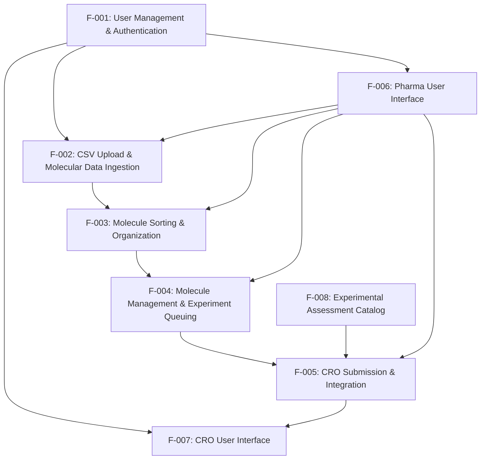
```mermaid
graph TD
    F001[F-001: User Management & Authentication]
    F002[F-002: CSV Upload & Molecular Data Ingestion]
    F003[F-003: Molecule Sorting & Organization]
    F004[F-004: Molecule Management & Experiment Queuing]
    F005[F-005: CRO Submission & Integration]
    F006[F-006: Pharma User Interface]
    F007[F-007: CRO User Interface]
    F008[F-008: Experimental Assessment Catalog]
    
    F001 --> F002
    F001 --> F006
    F001 --> F007
    F002 --> F003
    F003 --> F004
    F004 --> F005
    F005 --> F007
    F008 --> F005
    F006 --> F002
    F006 --> F003
    F006 --> F004
    F006 --> F005
```

#### 2.3.1 Integration Points

| Feature | Integration Points |
|---------|-------------------|
| User Management & Authentication (F-001) | Integrates with all features requiring user context |
| CSV Upload & Molecular Data Ingestion (F-002) | Integrates with Molecule Sorting & Organization (F-003) |
| Molecule Sorting & Organization (F-003) | Integrates with Molecule Management & Experiment Queuing (F-004) |
| Molecule Management & Experiment Queuing (F-004) | Integrates with CRO Submission & Integration (F-005) |
| CRO Submission & Integration (F-005) | Integrates with Experimental Assessment Catalog (F-008) |

#### 2.3.2 Shared Components

| Component | Used By Features |
|-----------|------------------|
| User Authentication Service | F-001, F-006, F-007 |
| Molecular Database | F-002, F-003, F-004, F-005 |
| Workflow Engine | F-004, F-005 |
| File Upload Service | F-002, F-005 |
| Notification System | F-001, F-004, F-005 |

### 2.4 IMPLEMENTATION CONSIDERATIONS

#### 2.4.1 Technical Constraints

| Feature | Technical Constraints |
|---------|----------------------|
| User Management & Authentication (F-001) | Must operate without external authentication services |
| CSV Upload & Molecular Data Ingestion (F-002) | Must handle large files (up to 10,000 molecules) efficiently |
| Molecule Sorting & Organization (F-003) | Must provide real-time filtering performance |
| CRO Submission & Integration (F-005) | Must ensure secure data exchange without external dependencies |
| All Features | Must be deployable locally via Docker containers |

#### 2.4.2 Performance Requirements

| Feature | Performance Requirements |
|---------|--------------------------|
| CSV Upload & Molecular Data Ingestion (F-002) | Process 10,000 molecules in <30 seconds |
| Molecule Sorting & Organization (F-003) | Filter 10,000 molecules in <2 seconds |
| Molecule Management & Experiment Queuing (F-004) | Queue operations complete in <2 seconds |
| User Management & Authentication (F-001) | Authentication process completes in <2 seconds |
| CRO Submission & Integration (F-005) | Submission process completes in <5 seconds |

#### 2.4.3 Security Implications

| Feature | Security Implications |
|---------|----------------------|
| User Management & Authentication (F-001) | Requires secure credential storage, password hashing |
| CSV Upload & Molecular Data Ingestion (F-002) | Requires input validation to prevent injection attacks |
| CRO Submission & Integration (F-005) | Requires secure file handling and data transmission |
| All Features | Requires role-based access control enforcement |
| All Features | Requires input sanitization to prevent XSS attacks |

#### 2.4.4 Maintenance Requirements

| Feature | Maintenance Requirements |
|---------|--------------------------|
| Experimental Assessment Catalog (F-008) | Regular updates to assessment types and requirements |
| User Management & Authentication (F-001) | Regular security updates and password policy enforcement |
| CSV Upload & Molecular Data Ingestion (F-002) | Monitoring of file processing performance |
| CRO Submission & Integration (F-005) | Monitoring of submission workflow efficiency |
| All Features | Regular database maintenance and optimization |

### 2.5 TRACEABILITY MATRIX

| Requirement ID | Feature ID | Business Need | Technical Specification |
|----------------|------------|---------------|-------------------------|
| F-001-RQ-001 | F-001 | Secure user access | Local authentication system |
| F-001-RQ-002 | F-001 | Role-specific access | Role-based permission system |
| F-002-RQ-001 | F-002 | Efficient data import | CSV processing engine |
| F-002-RQ-002 | F-002 | Flexible data mapping | Dynamic property mapping system |
| F-003-RQ-001 | F-003 | Efficient molecule analysis | Real-time filtering engine |
| F-003-RQ-002 | F-003 | Organized research | Custom library management |
| F-004-RQ-001 | F-004 | Priority identification | Molecule flagging system |
| F-004-RQ-002 | F-004 | Experiment planning | Queue management system |
| F-005-RQ-001 | F-005 | CRO collaboration | Submission workflow system |
| F-005-RQ-002 | F-005 | Result management | Secure file exchange system |

## 3. TECHNOLOGY STACK

### 3.1 PROGRAMMING LANGUAGES

| Component | Language | Version | Justification |
|-----------|----------|---------|---------------|
| Backend | Python | 3.10+ | Excellent support for scientific computing, molecular data processing libraries, and web frameworks. Widely used in pharmaceutical research. |
| Frontend | JavaScript/TypeScript | TypeScript 4.9+ | Type safety for complex data structures and improved developer experience. TypeScript provides better maintainability for complex UIs. |
| Database Scripts | SQL | - | Required for database schema management and optimization. |
| Build Scripts | Bash | - | Necessary for containerization and deployment automation. |

### 3.2 FRAMEWORKS & LIBRARIES

#### 3.2.1 Backend Frameworks

| Framework | Version | Purpose | Justification |
|-----------|---------|---------|---------------|
| FastAPI | 0.95+ | API Development | High performance, automatic OpenAPI documentation, and native async support. Ideal for handling molecular data processing requests. |
| SQLAlchemy | 2.0+ | ORM | Robust database abstraction with transaction support for complex molecular data relationships. |
| RDKit | 2023.03+ | Cheminformatics | Industry-standard library for molecular data processing, SMILES parsing, and chemical property calculations. |
| Pandas | 2.0+ | Data Processing | Efficient handling of tabular data for CSV processing and molecular property analysis. |
| Pydantic | 2.0+ | Data Validation | Strong typing and validation for molecular data structures and API requests/responses. |

#### 3.2.2 Frontend Frameworks

| Framework | Version | Purpose | Justification |
|-----------|---------|---------|---------------|
| React | 18.2+ | UI Framework | Component-based architecture ideal for complex molecular data visualization and organization interfaces. |
| Redux Toolkit | 1.9+ | State Management | Centralized state management for complex molecular data and workflow states. |
| Material-UI | 5.13+ | UI Components | Comprehensive component library with drag-and-drop support for molecule organization. |
| React Query | 4.28+ | Data Fetching | Efficient data fetching with caching for improved performance with large molecular datasets. |
| D3.js | 7.8+ | Data Visualization | Advanced visualization capabilities for molecular property charts and graphs. |

### 3.3 DATABASES & STORAGE

| Database | Version | Purpose | Justification |
|----------|---------|---------|---------------|
| PostgreSQL | 15+ | Primary Database | ACID-compliant relational database with excellent support for complex queries and transactions. Supports JSON for flexible property storage. |
| Redis | 7.0+ | Caching & Session Store | In-memory data structure store for high-performance caching and session management. |
| MinIO | RELEASE.2023-05-04T21-44-30Z | Object Storage | S3-compatible object storage for molecular files and experimental results. Self-hosted alternative to cloud storage. |

#### 3.3.1 Data Persistence Strategy

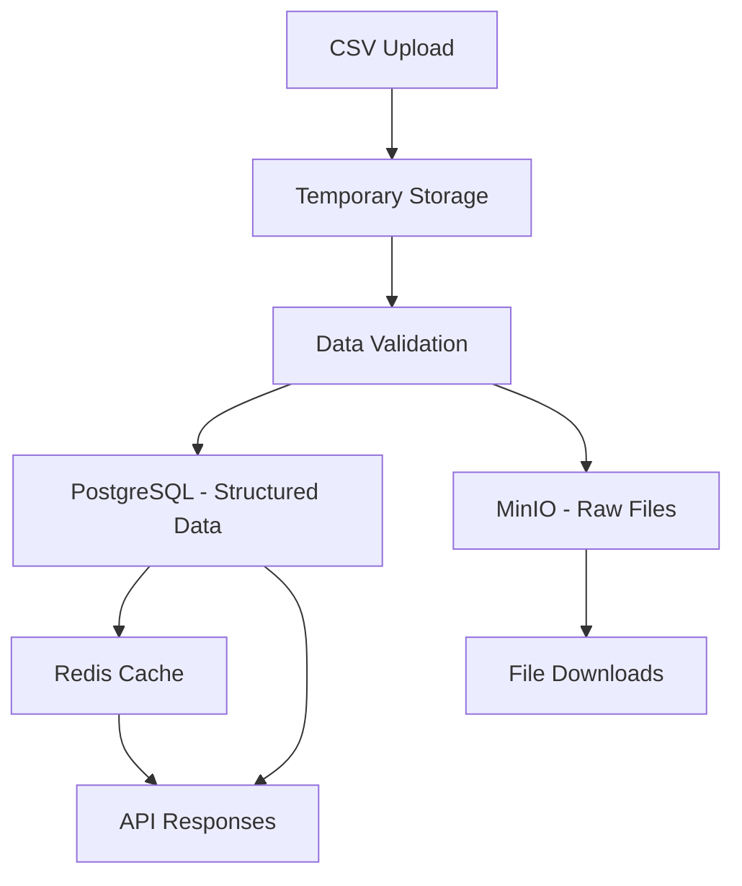
```mermaid
graph TD
    A[CSV Upload] --> B[Temporary Storage]
    B --> C[Data Validation]
    C --> D[PostgreSQL - Structured Data]
    C --> E[MinIO - Raw Files]
    D --> F[Redis Cache]
    F --> G[API Responses]
    D --> G
    E --> H[File Downloads]
```

### 3.4 THIRD-PARTY SERVICES

| Service | Purpose | Justification | Integration Method |
|---------|---------|---------------|-------------------|
| None | - | System designed to operate fully locally without external dependencies as per requirements | - |

### 3.5 DEVELOPMENT & DEPLOYMENT

#### 3.5.1 Development Tools

| Tool | Version | Purpose | Justification |
|------|---------|---------|---------------|
| Visual Studio Code | Latest | IDE | Excellent support for Python, TypeScript, and Docker development. |
| Git | 2.40+ | Version Control | Industry standard for source code management. |
| Poetry | 1.4+ | Python Dependency Management | Deterministic builds and dependency resolution for backend. |
| npm | 9.6+ | JavaScript Package Management | Standard package manager for frontend dependencies. |
| ESLint | 8.40+ | JavaScript Linting | Code quality and consistency enforcement. |
| Pytest | 7.3+ | Backend Testing | Comprehensive testing framework for Python. |
| Jest | 29.5+ | Frontend Testing | Standard testing framework for React applications. |

#### 3.5.2 Containerization & Deployment

| Tool | Version | Purpose | Justification |
|------|---------|---------|---------------|
| Docker | 23.0+ | Containerization | Industry standard for containerization, ensuring consistent deployment across environments. |
| Docker Compose | 2.17+ | Multi-container Orchestration | Simplifies management of multi-container applications for local deployment. |
| Nginx | 1.24+ | Web Server/Reverse Proxy | High-performance web server for serving static assets and routing API requests. |

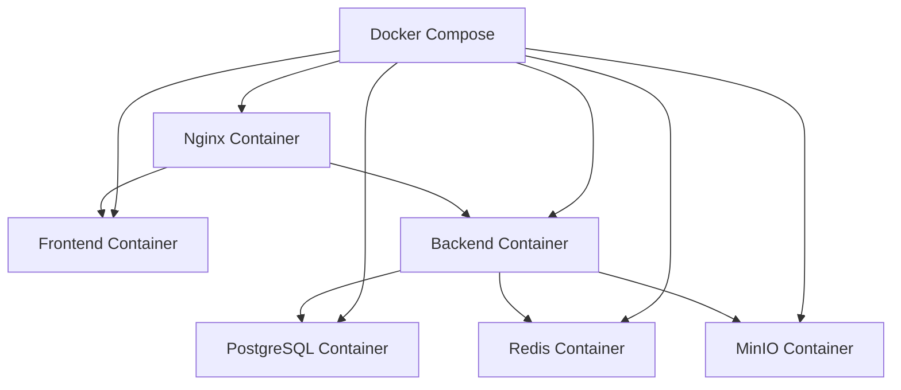
```mermaid
graph TD
    A[Docker Compose] --> B[Frontend Container]
    A --> C[Backend Container]
    A --> D[PostgreSQL Container]
    A --> E[Redis Container]
    A --> F[MinIO Container]
    A --> G[Nginx Container]
    G --> B
    G --> C
    C --> D
    C --> E
    C --> F
```

### 3.6 SECURITY COMPONENTS

| Component | Version | Purpose | Justification |
|-----------|---------|---------|---------------|
| Passlib | 1.7.4+ | Password Hashing | Secure password storage with modern hashing algorithms. |
| PyJWT | 2.7+ | JWT Authentication | Token-based authentication without external dependencies. |
| CORS Middleware | - | Cross-Origin Security | Prevent unauthorized cross-origin requests. |
| Content Security Policy | - | XSS Prevention | Mitigate cross-site scripting attacks. |
| Input Validation | - | Injection Prevention | Prevent SQL injection and other injection attacks. |

### 3.7 TECHNOLOGY STACK INTEGRATION

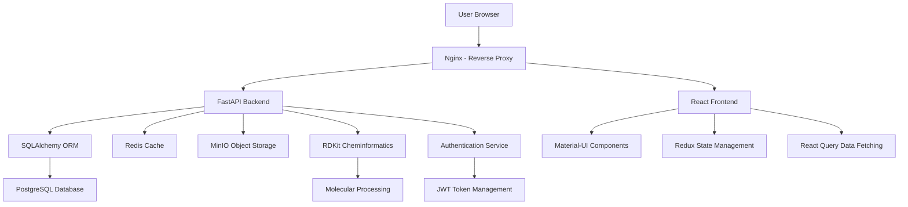
```mermaid
graph TD
    A[User Browser] --> B[Nginx - Reverse Proxy]
    B --> C[React Frontend]
    B --> D[FastAPI Backend]
    D --> E[SQLAlchemy ORM]
    E --> F[PostgreSQL Database]
    D --> G[Redis Cache]
    D --> H[MinIO Object Storage]
    D --> I[RDKit Cheminformatics]
    I --> J[Molecular Processing]
    D --> K[Authentication Service]
    K --> L[JWT Token Management]
    C --> M[Material-UI Components]
    C --> N[Redux State Management]
    C --> O[React Query Data Fetching]
```

### 3.8 TECHNOLOGY SELECTION RATIONALE

| Requirement | Technology Choice | Rationale |
|-------------|-------------------|-----------|
| Local Deployment | Docker & Docker Compose | Enables fully local deployment without external dependencies while maintaining isolation between services. |
| No External APIs | Self-contained JWT Authentication | Eliminates dependency on external authentication services while maintaining security. |
| CSV Processing | Pandas & RDKit | Industry-standard libraries for handling tabular data and molecular structures with excellent performance. |
| Interactive UI | React & Material-UI | Provides drag-and-drop capabilities and responsive interfaces for molecular organization. |
| Real-time Filtering | React Query & Redux | Efficient state management and data fetching for responsive filtering of large molecular datasets. |
| Secure File Exchange | MinIO | Self-hosted object storage eliminates dependency on cloud services while providing secure file management. |
| Performance Requirements | FastAPI & PostgreSQL | High-performance API framework and database to meet processing time requirements for large datasets. |

## 4. PROCESS FLOWCHART

### 4.1 SYSTEM WORKFLOWS

#### 4.1.1 Core Business Processes

##### User Authentication and Access Control

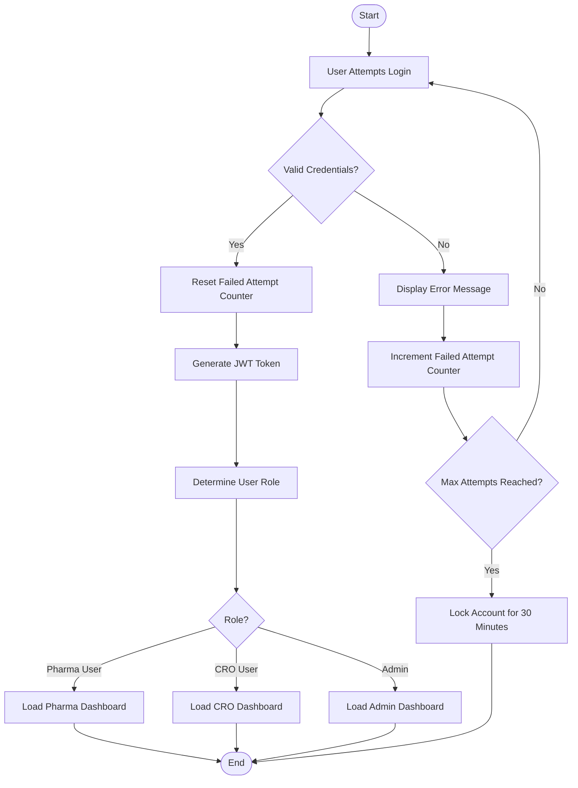
```mermaid
flowchart TD
    Start([Start]) --> A[User Attempts Login]
    A --> B{Valid Credentials?}
    B -->|No| C[Display Error Message]
    C --> D[Increment Failed Attempt Counter]
    D --> E{Max Attempts Reached?}
    E -->|Yes| F[Lock Account for 30 Minutes]
    E -->|No| A
    B -->|Yes| G[Reset Failed Attempt Counter]
    G --> H[Generate JWT Token]
    H --> I[Determine User Role]
    I --> J{Role?}
    J -->|Pharma User| K[Load Pharma Dashboard]
    J -->|CRO User| L[Load CRO Dashboard]
    J -->|Admin| M[Load Admin Dashboard]
    K --> End([End])
    L --> End
    M --> End
    F --> End
```

##### CSV Upload and Molecule Ingestion

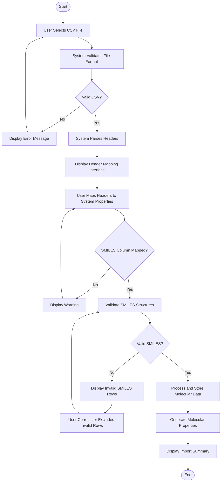
```mermaid
flowchart TD
    Start([Start]) --> A[User Selects CSV File]
    A --> B[System Validates File Format]
    B --> C{Valid CSV?}
    C -->|No| D[Display Error Message]
    D --> A
    C -->|Yes| E[System Parses Headers]
    E --> F[Display Header Mapping Interface]
    F --> G[User Maps Headers to System Properties]
    G --> H{SMILES Column Mapped?}
    H -->|No| I[Display Warning]
    I --> G
    H -->|Yes| J[Validate SMILES Structures]
    J --> K{Valid SMILES?}
    K -->|No| L[Display Invalid SMILES Rows]
    L --> M[User Corrects or Excludes Invalid Rows]
    M --> J
    K -->|Yes| N[Process and Store Molecular Data]
    N --> O[Generate Molecular Properties]
    O --> P[Display Import Summary]
    P --> End([End])
```

##### Molecule Organization and Library Management

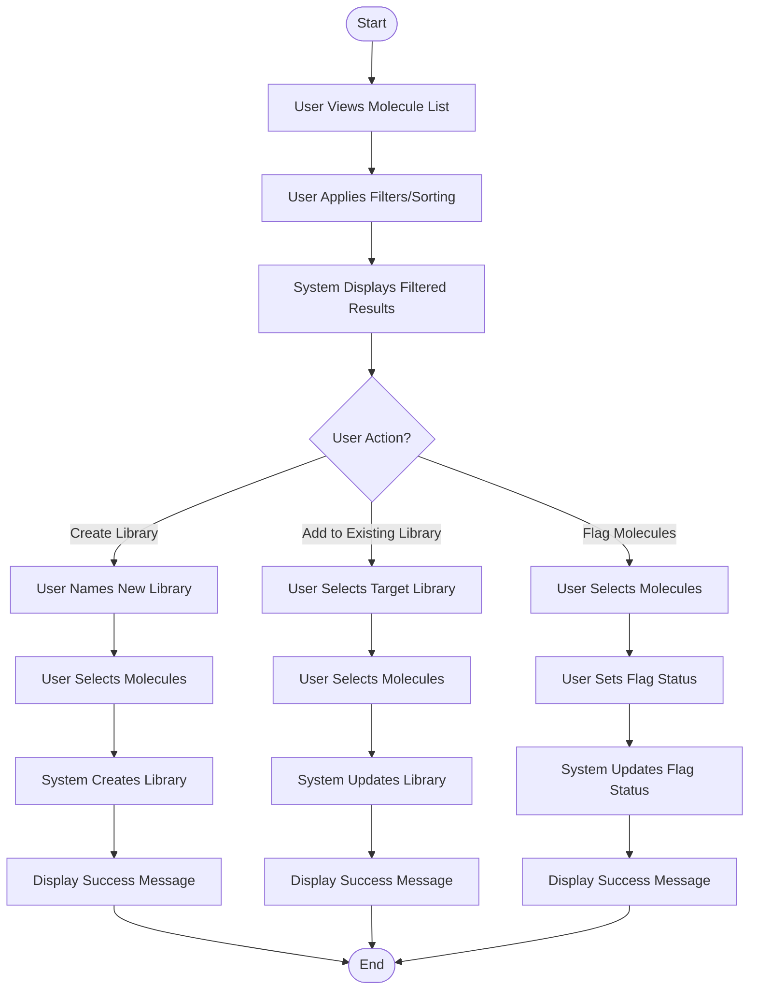
```mermaid
flowchart TD
    Start([Start]) --> A[User Views Molecule List]
    A --> B[User Applies Filters/Sorting]
    B --> C[System Displays Filtered Results]
    C --> D{User Action?}
    D -->|Create Library| E[User Names New Library]
    E --> F[User Selects Molecules]
    F --> G[System Creates Library]
    G --> H[Display Success Message]
    D -->|Add to Existing Library| I[User Selects Target Library]
    I --> J[User Selects Molecules]
    J --> K[System Updates Library]
    K --> L[Display Success Message]
    D -->|Flag Molecules| M[User Selects Molecules]
    M --> N[User Sets Flag Status]
    N --> O[System Updates Flag Status]
    O --> P[Display Success Message]
    H --> End([End])
    L --> End
    P --> End
```

##### Experiment Queue Management

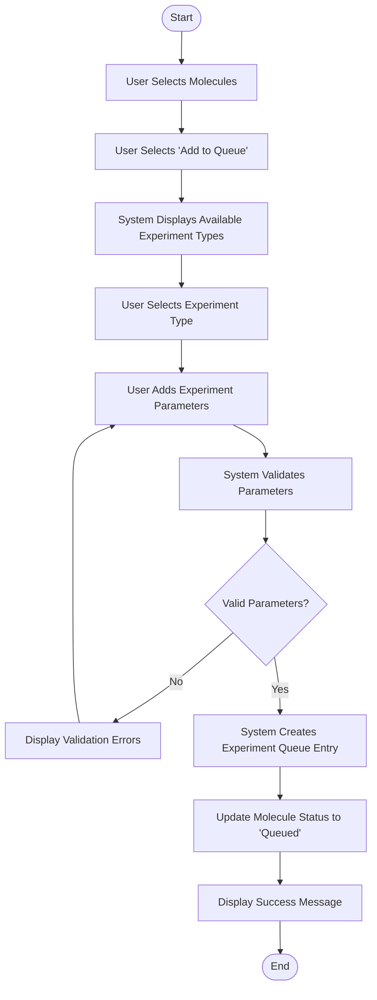
```mermaid
flowchart TD
    Start([Start]) --> A[User Selects Molecules]
    A --> B[User Selects 'Add to Queue']
    B --> C[System Displays Available Experiment Types]
    C --> D[User Selects Experiment Type]
    D --> E[User Adds Experiment Parameters]
    E --> F[System Validates Parameters]
    F --> G{Valid Parameters?}
    G -->|No| H[Display Validation Errors]
    H --> E
    G -->|Yes| I[System Creates Experiment Queue Entry]
    I --> J[Update Molecule Status to 'Queued']
    J --> K[Display Success Message]
    K --> End([End])
```

##### CRO Submission Workflow

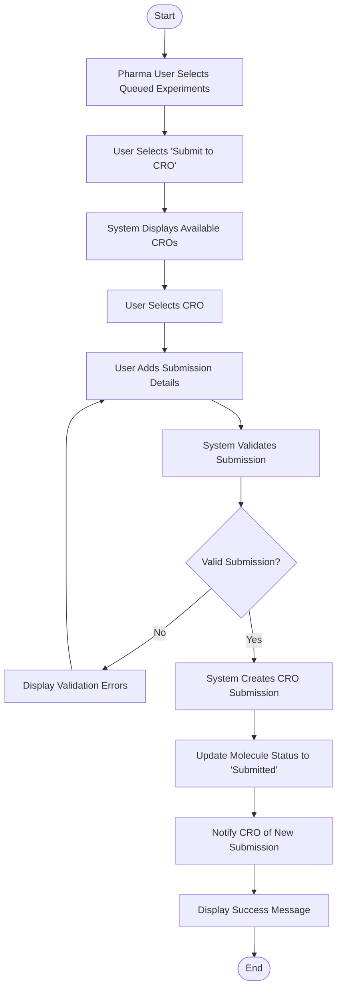
```mermaid
flowchart TD
    Start([Start]) --> A[Pharma User Selects Queued Experiments]
    A --> B[User Selects 'Submit to CRO']
    B --> C[System Displays Available CROs]
    C --> D[User Selects CRO]
    D --> E[User Adds Submission Details]
    E --> F[System Validates Submission]
    F --> G{Valid Submission?}
    G -->|No| H[Display Validation Errors]
    H --> E
    G -->|Yes| I[System Creates CRO Submission]
    I --> J[Update Molecule Status to 'Submitted']
    J --> K[Notify CRO of New Submission]
    K --> L[Display Success Message]
    L --> End([End])
```

##### CRO Response and Result Management

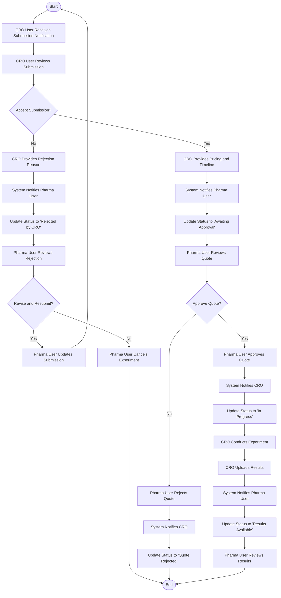
```mermaid
flowchart TD
    Start([Start]) --> A[CRO User Receives Submission Notification]
    A --> B[CRO User Reviews Submission]
    B --> C{Accept Submission?}
    C -->|No| D[CRO Provides Rejection Reason]
    D --> E[System Notifies Pharma User]
    E --> F[Update Status to 'Rejected by CRO']
    F --> G[Pharma User Reviews Rejection]
    G --> H{Revise and Resubmit?}
    H -->|Yes| I[Pharma User Updates Submission]
    I --> Start
    H -->|No| J[Pharma User Cancels Experiment]
    J --> End([End])
    C -->|Yes| K[CRO Provides Pricing and Timeline]
    K --> L[System Notifies Pharma User]
    L --> M[Update Status to 'Awaiting Approval']
    M --> N[Pharma User Reviews Quote]
    N --> O{Approve Quote?}
    O -->|No| P[Pharma User Rejects Quote]
    P --> Q[System Notifies CRO]
    Q --> R[Update Status to 'Quote Rejected']
    R --> End
    O -->|Yes| S[Pharma User Approves Quote]
    S --> T[System Notifies CRO]
    T --> U[Update Status to 'In Progress']
    U --> V[CRO Conducts Experiment]
    V --> W[CRO Uploads Results]
    W --> X[System Notifies Pharma User]
    X --> Y[Update Status to 'Results Available']
    Y --> Z[Pharma User Reviews Results]
    Z --> End
```

#### 4.1.2 Integration Workflows

##### Data Flow Between System Components

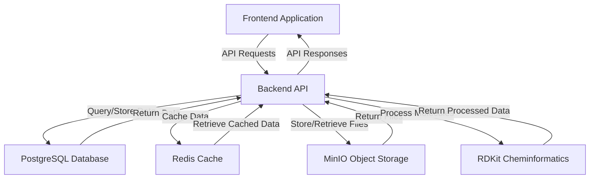
```mermaid
flowchart TD
    A[Frontend Application] -->|API Requests| B[Backend API]
    B -->|API Responses| A
    B -->|Query/Store Data| C[PostgreSQL Database]
    C -->|Return Data| B
    B -->|Cache Data| D[Redis Cache]
    D -->|Retrieve Cached Data| B
    B -->|Store/Retrieve Files| E[MinIO Object Storage]
    E -->|Return Files| B
    B -->|Process Molecules| F[RDKit Cheminformatics]
    F -->|Return Processed Data| B
```

##### Notification System Flow

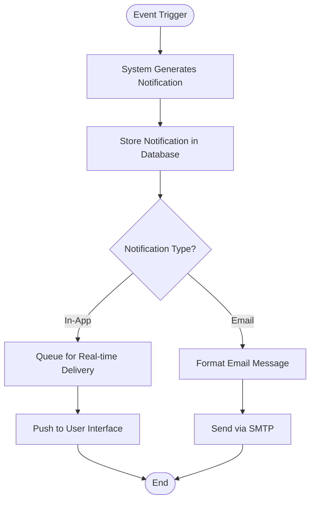
```mermaid
flowchart TD
    Start([Event Trigger]) --> A[System Generates Notification]
    A --> B[Store Notification in Database]
    B --> C{Notification Type?}
    C -->|In-App| D[Queue for Real-time Delivery]
    D --> E[Push to User Interface]
    C -->|Email| F[Format Email Message]
    F --> G[Send via SMTP]
    E --> End([End])
    G --> End
```

##### Batch Processing for Molecular Data

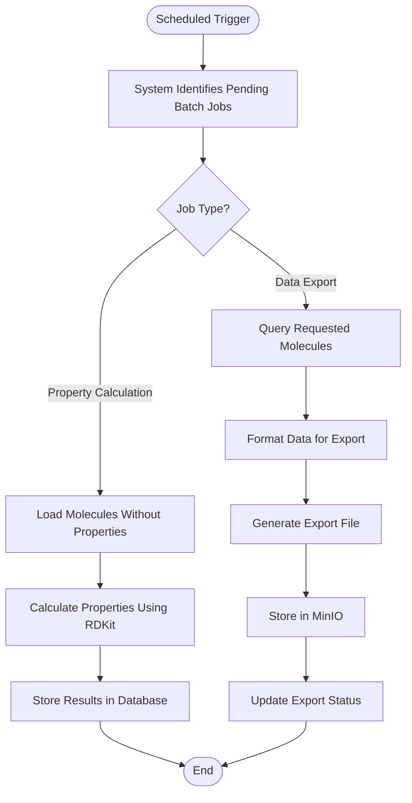
```mermaid
flowchart TD
    Start([Scheduled Trigger]) --> A[System Identifies Pending Batch Jobs]
    A --> B{Job Type?}
    B -->|Property Calculation| C[Load Molecules Without Properties]
    C --> D[Calculate Properties Using RDKit]
    D --> E[Store Results in Database]
    B -->|Data Export| F[Query Requested Molecules]
    F --> G[Format Data for Export]
    G --> H[Generate Export File]
    H --> I[Store in MinIO]
    I --> J[Update Export Status]
    E --> End([End])
    J --> End
```

### 4.2 FLOWCHART REQUIREMENTS

#### 4.2.1 User Registration Process

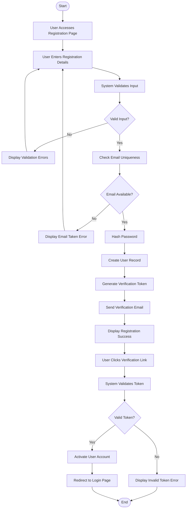
```mermaid
flowchart TD
    Start([Start]) --> A[User Accesses Registration Page]
    A --> B[User Enters Registration Details]
    B --> C[System Validates Input]
    C --> D{Valid Input?}
    D -->|No| E[Display Validation Errors]
    E --> B
    D -->|Yes| F[Check Email Uniqueness]
    F --> G{Email Available?}
    G -->|No| H[Display Email Taken Error]
    H --> B
    G -->|Yes| I[Hash Password]
    I --> J[Create User Record]
    J --> K[Generate Verification Token]
    K --> L[Send Verification Email]
    L --> M[Display Registration Success]
    M --> N[User Clicks Verification Link]
    N --> O[System Validates Token]
    O --> P{Valid Token?}
    P -->|No| Q[Display Invalid Token Error]
    Q --> End([End])
    P -->|Yes| R[Activate User Account]
    R --> S[Redirect to Login Page]
    S --> End
```

#### 4.2.2 Molecule Data Validation Process

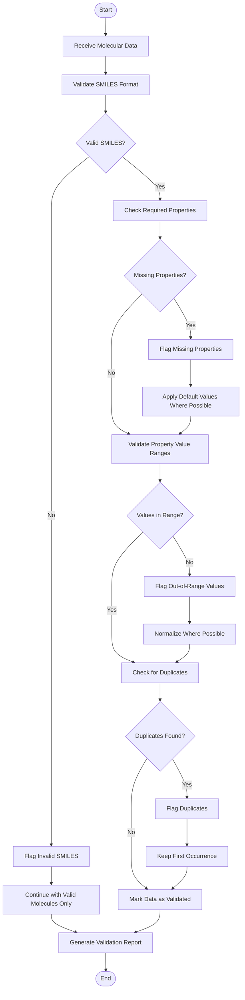
```mermaid
flowchart TD
    Start([Start]) --> A[Receive Molecular Data]
    A --> B[Validate SMILES Format]
    B --> C{Valid SMILES?}
    C -->|No| D[Flag Invalid SMILES]
    D --> E[Continue with Valid Molecules Only]
    C -->|Yes| F[Check Required Properties]
    F --> G{Missing Properties?}
    G -->|Yes| H[Flag Missing Properties]
    H --> I[Apply Default Values Where Possible]
    G -->|No| J[Validate Property Value Ranges]
    I --> J
    J --> K{Values in Range?}
    K -->|No| L[Flag Out-of-Range Values]
    L --> M[Normalize Where Possible]
    K -->|Yes| N[Check for Duplicates]
    M --> N
    N --> O{Duplicates Found?}
    O -->|Yes| P[Flag Duplicates]
    P --> Q[Keep First Occurrence]
    O -->|No| R[Mark Data as Validated]
    Q --> R
    E --> S[Generate Validation Report]
    R --> S
    S --> End([End])
```

#### 4.2.3 CRO Submission Authorization Flow

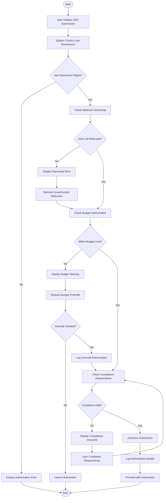
```mermaid
flowchart TD
    Start([Start]) --> A[User Initiates CRO Submission]
    A --> B[System Checks User Permissions]
    B --> C{Has Submission Rights?}
    C -->|No| D[Display Authorization Error]
    D --> End([End])
    C -->|Yes| E[Check Molecule Ownership]
    E --> F{Owns All Molecules?}
    F -->|No| G[Display Ownership Error]
    G --> H[Remove Unauthorized Molecules]
    F -->|Yes| I[Check Budget Authorization]
    H --> I
    I --> J{Within Budget Limit?}
    J -->|No| K[Display Budget Warning]
    K --> L[Request Budget Override]
    L --> M{Override Granted?}
    M -->|No| N[Cancel Submission]
    N --> End
    M -->|Yes| O[Log Override Authorization]
    J -->|Yes| P[Check Compliance Requirements]
    O --> P
    P --> Q{Compliance Met?}
    Q -->|No| R[Display Compliance Checklist]
    R --> S[User Completes Requirements]
    S --> P
    Q -->|Yes| T[Authorize Submission]
    T --> U[Log Authorization Details]
    U --> V[Proceed with Submission]
    V --> End
```

### 4.3 TECHNICAL IMPLEMENTATION

#### 4.3.1 State Management Diagram

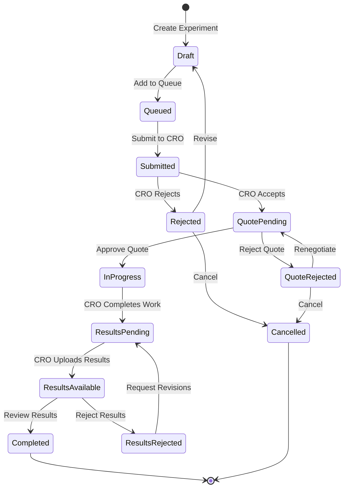
```mermaid
stateDiagram-v2
    [*] --> Draft: Create Experiment
    Draft --> Queued: Add to Queue
    Queued --> Submitted: Submit to CRO
    Submitted --> Rejected: CRO Rejects
    Submitted --> QuotePending: CRO Accepts
    Rejected --> Draft: Revise
    Rejected --> Cancelled: Cancel
    QuotePending --> QuoteRejected: Reject Quote
    QuotePending --> InProgress: Approve Quote
    QuoteRejected --> Cancelled: Cancel
    QuoteRejected --> QuotePending: Renegotiate
    InProgress --> ResultsPending: CRO Completes Work
    ResultsPending --> ResultsAvailable: CRO Uploads Results
    ResultsAvailable --> Completed: Review Results
    ResultsAvailable --> ResultsRejected: Reject Results
    ResultsRejected --> ResultsPending: Request Revisions
    Completed --> [*]
    Cancelled --> [*]
```

#### 4.3.2 Error Handling Flow

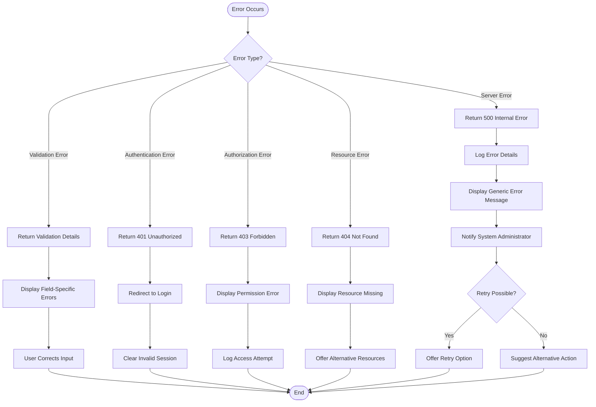
```mermaid
flowchart TD
    Start([Error Occurs]) --> A{Error Type?}
    A -->|Validation Error| B[Return Validation Details]
    B --> C[Display Field-Specific Errors]
    C --> D[User Corrects Input]
    D --> End([End])
    
    A -->|Authentication Error| E[Return 401 Unauthorized]
    E --> F[Redirect to Login]
    F --> G[Clear Invalid Session]
    G --> End
    
    A -->|Authorization Error| H[Return 403 Forbidden]
    H --> I[Display Permission Error]
    I --> J[Log Access Attempt]
    J --> End
    
    A -->|Resource Error| K[Return 404 Not Found]
    K --> L[Display Resource Missing]
    L --> M[Offer Alternative Resources]
    M --> End
    
    A -->|Server Error| N[Return 500 Internal Error]
    N --> O[Log Error Details]
    O --> P[Display Generic Error Message]
    P --> Q[Notify System Administrator]
    Q --> R{Retry Possible?}
    R -->|Yes| S[Offer Retry Option]
    S --> End
    R -->|No| T[Suggest Alternative Action]
    T --> End
```

#### 4.3.3 Transaction Boundary Management

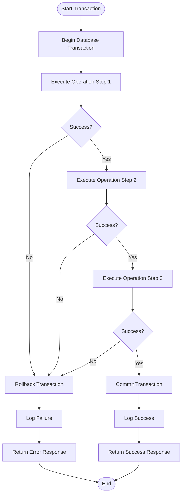
```mermaid
flowchart TD
    Start([Start Transaction]) --> A[Begin Database Transaction]
    A --> B[Execute Operation Step 1]
    B --> C{Success?}
    C -->|No| D[Rollback Transaction]
    D --> E[Log Failure]
    E --> F[Return Error Response]
    F --> End([End])
    C -->|Yes| G[Execute Operation Step 2]
    G --> H{Success?}
    H -->|No| D
    H -->|Yes| I[Execute Operation Step 3]
    I --> J{Success?}
    J -->|No| D
    J -->|Yes| K[Commit Transaction]
    K --> L[Log Success]
    L --> M[Return Success Response]
    M --> End
```

### 4.4 INTEGRATION SEQUENCE DIAGRAMS

#### 4.4.1 CRO Submission Sequence

```mermaid
sequenceDiagram
    participant PU as Pharma User
    participant FE as Frontend
    participant BE as Backend API
    participant DB as Database
    participant ST as Storage
    participant CU as CRO User
    
    PU->>FE: Select molecules for submission
    FE->>BE: Request submission creation
    BE->>DB: Validate molecule ownership
    DB-->>BE: Ownership confirmed
    BE->>DB: Create submission record
    DB-->>BE: Submission created
    BE->>ST: Store submission files
    ST-->>BE: Files stored
    BE->>DB: Update submission status
    DB-->>BE: Status updated
    BE-->>FE: Return submission details
    FE-->>PU: Display submission confirmation
    BE->>CU: Send notification
    CU->>FE: Access submission details
    FE->>BE: Request submission data
    BE->>DB: Retrieve submission
    DB-->>BE: Return submission data
    BE->>ST: Retrieve submission files
    ST-->>BE: Return files
    BE-->>FE: Return complete submission
    FE-->>CU: Display submission details
    CU->>FE: Submit quote
    FE->>BE: Store quote
    BE->>DB: Update submission with quote
    DB-->>BE: Quote stored
    BE->>PU: Send quote notification
```

#### 4.4.2 Result Upload and Retrieval

```mermaid
sequenceDiagram
    participant CU as CRO User
    participant FE as Frontend
    participant BE as Backend API
    participant DB as Database
    participant ST as Storage
    participant PU as Pharma User
    
    CU->>FE: Upload experiment results
    FE->>BE: Submit result files
    BE->>ST: Store result files
    ST-->>BE: Files stored
    BE->>DB: Update experiment status
    DB-->>BE: Status updated
    BE-->>FE: Confirm upload success
    FE-->>CU: Display upload confirmation
    BE->>PU: Send results notification
    PU->>FE: Request result details
    FE->>BE: Fetch result data
    BE->>DB: Query experiment details
    DB-->>BE: Return experiment data
    BE->>ST: Retrieve result files
    ST-->>BE: Return files
    BE-->>FE: Return complete results
    FE-->>PU: Display result details
    PU->>FE: Accept/Reject results
    FE->>BE: Update result status
    BE->>DB: Store status decision
    DB-->>BE: Status updated
    BE->>CU: Notify of decision
```

### 4.5 DETAILED FEATURE FLOWS

#### 4.5.1 CSV Upload and Processing Flow

```mermaid
flowchart TD
    Start([Start]) --> A[User Selects CSV File]
    A --> B[Frontend Validates File Format]
    B --> C{Valid Format?}
    C -->|No| D[Display Format Error]
    D --> A
    C -->|Yes| E[Upload File to Backend]
    E --> F[Backend Validates File Size]
    F --> G{Size OK?}
    G -->|No| H[Display Size Error]
    H --> A
    G -->|Yes| I[Store File in Temporary Storage]
    I --> J[Parse CSV Headers]
    J --> K[Display Header Mapping Interface]
    K --> L[User Maps Headers to System Properties]
    L --> M[Validate SMILES Column Selection]
    M --> N{SMILES Selected?}
    N -->|No| O[Display SMILES Required Error]
    O --> L
    N -->|Yes| P[Submit Mapping to Backend]
    P --> Q[Backend Processes CSV Rows]
    Q --> R[Validate SMILES Structures]
    R --> S[Calculate Missing Properties]
    S --> T[Check for Duplicates]
    T --> U[Store Valid Molecules in Database]
    U --> V[Generate Import Report]
    V --> W[Return Results to Frontend]
    W --> X[Display Import Summary]
    X --> End([End])
```

#### 4.5.2 Molecule Library Management Flow

```mermaid
flowchart TD
    Start([Start]) --> A[User Views Molecule List]
    A --> B[User Selects 'Create Library']
    B --> C[System Displays Library Creation Form]
    C --> D[User Enters Library Name and Description]
    D --> E[System Validates Input]
    E --> F{Valid Input?}
    F -->|No| G[Display Validation Errors]
    G --> D
    F -->|Yes| H[User Selects Molecules for Library]
    H --> I[User Submits Library Creation]
    I --> J[System Creates Library Record]
    J --> K[System Associates Molecules with Library]
    K --> L[System Displays Success Message]
    L --> M{Add More Molecules?}
    M -->|Yes| N[User Views Library]
    N --> O[User Selects 'Add Molecules']
    O --> P[System Displays Molecule Selector]
    P --> Q[User Selects Additional Molecules]
    Q --> R[User Submits Selection]
    R --> S[System Updates Library Associations]
    S --> T[System Displays Update Success]
    T --> M
    M -->|No| U[User Views Complete Library]
    U --> End([End])
```

#### 4.5.3 Experiment Workflow Management

```mermaid
flowchart TD
    Start([Start]) --> A[User Views Molecule Library]
    A --> B[User Selects Molecules for Experiment]
    B --> C[User Selects 'Create Experiment']
    C --> D[System Displays Experiment Types]
    D --> E[User Selects Experiment Type]
    E --> F[System Displays Experiment Parameters]
    F --> G[User Configures Parameters]
    G --> H[System Validates Configuration]
    H --> I{Valid Configuration?}
    I -->|No| J[Display Validation Errors]
    J --> G
    I -->|Yes| K[User Submits Experiment Creation]
    K --> L[System Creates Experiment Record]
    L --> M[System Associates Molecules with Experiment]
    M --> N[System Sets Status to 'Draft']
    N --> O[System Displays Success Message]
    O --> P{Ready to Queue?}
    P -->|No| Q[User Continues Editing]
    Q --> G
    P -->|Yes| R[User Selects 'Add to Queue']
    R --> S[System Updates Status to 'Queued']
    S --> T[System Displays Queue Confirmation]
    T --> U{Submit to CRO Now?}
    U -->|No| V[End Workflow]
    V --> End([End])
    U -->|Yes| W[Proceed to CRO Submission Flow]
    W --> End
```

### 4.6 ERROR HANDLING PROCEDURES

#### 4.6.1 API Error Recovery Flow

```mermaid
flowchart TD
    Start([API Error Occurs]) --> A[Capture Error Details]
    A --> B[Log Error with Context]
    B --> C{Error Type?}
    
    C -->|Network Error| D[Implement Exponential Backoff]
    D --> E[Attempt Retry]
    E --> F{Retry Successful?}
    F -->|Yes| G[Continue Operation]
    F -->|No| H{Max Retries Reached?}
    H -->|No| E
    H -->|Yes| I[Display Connection Error]
    I --> J[Offer Manual Retry Option]
    
    C -->|Validation Error| K[Parse Validation Details]
    K --> L[Highlight Invalid Fields]
    L --> M[Provide Correction Guidance]
    M --> N[Allow User to Correct and Resubmit]
    
    C -->|Server Error| O[Display Generic Error Message]
    O --> P[Save User's Work Locally]
    P --> Q[Notify Support Team]
    Q --> R[Provide Incident Reference]
    R --> S[Suggest Alternative Action]
    
    C -->|Authentication Error| T[Clear Invalid Credentials]
    T --> U[Redirect to Login]
    U --> V[Preserve Original Request]
    V --> W[Restore After Authentication]
    
    G --> End([End])
    J --> End
    N --> End
    S --> End
    W --> End
```

#### 4.6.2 Data Validation Error Handling

```mermaid
flowchart TD
    Start([Data Validation]) --> A[Apply Validation Rules]
    A --> B{Validation Result?}
    
    B -->|All Valid| C[Proceed with Operation]
    C --> End([End])
    
    B -->|Minor Issues| D[Apply Auto-Corrections]
    D --> E[Log Corrections Made]
    E --> F[Notify User of Changes]
    F --> C
    
    B -->|Critical Issues| G[Categorize Issues]
    G --> H[Generate Detailed Error Report]
    H --> I[Display User-Friendly Messages]
    I --> J{Issue Type?}
    
    J -->|Missing Required Data| K[Highlight Required Fields]
    K --> L[Provide Input Guidelines]
    
    J -->|Invalid Format| M[Show Format Examples]
    M --> N[Offer Format Conversion]
    
    J -->|Out of Range| O[Display Acceptable Ranges]
    O --> P[Suggest Nearest Valid Value]
    
    J -->|Duplicate Data| Q[Identify Duplicates]
    Q --> R[Offer Merge or Replace Options]
    
    L --> S[Allow User Correction]
    N --> S
    P --> S
    R --> S
    
    S --> T[Revalidate After Correction]
    T --> A
```

### 4.7 TIMING AND PERFORMANCE CONSIDERATIONS

```mermaid
flowchart TD
    Start([System Operation]) --> A[Monitor Response Times]
    A --> B{Response Time?}
    
    B -->|< 500ms| C[Optimal Performance]
    C --> D[Standard Processing]
    
    B -->|500ms - 2s| E[Acceptable Performance]
    E --> F[Display Progress Indicator]
    
    B -->|2s - 10s| G[Degraded Performance]
    G --> H[Display Progress Bar]
    H --> I[Enable Background Processing]
    
    B -->|> 10s| J[Critical Performance Issue]
    J --> K[Switch to Batch Processing]
    K --> L[Notify User of Delay]
    L --> M[Provide Estimated Completion]
    M --> N[Enable Notification on Completion]
    
    D --> O[Complete Operation]
    F --> O
    I --> O
    N --> O
    
    O --> P[Log Performance Metrics]
    P --> Q[Analyze for Optimization]
    Q --> End([End])
```

## 5. SYSTEM ARCHITECTURE

### 5.1 HIGH-LEVEL ARCHITECTURE

#### 5.1.1 System Overview

The Molecular Data Management and CRO Integration Platform employs a **containerized microservices architecture** to enable full local deployment while maintaining separation of concerns. The system follows these key architectural principles:

- **Modularity**: Independent services with well-defined responsibilities and interfaces
- **Local-first design**: All components operate without external dependencies
- **Stateful persistence**: Reliable data storage with transaction support
- **Layered security**: Authentication and authorization at multiple levels
- **Asynchronous processing**: Background tasks for computationally intensive operations

The system boundaries are clearly defined with the frontend application serving as the primary interface for users, while backend services handle data processing, storage, and business logic. The architecture emphasizes loose coupling between components to facilitate maintenance and future enhancements.

#### 5.1.2 Core Components Table

| Component Name | Primary Responsibility | Key Dependencies | Critical Considerations |
|----------------|------------------------|------------------|-------------------------|
| Frontend Application | User interface for molecule management and CRO interactions | Backend API, Authentication Service | Responsive design, real-time updates, drag-and-drop functionality |
| Backend API | Core business logic, data validation, and service orchestration | Database, File Storage, Molecular Processing Engine | Transaction integrity, error handling, performance optimization |
| Authentication Service | User management, role-based access control | Database | Security, token management, session handling |
| Molecular Processing Engine | SMILES validation, property calculation, molecular analysis | RDKit | Computational efficiency, error handling for invalid structures |
| Database Service | Persistent storage for molecular data, user information, and experiment tracking | None | Data integrity, transaction support, backup/recovery |
| File Storage Service | Management of CSV files, experimental results, and documents | None | File integrity, access control, efficient retrieval |
| Queue Service | Asynchronous task processing for long-running operations | Backend API | Reliability, monitoring, retry mechanisms |
| Notification Service | User alerts for experiment status changes and communications | Backend API, Queue Service | Delivery guarantees, templating, prioritization |

#### 5.1.3 Data Flow Description

The system's data flow begins with CSV uploads containing molecular data. These files are processed by the Backend API, which validates the format and extracts SMILES strings and properties. The Molecular Processing Engine validates the SMILES structures and calculates any missing properties. Validated molecular data is then stored in the Database Service.

Users interact with molecules through the Frontend Application, which communicates with the Backend API to retrieve, filter, and organize molecular data. When molecules are selected for experimental testing, they are added to experiment queues in the Database Service. The Backend API manages the submission of these experiments to CRO users.

CRO users receive notifications about new submissions through the Notification Service. They interact with the Frontend Application to review submissions, provide pricing, and upload results. These results are stored in the File Storage Service, with metadata in the Database Service. The Notification Service alerts pharma users about new results.

Throughout these flows, the Authentication Service verifies user identity and permissions for each operation. The Queue Service handles resource-intensive tasks asynchronously, such as processing large CSV files or generating complex reports.

#### 5.1.4 External Integration Points

| System Name | Integration Type | Data Exchange Pattern | Protocol/Format | SLA Requirements |
|-------------|------------------|------------------------|-----------------|------------------|
| None | N/A | N/A | N/A | N/A |

*Note: The system is designed to operate fully locally without external dependencies as per requirements.*

### 5.2 COMPONENT DETAILS

#### 5.2.1 Frontend Application

- **Purpose**: Provides the user interface for both pharma and CRO users, enabling molecule management, experiment submission, and result review.
- **Technologies**: React, TypeScript, Material-UI, Redux Toolkit, React Query
- **Key Interfaces**:
  - Molecule Management Interface: Drag-and-drop organization, filtering, and library creation
  - Experiment Queue Interface: Selection and submission of molecules for testing
  - CRO Dashboard: Review of submissions, pricing input, and result uploads
  - Admin Console: User management and system configuration
- **Data Persistence**: Browser local storage for user preferences and draft submissions
- **Scaling Considerations**: Client-side rendering with efficient state management to handle large molecule datasets

```mermaid
stateDiagram-v2
    [*] --> LoggedOut
    LoggedOut --> Authenticating: Login Attempt
    Authenticating --> LoggedOut: Failed
    Authenticating --> PharmaHome: Success (Pharma)
    Authenticating --> CROHome: Success (CRO)
    Authenticating --> AdminHome: Success (Admin)
    
    PharmaHome --> MoleculeManagement: View Molecules
    PharmaHome --> ExperimentQueue: View Experiments
    PharmaHome --> Results: View Results
    
    MoleculeManagement --> CSVUpload: Upload CSV
    MoleculeManagement --> LibraryCreation: Create Library
    MoleculeManagement --> MoleculeFiltering: Filter Molecules
    
    ExperimentQueue --> ExperimentCreation: Create Experiment
    ExperimentQueue --> CROSubmission: Submit to CRO
    
    CROHome --> SubmissionReview: Review Submissions
    CROHome --> ResultUpload: Upload Results
    
    AdminHome --> UserManagement: Manage Users
    AdminHome --> SystemConfiguration: Configure System
```

#### 5.2.2 Backend API

- **Purpose**: Implements core business logic, handles data validation, and orchestrates interactions between components.
- **Technologies**: FastAPI, Python, SQLAlchemy, Pydantic
- **Key Interfaces**:
  - User API: Authentication and user management endpoints
  - Molecule API: CRUD operations for molecular data
  - Experiment API: Experiment creation and management
  - CRO API: Submission and result handling
  - Admin API: System configuration and monitoring
- **Data Persistence**: Relies on Database Service for persistent storage
- **Scaling Considerations**: Stateless design allows for horizontal scaling, with database as the bottleneck

```mermaid
sequenceDiagram
    participant Client
    participant API
    participant Auth
    participant DB
    participant MolEngine
    participant Storage
    
    Client->>API: Upload CSV
    API->>Auth: Validate Token
    Auth-->>API: Token Valid
    API->>Storage: Store CSV File
    Storage-->>API: File Stored
    API->>API: Parse CSV Headers
    API-->>Client: Return Headers for Mapping
    Client->>API: Submit Header Mapping
    API->>Storage: Retrieve CSV
    Storage-->>API: CSV Data
    API->>API: Process CSV with Mapping
    API->>MolEngine: Validate SMILES
    MolEngine-->>API: Validation Results
    API->>DB: Store Valid Molecules
    DB-->>API: Storage Confirmation
    API-->>Client: Return Import Summary
```

#### 5.2.3 Authentication Service

- **Purpose**: Manages user authentication, authorization, and session handling.
- **Technologies**: JWT, Passlib, SQLAlchemy
- **Key Interfaces**:
  - Login Endpoint: Authenticates users and issues tokens
  - Registration Endpoint: Creates new user accounts
  - Verification Endpoint: Validates user email addresses
  - Token Validation Endpoint: Verifies token authenticity and permissions
- **Data Persistence**: User credentials and roles stored in Database Service
- **Scaling Considerations**: Stateless token validation enables horizontal scaling

```mermaid
sequenceDiagram
    participant Client
    participant Auth
    participant DB
    
    Client->>Auth: Login Request
    Auth->>DB: Verify Credentials
    DB-->>Auth: Credentials Valid
    Auth->>Auth: Generate JWT Token
    Auth-->>Client: Return Token
    
    Client->>Auth: API Request with Token
    Auth->>Auth: Validate Token
    Auth->>Auth: Check Permissions
    Auth-->>Client: Authorization Result
```

#### 5.2.4 Molecular Processing Engine

- **Purpose**: Validates molecular structures, calculates properties, and performs chemical analysis.
- **Technologies**: RDKit, Python, NumPy, Pandas
- **Key Interfaces**:
  - SMILES Validation: Checks structural validity of molecules
  - Property Calculation: Computes molecular properties
  - Similarity Search: Finds molecules with similar structures
  - Substructure Search: Identifies molecules containing specific substructures
- **Data Persistence**: None (stateless service)
- **Scaling Considerations**: Computationally intensive operations benefit from parallel processing

```mermaid
sequenceDiagram
    participant API
    participant MolEngine
    
    API->>MolEngine: Validate SMILES
    MolEngine->>MolEngine: Parse SMILES
    MolEngine->>MolEngine: Check Structure Validity
    MolEngine-->>API: Validation Results
    
    API->>MolEngine: Calculate Properties
    MolEngine->>MolEngine: Generate Molecular Object
    MolEngine->>MolEngine: Compute Properties
    MolEngine-->>API: Property Values
```

#### 5.2.5 Database Service

- **Purpose**: Provides persistent storage for all system data.
- **Technologies**: PostgreSQL, SQLAlchemy
- **Key Interfaces**:
  - User Repository: Stores user accounts and roles
  - Molecule Repository: Manages molecular data and properties
  - Library Repository: Tracks user-defined molecule collections
  - Experiment Repository: Records experiment definitions and status
  - Submission Repository: Stores CRO submission details
- **Data Persistence**: Relational database with transaction support
- **Scaling Considerations**: Vertical scaling for performance, with potential for read replicas

```mermaid
erDiagram
    USERS {
        int id PK
        string email
        string password_hash
        string role
        datetime created_at
    }
    
    MOLECULES {
        int id PK
        string smiles
        json properties
        int created_by FK
        datetime created_at
    }
    
    LIBRARIES {
        int id PK
        string name
        string description
        int created_by FK
        datetime created_at
    }
    
    LIBRARY_MOLECULES {
        int library_id FK
        int molecule_id FK
    }
    
    EXPERIMENTS {
        int id PK
        string name
        string type
        json parameters
        string status
        int created_by FK
        datetime created_at
    }
    
    EXPERIMENT_MOLECULES {
        int experiment_id FK
        int molecule_id FK
    }
    
    SUBMISSIONS {
        int id PK
        int experiment_id FK
        int cro_user_id FK
        string status
        json pricing
        datetime submitted_at
    }
    
    RESULTS {
        int id PK
        int submission_id FK
        string file_path
        string status
        datetime uploaded_at
    }
    
    USERS ||--o{ MOLECULES : creates
    USERS ||--o{ LIBRARIES : creates
    LIBRARIES ||--o{ LIBRARY_MOLECULES : contains
    MOLECULES ||--o{ LIBRARY_MOLECULES : belongs_to
    USERS ||--o{ EXPERIMENTS : creates
    EXPERIMENTS ||--o{ EXPERIMENT_MOLECULES : includes
    MOLECULES ||--o{ EXPERIMENT_MOLECULES : used_in
    EXPERIMENTS ||--o{ SUBMISSIONS : submitted_as
    USERS ||--o{ SUBMISSIONS : processes
    SUBMISSIONS ||--o{ RESULTS : produces
```

#### 5.2.6 File Storage Service

- **Purpose**: Manages file storage and retrieval for CSV uploads, experimental results, and documents.
- **Technologies**: MinIO (S3-compatible)
- **Key Interfaces**:
  - Upload Endpoint: Stores files with metadata
  - Download Endpoint: Retrieves files by identifier
  - Delete Endpoint: Removes files when no longer needed
- **Data Persistence**: Object storage with metadata
- **Scaling Considerations**: Horizontal scaling for increased storage capacity

```mermaid
sequenceDiagram
    participant API
    participant Storage
    
    API->>Storage: Upload File
    Storage->>Storage: Generate Unique ID
    Storage->>Storage: Store File with Metadata
    Storage-->>API: Return File ID
    
    API->>Storage: Download File
    Storage->>Storage: Locate File by ID
    Storage-->>API: Return File Content
```

#### 5.2.7 Queue Service

- **Purpose**: Manages asynchronous processing of long-running tasks.
- **Technologies**: Redis, Celery
- **Key Interfaces**:
  - Task Submission: Enqueues tasks for background processing
  - Task Status: Provides progress updates
  - Task Result: Returns completed task results
- **Data Persistence**: In-memory queue with disk persistence
- **Scaling Considerations**: Horizontal scaling of workers for increased throughput

```mermaid
sequenceDiagram
    participant API
    participant Queue
    participant Worker
    
    API->>Queue: Submit CSV Processing Task
    Queue-->>API: Return Task ID
    Queue->>Worker: Assign Task
    Worker->>Worker: Process CSV
    Worker->>Queue: Update Progress
    API->>Queue: Check Task Status
    Queue-->>API: Return Progress
    Worker->>Queue: Store Task Result
    API->>Queue: Retrieve Result
    Queue-->>API: Return Completed Result
```

#### 5.2.8 Notification Service

- **Purpose**: Delivers notifications to users about system events and updates.
- **Technologies**: WebSockets, Redis Pub/Sub
- **Key Interfaces**:
  - Notification Creation: Generates notifications for events
  - Notification Delivery: Sends notifications to users
  - Notification History: Retrieves past notifications
- **Data Persistence**: Notifications stored in Database Service
- **Scaling Considerations**: Pub/Sub pattern enables horizontal scaling

```mermaid
sequenceDiagram
    participant API
    participant Notification
    participant Redis
    participant Client
    
    API->>Notification: Create Notification
    Notification->>Redis: Publish Event
    Redis->>Client: Push Notification
    Client->>API: Mark as Read
    API->>Notification: Update Status
```

### 5.3 TECHNICAL DECISIONS

#### 5.3.1 Architecture Style Decisions

| Decision | Options Considered | Selected Approach | Rationale |
|----------|-------------------|-------------------|-----------|
| Overall Architecture | Monolithic, Microservices, Serverless | Containerized Microservices | Enables local deployment while maintaining separation of concerns and component isolation |
| Frontend Architecture | MPA, SPA | Single Page Application (SPA) | Provides responsive user experience with complex interactions and real-time updates |
| Backend Architecture | REST, GraphQL, RPC | REST API | Simplifies implementation and client integration with well-understood patterns |
| Data Storage | Relational, Document, Graph | Relational with JSON support | Combines structured data integrity with flexibility for molecular properties |

#### 5.3.2 Communication Pattern Choices

| Pattern | Use Case | Implementation | Rationale |
|---------|----------|----------------|-----------|
| Synchronous REST | User interactions, CRUD operations | HTTP/JSON | Simplifies client implementation and provides immediate feedback |
| Asynchronous Queue | Long-running tasks, CSV processing | Redis/Celery | Prevents blocking user interface during intensive operations |
| Pub/Sub | Notifications, real-time updates | WebSockets, Redis | Enables push notifications without polling |
| Database Transactions | Data consistency, ACID operations | PostgreSQL | Ensures data integrity across related operations |

```mermaid
graph TD
    A[Client Request] --> B{Request Type}
    B -->|Interactive/CRUD| C[Synchronous REST]
    B -->|Long-running| D[Asynchronous Queue]
    B -->|Real-time Updates| E[WebSocket/Pub-Sub]
    C --> F[Immediate Response]
    D --> G[Task ID Response]
    D --> H[Background Processing]
    H --> I[Store Result]
    G --> J[Poll for Completion]
    J --> I
    E --> K[Push Updates]
```

#### 5.3.3 Data Storage Solution Rationale

| Data Type | Storage Solution | Key Features | Rationale |
|-----------|------------------|--------------|-----------|
| User Data | PostgreSQL | Relational integrity, encryption | Secure storage of credentials with role relationships |
| Molecular Data | PostgreSQL with JSONB | Structured core with flexible properties | Combines fixed schema for SMILES with flexible property storage |
| Files and Documents | MinIO | Object storage, versioning | S3-compatible local storage without cloud dependencies |
| Session Data | Redis | In-memory, expiration | Fast access with automatic cleanup |
| Task Queue | Redis | Persistence, pub/sub | Reliable message delivery with minimal configuration |

#### 5.3.4 Caching Strategy Justification

| Cache Type | Implementation | Use Case | Rationale |
|------------|----------------|----------|-----------|
| API Response Cache | Redis | Frequently accessed molecule data | Reduces database load for common queries |
| Session Cache | Redis | User authentication state | Fast token validation without database queries |
| Molecular Structure Cache | In-memory | RDKit molecule objects | Avoids repeated parsing of complex structures |
| Frontend Cache | Browser Storage | User preferences, draft submissions | Improves responsiveness and supports offline capabilities |

#### 5.3.5 Security Mechanism Selection

| Security Concern | Mechanism | Implementation | Rationale |
|------------------|-----------|----------------|-----------|
| Authentication | JWT Tokens | Custom implementation | Stateless authentication without external dependencies |
| Authorization | Role-Based Access Control | Database-backed permissions | Granular control over feature access |
| Data Protection | TLS, Field-level Encryption | HTTPS, Encrypted DB Fields | Protects sensitive data in transit and at rest |
| Input Validation | Schema Validation | Pydantic, React Hook Form | Prevents injection attacks and data corruption |
| Session Management | Token Expiration, Refresh | Custom JWT handling | Balances security with user experience |

```mermaid
flowchart TD
    A[Request] --> B[Authentication]
    B -->|Invalid Token| C[Reject Request]
    B -->|Valid Token| D[Authorization]
    D -->|Insufficient Permissions| E[Reject Request]
    D -->|Authorized| F[Input Validation]
    F -->|Invalid Input| G[Reject Request]
    F -->|Valid Input| H[Process Request]
    H --> I[Response]
    I -->|Sensitive Data| J[Encrypt Response]
    I -->|Non-sensitive Data| K[Return Response]
    J --> K
```

### 5.4 CROSS-CUTTING CONCERNS

#### 5.4.1 Monitoring and Observability Approach

The system implements a comprehensive monitoring strategy focusing on:

- **Performance Metrics**: Response times, queue lengths, and processing durations
- **Resource Utilization**: CPU, memory, disk usage, and network traffic
- **Application Health**: Service availability, error rates, and database connections
- **Business Metrics**: User activity, molecule counts, and experiment throughput

Monitoring is implemented using Prometheus for metrics collection and Grafana for visualization, all deployed locally within the container environment. Custom dashboards provide visibility into system performance and usage patterns.

#### 5.4.2 Logging and Tracing Strategy

| Log Type | Content | Storage | Retention |
|----------|---------|---------|-----------|
| Application Logs | Errors, warnings, info messages | File system | 30 days |
| Access Logs | API requests, authentication attempts | File system | 14 days |
| Audit Logs | Security events, data modifications | Database | 90 days |
| Performance Logs | Slow queries, long-running operations | File system | 7 days |

Logs follow a structured JSON format with consistent fields including timestamp, service name, log level, and correlation ID. Correlation IDs are propagated across service boundaries to enable request tracing through the system.

#### 5.4.3 Error Handling Patterns

The system implements a layered error handling approach:

- **Frontend**: Graceful degradation with user-friendly messages
- **API Layer**: Consistent error responses with appropriate HTTP status codes
- **Service Layer**: Domain-specific exceptions with detailed context
- **Data Layer**: Transaction management and integrity constraints

```mermaid
flowchart TD
    A[Error Occurs] --> B{Error Type}
    B -->|Validation Error| C[Return 400 Bad Request]
    C --> D[Display Field-Specific Errors]
    B -->|Authentication Error| E[Return 401 Unauthorized]
    E --> F[Redirect to Login]
    B -->|Authorization Error| G[Return 403 Forbidden]
    G --> H[Display Permission Error]
    B -->|Resource Error| I[Return 404 Not Found]
    I --> J[Display Not Found Message]
    B -->|Business Logic Error| K[Return 422 Unprocessable Entity]
    K --> L[Display Business Rule Violation]
    B -->|Server Error| M[Return 500 Internal Server Error]
    M --> N[Log Detailed Error]
    N --> O[Display Generic Error Message]
    B -->|Dependency Error| P[Return 503 Service Unavailable]
    P --> Q[Display Maintenance Message]
```

#### 5.4.4 Authentication and Authorization Framework

The system implements a custom authentication framework using JWT tokens with the following characteristics:

- **Token-based Authentication**: Stateless JWT tokens signed with a secure algorithm
- **Role-based Authorization**: Three primary roles (Pharma User, CRO User, Admin)
- **Permission Granularity**: Feature-level permissions within each role
- **Token Management**: Short-lived access tokens with refresh capability
- **Secure Storage**: Hashed passwords with strong algorithms (bcrypt)

Authorization checks occur at multiple levels:

1. **API Gateway**: Basic role validation
2. **Service Layer**: Feature-specific permission checks
3. **Data Layer**: Row-level security for multi-tenant data

#### 5.4.5 Performance Requirements and SLAs

| Operation | Performance Target | Degradation Threshold | Critical Threshold |
|-----------|-------------------|------------------------|-------------------|
| User Login | < 1 second | > 2 seconds | > 5 seconds |
| CSV Upload (10,000 molecules) | < 30 seconds | > 60 seconds | > 120 seconds |
| Molecule Filtering | < 2 seconds | > 5 seconds | > 10 seconds |
| Experiment Submission | < 3 seconds | > 6 seconds | > 15 seconds |
| Result Retrieval | < 2 seconds | > 5 seconds | > 10 seconds |

The system is designed to handle the following load characteristics:

- Up to 50 concurrent users
- Up to 100,000 molecules in the database
- Up to 1,000 experiments in various states
- Up to 10GB of result files

#### 5.4.6 Disaster Recovery Procedures

The system implements the following disaster recovery mechanisms:

- **Database Backups**: Automated daily backups with point-in-time recovery
- **File Storage Redundancy**: Replicated object storage for uploaded files
- **Configuration Backups**: Version-controlled configuration files
- **Recovery Runbooks**: Documented procedures for common failure scenarios

Recovery Time Objective (RTO): 4 hours
Recovery Point Objective (RPO): 24 hours

Recovery procedures are containerized alongside the application, ensuring that disaster recovery tools are available in the same environment as the application itself.

## 6. SYSTEM COMPONENTS DESIGN

### 6.1 FRONTEND COMPONENTS

#### 6.1.1 Component Architecture

The frontend application follows a component-based architecture using React with TypeScript. Components are organized in a hierarchical structure with clear separation of concerns:

```mermaid
graph TD
    A[App Root] --> B[Authentication Container]
    A --> C[Main Application Container]
    C --> D[Navigation Component]
    C --> E[Dashboard Container]
    C --> F[Molecule Management Container]
    C --> G[Experiment Queue Container]
    C --> H[CRO Submission Container]
    C --> I[Results Container]
    C --> J[Admin Container]
    
    F --> F1[CSV Upload Component]
    F --> F2[Molecule List Component]
    F --> F3[Molecule Filter Component]
    F --> F4[Library Management Component]
    F --> F5[Molecule Detail Component]
    
    G --> G1[Queue Creation Component]
    G --> G2[Experiment Configuration Component]
    G --> G3[Queue Status Component]
    
    H --> H1[CRO Selection Component]
    H --> H2[Submission Form Component]
    H --> H3[Submission Status Component]
    
    I --> I1[Results List Component]
    I --> I2[Result Detail Component]
    I --> I3[Result Analysis Component]
```

#### 6.1.2 Key UI Components

| Component | Purpose | Key Features | Technical Implementation |
|-----------|---------|--------------|--------------------------|
| MoleculeTable | Display and interact with molecular data | Sortable columns, filtering, selection, pagination | React Table with virtualization for handling 10,000+ molecules |
| MoleculeCard | Visual representation of a molecule | Structure display, property badges, action buttons | Material-UI Card with SVG rendering of molecule structure |
| DragDropLibrary | Organize molecules into libraries | Drag-and-drop interface, visual grouping | React DnD with custom drop targets and sources |
| PropertyFilter | Filter molecules by property values | Range sliders, multi-select dropdowns, search | Material-UI with debounced inputs for performance |
| ExperimentForm | Configure experimental parameters | Dynamic form fields, validation, submission | React Hook Form with Yup validation schema |
| ResultViewer | Display experimental results | Data tables, charts, export options | Material-UI Tables with Chart.js for visualizations |
| NotificationCenter | Display system notifications | Real-time updates, categorization, dismissal | Custom component with WebSocket integration |

#### 6.1.3 State Management

The application uses Redux Toolkit for global state management with the following slice structure:

| State Slice | Purpose | Key State Elements | Update Patterns |
|-------------|---------|-------------------|-----------------|
| auth | User authentication state | currentUser, roles, permissions, token | Login/logout actions, token refresh |
| molecules | Molecular data management | moleculeList, selectedMolecules, filters, sortOrder | CRUD operations, filter/sort updates |
| libraries | User-defined molecule collections | libraryList, activeLibrary, libraryContents | Library creation, molecule assignment |
| experiments | Experiment configuration and tracking | experimentList, experimentTypes, activeExperiment | Experiment creation, status updates |
| submissions | CRO submission management | submissionList, activeSubmission, submissionStatus | Submission creation, status tracking |
| results | Experimental result data | resultList, activeResult, resultAnalysis | Result reception, analysis generation |
| ui | UI state management | activeView, sidebarOpen, modalState, notifications | UI interaction events |

```mermaid
flowchart TD
    A[User Action] --> B[Action Creator]
    B --> C[Redux Thunk]
    C --> D{Action Type}
    D --> E[API Request]
    E --> F[API Response]
    F --> G[Success Action]
    F --> H[Error Action]
    G --> I[Reducer]
    H --> I
    I --> J[Updated State]
    J --> K[React Components]
    K --> L[UI Update]
```

#### 6.1.4 API Integration

The frontend communicates with the backend API using the following pattern:

```mermaid
sequenceDiagram
    participant UI as React Component
    participant Hook as React Query Hook
    participant Cache as Query Cache
    participant API as API Client
    participant Backend as Backend API
    
    UI->>Hook: Request Data
    Hook->>Cache: Check Cache
    
    alt Data in Cache
        Cache-->>Hook: Return Cached Data
        Hook-->>UI: Render with Cached Data
        Hook->>API: Fetch Fresh Data (Background)
    else Cache Miss
        Hook->>UI: Set Loading State
        Hook->>API: Fetch Data
    end
    
    API->>Backend: HTTP Request
    Backend-->>API: HTTP Response
    API->>Hook: Return Response Data
    Hook->>Cache: Update Cache
    Hook-->>UI: Render with Fresh Data
```

The API client layer is implemented using React Query with the following features:

- Automatic caching with configurable stale time
- Background refetching for stale data
- Optimistic updates for mutations
- Retry logic for failed requests
- Request deduplication
- Pagination and infinite scrolling support

#### 6.1.5 Responsive Design Strategy

The application implements a responsive design strategy using the following approaches:

| Screen Size | Layout Approach | Component Adaptations | Navigation Pattern |
|-------------|-----------------|------------------------|-------------------|
| Desktop (>1200px) | Multi-column layout with sidebar | Full feature set, advanced visualizations | Persistent sidebar navigation |
| Tablet (768-1199px) | Reduced column layout | Simplified visualizations, collapsible panels | Collapsible sidebar navigation |
| Mobile (<767px) | Single column layout | Essential features only, stacked components | Bottom navigation bar |

Material-UI's Grid system and breakpoints are used consistently throughout the application to ensure responsive behavior. Custom hooks monitor viewport size and adjust component rendering accordingly.

### 6.2 BACKEND COMPONENTS

#### 6.2.1 API Layer Design

The backend API is implemented using FastAPI with the following endpoint structure:

| API Group | Endpoint | Method | Purpose | Request Payload | Response Payload |
|-----------|----------|--------|---------|-----------------|------------------|
| Authentication | /api/auth/login | POST | User login | {email, password} | {token, user} |
| Authentication | /api/auth/register | POST | User registration | {email, password, role} | {success, message} |
| Authentication | /api/auth/verify | GET | Email verification | ?token=xyz | {success, message} |
| Authentication | /api/auth/refresh | POST | Token refresh | {refresh_token} | {token, refresh_token} |
| Molecules | /api/molecules | GET | List molecules | ?filters=xyz&sort=abc | {molecules[], total, page} |
| Molecules | /api/molecules/{id} | GET | Get molecule details | - | {molecule} |
| Molecules | /api/molecules/{id} | PUT | Update molecule | {properties} | {molecule} |
| Molecules | /api/molecules/{id} | DELETE | Delete molecule | - | {success} |
| CSV | /api/csv/upload | POST | Upload CSV file | multipart/form-data | {file_id, headers[]} |
| CSV | /api/csv/map | POST | Map CSV headers | {file_id, mapping{}} | {job_id} |
| CSV | /api/csv/status/{job_id} | GET | Check import status | - | {status, progress, results} |
| Libraries | /api/libraries | GET | List libraries | - | {libraries[]} |
| Libraries | /api/libraries | POST | Create library | {name, description} | {library} |
| Libraries | /api/libraries/{id} | GET | Get library details | - | {library, molecules[]} |
| Libraries | /api/libraries/{id}/molecules | POST | Add molecules to library | {molecule_ids[]} | {success} |
| Experiments | /api/experiments | GET | List experiments | ?status=xyz | {experiments[]} |
| Experiments | /api/experiments | POST | Create experiment | {name, type, parameters} | {experiment} |
| Experiments | /api/experiments/{id}/molecules | POST | Add molecules to experiment | {molecule_ids[]} | {success} |
| Submissions | /api/submissions | GET | List submissions | ?status=xyz | {submissions[]} |
| Submissions | /api/submissions | POST | Create submission | {experiment_id, cro_id, details} | {submission} |
| Submissions | /api/submissions/{id}/quote | POST | Provide quote (CRO) | {pricing, timeline} | {success} |
| Submissions | /api/submissions/{id}/approve | POST | Approve quote (Pharma) | {approved} | {success} |
| Results | /api/results | GET | List results | ?submission_id=xyz | {results[]} |
| Results | /api/results | POST | Upload results (CRO) | multipart/form-data | {result} |
| Admin | /api/admin/users | GET | List users | - | {users[]} |
| Admin | /api/admin/users/{id} | PUT | Update user | {role, status} | {user} |

The API implements the following cross-cutting concerns:

- Authentication middleware using JWT validation
- Role-based authorization checks
- Request validation using Pydantic models
- Standardized error responses
- Rate limiting for security
- Comprehensive request logging

#### 6.2.2 Service Layer Components

The service layer implements the business logic of the application with the following components:

| Service | Purpose | Key Functions | Dependencies |
|---------|---------|--------------|--------------|
| AuthService | User authentication and authorization | login, register, verify_email, validate_token | UserRepository, JWTHandler |
| MoleculeService | Molecular data management | get_molecules, create_molecule, update_molecule, delete_molecule | MoleculeRepository, MoleculeProcessor |
| CSVService | CSV file processing and import | upload_csv, map_headers, process_csv | FileStorage, MoleculeService, QueueService |
| LibraryService | Molecule library management | create_library, get_libraries, add_molecules_to_library | LibraryRepository, MoleculeRepository |
| ExperimentService | Experiment configuration and tracking | create_experiment, update_experiment, get_experiments | ExperimentRepository, MoleculeRepository |
| SubmissionService | CRO submission management | create_submission, update_submission, provide_quote, approve_quote | SubmissionRepository, ExperimentRepository, NotificationService |
| ResultService | Experimental result handling | upload_result, get_results, analyze_result | ResultRepository, FileStorage, NotificationService |
| NotificationService | User notification management | create_notification, get_notifications, mark_as_read | NotificationRepository, WebSocketManager |
| AdminService | System administration | get_users, update_user, get_system_stats | UserRepository, SystemMonitor |

Each service implements the following patterns:

- Dependency injection for testability
- Transaction management for data consistency
- Comprehensive error handling
- Logging for observability
- Performance optimization

#### 6.2.3 Data Access Layer

The data access layer is implemented using SQLAlchemy with the following repository pattern:

```mermaid
classDiagram
    class BaseRepository {
        +db_session
        +model_class
        +get_by_id(id)
        +get_all()
        +create(data)
        +update(id, data)
        +delete(id)
    }
    
    class UserRepository {
        +get_by_email(email)
        +verify_email(token)
        +update_last_login(user_id)
    }
    
    class MoleculeRepository {
        +get_by_smiles(smiles)
        +get_with_filters(filters)
        +get_by_property_range(property, min, max)
    }
    
    class LibraryRepository {
        +get_by_user(user_id)
        +add_molecules(library_id, molecule_ids)
        +remove_molecules(library_id, molecule_ids)
    }
    
    class ExperimentRepository {
        +get_by_status(status)
        +get_by_user(user_id)
        +add_molecules(experiment_id, molecule_ids)
    }
    
    class SubmissionRepository {
        +get_by_cro(cro_id)
        +get_by_status(status)
        +update_status(submission_id, status)
    }
    
    class ResultRepository {
        +get_by_submission(submission_id)
        +get_by_molecule(molecule_id)
    }
    
    BaseRepository <|-- UserRepository
    BaseRepository <|-- MoleculeRepository
    BaseRepository <|-- LibraryRepository
    BaseRepository <|-- ExperimentRepository
    BaseRepository <|-- SubmissionRepository
    BaseRepository <|-- ResultRepository
```

The data models are implemented with the following relationships:

```mermaid
erDiagram
    User ||--o{ Molecule : creates
    User ||--o{ Library : owns
    User ||--o{ Experiment : creates
    User ||--o{ Submission : processes
    
    Molecule }o--o{ Library : belongs_to
    Molecule }o--o{ Experiment : used_in
    
    Library ||--o{ LibraryMolecule : contains
    LibraryMolecule }o--|| Molecule : references
    
    Experiment ||--o{ ExperimentMolecule : includes
    ExperimentMolecule }o--|| Molecule : references
    Experiment ||--o{ Submission : submitted_as
    
    Submission ||--o{ Result : produces
    Submission }o--|| User : assigned_to
    
    Result }o--o{ Molecule : relates_to
```

#### 6.2.4 Molecular Processing Engine

The Molecular Processing Engine is implemented using RDKit with the following components:

| Component | Purpose | Key Functions | Implementation Details |
|-----------|---------|--------------|------------------------|
| SMILESValidator | Validate molecular structures | validate_smiles, normalize_smiles | RDKit molecule parsing with error handling |
| PropertyCalculator | Calculate molecular properties | calculate_properties, estimate_properties | RDKit descriptors with configurable property set |
| SimilaritySearcher | Find similar molecules | find_similar, calculate_similarity | Fingerprint generation and Tanimoto similarity |
| SubstructureSearcher | Find molecules with substructures | search_substructure, highlight_substructure | SMARTS pattern matching with visualization |
| MoleculeConverter | Convert between formats | smiles_to_mol, mol_to_smiles, mol_to_image | Format conversion with rendering options |

The engine implements the following optimizations:

- Caching of molecule objects for repeated operations
- Batch processing for efficient property calculation
- Parallel processing for computationally intensive tasks
- Error recovery for invalid structures

#### 6.2.5 Background Processing System

The background processing system is implemented using Celery with Redis as the message broker:

```mermaid
flowchart TD
    A[API Request] --> B[Task Creation]
    B --> C[Redis Queue]
    C --> D[Celery Worker]
    D --> E{Task Type}
    E -->|CSV Processing| F[CSV Processor]
    E -->|Property Calculation| G[Property Calculator]
    E -->|Notification Delivery| H[Notification Sender]
    E -->|Report Generation| I[Report Generator]
    F --> J[Database Update]
    G --> J
    H --> K[Notification Delivery]
    I --> L[File Storage]
    J --> M[Task Completion]
    K --> M
    L --> M
    M --> N[Result Storage]
    N --> O[Client Notification]
```

The system implements the following task types:

| Task Type | Purpose | Execution Pattern | Error Handling |
|-----------|---------|-------------------|----------------|
| CSVProcessingTask | Process uploaded CSV files | Chunked processing with progress updates | Partial success with error reporting |
| PropertyCalculationTask | Calculate molecular properties | Batch processing with caching | Skip invalid molecules, report errors |
| NotificationTask | Deliver user notifications | Immediate execution with retry | Exponential backoff for delivery failures |
| ReportGenerationTask | Generate analysis reports | Scheduled execution | Timeout handling with partial results |
| FileCleanupTask | Remove temporary files | Periodic execution | Logging of cleanup failures |

### 6.3 DATABASE DESIGN

#### 6.3.1 Schema Design

The database schema is designed with the following tables:

| Table | Purpose | Primary Key | Foreign Keys | Indexes |
|-------|---------|------------|--------------|---------|
| users | Store user accounts | id | - | email (unique) |
| molecules | Store molecular data | id | created_by -> users.id | smiles (unique), created_at |
| molecule_properties | Store molecular properties | (molecule_id, property_name) | molecule_id -> molecules.id | property_name, property_value |
| libraries | Store molecule collections | id | created_by -> users.id | created_at |
| library_molecules | Map molecules to libraries | (library_id, molecule_id) | library_id -> libraries.id, molecule_id -> molecules.id | - |
| experiments | Store experiment definitions | id | created_by -> users.id | status, created_at |
| experiment_molecules | Map molecules to experiments | (experiment_id, molecule_id) | experiment_id -> experiments.id, molecule_id -> molecules.id | - |
| experiment_types | Store experiment type definitions | id | - | name (unique) |
| experiment_parameters | Store experiment parameters | (experiment_id, parameter_name) | experiment_id -> experiments.id | parameter_value |
| submissions | Store CRO submissions | id | experiment_id -> experiments.id, cro_id -> users.id | status, submitted_at |
| submission_details | Store submission details | (submission_id, detail_name) | submission_id -> submissions.id | detail_value |
| results | Store experimental results | id | submission_id -> submissions.id | uploaded_at |
| result_files | Store result file references | id | result_id -> results.id | file_path |
| result_data | Store structured result data | (result_id, molecule_id, data_name) | result_id -> results.id, molecule_id -> molecules.id | data_value |
| notifications | Store user notifications | id | user_id -> users.id | read_status, created_at |

#### 6.3.2 Data Model Relationships

```mermaid
classDiagram
    class User {
        +id: Integer
        +email: String
        +password_hash: String
        +role: String
        +status: String
        +created_at: DateTime
        +last_login: DateTime
    }
    
    class Molecule {
        +id: Integer
        +smiles: String
        +created_by: Integer
        +created_at: DateTime
        +updated_at: DateTime
        +flag_status: String
    }
    
    class MoleculeProperty {
        +molecule_id: Integer
        +property_name: String
        +property_value: Float
        +property_unit: String
        +is_calculated: Boolean
    }
    
    class Library {
        +id: Integer
        +name: String
        +description: String
        +created_by: Integer
        +created_at: DateTime
        +updated_at: DateTime
    }
    
    class LibraryMolecule {
        +library_id: Integer
        +molecule_id: Integer
        +added_at: DateTime
    }
    
    class Experiment {
        +id: Integer
        +name: String
        +type_id: Integer
        +status: String
        +created_by: Integer
        +created_at: DateTime
        +updated_at: DateTime
    }
    
    class ExperimentMolecule {
        +experiment_id: Integer
        +molecule_id: Integer
        +added_at: DateTime
    }
    
    class ExperimentType {
        +id: Integer
        +name: String
        +description: String
        +category: String
    }
    
    class ExperimentParameter {
        +experiment_id: Integer
        +parameter_name: String
        +parameter_value: String
    }
    
    class Submission {
        +id: Integer
        +experiment_id: Integer
        +cro_id: Integer
        +status: String
        +submitted_at: DateTime
        +updated_at: DateTime
    }
    
    class SubmissionDetail {
        +submission_id: Integer
        +detail_name: String
        +detail_value: String
    }
    
    class Result {
        +id: Integer
        +submission_id: Integer
        +status: String
        +uploaded_at: DateTime
        +approved_at: DateTime
    }
    
    class ResultFile {
        +id: Integer
        +result_id: Integer
        +file_name: String
        +file_path: String
        +file_size: Integer
        +file_type: String
        +uploaded_at: DateTime
    }
    
    class ResultData {
        +result_id: Integer
        +molecule_id: Integer
        +data_name: String
        +data_value: Float
        +data_unit: String
    }
    
    class Notification {
        +id: Integer
        +user_id: Integer
        +type: String
        +message: String
        +read_status: Boolean
        +created_at: DateTime
        +read_at: DateTime
    }
    
    User "1" -- "many" Molecule: creates
    User "1" -- "many" Library: owns
    User "1" -- "many" Experiment: creates
    User "1" -- "many" Submission: processes
    User "1" -- "many" Notification: receives
    
    Molecule "1" -- "many" MoleculeProperty: has
    Molecule "many" -- "many" Library: belongs_to
    Molecule "many" -- "many" Experiment: used_in
    
    Library "1" -- "many" LibraryMolecule: contains
    LibraryMolecule "many" -- "1" Molecule: references
    
    Experiment "1" -- "many" ExperimentMolecule: includes
    ExperimentMolecule "many" -- "1" Molecule: references
    Experiment "1" -- "many" ExperimentParameter: configured_with
    Experiment "many" -- "1" ExperimentType: has_type
    Experiment "1" -- "many" Submission: submitted_as
    
    Submission "1" -- "many" SubmissionDetail: has
    Submission "1" -- "many" Result: produces
    
    Result "1" -- "many" ResultFile: includes
    Result "1" -- "many" ResultData: contains
    ResultData "many" -- "1" Molecule: references
```

#### 6.3.3 Query Optimization Strategies

The database implements the following optimization strategies:

| Query Type | Optimization Strategy | Implementation Details | Performance Impact |
|------------|------------------------|------------------------|-------------------|
| Molecule Filtering | Composite Indexes | Indexes on commonly filtered properties | Reduces full table scans |
| Molecule Retrieval | Pagination | Limit/offset with keyset pagination | Consistent performance with large datasets |
| Property Queries | Denormalized Properties | JSONB for flexible properties with GIN index | Efficient property filtering |
| Library Contents | Join Optimization | Indexed foreign keys with query hints | Faster library content retrieval |
| Experiment Status | Materialized Views | Refreshed views for status aggregation | Efficient dashboard queries |
| Full-Text Search | Text Search Configuration | PostgreSQL full-text search with trigram index | Fast molecule name/description search |
| Batch Operations | Bulk Inserts | COPY command for CSV imports | Efficient data loading |

#### 6.3.4 Data Migration Strategy

The database implements the following migration strategy:

| Migration Type | Tool | Approach | Rollback Strategy |
|----------------|------|----------|-------------------|
| Schema Migrations | Alembic | Version-controlled migrations with up/down scripts | Automatic rollback to previous version |
| Data Migrations | Custom Scripts | Idempotent transformations with validation | Transaction-based all-or-nothing execution |
| Seed Data | SQL Scripts | Environment-specific seed data | Truncate and reload capability |

The migration process follows these steps:

1. Development of migration scripts in a staging environment
2. Automated testing of migrations with test data
3. Backup of production database before migration
4. Application of migrations during maintenance window
5. Validation of database state after migration
6. Application compatibility verification
7. Rollback if issues are detected

### 6.4 FILE STORAGE DESIGN

#### 6.4.1 Storage Architecture

The file storage system is implemented using MinIO with the following bucket structure:

| Bucket | Purpose | File Types | Lifecycle Policy |
|--------|---------|------------|------------------|
| csv-uploads | Store uploaded CSV files | CSV | Delete after 30 days |
| molecule-images | Store molecular structure images | PNG, SVG | Retain indefinitely |
| experiment-files | Store experiment specifications | PDF, DOCX, XLSX | Retain indefinitely |
| result-files | Store experimental results | CSV, PDF, XLSX, ZIP | Retain indefinitely |
| temp-files | Store temporary processing files | Various | Delete after 1 day |
| system-backups | Store database and configuration backups | SQL, ZIP | Retain latest 10 versions |

The storage system implements the following features:

- Content-based access control
- Versioning for critical files
- Encryption at rest
- Integrity checking
- Automatic cleanup of temporary files

#### 6.4.2 File Access Patterns

```mermaid
flowchart TD
    A[User Request] --> B{File Operation}
    B -->|Upload| C[Generate Presigned URL]
    C --> D[Client Direct Upload]
    D --> E[Backend Notification]
    E --> F[File Processing]
    F --> G[Database Update]
    
    B -->|Download| H[Check Permissions]
    H --> I{Authorized?}
    I -->|No| J[Access Denied]
    I -->|Yes| K[Generate Presigned URL]
    K --> L[Client Direct Download]
    
    B -->|Processing| M[Backend File Access]
    M --> N[Process File]
    N --> O[Store Results]
    O --> P[Update Database]
```

#### 6.4.3 File Processing Workflows

| Workflow | Trigger | Processing Steps | Output |
|----------|---------|-----------------|--------|
| CSV Import | User Upload | 1. Validate CSV format<br>2. Parse headers<br>3. Process rows in batches<br>4. Validate SMILES<br>5. Extract properties | Molecules in database |
| Molecule Image Generation | On-demand | 1. Parse SMILES<br>2. Generate RDKit molecule<br>3. Render as SVG/PNG<br>4. Store in cache | Molecular structure image |
| Result File Processing | CRO Upload | 1. Validate file format<br>2. Extract structured data<br>3. Map to molecules<br>4. Store raw file<br>5. Store structured data | Processed results in database |
| Report Generation | User Request | 1. Query relevant data<br>2. Generate tables/charts<br>3. Format as PDF/XLSX<br>4. Store generated file | Downloadable report |

#### 6.4.4 File Security Measures

| Security Concern | Mitigation Strategy | Implementation Details |
|------------------|---------------------|------------------------|
| Unauthorized Access | Role-based permissions | Access control lists with user/role verification |
| Data Leakage | Presigned URLs | Time-limited URLs with specific file access |
| Malicious Uploads | Content validation | File type checking, virus scanning, size limits |
| Data Corruption | Checksums | MD5/SHA256 verification of uploaded files |
| Data Loss | Replication | MinIO distributed mode with erasure coding |

### 6.5 INTEGRATION COMPONENTS

#### 6.5.1 Authentication Integration

```mermaid
sequenceDiagram
    participant Client
    participant API
    participant AuthService
    participant UserRepo
    participant TokenService
    
    Client->>API: Login Request
    API->>AuthService: Authenticate User
    AuthService->>UserRepo: Find User by Email
    UserRepo-->>AuthService: User Record
    AuthService->>AuthService: Verify Password
    AuthService->>TokenService: Generate JWT
    TokenService-->>AuthService: Access & Refresh Tokens
    AuthService-->>API: Authentication Result
    API-->>Client: Tokens & User Info
    
    Client->>API: API Request with Token
    API->>TokenService: Validate Token
    TokenService-->>API: Token Claims
    API->>API: Check Permissions
    API-->>Client: API Response
```

#### 6.5.2 Notification System

```mermaid
flowchart TD
    A[System Event] --> B[Notification Service]
    B --> C[Create Notification Record]
    C --> D{Delivery Method}
    D -->|In-App| E[Store in Database]
    E --> F[WebSocket Manager]
    F --> G[Push to Client]
    D -->|Email| H[Format Email]
    H --> I[Send via SMTP]
    D -->|Both| E
    D -->|Both| H
```

The notification system supports the following event types:

| Event Type | Trigger | Recipients | Delivery Methods |
|------------|---------|------------|------------------|
| ExperimentStatusChange | Status update | Experiment owner | In-app, Email |
| SubmissionCreated | New submission | Assigned CRO | In-app, Email |
| QuoteProvided | CRO provides quote | Submission creator | In-app, Email |
| ResultsUploaded | CRO uploads results | Experiment owner | In-app, Email |
| SystemAlert | System event | Administrators | In-app, Email |
| UserMention | @username in comment | Mentioned user | In-app |

#### 6.5.3 WebSocket Communication

```mermaid
sequenceDiagram
    participant Client
    participant WebSocket
    participant AuthService
    participant NotificationService
    participant Redis
    
    Client->>WebSocket: Connect with Token
    WebSocket->>AuthService: Validate Token
    AuthService-->>WebSocket: User Identity
    WebSocket->>WebSocket: Subscribe to User Channel
    WebSocket-->>Client: Connection Established
    
    NotificationService->>Redis: Publish Notification
    Redis->>WebSocket: Notification Event
    WebSocket->>WebSocket: Find Subscribed Clients
    WebSocket-->>Client: Push Notification
    
    Client->>WebSocket: Mark Notification Read
    WebSocket->>NotificationService: Update Status
    NotificationService-->>WebSocket: Status Updated
    WebSocket-->>Client: Confirmation
```

### 6.6 SECURITY COMPONENTS

#### 6.6.1 Authentication Mechanism

The system implements a JWT-based authentication mechanism with the following characteristics:

| Component | Implementation | Security Features |
|-----------|----------------|-------------------|
| Password Storage | Bcrypt hashing | Adaptive work factor, salt per password |
| Token Generation | JWT with RS256 | Asymmetric signing, short expiration |
| Token Validation | JWT verification | Signature validation, expiration check |
| Session Management | Refresh tokens | Sliding expiration, token rotation |
| Account Protection | Login throttling | Progressive delays, account lockout |

```mermaid
flowchart TD
    A[Login Request] --> B[Validate Credentials]
    B --> C{Valid?}
    C -->|No| D[Increment Failed Attempts]
    D --> E{Threshold Reached?}
    E -->|Yes| F[Temporary Account Lock]
    E -->|No| G[Return Error]
    C -->|Yes| H[Reset Failed Attempts]
    H --> I[Generate Access Token]
    I --> J[Generate Refresh Token]
    J --> K[Store Refresh Token Hash]
    K --> L[Return Tokens]
    
    M[API Request] --> N[Extract Token]
    N --> O[Verify Signature]
    O --> P{Valid Signature?}
    P -->|No| Q[Return 401]
    P -->|Yes| R[Check Expiration]
    R --> S{Expired?}
    S -->|Yes| Q
    S -->|No| T[Extract User ID & Role]
    T --> U[Check Permissions]
    U --> V{Authorized?}
    V -->|No| W[Return 403]
    V -->|Yes| X[Process Request]
```

#### 6.6.2 Authorization Framework

The system implements a role-based access control (RBAC) framework with the following roles and permissions:

| Role | Description | Base Permissions | Special Capabilities |
|------|-------------|------------------|----------------------|
| Pharma User | Researcher from pharmaceutical company | View/manage own molecules, Create libraries, Submit experiments | Flag molecules, Create experiment queues |
| CRO User | Contract Research Organization staff | View assigned submissions, Upload results | Provide quotes, Communicate with pharma users |
| Administrator | System administrator | Manage users, View system logs | Configure system settings, Access all data |

Permission checks occur at multiple levels:

1. **API Gateway**: Basic role validation
2. **Controller Layer**: Endpoint-specific permission checks
3. **Service Layer**: Business logic authorization
4. **Repository Layer**: Data access filtering

#### 6.6.3 Data Protection Measures

| Data Category | Protection Measure | Implementation Details |
|---------------|-------------------|------------------------|
| User Credentials | Password Hashing | Bcrypt with high work factor |
| API Communication | Transport Encryption | TLS 1.3 with strong cipher suites |
| Sensitive Files | Encryption at Rest | AES-256 encryption |
| Database | Connection Security | TLS with certificate validation |
| Backups | Encrypted Backups | GPG encryption with key management |

#### 6.6.4 Input Validation Strategy

```mermaid
flowchart TD
    A[Client Request] --> B[API Gateway]
    B --> C[Schema Validation]
    C --> D{Valid Schema?}
    D -->|No| E[Return 400 Bad Request]
    D -->|Yes| F[Sanitize Input]
    F --> G[Business Rule Validation]
    G --> H{Valid Rules?}
    H -->|No| I[Return 422 Unprocessable Entity]
    H -->|Yes| J[Process Request]
```

The system implements the following validation layers:

| Validation Layer | Technology | Validation Types | Error Handling |
|------------------|------------|------------------|----------------|
| Frontend | React Hook Form + Yup | Client-side schema validation | Inline field errors |
| API Gateway | Pydantic | Request schema validation | 400 Bad Request with details |
| Service Layer | Custom validators | Business rule validation | 422 Unprocessable Entity with context |
| Database | Constraints | Data integrity validation | Transaction rollback with error |

### 6.7 MONITORING AND OBSERVABILITY

#### 6.7.1 Logging Framework

The system implements a structured logging framework with the following characteristics:

| Log Component | Implementation | Log Levels | Storage |
|---------------|----------------|------------|---------|
| Application Logs | Python logging + JSON formatter | DEBUG, INFO, WARNING, ERROR, CRITICAL | Rotating files |
| Access Logs | NGINX + FastAPI middleware | INFO | Rotating files |
| Audit Logs | Custom audit logger | INFO | Database + files |
| Performance Logs | Custom metrics logger | INFO | Time-series database |

Each log entry contains the following standard fields:

- Timestamp (ISO 8601 format)
- Service name
- Log level
- Message
- Correlation ID (for request tracing)
- User ID (when authenticated)
- Request path (for API requests)
- Additional context (JSON object)

#### 6.7.2 Metrics Collection

The system collects the following metrics:

| Metric Category | Specific Metrics | Collection Method | Visualization |
|-----------------|------------------|-------------------|---------------|
| System Metrics | CPU, Memory, Disk, Network | Node Exporter | Grafana dashboards |
| Application Metrics | Request count, Response time, Error rate | Prometheus client | Grafana dashboards |
| Business Metrics | Active users, Molecule count, Experiment count | Custom exporters | Grafana dashboards |
| Database Metrics | Query performance, Connection count, Cache hit ratio | PostgreSQL exporter | Grafana dashboards |

#### 6.7.3 Health Checks

The system implements the following health check endpoints:

| Endpoint | Purpose | Checks | Response Format |
|----------|---------|--------|-----------------|
| /health/liveness | Container orchestration | Basic application responsiveness | {status: "UP\|DOWN"} |
| /health/readiness | Load balancer | Database connectivity, Redis connectivity | {status: "UP\|DOWN", details: {...}} |
| /health/system | System monitoring | Disk space, memory usage, CPU load | {status: "UP\|DOWN", metrics: {...}} |
| /health/dependencies | Dependency monitoring | Service dependencies status | {status: "UP\|DOWN", dependencies: {...}} |

#### 6.7.4 Alerting System

The system implements the following alerting mechanisms:

| Alert Condition | Severity | Notification Channel | Auto-remediation |
|-----------------|----------|----------------------|------------------|
| High Error Rate | Critical | Email, Admin dashboard | Restart service if threshold exceeded |
| Database Connectivity Issues | Critical | Email, Admin dashboard | Attempt reconnection |
| Disk Space > 90% | Warning | Admin dashboard | Trigger cleanup job |
| Failed Login Attempts > 10/minute | Warning | Admin dashboard | Temporary IP blocking |
| CSV Processing Failure | Warning | User notification, Admin dashboard | None |

### 6.8 DEPLOYMENT COMPONENTS

#### 6.8.1 Container Architecture

```mermaid
graph TD
    A[Docker Compose] --> B[Frontend Container]
    A --> C[Backend API Container]
    A --> D[PostgreSQL Container]
    A --> E[Redis Container]
    A --> F[MinIO Container]
    A --> G[Celery Worker Container]
    A --> H[Nginx Container]
    
    H --> B
    H --> C
    C --> D
    C --> E
    C --> F
    G --> D
    G --> E
    G --> F
```

#### 6.8.2 Container Specifications

| Container | Base Image | Resource Limits | Exposed Ports | Volumes |
|-----------|------------|-----------------|---------------|---------|
| Frontend | node:18-alpine | CPU: 0.5, Memory: 512MB | 3000 | /app/node_modules |
| Backend API | python:3.10-slim | CPU: 1.0, Memory: 1GB | 8000 | /app/data |
| PostgreSQL | postgres:15-alpine | CPU: 1.0, Memory: 2GB | 5432 | /var/lib/postgresql/data |
| Redis | redis:7-alpine | CPU: 0.5, Memory: 512MB | 6379 | /data |
| MinIO | minio/minio:latest | CPU: 0.5, Memory: 1GB | 9000, 9001 | /data |
| Celery Worker | python:3.10-slim | CPU: 1.0, Memory: 1GB | - | /app/data |
| Nginx | nginx:1.24-alpine | CPU: 0.5, Memory: 256MB | 80, 443 | /etc/nginx/conf.d, /var/log/nginx |

#### 6.8.3 Deployment Process

```mermaid
flowchart TD
    A[Start Deployment] --> B[Build Docker Images]
    B --> C[Run Database Migrations]
    C --> D[Start Dependencies]
    D --> E[Start Backend Services]
    E --> F[Start Frontend]
    F --> G[Run Health Checks]
    G --> H{All Healthy?}
    H -->|No| I[Rollback Deployment]
    I --> J[Notify Administrator]
    H -->|Yes| K[Deployment Complete]
```

The deployment process includes the following steps:

1. **Preparation**:
   - Clone repository or extract release archive
   - Configure environment variables
   - Prepare data volumes

2. **Build**:
   - Build Docker images for all services
   - Tag images with version

3. **Database Setup**:
   - Start PostgreSQL container
   - Run database migrations
   - Seed initial data if needed

4. **Service Startup**:
   - Start dependencies (Redis, MinIO)
   - Start backend services (API, Celery)
   - Start frontend service
   - Start Nginx reverse proxy

5. **Verification**:
   - Run health checks on all services
   - Verify database connectivity
   - Verify API functionality
   - Verify frontend loading

#### 6.8.4 Configuration Management

| Configuration Category | Storage Method | Update Mechanism | Scope |
|------------------------|----------------|------------------|-------|
| Environment Variables | .env file | Manual edit, Docker Compose | Container-specific |
| Application Config | YAML files | Volume mount | Service-specific |
| Database Config | PostgreSQL config | Volume mount | Database-specific |
| Nginx Config | nginx.conf | Volume mount | Web server |
| Frontend Config | config.js | Build-time injection | Frontend |

The system implements the following configuration hierarchy:

1. **Default Values**: Hardcoded in application
2. **Configuration Files**: Override defaults
3. **Environment Variables**: Override configuration files
4. **Command Line Arguments**: Override environment variables

#### 6.8.5 Backup and Recovery

| Component | Backup Method | Backup Frequency | Recovery Procedure |
|-----------|--------------|------------------|-------------------|
| Database | pg_dump to compressed file | Daily | Restore from backup file |
| File Storage | MinIO mirror to backup volume | Daily | Copy from backup volume |
| Configuration | Git repository | On change | Restore from repository |
| Application State | Database-backed | Real-time | Database recovery |

The backup process includes:

1. Database schema and data export
2. File storage synchronization
3. Configuration files backup
4. Backup verification
5. Backup rotation (keep last 7 daily, 4 weekly, 3 monthly)

The recovery process includes:

1. Container environment setup
2. Database restoration
3. File storage restoration
4. Configuration restoration
5. Service startup
6. Verification checks

## 6.1 CORE SERVICES ARCHITECTURE

### 6.1.1 SERVICE COMPONENTS

The Molecular Data Management and CRO Integration Platform employs a modular service architecture deployed as interconnected Docker containers. While not a distributed microservices architecture in the traditional cloud-native sense, the system is designed with clear service boundaries to enable local deployment with proper separation of concerns.

#### Service Boundaries and Responsibilities

| Service | Primary Responsibility | Key Interfaces |
|---------|------------------------|----------------|
| API Service | Core business logic, request handling, and orchestration | REST API endpoints, service coordination |
| Authentication Service | User identity management and access control | Login, token validation, permission checks |
| Molecular Processing Service | SMILES validation, property calculation, molecular analysis | Molecule validation, property calculation |
| Data Access Service | Database operations and transaction management | CRUD operations, query execution |
| File Storage Service | Management of files and object storage | File upload/download, storage management |
| Queue Service | Asynchronous task processing | Task scheduling, execution, monitoring |
| Notification Service | User alerts and communication | Event publishing, notification delivery |

#### Inter-service Communication Patterns

```mermaid
flowchart TD
    A[API Service] <-->|Synchronous REST| B[Authentication Service]
    A <-->|Synchronous REST| C[Data Access Service]
    A <-->|Synchronous REST| D[Molecular Processing Service]
    A <-->|Synchronous REST| E[File Storage Service]
    A -->|Asynchronous Message| F[Queue Service]
    F -->|Task Completion| A
    A -->|Event Publishing| G[Notification Service]
    G -->|WebSocket| H[Client]
```

#### Service Discovery and Communication

Since the system is designed for local deployment, service discovery is simplified using Docker Compose networking with the following characteristics:

| Communication Aspect | Implementation | Justification |
|----------------------|----------------|---------------|
| Service Discovery | Docker Compose DNS | Services reference each other by container name |
| API Gateway | Nginx Reverse Proxy | Routes external requests to appropriate internal services |
| Internal Communication | Direct HTTP/REST | Simplifies implementation for local deployment |
| Asynchronous Communication | Redis Pub/Sub | Enables event-driven architecture without external dependencies |

#### Load Balancing Strategy

For local deployment, load balancing is primarily handled through efficient resource allocation:

| Load Balancing Aspect | Implementation | Scope |
|------------------------|----------------|-------|
| API Request Distribution | Nginx | Distributes incoming requests across API service instances |
| Worker Task Distribution | Redis Queue | Distributes background tasks across worker instances |
| Database Connection Pooling | Connection Pool | Manages database connections efficiently |

#### Circuit Breaker and Resilience Patterns

```mermaid
stateDiagram-v2
    [*] --> Closed
    Closed --> Open: Error Threshold Exceeded
    Open --> HalfOpen: Timeout Period Elapsed
    HalfOpen --> Closed: Success Threshold Met
    HalfOpen --> Open: Errors Continue
```

| Pattern | Implementation | Application |
|---------|----------------|-------------|
| Circuit Breaker | Custom middleware | Protects services from cascading failures |
| Retry Logic | Exponential backoff | Handles transient failures in service communication |
| Fallback Mechanisms | Default responses | Provides degraded functionality when services are unavailable |

### 6.1.2 SCALABILITY DESIGN

The system is designed for vertical scaling within a local deployment context, with the ability to adjust resource allocation based on workload:

#### Scaling Approach

```mermaid
flowchart TD
    A[User Load Increases] --> B{Resource Utilization}
    B -->|CPU > 80%| C[Increase API Container Resources]
    B -->|Memory > 80%| D[Increase Worker Container Resources]
    B -->|Database Load High| E[Optimize Queries]
    B -->|File I/O Bottleneck| F[Increase Storage Container Resources]
    C & D & E & F --> G[Monitor Performance]
    G --> H{Performance Acceptable?}
    H -->|No| B
    H -->|Yes| I[Maintain Current Configuration]
```

#### Resource Allocation Strategy

| Service | Scaling Approach | Resource Allocation | Bottleneck Mitigation |
|---------|------------------|---------------------|------------------------|
| API Service | Vertical + Replicas | CPU: 1-2 cores, Memory: 1-2GB | Add container replicas for concurrent requests |
| Molecular Processing | Vertical | CPU: 2-4 cores, Memory: 2-4GB | Batch processing, result caching |
| Database | Vertical | CPU: 2-4 cores, Memory: 4-8GB | Query optimization, indexing |
| Queue Workers | Horizontal | CPU: 1 core, Memory: 1GB per worker | Add worker instances for parallel processing |

#### Performance Optimization Techniques

| Component | Optimization Technique | Implementation | Impact |
|-----------|------------------------|----------------|--------|
| Database | Query Optimization | Indexed properties, optimized joins | Faster molecule filtering and retrieval |
| API | Response Caching | Redis-based caching of common queries | Reduced database load, faster responses |
| Molecular Processing | Batch Processing | Process molecules in chunks | Efficient handling of large datasets |
| File Storage | Chunked Uploads | Split large files into manageable chunks | Improved reliability for large file transfers |

#### Capacity Planning Guidelines

The system is designed to handle the following capacity within a standard local deployment:

- Up to 100,000 molecules in the database
- Up to 50 concurrent users
- CSV files with up to 10,000 molecules
- Up to 10GB of experimental result files

For deployments exceeding these guidelines, additional resources should be allocated according to the following formula:

- Add 1GB memory per additional 50,000 molecules
- Add 1 core per additional 25 concurrent users
- Add 2GB memory for CSV processing beyond 10,000 molecules

### 6.1.3 RESILIENCE PATTERNS

#### Fault Tolerance Mechanisms

```mermaid
flowchart TD
    A[Service Failure Detected] --> B{Failure Type}
    B -->|Transient| C[Implement Retry with Backoff]
    B -->|Service Unavailable| D[Use Fallback Mechanism]
    B -->|Database Error| E[Transaction Rollback]
    C --> F[Monitor Recovery]
    D --> F
    E --> F
    F --> G{Recovered?}
    G -->|Yes| H[Resume Normal Operation]
    G -->|No| I[Trigger Alert]
    I --> J[Initiate Recovery Procedure]
```

| Failure Scenario | Resilience Mechanism | Recovery Approach |
|------------------|----------------------|-------------------|
| API Service Failure | Container health checks, auto-restart | Docker restart policy with exponential backoff |
| Database Connection Loss | Connection pool with retry logic | Automatic reconnection with circuit breaker |
| Long-running Task Failure | Task tracking with retry capability | Failed task detection and resubmission |
| File Storage Unavailability | Temporary local storage | Queue operations for later execution |

#### Data Redundancy Approach

| Data Type | Redundancy Approach | Recovery Mechanism |
|-----------|---------------------|-------------------|
| Database Data | Scheduled backups, WAL archiving | Point-in-time recovery from backup |
| Uploaded Files | Redundant storage with checksums | Automatic repair from redundant copies |
| Configuration | Version-controlled configs | Restore from repository |
| User Sessions | Distributed session storage | Graceful session recreation |

#### Service Degradation Policies

When system components experience issues, the following degradation policies are implemented:

| Component | Degradation Level | User Experience | Recovery Action |
|-----------|-------------------|-----------------|-----------------|
| Molecular Processing | Degraded | Delayed processing, basic features only | Queue requests for later processing |
| File Storage | Degraded | Read-only access to existing files | Store new uploads temporarily |
| Database | Degraded | Read-only access to data | Serve cached data where possible |
| Queue Service | Degraded | Delayed background processing | Process critical tasks synchronously |

#### Disaster Recovery Procedures

```mermaid
flowchart TD
    A[Disaster Event] --> B[Assess Impact]
    B --> C{System State}
    C -->|Database Corruption| D[Restore from Backup]
    C -->|Service Failure| E[Restart Services]
    C -->|File Loss| F[Restore from Redundant Storage]
    C -->|Complete Failure| G[Full System Restore]
    D & E & F --> H[Verify System Integrity]
    G --> H
    H --> I{System Operational?}
    I -->|No| J[Manual Intervention]
    J --> B
    I -->|Yes| K[Resume Operations]
```

The system implements the following recovery time objectives (RTO) and recovery point objectives (RPO):

- Database: RPO = 24 hours (daily backups), RTO = 1 hour
- File Storage: RPO = 24 hours, RTO = 1 hour
- Configuration: RPO = On change, RTO = 30 minutes
- Complete System: RPO = 24 hours, RTO = 4 hours

All recovery procedures are documented and packaged with the deployment, ensuring that disaster recovery can be performed without external dependencies.

## 6.2 DATABASE DESIGN

### 6.2.1 SCHEMA DESIGN

The database schema is designed to support the molecular data management and CRO integration platform with a focus on efficient storage, retrieval, and organization of molecular data, while maintaining the relationships between users, molecules, libraries, experiments, and results.

#### Entity Relationships

```mermaid
erDiagram
    USERS ||--o{ MOLECULES : creates
    USERS ||--o{ LIBRARIES : owns
    USERS ||--o{ EXPERIMENTS : creates
    USERS ||--o{ SUBMISSIONS : processes
    
    MOLECULES }o--o{ LIBRARIES : belongs_to
    MOLECULES }o--o{ EXPERIMENTS : used_in
    
    LIBRARIES ||--o{ LIBRARY_MOLECULES : contains
    LIBRARY_MOLECULES }o--|| MOLECULES : references
    
    EXPERIMENTS ||--o{ EXPERIMENT_MOLECULES : includes
    EXPERIMENT_MOLECULES }o--|| MOLECULES : references
    EXPERIMENTS ||--o{ SUBMISSIONS : submitted_as
    EXPERIMENTS }o--|| EXPERIMENT_TYPES : has_type
    
    SUBMISSIONS ||--o{ RESULTS : produces
    SUBMISSIONS }o--|| USERS : assigned_to
    
    RESULTS }o--o{ MOLECULES : relates_to
    
    NOTIFICATIONS }o--|| USERS : received_by
```

#### Data Models and Structures

| Table | Description | Primary Key | Key Fields |
|-------|-------------|------------|------------|
| users | Stores user accounts and authentication data | id | email, password_hash, role, status |
| molecules | Stores molecular structures and basic properties | id | smiles, created_by, flag_status |
| molecule_properties | Stores flexible property data for molecules | (molecule_id, property_name) | property_value, property_unit |
| libraries | Stores user-defined molecule collections | id | name, description, created_by |
| library_molecules | Maps molecules to libraries (junction table) | (library_id, molecule_id) | added_at |
| experiment_types | Stores available experiment type definitions | id | name, description, category |
| experiments | Stores experiment definitions and status | id | name, type_id, status, created_by |
| experiment_molecules | Maps molecules to experiments (junction table) | (experiment_id, molecule_id) | added_at |
| experiment_parameters | Stores experiment configuration parameters | (experiment_id, parameter_name) | parameter_value |
| submissions | Stores CRO submission records | id | experiment_id, cro_id, status |
| submission_details | Stores submission metadata and specifications | (submission_id, detail_name) | detail_value |
| results | Stores experimental result metadata | id | submission_id, status, uploaded_at |
| result_files | Stores references to result files | id | result_id, file_path, file_type |
| result_data | Stores structured result data | (result_id, molecule_id, data_name) | data_value, data_unit |
| notifications | Stores user notifications | id | user_id, type, message, read_status |

#### Detailed Table Structures

**users**

| Column | Type | Constraints | Description |
|--------|------|-------------|-------------|
| id | INTEGER | PRIMARY KEY | Unique identifier |
| email | VARCHAR(255) | UNIQUE, NOT NULL | User email address |
| password_hash | VARCHAR(255) | NOT NULL | Bcrypt hashed password |
| role | VARCHAR(50) | NOT NULL | 'pharma', 'cro', or 'admin' |
| status | VARCHAR(50) | NOT NULL | 'active', 'inactive', 'pending' |
| created_at | TIMESTAMP | NOT NULL | Account creation timestamp |
| last_login | TIMESTAMP | NULL | Last login timestamp |

**molecules**

| Column | Type | Constraints | Description |
|--------|------|-------------|-------------|
| id | INTEGER | PRIMARY KEY | Unique identifier |
| smiles | VARCHAR(4000) | UNIQUE, NOT NULL | SMILES string representation |
| created_by | INTEGER | FOREIGN KEY, NOT NULL | Reference to users.id |
| created_at | TIMESTAMP | NOT NULL | Creation timestamp |
| updated_at | TIMESTAMP | NULL | Last update timestamp |
| flag_status | VARCHAR(50) | NULL | Optional flag for prioritization |

**molecule_properties**

| Column | Type | Constraints | Description |
|--------|------|-------------|-------------|
| molecule_id | INTEGER | FOREIGN KEY, NOT NULL | Reference to molecules.id |
| property_name | VARCHAR(100) | NOT NULL | Name of the property |
| property_value | NUMERIC | NULL | Numerical value of the property |
| property_unit | VARCHAR(50) | NULL | Unit of measurement |
| is_calculated | BOOLEAN | NOT NULL | Whether property was calculated or imported |

#### Indexing Strategy

| Table | Index Name | Columns | Type | Purpose |
|-------|------------|---------|------|---------|
| users | idx_users_email | email | BTREE | Fast user lookup by email |
| molecules | idx_molecules_smiles | smiles | BTREE | Fast molecule lookup by SMILES |
| molecules | idx_molecules_created_by | created_by | BTREE | Fast lookup of user's molecules |
| molecule_properties | idx_mol_prop_name_value | (molecule_id, property_name, property_value) | BTREE | Efficient property filtering |
| molecule_properties | idx_property_range | (property_name, property_value) | BTREE | Range queries on properties |
| libraries | idx_libraries_user | created_by | BTREE | Fast lookup of user's libraries |
| experiments | idx_experiments_status | status | BTREE | Filter experiments by status |
| experiments | idx_experiments_user | created_by | BTREE | Fast lookup of user's experiments |
| submissions | idx_submissions_cro | cro_id | BTREE | Fast lookup of CRO's submissions |
| submissions | idx_submissions_status | status | BTREE | Filter submissions by status |
| notifications | idx_notifications_user | user_id | BTREE | Fast lookup of user's notifications |
| notifications | idx_notifications_unread | (user_id, read_status) | BTREE | Fast lookup of unread notifications |

#### Partitioning Approach

For the initial deployment targeting small to mid-cap pharmaceutical companies, table partitioning is not implemented to reduce complexity. However, the schema is designed to support future partitioning if data volumes grow:

| Table | Potential Partition Strategy | Partition Key | Rationale |
|-------|------------------------------|---------------|-----------|
| molecules | Range Partitioning | created_at | Historical molecules can be archived |
| molecule_properties | List Partitioning | property_name | Common properties can be grouped |
| results | Range Partitioning | uploaded_at | Historical results can be archived |
| notifications | Range Partitioning | created_at | Old notifications can be archived |

#### Replication Configuration

```mermaid
graph TD
    A[Primary PostgreSQL] -->|Synchronous Replication| B[Standby PostgreSQL]
    A -->|WAL Archiving| C[Backup Storage]
    B -->|Read Queries| D[Application Read Operations]
    A -->|Write Queries| E[Application Write Operations]
```

The database employs a simple primary-standby replication configuration for local deployment:

| Component | Configuration | Purpose |
|-----------|---------------|---------|
| Primary Database | Write operations, WAL generation | Handles all write operations |
| Standby Database | Read-only, synchronous replication | Provides failover capability |
| WAL Archiving | Continuous archiving to backup storage | Enables point-in-time recovery |

#### Backup Architecture

```mermaid
graph TD
    A[PostgreSQL Database] -->|Daily Full Backup| B[Backup Storage]
    A -->|Continuous| C[WAL Archiving]
    C -->|Archive| B
    B -->|Retention Policy| D[7 Daily Backups]
    B -->|Retention Policy| E[4 Weekly Backups]
    B -->|Retention Policy| F[3 Monthly Backups]
```

The backup strategy includes:

| Backup Type | Frequency | Retention | Tool |
|-------------|-----------|-----------|------|
| Full Backup | Daily | 7 days | pg_dump |
| Incremental WAL | Continuous | 7 days | pg_receivewal |
| Weekly Consolidated | Weekly | 4 weeks | pg_dump |
| Monthly Consolidated | Monthly | 3 months | pg_dump |

### 6.2.2 DATA MANAGEMENT

#### Migration Procedures

The database migration strategy employs Alembic with SQLAlchemy to manage schema changes:

```mermaid
graph TD
    A[Development Environment] -->|Create Migration| B[Migration Script]
    B -->|Test| C[Test Environment]
    C -->|Validate| D[Validation]
    D -->|Approved| E[Production Environment]
    E -->|Apply Migration| F[Database Update]
    F -->|Verify| G[Post-Migration Validation]
```

| Migration Phase | Tools | Procedures |
|-----------------|-------|------------|
| Development | Alembic, SQLAlchemy | Generate migration scripts from model changes |
| Testing | Alembic, pytest | Apply migrations to test database and verify |
| Deployment | Alembic, Docker | Run migrations as part of container startup |
| Rollback | Alembic | Revert to previous version if issues occur |

#### Versioning Strategy

| Version Component | Implementation | Purpose |
|-------------------|----------------|---------|
| Schema Version | Alembic version table | Track applied migrations |
| Data Version | Custom version table | Track data transformations |
| Application Compatibility | Version constraints | Ensure app-database compatibility |

The versioning strategy ensures:
- One-way migrations with clear upgrade paths
- Backward compatibility where possible
- Data transformation scripts for non-compatible changes
- Version validation during application startup

#### Archival Policies

| Data Type | Archival Trigger | Archival Method | Retention Period |
|-----------|------------------|-----------------|------------------|
| Molecules | Age > 2 years AND unused | Move to archive table | 5 years |
| Experiments | Completed > 1 year | Move to archive table | 5 years |
| Results | Age > 2 years | Move to archive table | 5 years |
| Notifications | Read AND Age > 90 days | Delete | None |
| Audit Logs | Age > 1 year | Move to archive table | 7 years |

#### Data Storage and Retrieval Mechanisms

```mermaid
graph TD
    A[Application] -->|ORM Layer| B[SQLAlchemy]
    B -->|SQL Queries| C[PostgreSQL]
    C -->|Results| B
    B -->|Objects| A
    A -->|Cache Key| D[Redis Cache]
    D -->|Cached Data| A
    A -->|Store File Reference| C
    A -->|Store File Content| E[MinIO Object Storage]
    E -->|File Content| A
```

| Data Type | Storage Mechanism | Retrieval Mechanism |
|-----------|-------------------|---------------------|
| Structured Data | PostgreSQL tables | SQLAlchemy ORM |
| Property Data | JSONB columns + dedicated tables | SQLAlchemy hybrid approach |
| File References | PostgreSQL tables | SQLAlchemy ORM |
| File Content | MinIO object storage | S3-compatible API |
| Session Data | Redis | Key-value lookup |
| Cache Data | Redis | Key-value lookup with TTL |

#### Caching Policies

| Cache Type | Implementation | Invalidation Strategy | TTL |
|------------|----------------|------------------------|-----|
| Query Results | Redis | Key-based + time-based | 5 minutes |
| Molecule Data | Redis | Key-based on update | 15 minutes |
| User Permissions | Redis | On role/permission change | 30 minutes |
| Molecular Properties | Redis | On property update | 15 minutes |
| File Metadata | Redis | On file update/delete | 10 minutes |

### 6.2.3 COMPLIANCE CONSIDERATIONS

#### Data Retention Rules

| Data Category | Retention Period | Justification | Implementation |
|---------------|------------------|---------------|----------------|
| User Accounts | Active + 7 years | Regulatory compliance | Soft delete with status flag |
| Molecular Data | Active + 5 years | Research continuity | Archive tables with same schema |
| Experiment Records | Active + 5 years | Regulatory compliance | Archive tables with same schema |
| Audit Logs | 7 years | Regulatory compliance | Separate archive storage |
| System Logs | 90 days | Troubleshooting | Log rotation with archiving |

#### Backup and Fault Tolerance Policies

| Component | Backup Frequency | Recovery Point Objective | Recovery Time Objective |
|-----------|------------------|--------------------------|-------------------------|
| Database | Daily full + continuous WAL | < 15 minutes | < 1 hour |
| File Storage | Daily incremental | < 24 hours | < 2 hours |
| Configuration | On change | < 1 hour | < 30 minutes |
| Application State | Continuous (in database) | < 5 minutes | < 30 minutes |

Fault tolerance is implemented through:
- Synchronous replication to standby database
- Transaction integrity with ACID compliance
- Automated failover for database instances
- Data validation before commit

#### Privacy Controls

| Privacy Aspect | Implementation | Verification Method |
|----------------|----------------|---------------------|
| User Data | Encrypted at rest | Database encryption |
| Passwords | Bcrypt hashing | Security audit |
| Sensitive Files | Encrypted at rest | Object storage encryption |
| Data Access | Role-based permissions | Access control audit |
| Data Isolation | Multi-tenant design | Schema validation |

#### Audit Mechanisms

```mermaid
graph TD
    A[User Action] -->|Triggers| B[Audit Logger]
    B -->|Records| C[Audit Log Table]
    C -->|Archives| D[Long-term Storage]
    E[Admin User] -->|Reviews| F[Audit Report]
    F -->|Queries| C
    F -->|Queries| D
```

| Audit Category | Events Captured | Storage | Retention |
|----------------|-----------------|---------|-----------|
| Authentication | Login, logout, failed attempts | Database | 1 year active, 7 years archive |
| Data Modification | Create, update, delete operations | Database | 1 year active, 7 years archive |
| Access Control | Permission changes, role assignments | Database | 1 year active, 7 years archive |
| System Configuration | Setting changes, user management | Database | 1 year active, 7 years archive |

#### Access Controls

| Access Level | Implementation | Verification |
|--------------|----------------|-------------|
| Database Users | Role-based with minimal privileges | Regular permission audit |
| Application Access | Row-level security policies | Integration tests |
| Object Storage | Presigned URLs with expiration | Security audit |
| Audit Logs | Read-only access for auditors | Access control verification |

### 6.2.4 PERFORMANCE OPTIMIZATION

#### Query Optimization Patterns

```mermaid
graph TD
    A[Application Request] -->|Initial Query| B[Query Analysis]
    B -->|Optimization| C[Query Rewriting]
    C -->|Execution| D[Database Engine]
    D -->|Results| E[Result Processing]
    E -->|Cache Check| F{Cacheable?}
    F -->|Yes| G[Store in Cache]
    F -->|No| H[Return Results]
    G --> H
```

| Query Type | Optimization Pattern | Implementation |
|------------|----------------------|----------------|
| Molecule Filtering | Composite indexes, JSONB indexing | GIN indexes on properties |
| Library Contents | Optimized joins, pagination | Keyset pagination with indexed joins |
| Experiment Status | Materialized views | Periodically refreshed summary views |
| User Molecules | Filtered indexes | Partial indexes on user_id |
| Full-text Search | Text search configuration | tsvector columns with GIN indexes |

#### Caching Strategy

| Cache Level | Implementation | Use Cases |
|-------------|----------------|-----------|
| Database | PostgreSQL shared buffers | Frequently accessed tables and indexes |
| Application | Redis cache | Query results, session data, computed values |
| ORM | SQLAlchemy query cache | Repeated identical queries |
| API | Response cache | Frequently requested endpoints |

The caching hierarchy follows these principles:
- Cache invalidation on data modification
- Time-to-live (TTL) for all cached items
- Cache warming for common queries
- Cache bypass for real-time critical data

#### Connection Pooling

```mermaid
graph TD
    A[Application Instances] -->|Request Connection| B[Connection Pool]
    B -->|Provide Connection| A
    B -->|Manage Connections| C[PostgreSQL Database]
    A -->|Release Connection| B
    B -->|Health Check| C
    B -->|Recycle Idle| D[Connection Cleanup]
```

| Pool Configuration | Value | Rationale |
|--------------------|-------|-----------|
| Minimum Connections | 5 | Baseline for immediate availability |
| Maximum Connections | 20 | Prevent database connection exhaustion |
| Connection Lifetime | 30 minutes | Prevent connection leaks |
| Idle Timeout | 10 minutes | Reclaim unused connections |
| Connection Validation | Before use | Ensure connections are valid |

#### Read/Write Splitting

For local deployment, a simplified read/write splitting approach is implemented:

| Operation Type | Database Target | Implementation |
|----------------|-----------------|----------------|
| Write Operations | Primary database | Direct connection |
| Read-heavy Queries | Standby database | Connection routing |
| Real-time Reads | Primary database | Direct connection |
| Report Generation | Standby database | Connection routing |

This approach:
- Reduces load on the primary database
- Improves read performance for reporting
- Maintains data consistency for critical operations
- Provides failover capability

#### Batch Processing Approach

```mermaid
graph TD
    A[Large Operation] -->|Split| B[Batch Queue]
    B -->|Process Chunks| C[Worker Processes]
    C -->|Execute| D[Database Transaction]
    D -->|Commit| E[Update Progress]
    E -->|Check| F{More Batches?}
    F -->|Yes| B
    F -->|No| G[Complete Operation]
```

| Batch Process | Chunk Size | Implementation | Monitoring |
|---------------|------------|----------------|------------|
| CSV Import | 1,000 rows | Background worker | Progress tracking table |
| Property Calculation | 500 molecules | Task queue | Status updates |
| Bulk Updates | 1,000 records | Partitioned updates | Transaction logs |
| Report Generation | 5,000 records | Background processing | Status notifications |

Batch processing optimizations include:
- Transactional integrity per batch
- Progress tracking and resumability
- Error handling with partial success
- Resource throttling to prevent database overload

## 6.3 INTEGRATION ARCHITECTURE

The Molecular Data Management and CRO Integration Platform is designed as a fully self-contained system that operates without external dependencies, as specified in the requirements. While the system does not integrate with external third-party services, it does implement internal integration patterns between its components to ensure seamless operation.

### 6.3.1 API DESIGN

#### 6.3.1.1 Protocol Specifications

| Aspect | Specification | Description |
|--------|---------------|-------------|
| Protocol | REST over HTTPS | All API communications use RESTful principles over secure HTTPS |
| Data Format | JSON | Request and response payloads use JSON format for data exchange |
| Status Codes | Standard HTTP | Uses standard HTTP status codes (200, 201, 400, 401, 403, 404, 500) |
| Idempotency | Supported | POST/PUT operations support idempotency keys for safe retries |

#### 6.3.1.2 Authentication Methods

| Method | Implementation | Use Case |
|--------|----------------|----------|
| JWT Tokens | RS256 signed tokens | Primary authentication method for all API requests |
| API Keys | Static keys with HMAC | Used for service-to-service communication between containers |
| Session Cookies | HTTP-only secure cookies | Alternative authentication for browser-based access |

The authentication flow follows this sequence:

```mermaid
sequenceDiagram
    participant Client
    participant API
    participant Auth
    participant DB
    
    Client->>API: Login Request (username/password)
    API->>Auth: Validate Credentials
    Auth->>DB: Query User Record
    DB-->>Auth: User Data
    Auth->>Auth: Verify Password Hash
    Auth->>Auth: Generate JWT Token
    Auth-->>API: Authentication Result
    API-->>Client: JWT Token Response
    
    Client->>API: API Request with JWT
    API->>Auth: Validate Token
    Auth-->>API: Token Claims (User ID, Role)
    API->>API: Process Request
    API-->>Client: API Response
```

#### 6.3.1.3 Authorization Framework

| Role | Access Level | Resource Restrictions |
|------|--------------|----------------------|
| Pharma User | Own data only | Molecules, libraries, experiments created by user |
| CRO User | Assigned submissions | Only submissions explicitly assigned to the CRO |
| Admin | Full system access | All system resources and configuration |

Authorization is implemented using a role-based access control (RBAC) system with the following pattern:

```mermaid
graph TD
    A[API Request] --> B[Authentication]
    B --> C{Valid Token?}
    C -->|No| D[401 Unauthorized]
    C -->|Yes| E[Extract User & Role]
    E --> F[Resource Authorization]
    F --> G{Has Permission?}
    G -->|No| H[403 Forbidden]
    G -->|Yes| I[Process Request]
    I --> J[Return Response]
```

#### 6.3.1.4 Rate Limiting Strategy

| Limit Type | Default Limit | Scope | Behavior |
|------------|---------------|-------|----------|
| Request Rate | 100 req/minute | Per user | 429 Too Many Requests |
| Concurrent Requests | 10 requests | Per user | Queue excess requests |
| Bulk Operations | 1000 items | Per operation | Split into batches |

Rate limiting is implemented at the API gateway level using a token bucket algorithm with the following characteristics:
- Configurable limits based on endpoint sensitivity
- Rate limit headers in responses (X-RateLimit-*)
- Exponential backoff recommendations in 429 responses

#### 6.3.1.5 Versioning Approach

| Aspect | Approach | Example |
|--------|----------|---------|
| URL Path | Major version in path | `/api/v1/molecules` |
| Headers | Accept header for minor versions | `Accept: application/json;version=1.2` |
| Compatibility | Backward compatible within major version | v1.2 clients work with v1.3 API |

The versioning strategy ensures:
- Clear distinction between breaking (major) and non-breaking (minor) changes
- Graceful deprecation with sunset headers
- Documentation of changes between versions
- Coexistence of multiple major versions during transition periods

#### 6.3.1.6 Documentation Standards

| Documentation Type | Tool/Format | Purpose |
|--------------------|-------------|---------|
| API Reference | OpenAPI 3.0 | Detailed endpoint specifications |
| Integration Guide | Markdown | Implementation instructions |
| Code Examples | Multiple languages | Sample client implementations |

API documentation is automatically generated from code annotations and includes:
- Request/response schemas
- Authentication requirements
- Error codes and handling
- Rate limit information
- Example requests and responses

### 6.3.2 MESSAGE PROCESSING

#### 6.3.2.1 Event Processing Patterns

```mermaid
graph TD
    A[System Event] --> B[Event Publisher]
    B --> C[Redis Pub/Sub]
    C --> D[Event Subscribers]
    D --> E{Event Type}
    E -->|Notification| F[Notification Service]
    E -->|Status Change| G[Status Tracker]
    E -->|Data Update| H[Cache Invalidator]
    F --> I[User Alert]
    G --> J[Dashboard Update]
    H --> K[Cache Refresh]
```

The system implements an event-driven architecture for internal communication with the following event types:

| Event Category | Examples | Subscribers | Purpose |
|----------------|----------|-------------|---------|
| User Events | Login, Registration | Auth Service, Audit Logger | Security tracking |
| Data Events | Molecule Created, Library Updated | Cache Service, Search Indexer | Data consistency |
| Workflow Events | Experiment Status Change | Notification Service, Dashboard | User alerts |

#### 6.3.2.2 Message Queue Architecture

```mermaid
graph TD
    A[Task Producer] --> B[Redis Queue]
    B --> C[Worker Pool]
    C --> D{Task Type}
    D -->|CSV Processing| E[CSV Worker]
    D -->|Property Calculation| F[Molecular Worker]
    D -->|Notification| G[Notification Worker]
    D -->|Report Generation| H[Report Worker]
    E & F & G & H --> I[Result Storage]
    I --> J[Completion Event]
```

The message queue system handles asynchronous processing with the following characteristics:

| Queue | Purpose | Priority | Retry Strategy |
|-------|---------|----------|----------------|
| csv-processing | Handle CSV imports | Normal | 3 retries, exponential backoff |
| molecular-tasks | Calculate properties | High | 5 retries, exponential backoff |
| notifications | Deliver notifications | Low | 3 retries, linear backoff |
| reports | Generate reports | Low | 2 retries, exponential backoff |

#### 6.3.2.3 Batch Processing Flows

```mermaid
sequenceDiagram
    participant Client
    participant API
    participant Queue
    participant Worker
    participant DB
    
    Client->>API: Upload CSV (10,000 molecules)
    API->>API: Validate CSV Format
    API->>Queue: Create Processing Job
    Queue-->>API: Job ID
    API-->>Client: Accepted (202) with Job ID
    
    Client->>API: Poll Job Status
    API->>DB: Check Job Status
    DB-->>API: Status (Processing)
    API-->>Client: Job Status Response
    
    Queue->>Worker: Assign Processing Task
    Worker->>Worker: Process CSV in Batches (1,000)
    Worker->>DB: Store Batch Results
    Worker->>DB: Update Job Progress (10%)
    
    Note over Worker,DB: Process continues for all batches
    
    Worker->>DB: Update Job Status (Complete)
    Client->>API: Poll Job Status
    API->>DB: Check Job Status
    DB-->>API: Status (Complete)
    API-->>Client: Job Complete Response
```

Batch processing is implemented for resource-intensive operations with the following approach:

| Operation | Batch Size | Progress Tracking | Failure Handling |
|-----------|------------|-------------------|------------------|
| CSV Import | 1,000 rows | Percentage complete | Partial success with error report |
| Property Calculation | 500 molecules | Molecules processed | Skip failed molecules, continue |
| Bulk Export | 2,000 records | Files generated | Retry failed batches |

#### 6.3.2.4 Error Handling Strategy

```mermaid
graph TD
    A[Message Processing Error] --> B{Error Type}
    B -->|Transient| C[Retry with Backoff]
    B -->|Validation| D[Move to Error Queue]
    B -->|System| E[Alert Administrator]
    
    C --> F{Max Retries?}
    F -->|No| G[Requeue Message]
    F -->|Yes| D
    
    D --> H[Store Error Details]
    H --> I[Notify Relevant Users]
    
    E --> J[Log Detailed Error]
    J --> K[Trigger Recovery Procedure]
```

The error handling strategy for message processing includes:

| Error Category | Detection | Response | Recovery |
|----------------|-----------|----------|----------|
| Transient Errors | Exception patterns | Automatic retry | Exponential backoff |
| Validation Errors | Schema validation | Error queue | Manual resolution |
| System Errors | Exception monitoring | Admin alerts | Automated recovery procedures |

### 6.3.3 INTERNAL SYSTEM INTEGRATION

While the system does not integrate with external third-party services, it implements robust internal integration between its containerized components.

#### 6.3.3.1 Component Integration Patterns

```mermaid
graph TD
    A[Frontend Application] -->|REST API| B[Backend API Service]
    B -->|SQL| C[PostgreSQL Database]
    B -->|Object Storage| D[MinIO Service]
    B -->|Cache/Queue| E[Redis Service]
    B -->|Molecular Processing| F[RDKit Service]
    
    G[Background Workers] -->|Queue Consumer| E
    G -->|SQL| C
    G -->|Object Storage| D
    
    H[Nginx Gateway] -->|Reverse Proxy| A
    H -->|Reverse Proxy| B
```

#### 6.3.3.2 Service Communication

| From Service | To Service | Communication Pattern | Protocol |
|--------------|------------|------------------------|----------|
| Frontend | Backend API | Request/Response | REST/HTTP |
| Backend API | Database | Connection Pool | PostgreSQL Protocol |
| Backend API | Object Storage | Client/Server | S3 API |
| Backend API | Cache/Queue | Client/Server | Redis Protocol |
| Workers | Queue | Subscriber | Redis Protocol |
| Gateway | Services | Reverse Proxy | HTTP |

#### 6.3.3.3 Data Flow Patterns

```mermaid
sequenceDiagram
    participant PharmaUser as Pharma User
    participant Frontend
    participant API
    participant DB
    participant Storage
    participant Queue
    participant Worker
    participant CROUser as CRO User
    
    PharmaUser->>Frontend: Upload CSV
    Frontend->>API: POST /api/csv/upload
    API->>Storage: Store CSV File
    Storage-->>API: File ID
    API->>Queue: Create Processing Job
    Queue-->>API: Job ID
    API-->>Frontend: Accepted with Job ID
    Frontend-->>PharmaUser: Upload Accepted
    
    Queue->>Worker: Process CSV Job
    Worker->>Storage: Retrieve CSV
    Storage-->>Worker: CSV Data
    Worker->>Worker: Process Molecules
    Worker->>DB: Store Molecules
    Worker->>DB: Update Job Status
    
    PharmaUser->>Frontend: Create Experiment
    Frontend->>API: POST /api/experiments
    API->>DB: Store Experiment
    DB-->>API: Experiment ID
    API-->>Frontend: Experiment Created
    Frontend-->>PharmaUser: Success
    
    PharmaUser->>Frontend: Submit to CRO
    Frontend->>API: POST /api/submissions
    API->>DB: Create Submission
    DB-->>API: Submission ID
    API->>DB: Update Experiment Status
    API-->>Frontend: Submission Created
    Frontend-->>PharmaUser: Success
    
    CROUser->>Frontend: View Submissions
    Frontend->>API: GET /api/submissions
    API->>DB: Query Submissions
    DB-->>API: Submission Data
    API-->>Frontend: Submission List
    Frontend-->>CROUser: Display Submissions
    
    CROUser->>Frontend: Upload Results
    Frontend->>API: POST /api/results
    API->>Storage: Store Result Files
    Storage-->>API: File IDs
    API->>DB: Update Submission Status
    API->>Queue: Create Notification Job
    Queue->>Worker: Process Notification
    Worker->>DB: Create Notification
    API-->>Frontend: Results Uploaded
    Frontend-->>CROUser: Success
    
    PharmaUser->>Frontend: View Results
    Frontend->>API: GET /api/results
    API->>DB: Query Results
    DB-->>API: Result Metadata
    API->>Storage: Retrieve Result Files
    Storage-->>API: File Data
    API-->>Frontend: Complete Results
    Frontend-->>PharmaUser: Display Results
```

### 6.3.4 CONTAINERIZATION AND DEPLOYMENT INTEGRATION

The system uses Docker containers for deployment, with integration between containers managed through Docker Compose.

```mermaid
graph TD
    A[Docker Compose] --> B[Frontend Container]
    A --> C[Backend API Container]
    A --> D[PostgreSQL Container]
    A --> E[Redis Container]
    A --> F[MinIO Container]
    A --> G[Worker Container]
    A --> H[Nginx Container]
    
    H --> B
    H --> C
    C --> D
    C --> E
    C --> F
    G --> D
    G --> E
    G --> F
```

#### 6.3.4.1 Container Communication

| Container | Exposes | Consumed By | Purpose |
|-----------|---------|-------------|---------|
| Nginx | Port 80/443 | External Users | Entry point for all HTTP traffic |
| Backend API | Port 8000 | Nginx, Workers | REST API endpoints |
| PostgreSQL | Port 5432 | Backend API, Workers | Database access |
| Redis | Port 6379 | Backend API, Workers | Caching and message queue |
| MinIO | Port 9000 | Backend API, Workers | Object storage |

#### 6.3.4.2 Deployment Integration Flow

```mermaid
sequenceDiagram
    participant User
    participant Docker
    participant Compose
    participant Containers
    participant Volumes
    
    User->>Docker: Install Docker
    User->>Docker: Clone Repository
    User->>Compose: docker-compose up
    Compose->>Compose: Parse docker-compose.yml
    Compose->>Volumes: Create Data Volumes
    Compose->>Containers: Pull/Build Images
    Compose->>Containers: Start Containers
    Containers->>Containers: Establish Network
    Containers->>Volumes: Mount Volumes
    
    Containers->>Containers: Health Checks
    Containers-->>Compose: Containers Ready
    Compose-->>User: System Available
    
    User->>Containers: Access Web Interface
```

The deployment integration ensures:
- Proper container startup order with dependency management
- Volume persistence for data between restarts
- Network isolation with controlled exposure
- Health checking to verify system readiness
- Graceful shutdown and cleanup

### 6.3.5 SECURITY INTEGRATION

```mermaid
graph TD
    A[External Request] --> B[Nginx SSL Termination]
    B --> C[Rate Limiting]
    C --> D[Authentication]
    D --> E{Authenticated?}
    E -->|No| F[Reject Request]
    E -->|Yes| G[Authorization]
    G --> H{Authorized?}
    H -->|No| I[Reject Request]
    H -->|Yes| J[Input Validation]
    J --> K{Valid Input?}
    K -->|No| L[Reject Request]
    K -->|Yes| M[Process Request]
    M --> N[Response]
    N --> O[Audit Logging]
```

The security integration layers include:

| Security Layer | Implementation | Integration Point |
|----------------|----------------|-------------------|
| Transport Security | TLS 1.3 | Nginx reverse proxy |
| Authentication | JWT validation | API gateway middleware |
| Authorization | RBAC checks | Service layer |
| Input Validation | Schema validation | API endpoints |
| Audit Logging | Structured logging | Cross-cutting concern |

This multi-layered approach ensures security is integrated at every level of the system architecture.

## 6.4 SECURITY ARCHITECTURE

### 6.4.1 AUTHENTICATION FRAMEWORK

The authentication framework provides secure identity verification without external dependencies, implementing a complete local authentication solution.

#### 6.4.1.1 Identity Management

| Component | Implementation | Purpose |
|-----------|----------------|---------|
| User Registration | Email verification flow | Ensures valid user accounts with verified email addresses |
| Credential Storage | Bcrypt password hashing | Securely stores passwords with individual salts |
| Account Recovery | Time-limited reset tokens | Allows secure password recovery via email verification |
| Account Lockout | Progressive delay mechanism | Prevents brute force attacks by increasing delays after failed attempts |

#### 6.4.1.2 Authentication Flow

```mermaid
sequenceDiagram
    participant User
    participant Frontend
    participant AuthService
    participant Database
    
    User->>Frontend: Enter Credentials
    Frontend->>AuthService: Submit Login Request
    AuthService->>Database: Retrieve User Record
    Database-->>AuthService: Return User Data
    AuthService->>AuthService: Verify Password Hash
    
    alt Invalid Credentials
        AuthService->>AuthService: Increment Failed Attempts
        AuthService->>AuthService: Calculate Lockout Time
        AuthService-->>Frontend: Return Authentication Error
        Frontend-->>User: Display Error Message
    else Valid Credentials
        AuthService->>AuthService: Generate JWT Token
        AuthService->>AuthService: Generate Refresh Token
        AuthService->>Database: Store Refresh Token Hash
        AuthService->>Database: Reset Failed Attempts
        AuthService->>Database: Update Last Login
        AuthService-->>Frontend: Return Tokens & User Info
        Frontend->>Frontend: Store Tokens Securely
        Frontend-->>User: Redirect to Dashboard
    end
```

#### 6.4.1.3 Session Management

| Aspect | Implementation | Security Benefit |
|--------|----------------|------------------|
| Token Type | JWT with RS256 | Asymmetric signing prevents token forgery |
| Access Token Lifetime | 15 minutes | Limits exposure window if token is compromised |
| Refresh Token Lifetime | 7 days | Enables persistent sessions with periodic revalidation |
| Token Storage | HttpOnly cookies + memory | Prevents XSS attacks while maintaining usability |
| Token Rotation | On each refresh | Limits token reuse and detects theft attempts |

#### 6.4.1.4 Password Policies

| Policy | Requirement | Enforcement |
|--------|-------------|-------------|
| Minimum Length | 10 characters | Frontend and backend validation |
| Complexity | 3 of 4 character types | Must include lowercase, uppercase, numbers, and symbols |
| History | No reuse of last 5 passwords | Hash comparison during password change |
| Expiration | 90 days (configurable) | Forced change on expiration |
| Common Password Check | Dictionary validation | Prevents use of known vulnerable passwords |

### 6.4.2 AUTHORIZATION SYSTEM

The authorization system implements a comprehensive role-based access control model with fine-grained permissions.

#### 6.4.2.1 Role-Based Access Control

```mermaid
graph TD
    A[User] -->|has| B[Role]
    B -->|has| C[Permissions]
    C -->|grants access to| D[Resources]
    
    E[Pharma User] -->|is a| B
    F[CRO User] -->|is a| B
    G[Admin] -->|is a| B
    
    H[Molecule Management] -->|is a| D
    I[Library Management] -->|is a| D
    J[Experiment Management] -->|is a| D
    K[Submission Management] -->|is a| D
    L[Result Management] -->|is a| D
    M[User Management] -->|is a| D
```

| Role | Description | Base Permissions |
|------|-------------|------------------|
| Pharma User | Researcher from pharmaceutical company | Create/manage molecules, libraries, experiments |
| CRO User | Contract Research Organization staff | View assigned submissions, provide quotes, upload results |
| Admin | System administrator | Full system access, user management, configuration |

#### 6.4.2.2 Permission Management

| Permission Category | Granularity | Examples |
|---------------------|-------------|----------|
| Data Access | Object-level | View/edit specific molecules, libraries, experiments |
| Functional Access | Feature-level | Upload CSV, create library, submit to CRO |
| Administrative Access | System-level | Manage users, configure system settings |

The permission system implements the principle of least privilege, granting users only the permissions necessary for their role.

#### 6.4.2.3 Authorization Flow

```mermaid
flowchart TD
    A[Request] --> B[Authentication Middleware]
    B --> C{Valid Token?}
    C -->|No| D[401 Unauthorized]
    C -->|Yes| E[Extract User Context]
    E --> F[Authorization Middleware]
    F --> G{Has Role?}
    G -->|No| H[403 Forbidden]
    G -->|Yes| I{Has Permission?}
    I -->|No| H
    I -->|Yes| J[Resource Access Check]
    J --> K{Owns Resource?}
    K -->|No| H
    K -->|Yes| L[Allow Access]
    L --> M[Process Request]
    M --> N[Audit Log]
```

#### 6.4.2.4 Policy Enforcement Points

| Enforcement Point | Implementation | Purpose |
|-------------------|----------------|---------|
| API Gateway | Token validation middleware | Validates authentication before processing |
| Controller Layer | Permission annotation | Checks role-based permissions for endpoints |
| Service Layer | Programmatic checks | Enforces business rules and data access policies |
| Data Layer | Row-level security | Ensures users can only access authorized data |

#### 6.4.2.5 Audit Logging

| Audit Event | Data Captured | Retention |
|-------------|---------------|-----------|
| Authentication | User ID, timestamp, IP address, success/failure | 1 year |
| Authorization | User ID, resource, action, timestamp, success/failure | 1 year |
| Data Modification | User ID, resource, action, before/after values, timestamp | 1 year |
| Security Events | Event type, user ID, timestamp, details | 1 year |

Audit logs are stored in a dedicated table with tamper-evident design and are accessible only to administrators.

### 6.4.3 DATA PROTECTION

#### 6.4.3.1 Encryption Standards

| Data Category | Encryption Standard | Implementation |
|---------------|---------------------|----------------|
| Passwords | Bcrypt (cost factor 12+) | One-way hashing with individual salts |
| Sensitive Data at Rest | AES-256-GCM | Transparent database encryption |
| Data in Transit | TLS 1.3 | HTTPS with strong cipher suites |
| Backups | AES-256-CBC | Encrypted backup files |

#### 6.4.3.2 Key Management

```mermaid
flowchart TD
    A[Master Key] -->|Encrypts| B[Data Encryption Keys]
    B -->|Encrypt| C[Sensitive Data]
    
    D[Key Generation] --> E[Secure Storage]
    E --> F[Key Rotation]
    F --> G[Key Backup]
    G --> H[Key Destruction]
```

| Key Type | Storage Location | Rotation Policy | Access Control |
|----------|------------------|-----------------|----------------|
| JWT Signing Keys | Secure file system | 90 days | Application service only |
| Database Encryption Keys | Secure file system | 180 days | Database service only |
| TLS Certificates | Secure file system | 1 year | Web server only |

#### 6.4.3.3 Data Protection Zones

```mermaid
graph TD
    subgraph "Zone 1: Public Zone"
        A[Load Balancer]
        B[Web Server]
    end
    
    subgraph "Zone 2: Application Zone"
        C[API Services]
        D[Authentication Service]
    end
    
    subgraph "Zone 3: Data Zone"
        E[Database]
        F[File Storage]
    end
    
    A --> B
    B --> C
    C --> D
    C --> E
    C --> F
    D --> E
```

#### 6.4.3.4 Secure Communication

| Communication Path | Protection Mechanism | Implementation |
|--------------------|----------------------|----------------|
| Client to Server | TLS 1.3 | HTTPS with certificate validation |
| Service to Service | Mutual TLS | Certificate-based authentication |
| Service to Database | TLS with authentication | Encrypted database connection |
| Service to File Storage | TLS with signed requests | Encrypted object storage access |

#### 6.4.3.5 Data Masking Rules

| Data Type | Masking Rule | Example |
|-----------|--------------|---------|
| Email Addresses | Partial masking | j***@example.com |
| User IDs | Tokenization | Original: 12345, Displayed: a7f3d9 |
| IP Addresses | Partial masking | 192.168.x.x |
| Sensitive Properties | Full masking | ******** |

### 6.4.4 SECURITY CONTROLS MATRIX

| Control Category | Control | Implementation | Verification Method |
|------------------|---------|----------------|---------------------|
| Access Control | AC-1: Account Management | Role-based user accounts | User management audit |
| Access Control | AC-2: Least Privilege | Granular permissions | Permission matrix review |
| Access Control | AC-3: Session Management | Secure token handling | Security testing |
| Identification & Authentication | IA-1: Identification | Unique user identifiers | User database audit |
| Identification & Authentication | IA-2: Authentication | Password policies | Authentication testing |
| Identification & Authentication | IA-3: Device Authentication | API key validation | Integration testing |
| System & Communications Protection | SC-1: Secure Communications | TLS implementation | TLS configuration audit |
| System & Communications Protection | SC-2: Data Encryption | Encryption standards | Encryption verification |
| System & Communications Protection | SC-3: Boundary Protection | Network segmentation | Network configuration review |
| Audit & Accountability | AU-1: Audit Logging | Comprehensive event logging | Log review |
| Audit & Accountability | AU-2: Monitoring | Security event alerting | Alert testing |
| Audit & Accountability | AU-3: Accountability | User action traceability | Audit trail testing |

### 6.4.5 SECURITY INCIDENT RESPONSE

| Phase | Activities | Responsible Parties |
|-------|------------|---------------------|
| Preparation | Security monitoring, logging configuration | System Administrator |
| Detection | Alert monitoring, log analysis | System Administrator |
| Containment | Isolate affected systems, block attack vectors | System Administrator |
| Eradication | Remove malicious code, patch vulnerabilities | System Administrator |
| Recovery | Restore systems, verify security | System Administrator |
| Lessons Learned | Incident analysis, control improvements | System Administrator, Development Team |

### 6.4.6 COMPLIANCE CONSIDERATIONS

The system is designed to support compliance with common security standards while operating in a fully local deployment:

| Compliance Area | Implementation Approach | Verification Method |
|-----------------|--------------------------|---------------------|
| Data Privacy | Data minimization, purpose limitation | Data inventory review |
| Access Control | Role-based permissions, least privilege | Access control testing |
| Audit Logging | Comprehensive event logging | Log completeness verification |
| Data Protection | Encryption, secure communication | Security testing |

Since the system operates entirely locally without external dependencies, organizations can implement additional compliance controls specific to their regulatory environment as needed.

## 6.5 MONITORING AND OBSERVABILITY

### 6.5.1 MONITORING INFRASTRUCTURE

The Molecular Data Management and CRO Integration Platform implements a comprehensive monitoring infrastructure to ensure system health, performance, and reliability while maintaining the requirement for fully local deployment without external dependencies.

#### 6.5.1.1 Metrics Collection

```mermaid
graph TD
    A[System Components] -->|Expose Metrics| B[Prometheus]
    B -->|Scrape Metrics| C[Time-Series Database]
    C -->|Query Metrics| D[Grafana]
    D -->|Visualize| E[Dashboards]
    
    F[Frontend] -->|Custom Metrics| A
    G[Backend API] -->|Custom Metrics| A
    H[Database] -->|System Metrics| A
    I[File Storage] -->|System Metrics| A
    J[Queue Service] -->|Queue Metrics| A
```

| Metric Type | Collection Method | Storage | Retention |
|-------------|-------------------|---------|-----------|
| System Metrics | Node Exporter | Prometheus | 30 days |
| Application Metrics | Custom Exporters | Prometheus | 30 days |
| Database Metrics | PostgreSQL Exporter | Prometheus | 30 days |
| Business Metrics | API Instrumentation | Prometheus | 90 days |

The metrics collection system is containerized alongside the application components, ensuring consistent deployment and isolation.

#### 6.5.1.2 Log Aggregation

```mermaid
graph TD
    A[Application Logs] -->|Structured JSON| B[Fluentd]
    C[System Logs] -->|Structured JSON| B
    D[Database Logs] -->|Structured JSON| B
    E[Access Logs] -->|Structured JSON| B
    
    B -->|Parse & Filter| F[Elasticsearch]
    F -->|Index & Store| G[Log Storage]
    G -->|Search & Query| H[Kibana]
    H -->|Visualize| I[Log Dashboards]
```

| Log Source | Format | Collection | Retention |
|------------|--------|------------|-----------|
| Application | JSON | Fluentd | 30 days |
| System | JSON | Fluentd | 15 days |
| Database | JSON | Fluentd | 15 days |
| Access | JSON | Fluentd | 7 days |

Each log entry contains standardized fields including:
- Timestamp (ISO 8601)
- Service name
- Log level
- Correlation ID
- User ID (when applicable)
- Request path (for API logs)
- Execution time (for performance tracking)

#### 6.5.1.3 Distributed Tracing

```mermaid
graph TD
    A[User Request] -->|Generate Trace ID| B[API Gateway]
    B -->|Propagate Trace| C[Backend Services]
    C -->|Propagate Trace| D[Database]
    C -->|Propagate Trace| E[File Storage]
    C -->|Propagate Trace| F[Queue Service]
    
    G[Trace Collector] -->|Collect Spans| H[Jaeger]
    B -->|Report Spans| G
    C -->|Report Spans| G
    D -->|Report Spans| G
    E -->|Report Spans| G
    F -->|Report Spans| G
    
    H -->|Store Traces| I[Trace Storage]
    I -->|Query Traces| J[Trace UI]
```

The distributed tracing system implements:
- Unique trace IDs for each request
- Span propagation across service boundaries
- Timing information for each processing step
- Error flagging for failed operations
- Contextual metadata for debugging

#### 6.5.1.4 Alert Management

```mermaid
graph TD
    A[Prometheus] -->|Evaluate Rules| B[Alert Manager]
    B -->|Group & Route| C{Alert Channel}
    C -->|Email| D[System Administrator]
    C -->|Dashboard| E[Admin UI]
    C -->|Webhook| F[Incident Management]
    
    G[Log Anomalies] -->|Detect| H[Log Alert Generator]
    H -->|Generate Alert| B
```

| Alert Category | Severity Levels | Notification Channels | Response Time |
|----------------|-----------------|------------------------|---------------|
| System Health | Critical, Warning, Info | Email, Dashboard | Critical: 15min, Warning: 4h |
| Performance | Critical, Warning, Info | Email, Dashboard | Critical: 30min, Warning: 8h |
| Security | Critical, Warning | Email, Dashboard | Critical: 15min, Warning: 2h |
| Business | Warning, Info | Dashboard | Warning: 8h, Info: 24h |

#### 6.5.1.5 Dashboard Design

```mermaid
graph TD
    A[Grafana] -->|System Dashboard| B[System Health]
    A -->|Application Dashboard| C[Application Performance]
    A -->|Database Dashboard| D[Database Performance]
    A -->|Business Dashboard| E[Business Metrics]
    A -->|Security Dashboard| F[Security Monitoring]
    
    G[Kibana] -->|Log Dashboard| H[Log Analysis]
    G -->|Error Dashboard| I[Error Tracking]
    
    J[Jaeger UI] -->|Trace Dashboard| K[Request Tracing]
```

Each dashboard is designed with role-specific views:
- System Administrator: Complete system visibility
- Developer: Application performance and errors
- Business User: Usage patterns and business metrics

### 6.5.2 OBSERVABILITY PATTERNS

#### 6.5.2.1 Health Checks

The system implements a comprehensive health check framework with multiple endpoints:

| Health Check | Endpoint | Checks | Response Format |
|--------------|----------|--------|-----------------|
| Liveness | /health/live | Basic service responsiveness | {status: "UP\|DOWN"} |
| Readiness | /health/ready | Dependency availability | {status: "UP\|DOWN", details: {...}} |
| Deep Health | /health/deep | Comprehensive system check | {status: "UP\|DOWN", components: [...]} |
| Database | /health/db | Database connectivity | {status: "UP\|DOWN", latency: Nms} |

Health checks are implemented at multiple levels:
- Container health checks for orchestration
- Service health checks for load balancing
- Deep health checks for system monitoring

```mermaid
graph TD
    A[Health Check Request] --> B{Check Type}
    B -->|Liveness| C[Verify Process Running]
    B -->|Readiness| D[Verify Dependencies]
    B -->|Deep Health| E[Comprehensive Check]
    
    D --> F[Check Database]
    D --> G[Check Redis]
    D --> H[Check Storage]
    
    E --> F
    E --> G
    E --> H
    E --> I[Check Queue]
    E --> J[Check Worker]
    E --> K[Check File System]
    
    C & D & E --> L[Generate Health Response]
```

#### 6.5.2.2 Performance Metrics

| Metric Category | Key Metrics | Collection Method | Visualization |
|-----------------|-------------|-------------------|---------------|
| API Performance | Response time, Error rate, Request rate | Middleware instrumentation | Time-series graphs |
| Database | Query time, Connection count, Cache hit ratio | PostgreSQL exporter | Heatmaps, Gauges |
| File Operations | Upload/download time, Storage usage | Custom instrumentation | Time-series graphs |
| Background Tasks | Processing time, Queue length, Success rate | Queue instrumentation | Time-series graphs |

Performance metrics are collected with the following granularity:
- Per endpoint for API metrics
- Per query type for database metrics
- Per file type for storage metrics
- Per task type for background processing

#### 6.5.2.3 Business Metrics

| Business Metric | Definition | Collection Point | Purpose |
|-----------------|------------|------------------|---------|
| Active Users | Unique users per day | Authentication service | Usage tracking |
| Molecule Count | Total molecules in system | Database query | Data volume tracking |
| CSV Import Volume | Number and size of imports | Import service | Usage patterns |
| Experiment Submissions | Count by type and status | Submission service | Business activity |
| CRO Response Time | Time from submission to quote | Calculated metric | SLA tracking |
| Result Turnaround | Time from approval to results | Calculated metric | SLA tracking |

Business metrics are displayed on dedicated dashboards for stakeholders to monitor system adoption and usage patterns.

#### 6.5.2.4 SLA Monitoring

```mermaid
graph TD
    A[User Operation] -->|Measure| B[Performance Metric]
    B -->|Compare| C{SLA Threshold}
    C -->|Within SLA| D[Record Compliance]
    C -->|Exceeds SLA| E[Generate SLA Alert]
    E --> F[Incident Response]
    D & F --> G[SLA Reporting]
```

| Operation | SLA Target | Warning Threshold | Critical Threshold |
|-----------|------------|-------------------|-------------------|
| CSV Processing | < 30s for 10,000 molecules | > 20s | > 30s |
| Molecule Filtering | < 2s for any filter | > 1s | > 2s |
| API Response Time | < 500ms for 95th percentile | > 300ms | > 500ms |
| Background Task | < 5min for completion | > 3min | > 5min |
| CRO Response | < 24h for quote | > 18h | > 24h |

SLA compliance is tracked and reported through:
- Real-time dashboards showing current performance
- Historical reports showing compliance trends
- Automated alerts for SLA violations

#### 6.5.2.5 Capacity Tracking

```mermaid
graph TD
    A[Resource Usage] -->|Monitor| B[Capacity Metrics]
    B -->|Analyze| C[Trend Analysis]
    C -->|Project| D[Capacity Forecast]
    D -->|Compare| E{Threshold}
    E -->|Below Threshold| F[Normal Operation]
    E -->|Approaching Threshold| G[Capacity Warning]
    E -->|Exceeds Threshold| H[Capacity Alert]
```

| Resource | Capacity Metric | Warning Threshold | Critical Threshold |
|----------|-----------------|-------------------|-------------------|
| Database Size | Total GB used | 70% of allocated | 85% of allocated |
| File Storage | Total GB used | 70% of allocated | 85% of allocated |
| Memory Usage | % of available | 75% sustained | 85% sustained |
| CPU Usage | % of available | 70% sustained | 85% sustained |
| Queue Length | Tasks waiting | > 100 tasks | > 500 tasks |

Capacity tracking includes:
- Current usage monitoring
- Trend analysis for growth prediction
- Forecasting for capacity planning
- Automated alerts for capacity constraints

### 6.5.3 INCIDENT RESPONSE

#### 6.5.3.1 Alert Routing

```mermaid
graph TD
    A[Alert Triggered] --> B{Severity Level}
    B -->|Critical| C[Immediate Notification]
    B -->|Warning| D[Business Hours Notification]
    B -->|Info| E[Daily Digest]
    
    C --> F[System Administrator]
    D --> G{Business Hours?}
    G -->|Yes| F
    G -->|No| H[On-call Rotation]
    E --> I[Admin Dashboard]
    
    F & H --> J[Acknowledge Alert]
    J --> K[Begin Investigation]
```

| Alert Severity | Routing | Notification Method | Response Time |
|----------------|---------|---------------------|---------------|
| Critical | System Administrator | Email + Dashboard | 15 minutes |
| Warning | System Administrator (business hours) | Email + Dashboard | 4 hours |
| Warning | On-call (non-business hours) | Email + Dashboard | 8 hours |
| Info | Admin Dashboard | Dashboard only | Next business day |

#### 6.5.3.2 Escalation Procedures

```mermaid
graph TD
    A[Alert Acknowledged] --> B[Initial Investigation]
    B --> C{Resolved within SLA?}
    C -->|Yes| D[Close Incident]
    C -->|No| E[First Escalation]
    E --> F[Senior Technical Staff]
    F --> G{Resolved within SLA?}
    G -->|Yes| D
    G -->|No| H[Second Escalation]
    H --> I[Management Notification]
    I --> J[Vendor Engagement if needed]
    J --> K[Resolution]
    K --> D
```

| Escalation Level | Time Trigger | Notified Parties | Communication Channel |
|------------------|--------------|------------------|------------------------|
| Initial Response | Immediate | System Administrator | Alert system |
| First Escalation | SLA + 15min | Senior Technical Staff | Email + Phone |
| Second Escalation | SLA + 1h | IT Management | Email + Phone |
| Vendor Engagement | SLA + 2h | External Support | Ticketing system |

#### 6.5.3.3 Runbooks

The system includes detailed runbooks for common incident scenarios:

| Incident Type | Runbook | Key Steps |
|--------------|---------|-----------|
| Database Connectivity | DB-RUN-001 | Check network, credentials, process status |
| API Performance | API-RUN-001 | Check load, database queries, resource usage |
| File Storage Issues | FS-RUN-001 | Check disk space, permissions, mount status |
| Queue Processing | QUE-RUN-001 | Check worker status, message backlog, errors |
| Security Incident | SEC-RUN-001 | Isolate, investigate, remediate, report |

Each runbook includes:
- Initial assessment steps
- Diagnostic procedures
- Resolution actions
- Verification methods
- Documentation requirements

#### 6.5.3.4 Post-mortem Processes

```mermaid
graph TD
    A[Incident Resolved] --> B[Schedule Post-mortem]
    B --> C[Collect Data]
    C --> D[Analyze Root Cause]
    D --> E[Document Timeline]
    E --> F[Identify Improvements]
    F --> G[Assign Action Items]
    G --> H[Track Implementation]
    H --> I[Verify Effectiveness]
```

The post-mortem process follows a structured template:
1. Incident summary and impact
2. Timeline of events
3. Root cause analysis
4. What went well
5. What went poorly
6. Action items with owners and deadlines
7. Lessons learned

#### 6.5.3.5 Improvement Tracking

| Improvement Category | Tracking Method | Review Frequency | Responsible Party |
|----------------------|-----------------|------------------|-------------------|
| System Reliability | Action item tracker | Bi-weekly | System Administrator |
| Performance Optimization | Performance dashboard | Monthly | Development Team |
| Monitoring Coverage | Monitoring gap analysis | Quarterly | System Administrator |
| Incident Response | Mean time to resolve | Monthly | System Administrator |

Improvement initiatives are tracked through:
- Action item database with status tracking
- Regular review meetings
- Trend analysis of incident metrics
- Effectiveness verification of implemented changes

### 6.5.4 MONITORING DASHBOARD LAYOUTS

#### 6.5.4.1 System Health Dashboard

```mermaid
graph TD
    subgraph "System Health Dashboard"
        A[System Status] --- B[CPU Usage]
        A --- C[Memory Usage]
        A --- D[Disk Usage]
        A --- E[Network Traffic]
        
        F[Container Status] --- G[Container CPU]
        F --- H[Container Memory]
        F --- I[Container Restarts]
        
        J[Database Health] --- K[Connection Count]
        J --- L[Query Performance]
        J --- M[Transaction Rate]
        
        N[Queue Health] --- O[Queue Length]
        N --- P[Processing Rate]
        N --- Q[Error Rate]
    end
```

#### 6.5.4.2 Application Performance Dashboard

```mermaid
graph TD
    subgraph "Application Performance Dashboard"
        A[API Performance] --- B[Request Rate]
        A --- C[Response Time]
        A --- D[Error Rate]
        
        E[Endpoint Performance] --- F[Top 5 Slowest]
        E --- G[Top 5 Most Used]
        E --- H[Top 5 Error Rate]
        
        I[User Experience] --- J[Page Load Time]
        I --- K[API Latency]
        I --- L[Resource Load Time]
        
        M[Background Tasks] --- N[Task Completion Time]
        M --- O[Task Success Rate]
        M --- P[Task Throughput]
    end
```

#### 6.5.4.3 Business Metrics Dashboard

```mermaid
graph TD
    subgraph "Business Metrics Dashboard"
        A[User Activity] --- B[Active Users]
        A --- C[New Users]
        A --- D[Login Frequency]
        
        E[Data Volume] --- F[Total Molecules]
        E --- G[Molecules by User]
        E --- H[Libraries Created]
        
        I[Workflow Metrics] --- J[Experiments Created]
        I --- K[CRO Submissions]
        I --- L[Results Received]
        
        M[SLA Compliance] --- N[CSV Processing Time]
        M --- O[CRO Response Time]
        M --- P[Result Turnaround]
    end
```

#### 6.5.4.4 Alert Management Dashboard

```mermaid
graph TD
    subgraph "Alert Management Dashboard"
        A[Active Alerts] --- B[Critical Alerts]
        A --- C[Warning Alerts]
        A --- D[Info Alerts]
        
        E[Alert History] --- F[Alert Frequency]
        E --- G[Resolution Time]
        E --- H[Repeat Alerts]
        
        I[Alert Categories] --- J[System Alerts]
        I --- K[Performance Alerts]
        I --- L[Security Alerts]
        I --- M[Business Alerts]
        
        N[On-call Status] --- O[Current On-call]
        N --- P[Escalation Path]
        N --- Q[Response Time]
    end
```

### 6.5.5 ALERT THRESHOLDS MATRIX

| Metric | Warning Threshold | Critical Threshold | Recovery Threshold | Alert ID |
|--------|-------------------|-------------------|-------------------|---------|
| CPU Usage | > 70% for 5min | > 85% for 5min | < 60% for 5min | SYS-CPU-001 |
| Memory Usage | > 75% for 5min | > 90% for 5min | < 70% for 5min | SYS-MEM-001 |
| Disk Usage | > 75% | > 90% | < 70% | SYS-DSK-001 |
| API Error Rate | > 1% for 5min | > 5% for 5min | < 0.5% for 5min | API-ERR-001 |
| API Response Time | > 500ms avg for 5min | > 1s avg for 5min | < 300ms avg for 5min | API-LAT-001 |
| Database Connections | > 70% of max | > 85% of max | < 60% of max | DB-CON-001 |
| Queue Length | > 100 tasks for 10min | > 500 tasks for 10min | < 50 tasks | QUE-LEN-001 |
| Failed Tasks | > 5% for 15min | > 10% for 15min | < 1% for 15min | TSK-ERR-001 |
| CSV Processing Time | > 20s for 10,000 molecules | > 30s for 10,000 molecules | < 15s for 10,000 molecules | CSV-PRC-001 |
| Failed Logins | > 10 in 5min | > 20 in 5min | < 5 in 5min | SEC-LOG-001 |

### 6.5.6 SLA REQUIREMENTS

| Service | Operation | SLA Target | Measurement Method | Reporting Frequency |
|---------|-----------|------------|-------------------|---------------------|
| API Service | Request Processing | 99.9% of requests < 500ms | Response time metrics | Daily |
| CSV Processing | File Import | 95% of imports < 30s for 10,000 molecules | Processing time metrics | Weekly |
| Molecule Filtering | Filter Application | 99% of filters < 2s | UI interaction metrics | Weekly |
| CRO Workflow | Quote Response | 90% < 24 hours | Timestamp difference | Monthly |
| Result Delivery | Result Upload to Notification | 95% < 5 minutes | Timestamp difference | Weekly |
| System Availability | Core Functions | 99.9% uptime during business hours | Health check monitoring | Monthly |

### 6.5.7 MONITORING IMPLEMENTATION PLAN

```mermaid
graph TD
    A[Phase 1: Core Monitoring] --> B[System Metrics]
    A --> C[Basic Health Checks]
    A --> D[Critical Alerts]
    
    E[Phase 2: Application Monitoring] --> F[API Metrics]
    E --> G[Database Metrics]
    E --> H[Performance Dashboards]
    
    I[Phase 3: Business Monitoring] --> J[Business Metrics]
    I --> K[SLA Tracking]
    I --> L[Business Dashboards]
    
    M[Phase 4: Advanced Monitoring] --> N[Distributed Tracing]
    M --> O[Log Correlation]
    M --> P[Predictive Alerts]
    
    A --> E
    E --> I
    I --> M
```

The monitoring implementation follows a phased approach to ensure critical monitoring is in place early while more advanced capabilities are added over time. Each phase builds upon the previous one, with validation of monitoring effectiveness at each stage.

## 6.6 TESTING STRATEGY

### 6.6.1 TESTING APPROACH

#### 6.6.1.1 Unit Testing

The unit testing strategy focuses on validating individual components in isolation to ensure they function as expected.

| Framework/Tool | Purpose | Implementation |
|----------------|---------|----------------|
| pytest | Backend unit testing | Test Python services, models, and utilities |
| Jest | Frontend unit testing | Test React components and utilities |
| pytest-mock | Backend mocking | Mock dependencies in Python tests |
| React Testing Library | Frontend component testing | Test React component rendering and behavior |
| pytest-cov | Backend code coverage | Track test coverage for Python code |
| jest-coverage | Frontend code coverage | Track test coverage for JavaScript/TypeScript code |

**Test Organization Structure:**

```
src/
├── module/
│   ├── __tests__/
│   │   ├── unit/
│   │   │   ├── test_component1.py
│   │   │   └── test_component2.py
│   │   └── integration/
│   ├── component1.py
│   └── component2.py
```

**Mocking Strategy:**

| Component Type | Mocking Approach | Tools |
|----------------|------------------|-------|
| Database | Mock repository layer | pytest-mock, SQLAlchemy mocking |
| External Services | Mock service interfaces | pytest-mock, unittest.mock |
| File Storage | Mock storage interface | pytest-mock, MinIO mock |
| Authentication | Mock auth service | pytest-mock, JWT mocking |
| React Components | Mock hooks and context | jest.mock(), React Testing Library |

**Code Coverage Requirements:**

| Component | Minimum Coverage | Target Coverage |
|-----------|------------------|----------------|
| Core Business Logic | 90% | 95% |
| API Endpoints | 85% | 90% |
| Data Models | 90% | 95% |
| UI Components | 80% | 85% |
| Utility Functions | 85% | 90% |

**Test Naming Conventions:**

```
test_[unit_under_test]_[scenario]_[expected_result]
```

Examples:
- `test_molecule_validator_invalid_smiles_returns_error`
- `test_csv_processor_empty_file_raises_exception`
- `test_experiment_creation_valid_input_creates_experiment`

**Test Data Management:**

| Data Type | Management Approach | Implementation |
|-----------|---------------------|----------------|
| Test Fixtures | Parameterized test data | pytest fixtures, factory patterns |
| Mock Responses | Static JSON files | Stored in __fixtures__ directory |
| Test Molecules | SMILES string library | Predefined set of valid/invalid structures |
| Test Users | Factory pattern | Generate test users with different roles |

#### 6.6.1.2 Integration Testing

Integration testing validates that components work together correctly across boundaries.

| Test Type | Approach | Tools |
|-----------|----------|-------|
| API Integration | HTTP client testing against API endpoints | pytest, requests, FastAPI TestClient |
| Database Integration | Test against test database | pytest, SQLAlchemy, TestContainers |
| Service Integration | Test service interactions | pytest, dependency injection |
| Frontend-Backend | Test API contracts | Cypress, MSW (Mock Service Worker) |

**Service Integration Test Approach:**

```mermaid
flowchart TD
    A[Test Case] --> B[Setup Test Environment]
    B --> C[Initialize Services]
    C --> D[Execute Test Scenario]
    D --> E[Verify Results]
    E --> F[Cleanup Resources]
```

**API Testing Strategy:**

| API Test Level | Focus | Implementation |
|----------------|-------|----------------|
| Contract Testing | Validate request/response schemas | OpenAPI validation, Pydantic models |
| Functional Testing | Verify business logic | Test scenarios covering CRUD operations |
| Authorization Testing | Verify permission enforcement | Test with different user roles |
| Error Handling | Verify error responses | Test with invalid inputs and edge cases |

**Database Integration Testing:**

| Aspect | Approach | Implementation |
|--------|----------|----------------|
| Schema Validation | Verify migrations | Test against clean database |
| CRUD Operations | Test repository layer | Direct database verification |
| Transaction Management | Test transaction boundaries | Verify rollback on errors |
| Performance | Test query efficiency | Measure query execution time |

**External Service Mocking:**

| Service | Mocking Approach | Implementation |
|---------|------------------|----------------|
| File Storage | Mock MinIO service | TestContainers or mock implementation |
| Redis Cache/Queue | Mock Redis service | TestContainers or mock implementation |
| Molecular Processing | Mock RDKit operations | Custom mock implementation |

**Test Environment Management:**

```mermaid
flowchart TD
    A[Test Runner] --> B[Docker Compose]
    B --> C[Test Database]
    B --> D[Test Redis]
    B --> E[Test MinIO]
    B --> F[Test API Service]
    A --> G[Execute Tests]
    G --> H[Generate Reports]
```

#### 6.6.1.3 End-to-End Testing

End-to-end testing validates complete user workflows and scenarios across the entire system.

**E2E Test Scenarios:**

| Scenario | Description | Critical Paths |
|----------|-------------|---------------|
| User Registration | Test complete registration flow | Registration, email verification, login |
| CSV Upload | Test CSV upload and processing | File selection, upload, mapping, processing |
| Molecule Management | Test molecule organization | Filtering, sorting, library creation |
| Experiment Workflow | Test experiment creation and submission | Molecule selection, experiment configuration, submission |
| CRO Interaction | Test CRO response workflow | Quote provision, approval, result upload |

**UI Automation Approach:**

| Tool | Purpose | Implementation |
|------|---------|----------------|
| Cypress | E2E testing framework | Test user workflows and UI interactions |
| Playwright | Cross-browser testing | Verify compatibility across browsers |
| Percy | Visual regression testing | Capture and compare UI screenshots |

**Test Data Setup/Teardown:**

```mermaid
flowchart TD
    A[Start Test] --> B[Create Test Database]
    B --> C[Seed Initial Data]
    C --> D[Execute Test Steps]
    D --> E[Capture Results]
    E --> F[Clean Up Test Data]
    F --> G[Drop Test Database]
```

**Performance Testing Requirements:**

| Test Type | Tool | Metrics | Thresholds |
|-----------|------|---------|------------|
| Load Testing | k6 | Response time, throughput | <500ms avg response, >100 req/sec |
| Stress Testing | k6 | Breaking point, error rate | Sustain 2x expected load |
| Endurance Testing | k6 | Memory usage, response time stability | <5% degradation over 1 hour |
| API Performance | Custom scripts | Endpoint response times | <200ms for 95th percentile |

**Cross-browser Testing Strategy:**

| Browser | Version | Testing Approach |
|---------|---------|------------------|
| Chrome | Latest, Latest-1 | Automated Playwright tests |
| Firefox | Latest, Latest-1 | Automated Playwright tests |
| Edge | Latest | Automated Playwright tests |
| Safari | Latest | Manual verification of critical paths |

### 6.6.2 TEST AUTOMATION

#### 6.6.2.1 CI/CD Integration

```mermaid
flowchart TD
    A[Code Commit] --> B[Trigger CI Pipeline]
    B --> C[Lint & Static Analysis]
    C --> D[Unit Tests]
    D --> E{Tests Pass?}
    E -->|No| F[Notify Developer]
    E -->|Yes| G[Integration Tests]
    G --> H{Tests Pass?}
    H -->|No| F
    H -->|Yes| I[Build Docker Images]
    I --> J[E2E Tests]
    J --> K{Tests Pass?}
    K -->|No| F
    K -->|Yes| L[Deploy to Test Environment]
    L --> M[Performance Tests]
    M --> N{Tests Pass?}
    N -->|No| F
    N -->|Yes| O[Ready for Deployment]
```

**Automated Test Triggers:**

| Trigger | Test Types | Conditions |
|---------|------------|------------|
| Pull Request | Lint, Unit, Integration | All PRs to main branches |
| Merge to Main | Unit, Integration, E2E | After PR approval and merge |
| Nightly Build | All tests including performance | Scheduled daily |
| Release Tag | Full test suite | Version tags |

**Parallel Test Execution:**

| Test Type | Parallelization Strategy | Implementation |
|-----------|--------------------------|----------------|
| Unit Tests | Test file level | pytest-xdist, Jest --maxWorkers |
| Integration Tests | Test class level | pytest-xdist with groups |
| E2E Tests | Scenario level | Cypress parallelization |
| Performance Tests | Sequential only | Avoid resource contention |

**Test Reporting Requirements:**

| Report Type | Format | Distribution |
|-------------|--------|--------------|
| Test Results | JUnit XML, HTML | CI/CD dashboard, Email notifications |
| Code Coverage | HTML, XML | CI/CD dashboard, PR comments |
| Performance Reports | HTML, JSON | CI/CD dashboard, Performance dashboard |
| Test Trends | HTML charts | CI/CD dashboard |

**Failed Test Handling:**

| Failure Type | Action | Notification |
|--------------|--------|-------------|
| Unit Test | Block PR | PR comment, Developer notification |
| Integration Test | Block PR | PR comment, Developer notification |
| E2E Test | Block deployment | Team notification, Developer notification |
| Performance Test | Warning | Team notification, Performance alert |

**Flaky Test Management:**

| Strategy | Implementation | Process |
|----------|----------------|---------|
| Identification | Track test failure patterns | Flag tests with >5% failure rate |
| Quarantine | Separate flaky tests | Move to separate test suite |
| Retry Logic | Automatic retry | Retry failed tests up to 3 times |
| Root Cause Analysis | Dedicated investigation | Weekly review of flaky tests |

### 6.6.3 QUALITY METRICS

#### 6.6.3.1 Code Coverage Targets

| Component | Line Coverage | Branch Coverage | Function Coverage |
|-----------|---------------|----------------|-------------------|
| Backend Core | 90% | 85% | 95% |
| Frontend Components | 85% | 80% | 90% |
| API Layer | 90% | 85% | 95% |
| Data Access Layer | 85% | 80% | 90% |
| Utility Functions | 90% | 85% | 95% |

#### 6.6.3.2 Test Success Rate Requirements

| Test Type | Required Success Rate | Action on Failure |
|-----------|------------------------|-------------------|
| Unit Tests | 100% | Block PR/deployment |
| Integration Tests | 100% | Block PR/deployment |
| E2E Tests | 98% | Investigate failures |
| Performance Tests | 95% | Performance review |

#### 6.6.3.3 Performance Test Thresholds

| Operation | Average Response Time | 95th Percentile | Max Response Time |
|-----------|------------------------|-----------------|-------------------|
| API Requests | <200ms | <500ms | <1s |
| CSV Upload (10,000 molecules) | <30s | <45s | <60s |
| Molecule Filtering | <500ms | <1s | <2s |
| Page Load | <1s | <2s | <3s |
| Database Queries | <100ms | <300ms | <500ms |

#### 6.6.3.4 Quality Gates

```mermaid
flowchart TD
    A[Code Changes] --> B{Unit Tests Pass?}
    B -->|No| C[Fix Unit Tests]
    B -->|Yes| D{Code Coverage Meets Threshold?}
    D -->|No| E[Add Tests]
    D -->|Yes| F{Integration Tests Pass?}
    F -->|No| G[Fix Integration Issues]
    F -->|Yes| H{E2E Tests Pass?}
    H -->|No| I[Fix E2E Issues]
    H -->|Yes| J{Performance Tests Pass?}
    J -->|No| K[Fix Performance Issues]
    J -->|Yes| L[Changes Approved]
```

| Quality Gate | Threshold | Enforcement |
|--------------|-----------|-------------|
| Code Style | 0 linting errors | Block PR |
| Unit Test Coverage | Meets component targets | Block PR |
| Unit Test Success | 100% passing | Block PR |
| Integration Test Success | 100% passing | Block deployment |
| E2E Test Success | 98% passing | Block deployment |
| Performance Test | Meets thresholds | Warning, review required |
| Security Scan | 0 high vulnerabilities | Block deployment |

#### 6.6.3.5 Documentation Requirements

| Documentation Type | Required Content | Verification |
|--------------------|------------------|-------------|
| Test Plans | Test scenarios, coverage goals | Manual review |
| Test Reports | Results summary, failures, trends | Automated generation |
| Test Cases | Steps, expected results, data requirements | Manual review |
| Performance Reports | Metrics, trends, recommendations | Automated generation |

### 6.6.4 SPECIALIZED TESTING

#### 6.6.4.1 Security Testing

| Security Test Type | Tool/Approach | Frequency | Focus Areas |
|--------------------|--------------|-----------|-------------|
| Static Application Security Testing | Bandit, ESLint security plugins | Every PR | Code vulnerabilities |
| Dependency Scanning | Safety, npm audit | Daily | Vulnerable dependencies |
| Dynamic Application Security Testing | OWASP ZAP | Weekly | Runtime vulnerabilities |
| Authentication Testing | Custom test suite | Every PR | Auth bypass, token handling |
| Authorization Testing | Role-based test suite | Every PR | Permission enforcement |

#### 6.6.4.2 Accessibility Testing

| Test Type | Tool/Approach | Requirements |
|-----------|--------------|-------------|
| Automated Checks | axe-core, Lighthouse | WCAG 2.1 AA compliance |
| Keyboard Navigation | Manual testing | Full functionality without mouse |
| Screen Reader Compatibility | Manual testing | Critical paths navigable |
| Color Contrast | Automated checks | WCAG 2.1 AA compliance |

#### 6.6.4.3 Molecular Data Testing

| Test Type | Approach | Data Sets |
|-----------|----------|----------|
| SMILES Validation | Test with valid/invalid structures | Curated test set of molecules |
| Property Calculation | Compare with reference values | Known molecules with verified properties |
| Structure Rendering | Visual verification | Representative molecular structures |
| Large Dataset Handling | Performance testing | Synthetic datasets of varying sizes |

### 6.6.5 TEST ENVIRONMENT ARCHITECTURE

```mermaid
graph TD
    subgraph "Test Environments"
        A[Development Environment]
        B[CI Test Environment]
        C[Staging Environment]
        D[Performance Test Environment]
    end
    
    subgraph "Test Environment Components"
        E[Test Database]
        F[Test API Services]
        G[Test Frontend]
        H[Test File Storage]
        I[Test Queue Service]
    end
    
    subgraph "Test Data Management"
        J[Test Data Generation]
        K[Test Fixtures]
        L[Data Reset Scripts]
    end
    
    A --> E
    A --> F
    A --> G
    A --> H
    A --> I
    
    B --> E
    B --> F
    B --> G
    B --> H
    B --> I
    
    C --> E
    C --> F
    C --> G
    C --> H
    C --> I
    
    D --> E
    D --> F
    D --> G
    D --> H
    D --> I
    
    J --> K
    K --> L
    L --> E
```

#### 6.6.5.1 Test Environment Specifications

| Environment | Purpose | Configuration | Data Strategy |
|-------------|---------|---------------|---------------|
| Development | Developer testing | Local containers | Reset on demand |
| CI Test | Automated testing | Ephemeral containers | Fresh for each run |
| Staging | Pre-release validation | Mirror of production | Sanitized production data |
| Performance | Load and stress testing | Production-like | Synthetic large datasets |

#### 6.6.5.2 Test Data Flow

```mermaid
flowchart TD
    A[Test Data Sources] --> B{Data Type}
    B -->|Molecules| C[SMILES Library]
    B -->|Users| D[User Factory]
    B -->|Experiments| E[Experiment Templates]
    
    C --> F[Molecule Generator]
    D --> G[User Generator]
    E --> H[Experiment Generator]
    
    F --> I[Test Database]
    G --> I
    H --> I
    
    I --> J[Test Execution]
    J --> K[Test Verification]
    K --> L[Test Cleanup]
    L --> I
```

### 6.6.6 TEST EXECUTION STRATEGY

#### 6.6.6.1 Test Execution Flow

```mermaid
flowchart TD
    A[Developer Commits Code] --> B[Pre-commit Hooks]
    B --> C[Push to Repository]
    C --> D[CI Pipeline Triggered]
    
    D --> E[Static Analysis]
    E --> F[Unit Tests]
    F --> G{Pass?}
    G -->|No| H[Fix Issues]
    H --> A
    
    G -->|Yes| I[Integration Tests]
    I --> J{Pass?}
    J -->|No| H
    
    J -->|Yes| K[Build Artifacts]
    K --> L[Deploy to Test Environment]
    L --> M[E2E Tests]
    M --> N{Pass?}
    N -->|No| H
    
    N -->|Yes| O[Performance Tests]
    O --> P{Pass?}
    P -->|No| Q[Performance Review]
    Q --> H
    
    P -->|Yes| R[Security Tests]
    R --> S{Pass?}
    S -->|No| T[Security Review]
    T --> H
    
    S -->|Yes| U[Ready for Review/Merge]
```

#### 6.6.6.2 Test Resource Requirements

| Test Type | CPU | Memory | Disk | Network |
|-----------|-----|--------|------|---------|
| Unit Tests | 2 cores | 4GB | 10GB | Low |
| Integration Tests | 4 cores | 8GB | 20GB | Medium |
| E2E Tests | 4 cores | 8GB | 20GB | Medium |
| Performance Tests | 8 cores | 16GB | 50GB | High |

#### 6.6.6.3 Test Prioritization Matrix

| Test Category | Risk Level | Execution Priority | Frequency |
|---------------|------------|-------------------|-----------|
| Core Functionality | High | 1 | Every commit |
| Data Integrity | High | 1 | Every commit |
| Security | High | 1 | Every commit |
| User Workflows | Medium | 2 | Daily |
| Edge Cases | Medium | 2 | Daily |
| Performance | Medium | 3 | Weekly |
| Compatibility | Low | 4 | Weekly |

### 6.6.7 TEST MAINTENANCE STRATEGY

| Aspect | Approach | Responsibility | Frequency |
|--------|----------|----------------|-----------|
| Test Code Review | Peer review process | Development team | Every PR |
| Test Refactoring | Technical debt tracking | Development team | Bi-weekly |
| Test Data Updates | Data validation checks | QA team | Monthly |
| Test Environment Updates | Configuration management | DevOps team | As needed |
| Test Documentation | Living documentation | QA team | With feature changes |

## 7. USER INTERFACE DESIGN

### 7.1 OVERVIEW

The Molecular Data Management and CRO Integration Platform features a comprehensive user interface designed to support two primary user roles: Pharma Users and CRO Users. The UI follows a clean, intuitive design with drag-and-drop functionality, real-time filtering, and role-specific dashboards. The interface is built using React with Material-UI components, ensuring a responsive experience across different screen sizes.

### 7.2 DESIGN PRINCIPLES

| Principle | Implementation |
|-----------|----------------|
| Simplicity | Clean layouts with focused functionality per screen |
| Consistency | Uniform component styling and behavior across the application |
| Feedback | Clear visual indicators for all user actions |
| Efficiency | Keyboard shortcuts and batch operations for power users |
| Accessibility | WCAG 2.1 AA compliance with proper contrast and screen reader support |

### 7.3 WIREFRAME KEY

```
SYMBOLS:
[#] - Dashboard/Menu
[@] - User profile
[+] - Add/Create
[x] - Close/Delete
[i] - Information
[?] - Help
[!] - Alert/Warning
[=] - Settings
[^] - Upload
[<] [>] - Navigation
[*] - Favorite/Important
[$] - Pricing/Payment

UI COMPONENTS:
[ ] - Checkbox
( ) - Radio button
[Button] - Button
[...] - Text input field
[====] - Progress bar
[v] - Dropdown menu
{Tab} - Tab
```

### 7.4 PHARMA USER INTERFACE

#### 7.4.1 Login Screen

```
+--------------------------------------------------------------+
|                                                              |
|                  Molecular Data Platform                     |
|                                                              |
|  +--------------------------------------------------+        |
|  |                                                  |        |
|  |  [i] Please log in to access the platform        |        |
|  |                                                  |        |
|  |  Email:                                          |        |
|  |  [......................................]        |        |
|  |                                                  |        |
|  |  Password:                                       |        |
|  |  [......................................]        |        |
|  |                                                  |        |
|  |  [Remember me] Remember me                       |        |
|  |                                                  |        |
|  |  [    Log In    ]  [  Forgot Password  ]        |        |
|  |                                                  |        |
|  +--------------------------------------------------+        |
|                                                              |
|  Don't have an account? [    Register    ]                   |
|                                                              |
+--------------------------------------------------------------+
```

#### 7.4.2 Main Dashboard

```
+--------------------------------------------------------------+
| Molecular Data Platform                 [@User] [=] [?] [#]  |
+--------------------------------------------------------------+
|                                                              |
| {Dashboard} {Molecules} {Libraries} {Experiments} {Results}  |
|                                                              |
+--------------------------------------------------------------+
|                                                              |
|  DASHBOARD                                                   |
|                                                              |
|  +------------------------+  +------------------------+      |
|  | Active Experiments     |  | Recent Results         |      |
|  | [====] 5 in progress   |  | 3 new results received |      |
|  |                        |  |                        |      |
|  | [View All Experiments] |  | [View All Results]     |      |
|  +------------------------+  +------------------------+      |
|                                                              |
|  +------------------------+  +------------------------+      |
|  | Molecule Libraries     |  | CRO Communications     |      |
|  | 12 libraries           |  | [!] 2 new messages     |      |
|  | 5,432 total molecules  |  |                        |      |
|  | [Manage Libraries]     |  | [Open Messages]        |      |
|  +------------------------+  +------------------------+      |
|                                                              |
|  QUICK ACTIONS                                               |
|                                                              |
|  [^Upload CSV]  [+Create Library]  [+New Experiment]         |
|                                                              |
+--------------------------------------------------------------+
```

#### 7.4.3 CSV Upload and Mapping

```
+--------------------------------------------------------------+
| Molecular Data Platform                 [@User] [=] [?] [#]  |
+--------------------------------------------------------------+
|                                                              |
| {Dashboard} {Molecules} {Libraries} {Experiments} {Results}  |
|                                                              |
+--------------------------------------------------------------+
|                                                              |
|  CSV UPLOAD                                                  |
|                                                              |
|  Step 1: Select File                                         |
|  [^Select CSV File] or drag and drop file here               |
|                                                              |
|  Selected: molecules_batch_12.csv (2.3 MB)                   |
|  [============================] 100% [Continue]              |
|                                                              |
|  Step 2: Map Columns                                         |
|                                                              |
|  +--------------------------------------------------+        |
|  | CSV Column       | System Property      | Sample |        |
|  |------------------|---------------------|--------|        |
|  | SMILES           | [v] SMILES          | CCO    |        |
|  | MW               | [v] Molecular Weight| 46.07  |        |
|  | LogP             | [v] LogP            | -0.14  |        |
|  | Activity         | [v] Custom: Activity | 78.5   |        |
|  | Solubility       | [v] Solubility      | 3.45   |        |
|  | Notes            | [v] Custom: Notes   | Test   |        |
|  +--------------------------------------------------+        |
|                                                              |
|  [i] SMILES column is required                               |
|                                                              |
|  [< Back]                           [Import Molecules >]     |
|                                                              |
+--------------------------------------------------------------+
```

#### 7.4.4 Molecule List View

```
+--------------------------------------------------------------+
| Molecular Data Platform                 [@User] [=] [?] [#]  |
+--------------------------------------------------------------+
|                                                              |
| {Dashboard} {Molecules} {Libraries} {Experiments} {Results}  |
|                                                              |
+--------------------------------------------------------------+
|                                                              |
|  MOLECULES                                 [^Upload] [+Add]  |
|                                                              |
|  Filter: [...................] [v]Property [v]Range [Apply]  |
|                                                              |
|  +--------------------------------------------------+        |
|  | [ ] | Structure | SMILES | MW    | LogP  | Actions       |
|  |-----|-----------|--------|-------|-------|---------------|
|  | [*] |  [Image]  | CCO    | 46.07 | -0.14 | [View][+Queue]|
|  | [ ] |  [Image]  | CCCCO  | 74.12 |  0.88 | [View][+Queue]|
|  | [ ] |  [Image]  | c1ccccc1| 78.11 | 1.90 | [View][+Queue]|
|  | [*] |  [Image]  | CC(=O)O | 60.05 | -0.17| [View][+Queue]|
|  | [ ] |  [Image]  | CCN    | 45.08 |  0.13 | [View][+Queue]|
|  +--------------------------------------------------+        |
|                                                              |
|  Showing 5 of 1,245 molecules                                |
|                                                              |
|  [< Prev]  Page 1 of 249  [Next >]                           |
|                                                              |
|  With selected: [Add to Library v] [Add to Experiment v]     |
|                                                              |
+--------------------------------------------------------------+
```

#### 7.4.5 Molecule Detail View

```
+--------------------------------------------------------------+
| Molecular Data Platform                 [@User] [=] [?] [#]  |
+--------------------------------------------------------------+
|                                                              |
| {Dashboard} {Molecules} {Libraries} {Experiments} {Results}  |
|                                                              |
+--------------------------------------------------------------+
|                                                              |
|  MOLECULE DETAILS                                            |
|                                                              |
|  +------------------------+  +------------------------+      |
|  | Structure:             |  | Properties:            |      |
|  |                        |  | SMILES: CCO            |      |
|  |       [Image]          |  | Name: Ethanol          |      |
|  |                        |  | MW: 46.07 g/mol        |      |
|  |                        |  | LogP: -0.14            |      |
|  |                        |  | Solubility: 3.45 mg/mL |      |
|  |                        |  | Activity: 78.5%        |      |
|  +------------------------+  +------------------------+      |
|                                                              |
|  Libraries: [High Activity] [Alcohols] [+Add to Library]     |
|                                                              |
|  Experiments:                                                |
|  +--------------------------------------------------+        |
|  | Experiment      | Status       | Date       | Results     |
|  |-----------------|--------------|------------|-------------|
|  | Binding Assay   | Completed    | 2023-05-12 | [View]      |
|  | ADME Screening  | In Progress  | 2023-06-01 | Pending     |
|  +--------------------------------------------------+        |
|                                                              |
|  [*Flag Important]  [+Add to Experiment]  [< Back to List]   |
|                                                              |
+--------------------------------------------------------------+
```

#### 7.4.6 Library Management

```
+--------------------------------------------------------------+
| Molecular Data Platform                 [@User] [=] [?] [#]  |
+--------------------------------------------------------------+
|                                                              |
| {Dashboard} {Molecules} {Libraries} {Experiments} {Results}  |
|                                                              |
+--------------------------------------------------------------+
|                                                              |
|  LIBRARIES                                    [+Create New]  |
|                                                              |
|  +------------------------+  +------------------------+      |
|  | My Libraries           |  | Library: High Activity |      |
|  |                        |  |                        |      |
|  | [*] High Activity      |  | 24 molecules           |      |
|  | [ ] Alcohols           |  | Created: 2023-04-15    |      |
|  | [ ] Series A           |  | [Edit] [Export] [Share]|      |
|  | [ ] Candidates         |  |                        |      |
|  | [ ] Rejected           |  | Drag molecules here    |      |
|  |                        |  | to add to library      |      |
|  | [+Add Library]         |  |                        |      |
|  +------------------------+  +------------------------+      |
|                                                              |
|  +--------------------------------------------------+        |
|  | Available Molecules                                       |
|  |                                                           |
|  | [Image] CCO     [Image] CCCCO   [Image] c1ccccc1         |
|  | MW: 46.07       MW: 74.12       MW: 78.11                |
|  | LogP: -0.14     LogP: 0.88      LogP: 1.90               |
|  | [Drag]          [Drag]          [Drag]                   |
|  |                                                           |
|  +--------------------------------------------------+        |
|                                                              |
+--------------------------------------------------------------+
```

#### 7.4.7 Experiment Creation

```
+--------------------------------------------------------------+
| Molecular Data Platform                 [@User] [=] [?] [#]  |
+--------------------------------------------------------------+
|                                                              |
| {Dashboard} {Molecules} {Libraries} {Experiments} {Results}  |
|                                                              |
+--------------------------------------------------------------+
|                                                              |
|  CREATE EXPERIMENT                                           |
|                                                              |
|  Experiment Name: [..............................]           |
|                                                              |
|  Experiment Type: [v] Binding Assay                          |
|                                                              |
|  +------------------------+  +------------------------+      |
|  | Selected Molecules:    |  | Experiment Parameters: |      |
|  | 3 molecules selected   |  |                        |      |
|  |                        |  | Target: [v] Protein A  |      |
|  | [Image] CCO            |  | Concentration:         |      |
|  | [Image] CCCCO          |  | [...] μM               |      |
|  | [Image] c1ccccc1       |  |                        |      |
|  |                        |  | Temperature:           |      |
|  | [+Add More]            |  | [...] °C               |      |
|  |                        |  |                        |      |
|  | [Clear Selection]      |  | [+Add Parameter]       |      |
|  +------------------------+  +------------------------+      |
|                                                              |
|  Select CRO: [v] BioAssay Labs                               |
|                                                              |
|  Additional Notes:                                           |
|  [....................................................]      |
|  [....................................................]      |
|                                                              |
|  [Save as Draft]                      [Submit to CRO >]      |
|                                                              |
+--------------------------------------------------------------+
```

#### 7.4.8 Experiment Status View

```
+--------------------------------------------------------------+
| Molecular Data Platform                 [@User] [=] [?] [#]  |
+--------------------------------------------------------------+
|                                                              |
| {Dashboard} {Molecules} {Libraries} {Experiments} {Results}  |
|                                                              |
+--------------------------------------------------------------+
|                                                              |
|  EXPERIMENTS                                  [+Create New]  |
|                                                              |
|  Filter: [v]Status [v]Date Range [v]CRO [Apply]              |
|                                                              |
|  +--------------------------------------------------+        |
|  | Name           | Type        | Status     | Actions       |
|  |----------------|-------------|------------|---------------|
|  | Binding Study  | Binding     | [!]Quote   | [View][Cancel]|
|  |                | Assay       | Received   |               |
|  |----------------|-------------|------------|---------------|
|  | ADME Screening | ADME Panel  | In Progress| [View]        |
|  |----------------|-------------|------------|---------------|
|  | Tox Assessment | Toxicity    | Completed  | [View][Repeat]|
|  |                | Assay       |            |               |
|  |----------------|-------------|------------|---------------|
|  | Solubility Test| Formulation | Draft      | [Edit][Submit]|
|  |                | Development |            |               |
|  +--------------------------------------------------+        |
|                                                              |
|  EXPERIMENT DETAILS: Binding Study                           |
|                                                              |
|  Status: Quote Received - $1,250.00                          |
|  Estimated completion: 7 business days                       |
|  Molecules: 3 molecules                                      |
|  CRO: BioAssay Labs                                          |
|                                                              |
|  [Approve Quote]  [Request Changes]  [Decline]               |
|                                                              |
+--------------------------------------------------------------+
```

#### 7.4.9 Results View

```
+--------------------------------------------------------------+
| Molecular Data Platform                 [@User] [=] [?] [#]  |
+--------------------------------------------------------------+
|                                                              |
| {Dashboard} {Molecules} {Libraries} {Experiments} {Results}  |
|                                                              |
+--------------------------------------------------------------+
|                                                              |
|  RESULTS                                                     |
|                                                              |
|  Filter: [v]Experiment [v]Date Range [v]Status [Apply]       |
|                                                              |
|  +--------------------------------------------------+        |
|  | Experiment     | Date       | Status     | Actions        |
|  |----------------|------------|------------|----------------|
|  | Binding Study  | 2023-05-20 | [!]New     | [View][Export] |
|  | Tox Assessment | 2023-04-15 | Reviewed   | [View][Export] |
|  | ADME Panel     | 2023-03-10 | Reviewed   | [View][Export] |
|  +--------------------------------------------------+        |
|                                                              |
|  RESULT DETAILS: Binding Study                               |
|                                                              |
|  +------------------------+  +------------------------+      |
|  | Result Summary:        |  | Molecule Results:      |      |
|  |                        |  |                        |      |
|  | Experiment: Binding    |  | [Image] CCO            |      |
|  | Date: 2023-05-20       |  | Binding: 85.2%         |      |
|  | CRO: BioAssay Labs     |  | IC50: 12.3 nM          |      |
|  | Status: Completed      |  |                        |      |
|  | Files: [Download All]  |  | [Image] CCCCO          |      |
|  |                        |  | Binding: 45.7%         |      |
|  | [View Full Report]     |  | IC50: 78.5 nM          |      |
|  |                        |  |                        |      |
|  | [Message CRO]          |  | [View All Molecules]   |      |
|  +------------------------+  +------------------------+      |
|                                                              |
|  [Mark as Reviewed]  [Request Additional Data]  [< Back]     |
|                                                              |
+--------------------------------------------------------------+
```

### 7.5 CRO USER INTERFACE

#### 7.5.1 CRO Dashboard

```
+--------------------------------------------------------------+
| Molecular Data Platform                 [@CRO] [=] [?] [#]   |
+--------------------------------------------------------------+
|                                                              |
| {Dashboard} {Submissions} {In Progress} {Completed} {Comms}  |
|                                                              |
+--------------------------------------------------------------+
|                                                              |
|  CRO DASHBOARD                                               |
|                                                              |
|  +------------------------+  +------------------------+      |
|  | New Submissions        |  | In Progress            |      |
|  | [!] 2 new submissions  |  | 5 experiments running  |      |
|  | [!] 1 quote approval   |  | 2 due this week        |      |
|  |                        |  |                        |      |
|  | [View Submissions]     |  | [View In Progress]     |      |
|  +------------------------+  +------------------------+      |
|                                                              |
|  +------------------------+  +------------------------+      |
|  | Completed              |  | Communications         |      |
|  | 3 pending review       |  | [!] 3 new messages     |      |
|  | 45 total completed     |  | 2 requiring response   |      |
|  |                        |  |                        |      |
|  | [View Completed]       |  | [Open Messages]        |      |
|  +------------------------+  +------------------------+      |
|                                                              |
|  QUICK ACTIONS                                               |
|                                                              |
|  [Review Submissions]  [Upload Results]  [Update Status]     |
|                                                              |
+--------------------------------------------------------------+
```

#### 7.5.2 Submission Review

```
+--------------------------------------------------------------+
| Molecular Data Platform                 [@CRO] [=] [?] [#]   |
+--------------------------------------------------------------+
|                                                              |
| {Dashboard} {Submissions} {In Progress} {Completed} {Comms}  |
|                                                              |
+--------------------------------------------------------------+
|                                                              |
|  SUBMISSION REVIEW                                           |
|                                                              |
|  +--------------------------------------------------+        |
|  | ID     | Client        | Type           | Date           |
|  |--------|---------------|----------------|----------------|
|  | #1245  | PharmaCorp    | Binding Assay  | 2023-06-01     |
|  | #1246  | MediLabs      | ADME Panel     | 2023-06-02     |
|  | #1247  | PharmaCorp    | Tox Assessment | 2023-06-03     |
|  +--------------------------------------------------+        |
|                                                              |
|  SUBMISSION DETAILS: #1245                                   |
|                                                              |
|  +------------------------+  +------------------------+      |
|  | Experiment Details:    |  | Molecules:             |      |
|  |                        |  |                        |      |
|  | Client: PharmaCorp     |  | 3 molecules submitted  |      |
|  | Type: Binding Assay    |  | [View Structures]      |      |
|  | Target: Protein A      |  |                        |      |
|  | Parameters:            |  | Required assays:       |      |
|  | - Conc: 10 μM          |  | - Binding affinity     |      |
|  | - Temp: 25°C           |  | - IC50 determination   |      |
|  |                        |  |                        |      |
|  | [Download Details]     |  | [Download Molecules]   |      |
|  +------------------------+  +------------------------+      |
|                                                              |
|  Provide Quote:                                              |
|                                                              |
|  Price: [$...........] USD                                   |
|  Estimated Turnaround: [...] business days                   |
|  Notes: [...................................................] |
|                                                              |
|  [Decline Submission]                [Send Quote >]          |
|                                                              |
+--------------------------------------------------------------+
```

#### 7.5.3 Experiment Management

```
+--------------------------------------------------------------+
| Molecular Data Platform                 [@CRO] [=] [?] [#]   |
+--------------------------------------------------------------+
|                                                              |
| {Dashboard} {Submissions} {In Progress} {Completed} {Comms}  |
|                                                              |
+--------------------------------------------------------------+
|                                                              |
|  IN PROGRESS EXPERIMENTS                                     |
|                                                              |
|  Filter: [v]Client [v]Type [v]Due Date [Apply]               |
|                                                              |
|  +--------------------------------------------------+        |
|  | ID     | Client     | Type        | Due Date | Status     |
|  |--------|------------|-------------|----------|------------|
|  | #1240  | PharmaCorp | ADME Panel  | Jun 10   | [====75%]  |
|  | #1242  | MediLabs   | Tox Assay   | Jun 12   | [====50%]  |
|  | #1243  | BioGen     | Binding     | Jun 15   | [====25%]  |
|  | #1244  | PharmaCorp | Solubility  | Jun 18   | [====10%]  |
|  | #1245  | PharmaCorp | Binding     | Jun 20   | [====05%]  |
|  +--------------------------------------------------+        |
|                                                              |
|  EXPERIMENT DETAILS: #1240                                   |
|                                                              |
|  +------------------------+  +------------------------+      |
|  | Status Details:        |  | Update Status:         |      |
|  |                        |  |                        |      |
|  | Current: In Progress   |  | New Status:            |      |
|  | Started: 2023-06-01    |  | [v] In Progress        |      |
|  | Due: 2023-06-10        |  |                        |      |
|  | Completion: 75%        |  | Completion:            |      |
|  |                        |  | [==== 75% ====]        |      |
|  | Last Update:           |  |                        |      |
|  | 2023-06-05             |  | Notes:                 |      |
|  |                        |  | [..................]   |      |
|  +------------------------+  +------------------------+      |
|                                                              |
|  [Message Client]  [View Details]  [Update Status]           |
|                                                              |
+--------------------------------------------------------------+
```

#### 7.5.4 Result Upload

```
+--------------------------------------------------------------+
| Molecular Data Platform                 [@CRO] [=] [?] [#]   |
+--------------------------------------------------------------+
|                                                              |
| {Dashboard} {Submissions} {In Progress} {Completed} {Comms}  |
|                                                              |
+--------------------------------------------------------------+
|                                                              |
|  UPLOAD RESULTS                                              |
|                                                              |
|  Select Experiment: [v] #1240 - PharmaCorp - ADME Panel      |
|                                                              |
|  +--------------------------------------------------+        |
|  | Experiment Summary:                                       |
|  | Client: PharmaCorp                                        |
|  | Type: ADME Panel                                          |
|  | Started: 2023-06-01                                       |
|  | Due: 2023-06-10                                           |
|  | Status: In Progress (75%)                                 |
|  +--------------------------------------------------+        |
|                                                              |
|  Result Files:                                               |
|                                                              |
|  [^Upload Files] or drag and drop files here                 |
|                                                              |
|  +--------------------------------------------------+        |
|  | Filename               | Type      | Size    | Action     |
|  |------------------------|-----------|---------|------------|
|  | adme_results.xlsx      | Excel     | 2.4 MB  | [x]        |
|  | solubility_data.csv    | CSV       | 0.5 MB  | [x]        |
|  | methodology.pdf        | PDF       | 1.2 MB  | [x]        |
|  +--------------------------------------------------+        |
|                                                              |
|  Structured Data Entry:                                      |
|                                                              |
|  +--------------------------------------------------+        |
|  | Molecule | Solubility | Permeability | Stability | Tox    |
|  |----------|------------|--------------|-----------|--------|
|  | CCO      | [...] mg/mL| [...] 10^-6  | [...] t1/2| [...]  |
|  | CCCCO    | [...] mg/mL| [...] 10^-6  | [...] t1/2| [...]  |
|  | c1ccccc1 | [...] mg/mL| [...] 10^-6  | [...] t1/2| [...]  |
|  +--------------------------------------------------+        |
|                                                              |
|  Notes to Client:                                            |
|  [....................................................]      |
|  [....................................................]      |
|                                                              |
|  [Save as Draft]                      [Submit Results >]     |
|                                                              |
+--------------------------------------------------------------+
```

#### 7.5.5 Communication Interface

```
+--------------------------------------------------------------+
| Molecular Data Platform                 [@CRO] [=] [?] [#]   |
+--------------------------------------------------------------+
|                                                              |
| {Dashboard} {Submissions} {In Progress} {Completed} {Comms}  |
|                                                              |
+--------------------------------------------------------------+
|                                                              |
|  COMMUNICATIONS                                              |
|                                                              |
|  +------------------------+  +------------------------+      |
|  | Conversations:         |  | PharmaCorp - #1240     |      |
|  |                        |  |                        |      |
|  | [!] PharmaCorp - #1240 |  | June 5, 2023           |      |
|  | [ ] MediLabs - #1242   |  | PharmaCorp:            |      |
|  | [ ] BioGen - #1243     |  | Could you provide more |      |
|  | [ ] PharmaCorp - #1244 |  | details on the ADME    |      |
|  | [ ] PharmaCorp - #1245 |  | methodology?           |      |
|  |                        |  |                        |      |
|  | [+New Message]         |  | June 5, 2023           |      |
|  |                        |  | You:                   |      |
|  |                        |  | We're using LC-MS/MS   |      |
|  |                        |  | for metabolic stability|      |
|  |                        |  | and Caco-2 cells for   |      |
|  |                        |  | permeability.          |      |
|  |                        |  |                        |      |
|  |                        |  | [+Attach File]         |      |
|  +------------------------+  +------------------------+      |
|                                                              |
|  Reply:                                                      |
|  [....................................................]      |
|  [....................................................]      |
|                                                              |
|  [Attach File]                             [Send >]          |
|                                                              |
+--------------------------------------------------------------+
```

### 7.6 ADMIN INTERFACE

#### 7.6.1 Admin Dashboard

```
+--------------------------------------------------------------+
| Molecular Data Platform                 [@Admin] [=] [?] [#] |
+--------------------------------------------------------------+
|                                                              |
| {Dashboard} {Users} {System} {Logs} {Settings}               |
|                                                              |
+--------------------------------------------------------------+
|                                                              |
|  ADMIN DASHBOARD                                             |
|                                                              |
|  +------------------------+  +------------------------+      |
|  | System Status          |  | User Statistics        |      |
|  |                        |  |                        |      |
|  | Database: [====] OK    |  | Total Users: 45        |      |
|  | Storage: [====] OK     |  | Pharma Users: 35       |      |
|  | Services: [====] OK    |  | CRO Users: 8           |      |
|  | Memory: [====] 45%     |  | Admins: 2              |      |
|  | CPU: [====] 32%        |  | Active Now: 12         |      |
|  |                        |  |                        |      |
|  | [View System Details]  |  | [Manage Users]         |      |
|  +------------------------+  +------------------------+      |
|                                                              |
|  +------------------------+  +------------------------+      |
|  | Recent Activity        |  | System Alerts          |      |
|  |                        |  |                        |      |
|  | - User login: JSmith   |  | [!] Storage usage      |      |
|  |   2023-06-05 14:32     |  |    approaching 75%     |      |
|  | - New user: ACorp      |  |                        |      |
|  |   2023-06-05 13:15     |  | [!] 3 failed login     |      |
|  | - CSV upload: PharmaCo |  |    attempts: user123   |      |
|  |   2023-06-05 12:45     |  |                        |      |
|  |                        |  | [View All Alerts]      |      |
|  | [View Activity Log]    |  |                        |      |
|  +------------------------+  +------------------------+      |
|                                                              |
|  QUICK ACTIONS                                               |
|                                                              |
|  [+Add User]  [Backup System]  [View Logs]  [System Config]  |
|                                                              |
+--------------------------------------------------------------+
```

#### 7.6.2 User Management

```
+--------------------------------------------------------------+
| Molecular Data Platform                 [@Admin] [=] [?] [#] |
+--------------------------------------------------------------+
|                                                              |
| {Dashboard} {Users} {System} {Logs} {Settings}               |
|                                                              |
+--------------------------------------------------------------+
|                                                              |
|  USER MANAGEMENT                                  [+Add User]|
|                                                              |
|  Filter: [v]Role [v]Status [v]Date Joined [Apply]            |
|                                                              |
|  +--------------------------------------------------+        |
|  | Username | Email           | Role    | Status | Actions   |
|  |----------|-----------------|---------|--------|-----------|
|  | jsmith   | js@pharmaco.com | Pharma  | Active | [Edit][x] |
|  | acorp    | ac@pharmaco.com | Pharma  | Active | [Edit][x] |
|  | biolab   | info@biolab.com | CRO     | Active | [Edit][x] |
|  | testuser | test@test.com   | Pharma  | Locked | [Edit][x] |
|  | admin2   | admin2@sys.com  | Admin   | Active | [Edit][x] |
|  +--------------------------------------------------+        |
|                                                              |
|  USER DETAILS: jsmith                                        |
|                                                              |
|  +------------------------+  +------------------------+      |
|  | Account Information:   |  | Activity:              |      |
|  |                        |  |                        |      |
|  | Username: jsmith       |  | Last Login:            |      |
|  | Email: js@pharmaco.com |  | 2023-06-05 14:32       |      |
|  | Role: Pharma User      |  |                        |      |
|  | Status: Active         |  | Login Count: 45        |      |
|  | Created: 2023-01-15    |  | Failed Logins: 2       |      |
|  |                        |  |                        |      |
|  | [Reset Password]       |  | Molecules: 156         |      |
|  | [Lock Account]         |  | Experiments: 12        |      |
|  |                        |  |                        |      |
|  +------------------------+  +------------------------+      |
|                                                              |
|  [Save Changes]                           [< Back to List]   |
|                                                              |
+--------------------------------------------------------------+
```

### 7.7 RESPONSIVE DESIGN CONSIDERATIONS

The UI is designed to be responsive across different screen sizes with the following adaptations:

#### 7.7.1 Desktop (>1200px)
- Full multi-column layout
- Advanced data visualization
- Expanded navigation
- Detailed molecule information

#### 7.7.2 Tablet (768-1199px)
- Reduced column layout
- Simplified visualizations
- Collapsible panels
- Condensed navigation

#### 7.7.3 Mobile (<767px)
- Single column layout
- Essential information only
- Bottom navigation bar
- Progressive disclosure of details

### 7.8 INTERACTION PATTERNS

| Interaction | Implementation | User Experience |
|-------------|----------------|-----------------|
| Drag and Drop | React DnD | Molecules can be dragged between lists and libraries |
| Real-time Filtering | Debounced inputs | Filter results update as user types with slight delay |
| Pagination | Keyset pagination | Efficient navigation through large datasets |
| Sorting | Column headers | Click to sort, click again to reverse |
| Multi-select | Checkboxes + batch actions | Select multiple items and perform actions |
| Notifications | Toast messages | Non-intrusive feedback for user actions |
| Form Validation | Inline validation | Real-time feedback as users complete forms |

### 7.9 ACCESSIBILITY CONSIDERATIONS

| Feature | Implementation | Benefit |
|---------|----------------|---------|
| Keyboard Navigation | Full keyboard support | Users can navigate without mouse |
| Screen Reader Support | ARIA attributes | Improved experience for visually impaired users |
| Color Contrast | WCAG 2.1 AA compliant | Readable text for all users |
| Text Scaling | Relative units (rem) | UI adapts to user font size preferences |
| Focus Indicators | Visible focus states | Clear indication of current interactive element |
| Alternative Text | For all images | Descriptions for molecular structures |
| Error Identification | Color + icon + text | Multiple cues for error states |

## 8. INFRASTRUCTURE

### 8.1 DEPLOYMENT ENVIRONMENT

#### 8.1.1 Target Environment Assessment

The Molecular Data Management and CRO Integration Platform is designed for local deployment within pharmaceutical organizations' infrastructure, requiring no external dependencies.

| Environment Aspect | Specification | Justification |
|-------------------|---------------|---------------|
| Environment Type | On-premises | Ensures data security and meets requirement for no external dependencies |
| Geographic Distribution | Single location | Local deployment model with no distributed components |
| Compliance Requirements | Data remains within organizational boundaries | Addresses pharmaceutical data security concerns |

**Resource Requirements:**

| Resource Type | Minimum Requirements | Recommended Requirements |
|--------------|----------------------|--------------------------|
| Compute | 4 CPU cores | 8+ CPU cores |
| Memory | 8GB RAM | 16GB+ RAM |
| Storage | 100GB SSD | 500GB+ SSD |
| Network | 1 Gbps internal network | 10 Gbps internal network |

#### 8.1.2 Environment Management

| Management Aspect | Approach | Implementation |
|-------------------|----------|----------------|
| Infrastructure as Code | Docker Compose | YAML-based configuration for all containers |
| Configuration Management | Environment variables | .env files for environment-specific configuration |
| Environment Promotion | Manual promotion | Documented process for moving from dev to production |

**Backup and Disaster Recovery:**

```mermaid
flowchart TD
    A[Scheduled Backup] --> B[Database Backup]
    A --> C[File Storage Backup]
    A --> D[Configuration Backup]
    B --> E[Local Backup Storage]
    C --> E
    D --> E
    F[Disaster Event] --> G[Restore from Backup]
    G --> H[Database Restore]
    G --> I[File Storage Restore]
    G --> J[Configuration Restore]
    H --> K[Validate System]
    I --> K
    J --> K
```

| Backup Component | Frequency | Retention | Method |
|------------------|-----------|-----------|--------|
| Database | Daily | 30 days | pg_dump to compressed file |
| File Storage | Daily | 30 days | Directory synchronization |
| Configuration | On change | 10 versions | Git repository |

### 8.2 CONTAINERIZATION

#### 8.2.1 Container Platform Selection

| Platform | Selection | Justification |
|----------|-----------|---------------|
| Container Runtime | Docker | Industry standard with wide adoption and support |
| Orchestration | Docker Compose | Simplifies multi-container management for local deployment |
| Registry | Local | No external dependencies required |

#### 8.2.2 Base Image Strategy

| Service | Base Image | Justification |
|---------|------------|---------------|
| Frontend | node:18-alpine | Lightweight image with minimal attack surface |
| Backend API | python:3.10-slim | Balanced size and functionality for Python applications |
| Database | postgres:15-alpine | Optimized PostgreSQL image with small footprint |
| Redis | redis:7-alpine | Lightweight Redis image for caching and queues |
| MinIO | minio/minio:latest | Official MinIO image for object storage |
| Nginx | nginx:1.24-alpine | Lightweight reverse proxy image |

#### 8.2.3 Image Versioning Approach

| Aspect | Approach | Implementation |
|--------|----------|----------------|
| Version Scheme | Semantic Versioning | MAJOR.MINOR.PATCH format |
| Image Tags | Git commit hash + semantic version | e.g., `v1.2.3-a1b2c3d` |
| Latest Tag | Avoided in production | Explicit versions only |
| Build Artifacts | Stored with version metadata | Version information embedded in images |

#### 8.2.4 Build Optimization Techniques

| Technique | Implementation | Benefit |
|-----------|----------------|---------|
| Multi-stage Builds | Separate build and runtime stages | Smaller final images |
| Layer Caching | Optimized Dockerfile ordering | Faster builds |
| Dependency Caching | Separate dependency and code layers | Efficient rebuilds |
| Image Pruning | Automated cleanup of unused images | Reduced storage requirements |

#### 8.2.5 Security Scanning Requirements

| Scan Type | Tool | Frequency | Integration Point |
|-----------|------|-----------|-------------------|
| Vulnerability Scanning | Trivy | Every build | CI pipeline |
| Secret Detection | git-secrets | Pre-commit | Developer workflow |
| Dependency Scanning | Safety (Python), npm audit (JS) | Every build | CI pipeline |
| Image Compliance | Docker Bench | Weekly | Scheduled job |

### 8.3 CI/CD PIPELINE

#### 8.3.1 Build Pipeline

```mermaid
flowchart TD
    A[Code Commit] --> B[Trigger Build]
    B --> C[Lint & Static Analysis]
    C --> D[Unit Tests]
    D --> E[Build Docker Images]
    E --> F[Security Scan]
    F --> G[Integration Tests]
    G --> H[Tag Images]
    H --> I[Store Artifacts]
```

| Build Stage | Tools | Requirements |
|-------------|-------|--------------|
| Source Control | Git | Self-hosted Git server or local Git |
| Static Analysis | ESLint, Pylint, Black | Code quality standards enforcement |
| Testing | Jest, pytest | Test coverage requirements |
| Image Building | Docker BuildKit | Multi-stage build support |

**Quality Gates:**

| Gate | Criteria | Action on Failure |
|------|----------|-------------------|
| Code Style | 0 linting errors | Fail build |
| Unit Tests | 100% pass rate | Fail build |
| Security Scan | No high/critical vulnerabilities | Fail build |
| Integration Tests | 100% pass rate | Fail build |

#### 8.3.2 Deployment Pipeline

```mermaid
flowchart TD
    A[Deployment Trigger] --> B[Backup Current State]
    B --> C[Deploy Database Changes]
    C --> D[Deploy Backend Services]
    D --> E[Deploy Frontend]
    E --> F[Deploy Nginx Configuration]
    F --> G[Health Checks]
    G --> H{All Healthy?}
    H -->|Yes| I[Deployment Complete]
    H -->|No| J[Rollback]
    J --> K[Restore from Backup]
    K --> L[Validate Rollback]
```

| Deployment Aspect | Strategy | Implementation |
|-------------------|----------|----------------|
| Deployment Strategy | Blue-Green | Maintain two environments and switch between them |
| Environment Promotion | Manual approval | Documented verification steps between environments |
| Rollback Procedure | Full state restoration | Database and file system restore from pre-deployment backup |

**Post-deployment Validation:**

| Validation | Method | Criteria |
|------------|--------|----------|
| Service Health | HTTP health endpoints | 200 OK response |
| Database Connectivity | Connection test | Successful query execution |
| Frontend Loading | Page load test | Successful rendering |
| End-to-End Flow | Critical path test | Successful completion of key workflows |

### 8.4 INFRASTRUCTURE MONITORING

#### 8.4.1 Resource Monitoring Approach

```mermaid
flowchart TD
    A[System Components] -->|Expose Metrics| B[Prometheus]
    B -->|Store Time Series| C[Prometheus Database]
    C -->|Query Metrics| D[Grafana]
    D -->|Visualize| E[Dashboards]
    F[Alert Rules] -->|Evaluate| B
    B -->|Trigger| G[Alert Manager]
    G -->|Notify| H[Administrators]
```

| Monitoring Component | Tool | Purpose |
|----------------------|------|---------|
| Metrics Collection | Prometheus | Gather system and application metrics |
| Visualization | Grafana | Display dashboards and trends |
| Log Aggregation | Fluentd | Collect and centralize logs |
| Log Storage | Elasticsearch | Store and index logs |
| Log Visualization | Kibana | Search and analyze logs |

#### 8.4.2 Performance Metrics Collection

| Metric Category | Specific Metrics | Collection Method |
|-----------------|------------------|-------------------|
| System | CPU, Memory, Disk, Network | Node Exporter |
| Container | Container CPU, Memory, Restarts | cAdvisor |
| Application | Request Rate, Error Rate, Latency | Application Instrumentation |
| Database | Query Performance, Connection Count | PostgreSQL Exporter |
| Queue | Queue Length, Processing Rate | Redis Exporter |

#### 8.4.3 Security Monitoring

| Security Aspect | Monitoring Approach | Alert Threshold |
|-----------------|---------------------|-----------------|
| Failed Logins | Authentication log monitoring | >5 failures in 5 minutes |
| Resource Access | Authorization log monitoring | Unauthorized access attempts |
| Container Security | Image vulnerability scanning | New high/critical vulnerabilities |
| Network Traffic | Connection monitoring | Unusual traffic patterns |
| File Integrity | Configuration checksum verification | Unexpected file changes |

### 8.5 DEPLOYMENT ARCHITECTURE

#### 8.5.1 Infrastructure Architecture

```mermaid
graph TD
    subgraph "User Access"
        A[Browser] --> B[HTTPS]
    end
    
    subgraph "Edge Layer"
        B --> C[Nginx Reverse Proxy]
    end
    
    subgraph "Application Layer"
        C --> D[Frontend Container]
        C --> E[Backend API Container]
        F[Worker Container]
    end
    
    subgraph "Data Layer"
        G[PostgreSQL Container]
        H[Redis Container]
        I[MinIO Container]
    end
    
    E --> G
    E --> H
    E --> I
    F --> G
    F --> H
    F --> I
    D --> E
```

#### 8.5.2 Network Architecture

```mermaid
graph TD
    subgraph "External Network"
        A[User Workstation]
    end
    
    subgraph "DMZ Network"
        B[Nginx Reverse Proxy]
    end
    
    subgraph "Application Network"
        C[Frontend Container]
        D[Backend API Container]
        E[Worker Container]
    end
    
    subgraph "Data Network"
        F[PostgreSQL Container]
        G[Redis Container]
        H[MinIO Container]
    end
    
    A -->|HTTPS 443| B
    B -->|HTTP 3000| C
    B -->|HTTP 8000| D
    C -->|HTTP 8000| D
    D -->|TCP 5432| F
    D -->|TCP 6379| G
    D -->|HTTP 9000| H
    E -->|TCP 5432| F
    E -->|TCP 6379| G
    E -->|HTTP 9000| H
```

### 8.6 DEPLOYMENT WORKFLOW

#### 8.6.1 Initial Deployment

```mermaid
flowchart TD
    A[Start Deployment] --> B[Clone Repository]
    B --> C[Configure Environment Variables]
    C --> D[Build Docker Images]
    D --> E[Start Database Container]
    E --> F[Run Database Migrations]
    F --> G[Start Redis and MinIO]
    G --> H[Start Backend Services]
    H --> I[Start Frontend]
    I --> J[Configure Nginx]
    J --> K[Verify Deployment]
    K --> L[Deployment Complete]
```

#### 8.6.2 Update Deployment

```mermaid
flowchart TD
    A[Start Update] --> B[Backup Current State]
    B --> C[Pull Latest Code]
    C --> D[Build New Images]
    D --> E[Stop Frontend and Backend]
    E --> F[Start New Backend]
    F --> G[Run Database Migrations]
    G --> H[Start New Frontend]
    H --> I[Verify Update]
    I -->|Success| J[Update Complete]
    I -->|Failure| K[Rollback]
    K --> L[Restore from Backup]
```

### 8.7 RESOURCE SIZING GUIDELINES

| Deployment Scale | Users | Molecules | CPU | Memory | Storage | Network |
|------------------|-------|-----------|-----|--------|---------|---------|
| Small | <10 | <50,000 | 4 cores | 8GB | 100GB | 1 Gbps |
| Medium | 10-25 | 50,000-250,000 | 8 cores | 16GB | 500GB | 1 Gbps |
| Large | 25-50 | 250,000-1,000,000 | 16 cores | 32GB | 1TB | 10 Gbps |

**Container-Specific Sizing:**

| Container | CPU Allocation | Memory Allocation | Storage Requirements |
|-----------|----------------|-------------------|----------------------|
| Frontend | 0.5-1 core | 512MB-1GB | 1GB |
| Backend API | 1-2 cores | 1-2GB | 2GB |
| Worker | 1-2 cores | 1-2GB | 2GB |
| PostgreSQL | 2-4 cores | 4-8GB | 50-500GB |
| Redis | 0.5-1 core | 1-2GB | 10GB |
| MinIO | 1-2 cores | 1-2GB | 50-500GB |
| Nginx | 0.5-1 core | 512MB | 1GB |

### 8.8 MAINTENANCE PROCEDURES

#### 8.8.1 Routine Maintenance

| Maintenance Task | Frequency | Procedure |
|------------------|-----------|-----------|
| Database Backup | Daily | Automated pg_dump to compressed file |
| Log Rotation | Weekly | Rotate and compress log files |
| Disk Space Check | Weekly | Monitor and clean unused files |
| Security Updates | Monthly | Apply OS and dependency updates |
| Performance Tuning | Quarterly | Review and optimize database queries |

#### 8.8.2 Troubleshooting Procedures

| Issue | Diagnostic Steps | Resolution Steps |
|-------|------------------|------------------|
| Service Unavailable | Check container status, Check logs | Restart container, Restore from backup if corrupted |
| Database Connection Failure | Check database logs, Verify network connectivity | Restart database, Restore from backup if corrupted |
| Performance Degradation | Monitor resource usage, Check slow queries | Optimize queries, Scale resources if needed |
| Storage Exhaustion | Identify large files/tables, Check growth rate | Clean unused data, Add storage capacity |

### 8.9 DISASTER RECOVERY

#### 8.9.1 Recovery Time and Point Objectives

| Component | Recovery Time Objective (RTO) | Recovery Point Objective (RPO) |
|-----------|-------------------------------|--------------------------------|
| Database | <4 hours | <24 hours (daily backup) |
| File Storage | <4 hours | <24 hours (daily backup) |
| Application Services | <2 hours | N/A (stateless) |
| Complete System | <8 hours | <24 hours |

#### 8.9.2 Recovery Procedures

```mermaid
flowchart TD
    A[Disaster Event] --> B[Assess Impact]
    B --> C{System State}
    C -->|Database Corruption| D[Restore Database]
    C -->|Storage Corruption| E[Restore File Storage]
    C -->|Container Failure| F[Rebuild Containers]
    C -->|Complete Failure| G[Full System Restore]
    D & E & F --> H[Verify System Integrity]
    G --> H
    H --> I{System Operational?}
    I -->|No| J[Manual Intervention]
    J --> B
    I -->|Yes| K[Resume Operations]
```

| Recovery Scenario | Procedure | Verification |
|-------------------|-----------|--------------|
| Database Recovery | Restore from latest backup, Apply transaction logs | Verify data integrity, Test queries |
| File Storage Recovery | Restore from backup | Verify file integrity, Test access |
| Container Recovery | Rebuild from images, Connect to persistent volumes | Verify service health, Test functionality |
| Complete System Recovery | Deploy infrastructure, Restore database and files | Complete system test |

### 8.10 COST CONSIDERATIONS

| Component | Cost Factor | Optimization Strategy |
|-----------|------------|------------------------|
| Hardware | Server resources | Right-size based on actual usage |
| Software | Docker, monitoring tools | Utilize open-source options |
| Maintenance | Staff time | Automate routine tasks |
| Backup Storage | Disk space | Implement retention policies |

**Estimated Infrastructure Costs (On-premises):**

| Deployment Scale | Hardware | Software | Maintenance | Total Annual Cost Estimate |
|------------------|----------|----------|-------------|----------------------------|
| Small | $5,000-$10,000 | $0-$2,000 | $5,000-$10,000 | $10,000-$22,000 |
| Medium | $10,000-$20,000 | $0-$5,000 | $10,000-$20,000 | $20,000-$45,000 |
| Large | $20,000-$40,000 | $0-$10,000 | $20,000-$40,000 | $40,000-$90,000 |

*Note: These are rough estimates for on-premises deployment. Actual costs will vary based on existing infrastructure and organizational requirements.*

# APPENDICES

## A.1 ADDITIONAL TECHNICAL INFORMATION

### A.1.1 SMILES Notation Support

The system supports SMILES (Simplified Molecular Input Line Entry System) notation as the primary method for representing molecular structures. The following table outlines the SMILES handling capabilities:

| Capability | Description | Implementation |
|------------|-------------|----------------|
| SMILES Validation | Verification of syntactically correct SMILES strings | RDKit molecular parsing with error handling |
| SMILES Normalization | Conversion to canonical SMILES representation | RDKit canonicalization functions |
| SMILES Visualization | Rendering of 2D molecular structures from SMILES | RDKit molecule rendering to SVG/PNG |

### A.1.2 Molecular Property Handling

The system is designed to handle various molecular properties commonly used in drug discovery:

| Property Type | Examples | Storage Approach |
|---------------|----------|------------------|
| Physical Properties | Molecular Weight, LogP, Solubility | Dedicated columns + JSONB for flexibility |
| Activity Data | IC50, EC50, Ki values | Dedicated columns + JSONB for flexibility |
| Custom Properties | User-defined properties from CSV | JSONB storage with indexing |

### A.1.3 Docker Container Resource Allocation

Detailed resource allocation guidelines for optimal performance:

| Container | CPU Allocation | Memory Allocation | Disk I/O Priority |
|-----------|----------------|-------------------|-------------------|
| Frontend | Low (0.5-1 core) | Medium (1GB) | Low |
| Backend API | High (1-2 cores) | High (2GB) | Medium |
| Database | High (2-4 cores) | High (4-8GB) | High |
| Molecular Processing | Very High (2-4 cores) | High (2-4GB) | Medium |
| File Storage | Medium (1-2 cores) | Medium (1-2GB) | Very High |

### A.1.4 Data Migration Considerations

For organizations with existing molecular data, the following migration paths are supported:

```mermaid
flowchart TD
    A[Source Data] --> B{Data Format}
    B -->|CSV Files| C[Direct CSV Upload]
    B -->|SDF Files| D[Convert to CSV]
    B -->|Database| E[Database Export to CSV]
    C --> F[CSV Mapping Interface]
    D --> F
    E --> F
    F --> G[Data Validation]
    G --> H[Import to System]
```

## A.2 GLOSSARY

| Term | Definition |
|------|------------|
| SMILES | Simplified Molecular Input Line Entry System - a string notation representing molecular structures |
| Canonical SMILES | A standardized SMILES representation that provides a unique string for a given molecular structure |
| Molecule | A chemical structure represented by atoms connected by bonds |
| Library | A user-defined collection of molecules grouped for organizational purposes |
| Experiment | A defined scientific procedure to test molecules for specific properties or activities |
| Queue | A list of molecules awaiting submission for experimental testing |
| Assay | A laboratory test to measure a specific property or activity of a molecule |
| Binding Affinity | The strength of interaction between a molecule and its target protein |
| LogP | The partition coefficient measuring a compound's lipophilicity |
| IC50 | The concentration of a compound required to inhibit a biological process by 50% |
| ADME | The pharmacokinetic processes of Absorption, Distribution, Metabolism, and Excretion |
| Toxicity | The degree to which a substance can damage an organism |
| Pharmacokinetics | The study of how drugs move through the body |

## A.3 ACRONYMS

| Acronym | Expansion |
|---------|-----------|
| API | Application Programming Interface |
| ADME | Absorption, Distribution, Metabolism, Excretion |
| CRO | Contract Research Organization |
| CSV | Comma-Separated Values |
| CRUD | Create, Read, Update, Delete |
| HTTPS | Hypertext Transfer Protocol Secure |
| JWT | JSON Web Token |
| JSON | JavaScript Object Notation |
| JSONB | JSON Binary (PostgreSQL data type) |
| MW | Molecular Weight |
| ORM | Object-Relational Mapping |
| RBAC | Role-Based Access Control |
| REST | Representational State Transfer |
| SMILES | Simplified Molecular Input Line Entry System |
| SQL | Structured Query Language |
| SPA | Single Page Application |
| SVG | Scalable Vector Graphics |
| TLS | Transport Layer Security |
| UI | User Interface |
| UX | User Experience |
| WCAG | Web Content Accessibility Guidelines |
| XSS | Cross-Site Scripting |