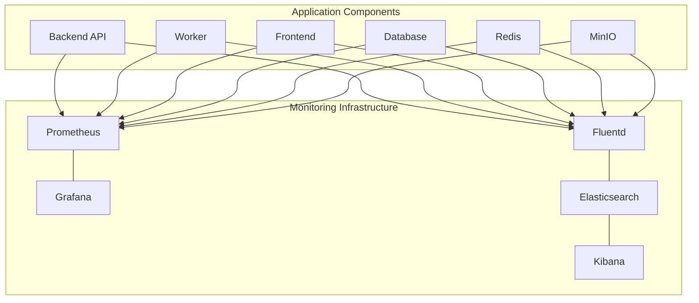

# Monitoring and Observability

## Introduction

This document provides comprehensive guidance on the monitoring and observability capabilities of the Molecular Data Management and CRO Integration Platform. Effective monitoring is crucial for ensuring system health, performance optimization, and business insights across your local deployment.

The platform features a complete monitoring stack with zero external dependencies, providing real-time visibility into system health, application performance, and business metrics. This monitoring infrastructure enables:

- **Proactive issue detection** before they impact users
- **Performance optimization** through detailed metrics analysis
- **SLA compliance tracking** for critical system operations
- **Business insights** for platform adoption and usage patterns
- **Troubleshooting support** through comprehensive logging and tracing

## Monitoring Architecture

The platform implements a comprehensive monitoring architecture consisting of several integrated components deployed alongside the application containers.

### Component Overview

| Component | Purpose | Description |
|-----------|---------|-------------|
| Prometheus | Metrics Collection | Time-series database that scrapes and stores metrics from all system components |
| Grafana | Visualization | Dashboard platform for visualizing metrics with pre-built dashboards for system health, application performance, and business metrics |
| Fluentd | Log Collection | Aggregates logs from all containers into a centralized logging system |
| Elasticsearch | Log Storage | Indexes and stores logs with support for advanced querying and analysis |
| Kibana | Log Analysis | Web interface for searching, analyzing, and visualizing log data |

### Deployment Architecture

The monitoring components are deployed as Docker containers within the same Docker Compose environment as the application:



### Data Flow

The monitoring data flow follows these patterns:

1. **Metrics Collection**:
   - Application components expose metrics endpoints
   - Prometheus scrapes these endpoints at configured intervals
   - Metrics are stored in Prometheus' time-series database
   - Grafana queries Prometheus to display metrics on dashboards

2. **Log Collection**:
   - Application components write logs to stdout/stderr
   - Fluentd captures these logs from Docker
   - Logs are processed and forwarded to Elasticsearch
   - Elasticsearch indexes the logs for efficient querying
   - Kibana provides visualization and analysis of the logs

## Metrics Collection

The platform collects a wide range of metrics to provide comprehensive monitoring of all system aspects.

### System Metrics

| Metric Category | Specific Metrics | Collection Method | Purpose |
|-----------------|------------------|-------------------|---------|
| CPU | Utilization, load average, throttling | Node Exporter | Monitor processing resource usage |
| Memory | Usage, available, swap | Node Exporter | Track memory consumption and detect potential leaks |
| Disk | Usage, I/O operations, latency | Node Exporter | Monitor storage capacity and performance |
| Network | Bandwidth, packets, errors | Node Exporter | Track network performance and detect issues |

Example Prometheus configuration for system metrics:

```yaml
- job_name: 'node_exporter'
  scrape_interval: 15s
  static_configs:
    - targets: ['node-exporter:9100']
```

### Application Metrics

| Metric Category | Specific Metrics | Collection Method | Purpose |
|-----------------|------------------|-------------------|---------|
| API Performance | Request count, response time, error rate | FastAPI instrumentation | Monitor API performance and error rates |
| Request Rates | Requests per second by endpoint | FastAPI instrumentation | Track usage patterns and load |
| Error Rates | Error count, error percentage by endpoint | FastAPI instrumentation | Identify problematic endpoints |
| Endpoint Performance | Response time percentiles (p50, p95, p99) | FastAPI instrumentation | Track performance against SLAs |

Example metrics exposed by the API:

```python
# Response time histogram
http_request_duration_seconds = Histogram(
    'http_request_duration_seconds',
    'HTTP request duration in seconds',
    ['method', 'endpoint', 'status_code']
)

# Request counter
http_requests_total = Counter(
    'http_requests_total',
    'Total HTTP requests',
    ['method', 'endpoint', 'status_code']
)
```

### Database Metrics

| Metric Category | Specific Metrics | Collection Method | Purpose |
|-----------------|------------------|-------------------|---------|
| Connection Pool | Active connections, max connections, utilization | PostgreSQL Exporter | Monitor database connection usage |
| Query Performance | Query execution time, slow queries | PostgreSQL Exporter | Identify performance bottlenecks |
| Transaction Rates | Commits, rollbacks | PostgreSQL Exporter | Monitor database activity |
| Resource Usage | CPU, memory, disk I/O | PostgreSQL Exporter | Track database resource utilization |

Example Prometheus configuration for database metrics:

```yaml
- job_name: 'postgres'
  scrape_interval: 30s
  static_configs:
    - targets: ['postgres-exporter:9187']
```

### Queue Metrics

| Metric Category | Specific Metrics | Collection Method | Purpose |
|-----------------|------------------|-------------------|---------|
| Queue Length | Active tasks, pending tasks by queue | Celery/Redis metrics | Monitor task backlog |
| Processing Rate | Tasks processed per second | Celery metrics | Track throughput |
| Task Duration | Execution time by task type | Celery metrics | Monitor task performance |
| Error Rate | Failed tasks, retry count | Celery metrics | Identify problematic tasks |

Example metrics exposed by the worker:

```python
# Task counter
celery_tasks_total = Counter(
    'celery_tasks_total',
    'Total number of Celery tasks',
    ['task_name', 'status']
)

# Task duration histogram
celery_task_execution_time_seconds = Histogram(
    'celery_task_execution_time_seconds',
    'Task execution time in seconds',
    ['task_name']
)
```

### Business Metrics

| Metric Category | Specific Metrics | Collection Method | Purpose |
|-----------------|------------------|-------------------|---------|
| User Activity | Active users, new users, login frequency | Custom metrics | Track user engagement |
| Data Volume | Total molecules, libraries, experiments | Custom metrics | Monitor platform data growth |
| Workflow Metrics | Experiments created, CRO submissions, results received | Custom metrics | Track business processes |
| SLA Compliance | CSV processing time, CRO response time, result turnaround | Custom metrics | Monitor compliance with SLAs |

Example custom business metrics:

```python
# User activity metrics
active_users_total = Gauge(
    'active_users_total',
    'Total number of active users',
    ['role']
)

# Data volume metrics
molecules_total = Gauge(
    'molecules_total',
    'Total number of molecules in the system'
)

# Workflow metrics
experiments_by_status_total = Gauge(
    'experiments_by_status_total',
    'Number of experiments by status',
    ['status']
)
```

## Health Checks

The platform provides several health check endpoints to verify the health and status of system components.

### Liveness Check

**Endpoint**: `/health/live`

The liveness check provides a basic verification that the service is up and running.

**Response Format**:
```json
{
  "status": "UP"
}
```

**Usage**: This endpoint is used by container orchestration systems to determine if the service is alive.

### Readiness Check

**Endpoint**: `/health/ready`

The readiness check verifies if the service is ready to handle requests by checking essential dependencies.

**Response Format**:
```json
{
  "status": "UP",
  "details": {
    "database": {
      "status": "UP",
      "latency_ms": 5.23
    },
    "redis": {
      "status": "UP",
      "latency_ms": 1.45
    }
  }
}
```

**Usage**: Used to determine if the service should receive requests, particularly during startup.

### Deep Health Check

**Endpoint**: `/health/deep`

The deep health check performs a comprehensive verification of all system components.

**Response Format**:
```json
{
  "status": "UP",
  "components": {
    "database": {
      "status": "UP",
      "latency_ms": 5.23
    },
    "redis": {
      "status": "UP", 
      "latency_ms": 1.45
    },
    "minio": {
      "status": "UP",
      "latency_ms": 8.76
    },
    "celery": {
      "status": "UP",
      "workers": 3
    }
  }
}
```

**Usage**: Used for detailed system diagnostics and troubleshooting.

### Database Health Check

**Endpoint**: `/health/db`

This endpoint provides detailed information about database connectivity.

**Response Format**:
```json
{
  "status": "UP",
  "latency_ms": 5.23,
  "details": {}
}
```

**Usage**: Used for database-specific diagnostics.

### System Health Check

**Endpoint**: `/health/system`

This endpoint provides system resource metrics.

**Response Format**:
```json
{
  "status": "UP",
  "metrics": {
    "memory": {
      "total": 16777216000,
      "used": 8589934592,
      "percent": 51.2
    },
    "cpu": {
      "percent": 23.5
    },
    "disk": {
      "total": 1099511627776,
      "used": 549755813888,
      "percent": 50.0
    }
  }
}
```

**Usage**: Used for monitoring system resource utilization.

Implementation details for these health checks can be found in the `health.py` module.

## Dashboards

The platform includes pre-configured Grafana dashboards for monitoring system health, application performance, and business metrics.

### System Health Dashboard

The System Health Dashboard provides a comprehensive view of system-level metrics:


**Key Panels**:
- System Status Overview
- CPU Usage
- Memory Usage
- Disk Usage
- Network Traffic
- Container Status
- Container CPU/Memory Usage
- Database Health and Connections
- Redis Health
- Queue Health
- File Storage Health

**Usage**: Use this dashboard to monitor the overall health and resource utilization of the platform.

### Application Performance Dashboard

The Application Performance Dashboard focuses on application-specific metrics:


**Key Panels**:
- API Performance Overview
- Request Rate by Endpoint
- Response Time Percentiles
- Error Rate by Endpoint
- Top 5 Slowest Endpoints
- Top 5 Most Used Endpoints
- HTTP Status Codes Distribution
- Page Load Time
- API Latency
- Background Task Performance
- CSV Processing Performance
- Database Query Performance
- API SLA Compliance

**Usage**: Use this dashboard to monitor API performance, identify bottlenecks, and track compliance with performance SLAs.

### Business Metrics Dashboard

The Business Metrics Dashboard provides insights into business-level metrics:


**Key Panels**:
- User Activity Overview
- Active Users by Role
- New User Registration Trend
- Data Volume Overview
- Molecule Growth Trend
- Experiment Status Distribution
- CRO Submission Trend
- Results Received Trend
- SLA Compliance Metrics
- Feature Usage Distribution
- CSV Import Volume

**Usage**: Use this dashboard to track user engagement, data growth, workflow metrics, and business KPIs.

### Custom Dashboard Creation

You can create custom dashboards based on your specific monitoring needs:

1. Log in to Grafana (default: http://localhost:3000, admin/admin)
2. Click "+ Create" and select "Dashboard"
3. Add panels by selecting metrics from Prometheus
4. Save your dashboard

## Logging

The platform implements a comprehensive logging system to capture and centralize logs from all components.

### Log Formats

All logs are structured in JSON format with consistent fields:

```json
{
  "timestamp": "2023-06-05 14:32:10,123",
  "service_name": "backend",
  "level": "INFO",
  "message": "Request processed successfully",
  "path": "/app/api/endpoints/molecules.py",
  "line": 123,
  "function": "get_molecules",
  "correlation_id": "550e8400-e29b-41d4-a716-446655440000",
  "user_id": 42,
  "request_path": "/api/v1/molecules",
  "execution_time_ms": 25
}
```

This structured format enables efficient filtering, searching, and analysis of logs.

### Log Levels

The platform uses standard log levels with the following guidelines:

| Level | Description | Usage |
|-------|-------------|-------|
| DEBUG | Detailed information for debugging | Development environments only |
| INFO | General operational information | Normal operations, requests, responses |
| WARNING | Unexpected but non-critical issues | Potential problems that don't affect service |
| ERROR | Error conditions preventing functions | Exceptions, failed operations |
| CRITICAL | Critical failures requiring immediate attention | System-wide failures, data corruption |

### Log Collection

Logs are collected from containers using Fluentd with the following workflow:

1. Application containers write logs to stdout/stderr
2. Fluentd captures these logs via Docker's logging driver
3. Fluentd parses and enriches the logs (adding metadata)
4. Logs are forwarded to Elasticsearch for storage

### Log Storage

Logs are stored in Elasticsearch with the following retention policies:

| Log Type | Retention Period |
|----------|------------------|
| Application Logs | 30 days |
| System Logs | 15 days |
| Access Logs | 7 days |
| Error Logs | 90 days |

Older logs are automatically deleted based on these retention policies.

### Log Analysis

Logs can be analyzed using Kibana with these capabilities:

- **Search**: Full-text search across all logs
- **Filtering**: Filter by service, level, timestamp, or any field
- **Visualization**: Create charts and graphs of log patterns
- **Dashboards**: Create custom dashboards for specific log analysis
- **Alerts**: Configure alerts based on log patterns

Example search query for error logs:

```
level:ERROR AND service_name:backend
```

Example search for slow API requests:

```
service_name:backend AND execution_time_ms:>500
```

## Alerting

The platform includes a comprehensive alerting system based on Prometheus AlertManager.

### Alert Rules

Pre-configured alert rules monitor key metrics with appropriate thresholds:

| Metric | Warning Threshold | Critical Threshold | Recovery Threshold | Alert ID |
|--------|-------------------|-------------------|-------------------|---------|
| CPU Usage | > 70% for 5min | > 85% for 5min | < 60% for 5min | SYS-CPU-001 |
| Memory Usage | > 75% for 5min | > 90% for 5min | < 70% for 5min | SYS-MEM-001 |
| Disk Usage | > 75% | > 90% | < 70% | SYS-DSK-001 |
| API Error Rate | > 1% for 5min | > 5% for 5min | < 0.5% for 5min | API-ERR-001 |
| API Response Time | > 500ms avg for 5min | > 1s avg for 5min | < 300ms avg for 5min | API-LAT-001 |
| Database Connections | > 70% of max | > 85% of max | < 60% of max | DB-CON-001 |
| Queue Length | > 100 tasks for 10min | > 500 tasks for 10min | < 50 tasks | QUE-LEN-001 |
| Failed Tasks | > 5% for 15min | > 10% for 15min | < 1% for 15min | TSK-ERR-001 |
| CSV Processing Time | > 20s for 10,000 molecules | > 30s for 10,000 molecules | < 15s for 10,000 molecules | CSV-PRC-001 |
| Failed Logins | > 10 in 5min | > 20 in 5min | < 5 in 5min | SEC-LOG-001 |

### Notification Channels

Alerts are delivered through multiple channels:

1. **Email**: Critical and warning alerts
2. **Dashboard**: All alerts displayed in Grafana
3. **Logs**: All alerts logged to centralized logging

### Alert Severity Levels

The platform uses three severity levels for alerts:

| Severity | Description | Response Expectation |
|----------|-------------|----------------------|
| Critical | Service-impacting issue requiring immediate attention | Response within 15 minutes |
| Warning | Potential issue that may impact service if not addressed | Response within 4 hours (business hours) or 8 hours (non-business) |
| Info | Informational alert for awareness | Review during next business day |

### Alert Routing

Alerts are routed based on severity and time of day:

| Alert Severity | Routing | Notification Method | Response Time |
|----------------|---------|---------------------|---------------|
| Critical | System Administrator | Email + Dashboard | 15 minutes |
| Warning | System Administrator (business hours), On-call (non-business hours) | Email + Dashboard | 4 hours (business hours), 8 hours (non-business hours) |
| Info | Admin Dashboard | Dashboard only | Next business day |

### Escalation Procedures

If alerts are not acknowledged or resolved within the expected response time, they are automatically escalated:

1. **First Escalation**: 15 minutes after SLA
   - Notify Senior Technical Staff
   - Escalation via email and phone

2. **Second Escalation**: 1 hour after SLA
   - Notify IT Management
   - Escalation via email and phone

3. **Vendor Engagement**: 2 hours after SLA (if applicable)
   - Engage external support channels
   - Create support ticket

## SLA Monitoring

The platform monitors compliance with Service Level Agreements (SLAs) for key operations.

### API Response Time

- **SLA Target**: 99.9% of requests < 500ms
- **Measurement Method**: Response time metrics from API instrumentation
- **Reporting Frequency**: Daily
- **Dashboard Panel**: "Response Time SLA Compliance" in Application Performance Dashboard

### CSV Processing Time

- **SLA Target**: 95% of imports < 30s for 10,000 molecules
- **Measurement Method**: Processing time metrics from CSV import operations
- **Reporting Frequency**: Weekly
- **Dashboard Panel**: "CSV Processing Time" in Application Performance and Business Metrics Dashboards

### Molecule Filtering

- **SLA Target**: 99% of filters < 2s
- **Measurement Method**: UI interaction metrics
- **Reporting Frequency**: Weekly
- **Dashboard Panel**: "Molecule Filter Response Time" in Application Performance Dashboard

### CRO Response Time

- **SLA Target**: 90% < 24 hours
- **Measurement Method**: Timestamp difference between submission and quote
- **Reporting Frequency**: Monthly
- **Dashboard Panel**: "CRO Response Time" in Business Metrics Dashboard

### Result Delivery

- **SLA Target**: 95% < 5 minutes
- **Measurement Method**: Timestamp difference between result upload and notification
- **Reporting Frequency**: Weekly
- **Dashboard Panel**: "Result Turnaround" in Business Metrics Dashboard

### System Availability

- **SLA Target**: 99.9% uptime during business hours
- **Measurement Method**: Health check monitoring
- **Reporting Frequency**: Monthly
- **Dashboard Panel**: "System Status Overview" in System Health Dashboard

## Incident Response

The platform includes procedures for responding to monitoring alerts and system issues.

### Alert Response

When an alert is triggered, follow these general steps:

1. **Acknowledge**: Acknowledge the alert in the monitoring system
2. **Assess**: Determine the severity and impact of the issue
3. **Investigate**: Use monitoring tools and logs to identify the root cause
4. **Resolve**: Apply the appropriate resolution steps
5. **Document**: Document the incident and resolution

Specific response procedures vary by alert type. Refer to the runbooks for detailed guidance.

### Runbooks

The platform includes pre-defined runbooks for common incident scenarios:

| Incident Type | Runbook ID | Key Steps |
|--------------|---------|-----------|
| Database Connectivity | DB-RUN-001 | 1. Check network connectivity<br>2. Verify database credentials<br>3. Check database process status<br>4. Verify disk space<br>5. Check database logs for errors<br>6. Restart database if necessary<br>7. Verify connectivity after restart |
| API Performance | API-RUN-001 | 1. Check system resource usage<br>2. Identify slow endpoints<br>3. Check database query performance<br>4. Check for high concurrency<br>5. Verify cache effectiveness<br>6. Scale resources if necessary<br>7. Optimize slow queries |
| File Storage Issues | FS-RUN-001 | 1. Check disk space<br>2. Verify file permissions<br>3. Check mount status<br>4. Verify MinIO service status<br>5. Check MinIO logs for errors<br>6. Restart MinIO if necessary<br>7. Verify connectivity after restart |
| Queue Processing | QUE-RUN-001 | 1. Check worker status<br>2. Verify Redis connectivity<br>3. Check message backlog<br>4. Identify failed tasks<br>5. Check worker logs for errors<br>6. Restart workers if necessary<br>7. Verify processing after restart |
| Security Incident | SEC-RUN-001 | 1. Isolate affected systems<br>2. Preserve evidence<br>3. Identify attack vector<br>4. Assess damage<br>5. Implement containment measures<br>6. Remediate vulnerabilities<br>7. Restore systems<br>8. Document incident and response |

Runbooks are located in the `docs/runbooks/` directory.

### Escalation Path

If an incident cannot be resolved by the initial responder, follow this escalation path:

1. **System Administrator**: First line of response
2. **Senior Technical Staff**: Escalation for complex issues
3. **IT Management**: Escalation for major incidents
4. **External Support**: Escalation for vendor-specific issues

Contact information for escalation points is available in the `docs/contacts.md` file.

### Post-Incident Analysis

After resolving an incident, conduct a post-incident analysis:

1. **Schedule**: Arrange a post-mortem meeting within 24-48 hours
2. **Collect Data**: Gather all relevant logs, metrics, and timeline information
3. **Analyze Root Cause**: Determine what caused the incident
4. **Document Timeline**: Create a detailed timeline of the incident
5. **Identify Improvements**: Determine what could prevent similar incidents
6. **Assign Action Items**: Assign specific tasks to prevent recurrence
7. **Track Implementation**: Follow up on action items

## Troubleshooting

This section provides guidance for troubleshooting common monitoring issues.

### Missing Metrics

If metrics are missing from dashboards:

1. Check if the relevant service is running
2. Verify that the service is exposing metrics on its `/metrics` endpoint
3. Check if Prometheus is scraping the endpoint (Status > Targets in Prometheus UI)
4. Check for scrape errors in Prometheus logs
5. Verify that metrics have the expected names and labels
6. Check time range selection in Grafana dashboard

### Dashboard Errors

If dashboards show errors:

1. Check Prometheus connectivity in Grafana data source settings
2. Verify that the PromQL queries are valid
3. Check for renamed or removed metrics
4. Look for JavaScript errors in browser console
5. Try refreshing the dashboard
6. Reload dashboard definitions if recently modified

### Alert Failures

If alerts aren't firing as expected:

1. Check AlertManager status in Prometheus UI
2. Verify alert rule definitions in Prometheus configuration
3. Test alert rules manually in Prometheus UI (Alerts section)
4. Check AlertManager configuration for routing rules
5. Verify notification channel configurations
6. Check logs for AlertManager errors

### Log Collection Issues

If logs aren't appearing in Elasticsearch/Kibana:

1. Verify that containers are logging to stdout/stderr
2. Check Fluentd status and logs
3. Verify Elasticsearch status and health
4. Check Fluentd configuration for log parsing rules
5. Verify index patterns in Kibana
6. Check for log format mismatches

## Maintenance

This section covers maintenance procedures for the monitoring system.

### Backup and Restore

Regular backups should be performed for monitoring configurations and data:

1. **Prometheus Data**: 
   - Location: `/prometheus` volume
   - Backup frequency: Weekly
   - Retention: 30 days

2. **Grafana Configurations**:
   - Location: `/grafana` volume
   - Backup frequency: After dashboard changes
   - Retention: Last 5 versions

3. **Alert Configurations**:
   - Location: `prometheus/rules/` directory
   - Backup frequency: After rule changes
   - Retention: Last 5 versions

4. **Elasticsearch Indices**:
   - Use Elasticsearch snapshot API
   - Backup frequency: Weekly
   - Retention: 30 days

To restore from backup:

1. Stop the relevant monitoring service
2. Replace the data directory with the backup
3. Restart the service
4. Verify proper operation

### Scaling

As your deployment grows, you may need to scale the monitoring infrastructure:

1. **Prometheus Scaling**:
   - Increase storage volume size
   - Adjust retention period
   - Consider federation for very large deployments

2. **Elasticsearch Scaling**:
   - Increase memory allocation
   - Adjust JVM heap size
   - Implement index lifecycle policies

3. **Grafana Scaling**:
   - Increase CPU/memory resources
   - Implement session management for multiple users

### Version Updates

When updating monitoring components:

1. **Plan the Update**:
   - Review release notes for breaking changes
   - Schedule maintenance window
   - Prepare rollback plan

2. **Backup Configuration**:
   - Create backups of all configurations
   - Export important dashboards

3. **Perform the Update**:
   - Update container images
   - Apply configuration changes
   - Restart services

4. **Verify Operation**:
   - Check service health
   - Verify metrics collection
   - Test dashboards
   - Validate alert rules

### Performance Tuning

To optimize monitoring system performance:

1. **Prometheus Tuning**:
   - Adjust scrape intervals for less critical metrics
   - Optimize storage with appropriate retention periods
   - Use recording rules for complex queries

2. **Elasticsearch Tuning**:
   - Implement index lifecycle management
   - Optimize mappings for common queries
   - Adjust shard and replica configurations

3. **Grafana Tuning**:
   - Optimize dashboard refresh rates
   - Use variables to reduce query load
   - Implement caching for frequently accessed panels

## References

- [Prometheus Documentation](https://prometheus.io/docs/introduction/overview/)
- [Grafana Documentation](https://grafana.com/docs/grafana/latest/)
- [Fluentd Documentation](https://docs.fluentd.org/)
- [Elasticsearch Documentation](https://www.elastic.co/guide/en/elasticsearch/reference/current/index.html)
- [Kibana Documentation](https://www.elastic.co/guide/en/kibana/current/index.html)